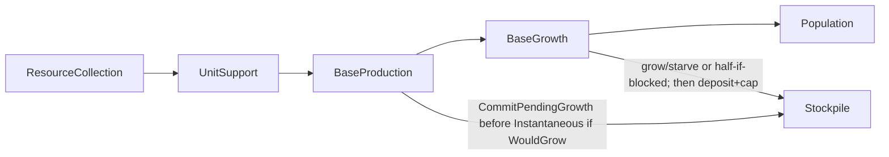

# Base size limits and growth recheck

## Decisions (locked)

- **Baselines as effects** in [`config/pop_growth.json`](config/pop_growth.json): `starting_size` = 1, `max_base_size` = 7 (`StatModifier`, `AllOwnerBases`), collected like difficulty effects via [`FactionEffectsPool`](src/game/faction/FactionEffectsPool.cpp). Replace the scalar `max_base_size` key with an `effects` vector; add `nutrient_intake_per_citizen`.
- **Raise the limit by stacking `Add`**, no new `ModifierOp_t`. `Unlimited` → `+infinity` was considered and **dropped**: `MaxBaseSize` is Additive, and Hab Dome's classic hard cap of 127 is expressible as `Add` +120 on top of the baseline 7. That keeps one resolve path, needs no non-finite handling or `GetMaxSize()` sentinel, and leaves `ParseModifierOp("Unlimited")` rejecting. Hab Complex later: `Add` +7 (7→14). Revisit only if a genuinely uncapped stat appears.
- **Max can fall** (effects removed / weaker stack): **no trim** of existing pops. Oversized bases simply fail `CanGrow()` until size is below the new max again — free from resolving live `MaxBaseSize`. Drop stored `m_maxSize` / `SetMaxSize` and any decrease-trim loop.
- **Stage order (option 2):** [`BaseProduction`](src/game/stages/BaseProduction.cpp) **before** [`BaseGrowth`](src/game/stages/BaseGrowth.cpp) (still after `UnitSupport`). Hab / Dome completing this turn raises max before the growth pass, so same-turn unlock needs no post-production recheck. [`Population`](src/game/stages/Population.cpp) stays after both (composition / mood vs new facilities).
- **Colony pod / abandon with Production-first:** a predictor alone is not enough — completing the pod at size 1 would still apply Instantaneous pop cost and **raze** before BaseGrowth runs. Lock both:
  1. **`WouldGrowThisTurn()`** — tanks full, this turn’s net ≥ 0, `CanGrow()` under the **current** max (mirrors the ApplyGrowth grow gate; no mutation).
  2. **`WouldCompletionAbandonBase`** predicts Instantaneous size from `GetSize()` adjusted by **both** pending pop events, since BaseGrowth now runs after the check: `+1` when `WouldGrowThisTurn()`, else `-1` (floored at 1) when `WouldStarveThisTurn()`. Growth alone would leave the mirror hole — a size-2 base that starves after paying a pod's pop cost is razed having answered "no". The floor keeps a size-1 base that is starving out anyway from making *every* item, pop cost or not, answer "yes".
  3. **`CommitPendingGrowth()`** before Instantaneous effects on production completion when `WouldGrowThisTurn()` — grow path only (`size+1`, `stockpile = 0`). Then pop cost runs against the post-growth size so the base is **not razed**. BaseGrowth later only deposits/caps (and starves if applicable); it must not grow again (stockpile already empty).
- **Nutrient rules follow the [Nutrients wiki](https://alphacentauri.miraheze.org/wiki/Nutrients) paragraph**, plus **half nutrient tanks when full at the population limit** (Thinker / classic). Intake is **2 per population point** — workers, drones, talents, and specialists alike; never special-case specialists for nutrients.
- **Half-tank timing:** inside `ApplyGrowth`, when tanks are full and `!CanGrow()` (Hab already had its chance in BaseProduction): set `stockpile = required / 2` (integer division toward zero), then deposit net and cap. UI notice (`POPULATIONLIMIT`) stays out of scope.

## Wiki vs current behaviour

Wiki ([Nutrients](https://alphacentauri.miraheze.org/wiki/Nutrients)):

> Starting each turn, if a base's nutrient storage is full, and the net gain of nutrients is either neutral or positive, the population grows by one and the storage is emptied. If there is a net loss beyond exhausting the storage, the population decreases by one. Then nutrients produced are tallied up, and two per population point are consumed. Nutrient storage is then adjusted by the net gain or loss, gains are limited to the bases storage capacity.

| Wiki / classic rule | Our current behaviour | This plan |
|---------------------|----------------------|-----------|
| Grow only if tanks **full** (before applying this turn’s net) | Deposit-first: grow once `stockpile + nutrients >= required` in the same call | Grow-first: only if already full at start of `ApplyGrowth` / `CommitPendingGrowth` |
| Grow only if **net ≥ 0** | No gate | Require `net >= 0` to grow |
| On grow, storage **emptied** | `stockpile -= required` (keeps remainder) | `stockpile = 0` |
| Starvation if net loss **exhausts** storage | After `+=`, if `< 0` → starve | If `stockpile + net < 0` (and not growing) → starve, clear stockpile |
| **2 per pop** consumed; adjust by **net**; gains **capped** | Gross nutrients banked; no eating; no capacity cap; at max **banks uncapped** | Net = production − intake×**size** (all pops); cap stockpile at required |
| Full + at population limit | Banks uncapped; no half | **`stockpile = required / 2`**, then deposit + cap |
| Hab raises max same turn | Growth before production → one-turn delay | Production before growth → unlock in `ApplyGrowth` |
| Size-1 colony pod + pending growth | Growth before production → no false prompt | Predict + **commit growth before Instantaneous** → no prompt, no raze |
| Tank size | `size * nutrients_per_pop / (GrowthRate/100)` | `(size + 1) * nutrients_per_pop / (GrowthRate/100)` per [Base wiki](https://alphacentauri2.info/wiki/Base.html) (rows = size after growth) |

## Nutrient / growth rules (implement)

### Net surplus and threshold

- Add `nutrient_intake_per_citizen: 2` to [`pop_growth.json`](config/pop_growth.json).
- [`ResourceManager`](src/game/faction/base/resources/ResourceManager.cpp) (or growth handoff) exposes **net** = production − `size * intake`. Size is total population (specialists included). Persist or recompute this turn’s net so Production (abandon / commit) and BaseGrowth share the same figure.
- [`GrowthCalculator`](src/game/population/calculators/GrowthCalculator.cpp): required = **`(baseSize + 1) * nutrientsPerPop / (GrowthRate/100)`**. Example at rate 100, npp 10, size 3: required **40**.
- After a successful grow (in `ApplyGrowth` or `CommitPendingGrowth`), adjust any later deposit for the new citizen (subtract one intake from net computed on the old size).

### `WouldGrowThisTurn` / `CommitPendingGrowth`

Shared grow gate (keep in one place with `ApplyGrowth`):

- `stockpile >= required` **and** `net >= 0` **and** `CanGrow()`.

`CommitPendingGrowth()`: if the gate holds, emit growth, `stockpile = 0`, reconcile composition as BaseGrowth does today after a pop gain. No deposit here.

Call **immediately before** Instantaneous effects when production completes (unit or building). If the gate is false (e.g. at max before Hab is added), do nothing — Hab completion then BaseGrowth handles unlock.

### `ApplyGrowth` order

Given stockpile, this turn’s **net**, and pre-growth `required`:

1. **Grow path:** if `stockpile >= required` **and** `net >= 0`:
   - if `CanGrow()` → emit growth, `stockpile = 0`; adjust net for new size before deposit.
   - else → **`stockpile = required / 2`** (toward zero); no grow.
2. **Starve path:** else if `stockpile + net < 0` → `stockpile = 0`, emit starvation; return.
3. **Deposit:** `stockpile += net` (when not returned above).
4. **Floor then cap:** `stockpile = clamp(stockpile, 0, requiredAfter)` using **post**-growth (or unchanged) size’s required. The floor matters only on the grow path: every other route here was gated on `stockpile + net >= 0`, but subtracting the new citizen's intake after emptying the tank can undershoot, and a base that just grew should not carry a hidden debt into next turn's starve check.
5. At most one pop event (grow **or** starve) per call; do not grow again after deposit. If `CommitPendingGrowth` already emptied the tank this turn, this call only deposits/caps.

`CanGrow()`: `size < GetMaxSize()`. Drop stored `m_maxSize` / `SetMaxSize`; resolve `StatId_t::MaxBaseSize` live. Falling max does not remove pops.

### Worked examples

**Normal grow** (size 3 → required **40**, net +8):

- Prior turn left stockpile at 40 (capped).
- BaseGrowth: full and net ≥ 0 → grow to 4, stockpile 0; deposit adjusted net.

**Hab same turn** (at max, full tanks):

- BaseProduction: Hab Complex raises max.
- BaseGrowth: `CanGrow()` true → grow and empty; no half.

**At max, no Hab:**

- BaseGrowth: full + blocked → half to `required / 2`, deposit net, cap.

**Size-1 colony pod + pending growth:**

- BaseProduction: `WouldGrowThisTurn` true → abandon check uses size 2 → no prompt; `CommitPendingGrowth` → size 2, tanks empty; Instantaneous pop cost → size 1; pod unit appears; base not razed.
- BaseGrowth: tanks empty → deposit net only.

**Size-1 colony pod, tanks not full:**

- Abandon check uses size 1 → prompt / defer as today (completion would raze).

## Effect / config plumbing

- [`EffectEnums.h`](include/game/effects/EffectEnums.h): `StartingSize`, `MaxBaseSize` (Additive, Base domain)
- Parser: `pop_growth.json` `effects` is a closed set — `StatModifier` only, stats restricted to `starting_size` / `max_base_size`, op `Add`, amount > 0, and **both** baselines required (absent, they resolve to seed 0: a founding throw and a base that can never grow)
- [`GrowthConfig_t`](include/game/population/pop-types/GrowthConfigParser.h): `effects` vector + `nutrients_per_pop` + `nutrient_intake_per_citizen`; drop scalar `maxBaseSize`
- [`FactionEffectsPool`](src/game/faction/FactionEffectsPool.cpp): `CollectGrowthEffects_()`
- Founding: resolve `StartingSize` when `initialPopulation` not overridden (shipping default 1)
- [`config/turn_stages.json`](config/turn_stages.json): move `BaseGrowth` after `BaseProduction`; rewrite stage descriptions and [`docs/game-rules-decisions.md`](docs/game-rules-decisions.md) §10 / [`docs/architecture/turn-system.md`](docs/architecture/turn-system.md) abandon-ordering notes

## Tests (requirements-first)

- Full + net ≥ 0 + can grow → size+1, stockpile 0, then deposit net (capped at new required).
- Full + net &lt; 0 → **no grow**; then apply net / starve rules.
- Grow empties; does **not** keep `stockpile - required`.
- Full + blocked → **`required / 2`**, then deposit + cap.
- Cap raised in BaseProduction + stockpile full + net ≥ 0 → BaseGrowth grows same turn; **no half**.
- Partial + net that would cross required → cap at required, **no same-pass grow**.
- Threshold at size 3 / rate 100 / npp 10 → **40**.
- Gross 10 at size 3 with intake 2 → net **4** (intake uses total size, including specialists).
- Max falls below current size → no trim; `CanGrow()` false; existing pops remain.
- Stacked `Add` max size (baseline 7 + 120 → 127); `pop_growth.json` effects + intake parse strictness, including a missing / wrong-stat / wrong-op baseline (update shipping config and test fixtures that still use scalar `max_base_size`).
- Size-1 + full tanks + net ≥ 0 + colony pod ready → **no** `AwaitingConfirmation`; after completion size 1, base not razed, tanks empty; BaseGrowth deposits only.
- Size-1 + not about to grow + colony pod → still asks / can raze on accept (existing abandon tests).
- Size-2 + about to starve + colony pod → **asks** (starvation would take the post-cost size to 0).
- Size-1 + about to starve + zero-pop-cost item → **does not** ask (the starve floor).
- Grow with net exactly equal to intake → tank floors at 0, never negative.
- `CreateBase` without an `initialPopulation` override honours resolved `StartingSize`; a resolved size ≤ 0 throws.

## Out of scope this pass

- Hab Complex / Habitation Dome building JSON (effect shapes are the contract).
- Population-limit / starvation player notice UI (`POPULATIONLIMIT` and related).
- Population boom / near-zero growth flag behaviour (still TODO on GrowthCalculator).
- Remaining items under [`docs/thinker/nutrient-growth.md`](docs/thinker/nutrient-growth.md) (alternate starvation timing, boom clamps, full surplus recompute, etc.) — half-tank and Production-before-Growth are **in** this pass.
