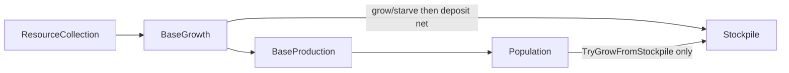

# Base size limits and growth recheck

## Decisions (locked)

- **Baselines as effects** in [`config/pop_growth.json`](config/pop_growth.json): `starting_size` = 1, `max_base_size` = 7 (`StatModifier`, `AllOwnerBases`), collected like difficulty effects via [`FactionEffectsPool`](src/game/faction/FactionEffectsPool.cpp).
- **Remove the limit** with **`ModifierOp_t::Unlimited`**: resolve returns `+infinity`. Hab Dome later uses Unlimited (classic hard-cap was 127). Hab Complex later: `Add` +7 (7→14).
- **Post-production recheck** at the start of [`Population`](src/game/stages/Population.cpp): `TryGrowFromStockpile` once per base.
- **Nutrient rules follow the [Nutrients wiki](https://alphacentauri.miraheze.org/wiki/Nutrients) paragraph.** Deferred engine-reconstruction quirks (e.g. halving tanks at the population limit) live in [`docs/thinker/nutrient-growth.md`](docs/thinker/nutrient-growth.md) for later — not in this pass.

## Wiki vs current behaviour

Wiki ([Nutrients](https://alphacentauri.miraheze.org/wiki/Nutrients)):

> Starting each turn, if a base's nutrient storage is full, and the net gain of nutrients is either neutral or positive, the population grows by one and the storage is emptied. If there is a net loss beyond exhausting the storage, the population decreases by one. Then nutrients produced are tallied up, and two per population point are consumed. Nutrient storage is then adjusted by the net gain or loss, gains are limited to the bases storage capacity.

| Wiki rule | Our current behaviour | This plan |
|-----------|----------------------|-----------|
| Grow only if tanks **full** (before applying this turn’s net) | Deposit-first: grow once `stockpile + nutrients >= required` in the same call | Grow-first: only if already full at start of `ApplyGrowth` |
| Grow only if **net ≥ 0** | No gate | Require `net >= 0` to grow |
| On grow, storage **emptied** | `stockpile -= required` (keeps remainder) | `stockpile = 0` |
| Starvation if net loss **exhausts** storage | After `+=`, if `< 0` → starve | If `stockpile + net < 0` (and not growing) → starve, clear stockpile |
| **2 per pop** consumed; adjust by **net**; gains **capped** | Gross nutrients banked; no eating; no capacity cap; at max **banks uncapped** | Net = production − intake×size; cap stockpile at required; at max do not grow, leave stockpile, then deposit+cap |
| Tank size | `size * nutrients_per_pop / (GrowthRate/100)` | `(size + 1) * nutrients_per_pop / (GrowthRate/100)` per [Base wiki](https://alphacentauri2.info/wiki/Base.html) (rows = size after growth) |

## Nutrient / growth rules (implement)

### Net surplus and threshold

- Add `nutrient_intake_per_citizen: 2` to [`pop_growth.json`](config/pop_growth.json).
- [`ResourceManager`](src/game/faction/base/resources/ResourceManager.cpp) (or growth handoff) exposes **net** = production − `size * intake`. `ApplyGrowth` receives **net**.
- [`GrowthCalculator`](src/game/population/calculators/GrowthCalculator.cpp): required = **`(baseSize + 1) * nutrientsPerPop / (GrowthRate/100)`**. Example at rate 100, npp 10, size 3: required **40**.
- After a successful grow, adjust the deposited net for the new citizen (subtract one intake) so post-growth eating matches the wiki’s “then … two per population point” on the new size.

### `ApplyGrowth` order

Given stockpile, this turn’s **net**, and pre-growth `required`:

1. **Grow path:** if `stockpile >= required` **and** `net >= 0`:
   - if `CanGrow()` → emit growth, `stockpile = 0`; adjust net for new size before deposit.
   - else → leave stockpile unchanged (still full); no grow.
2. **Starve path:** else if `stockpile + net < 0` → `stockpile = 0`, emit starvation; return.
3. **Deposit:** `stockpile += net` (when not returned above).
4. **Cap:** `stockpile = min(stockpile, requiredAfter)` using **post**-growth size’s required.
5. At most one pop event (grow **or** starve) per call; do not grow again after deposit.

`TryGrowFromStockpile(effects)`: grow-path only (full + can grow; treat as net ≥ 0 for the recheck, or pass the turn’s net). Used from `Population` after production. No second deposit.

`CanGrow()`: unlimited if resolved max non-finite; else `size < max`. Drop stored `m_maxSize` / `SetMaxSize`; resolve `StatId_t::MaxBaseSize`.

Worked example (size 3 → required **40**, net +8):

- Prior turn left stockpile at 40 (capped).
- Full and net ≥ 0 → grow to 4, stockpile 0; deposit adjusted net → starts the new box.

## Effect / config plumbing

- [`EffectEnums.h`](include/game/effects/EffectEnums.h): `StartingSize`, `MaxBaseSize`; `ModifierOp_t::Unlimited`
- [`ApplyModifierStack`](src/game/effects/ActiveEffect.cpp): any Unlimited → `+infinity`
- Parser: Unlimited without amount; reject `amount_source`; restrict to `max_base_size` for now
- [`GrowthConfig_t`](include/game/population/pop-types/GrowthConfigParser.h): `effects` vector + `nutrients_per_pop` + `nutrient_intake_per_citizen`; drop scalar `maxBaseSize`
- [`FactionEffectsPool`](src/game/faction/FactionEffectsPool.cpp): `CollectGrowthEffects_()`
- Founding: resolve `StartingSize` when `initialPopulation` not overridden (shipping default 1)

## Tests (requirements-first)

- Full + net ≥ 0 + can grow → size+1, stockpile 0, then deposit net (capped at new required).
- Full + net &lt; 0 → **no grow**; then apply net / starve rules.
- Grow empties; does **not** keep `stockpile - required`.
- Full + blocked → stockpile unchanged, then deposit net, cap (no half).
- Partial + net that would cross required → cap at required, **no same-pass grow**.
- Cap raised after production + stockpile full + net ≥ 0 → `TryGrowFromStockpile` grows.
- Threshold at size 3 / rate 100 / npp 10 → **40**.
- Gross 10 at size 3 with intake 2 → net **4**.
- Unlimited / Add +7 max size; `pop_growth.json` effects parse strictness.

## Out of scope this pass

- Hab Complex / Habitation Dome building JSON (effect shapes are the contract).
- Reordering `BaseGrowth` vs `BaseProduction`.
- Population-limit / starvation player notice UI.
- Population boom / near-zero growth flag behaviour (still TODO on GrowthCalculator).
- Items listed under [`docs/thinker/`](docs/thinker/nutrient-growth.md) (half-tank at limit, alternate starvation timing, etc.).
