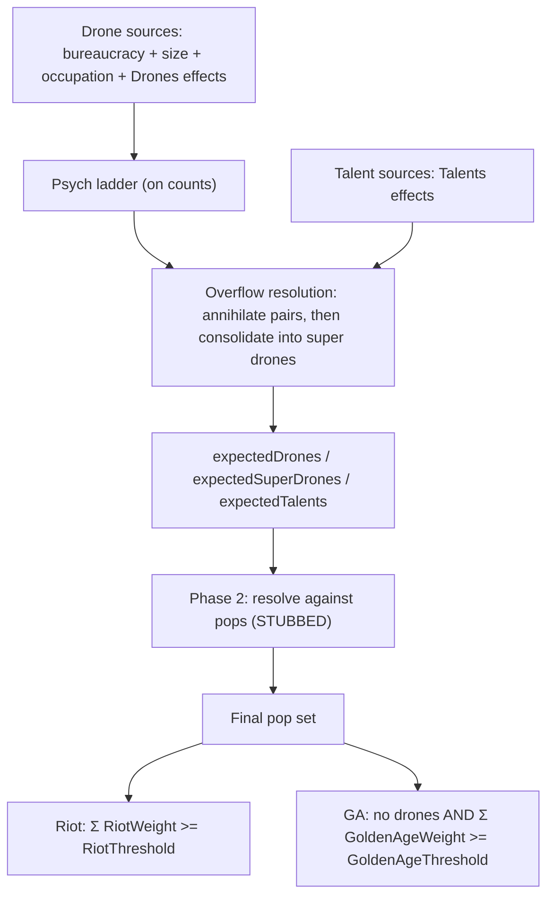

# Pop composition architecture (SMAC psych + police)

## Core shift

Both prior formulas are dissolved. `Drones` and `Talents` are **sums of named contributions**,
not Lua mega-formulas. Sources that need real math (bureaucracy, size, occupation) become small
term calculators that each emit a contribution; everything else already arrives through the
effect pipeline.

This is also what fixes the psych double-spend: with `talent_formula` gone, the psych ladder is
the only consumer of psych, and there is no `grossTalents` target left to clobber what the
ladder produced.

## Pipeline



`PopCompositionCalculator` owns everything up to `expectedDrones` / `expectedTalents`, including
the ladder, which it walks **on counts**. Phase 2 — reconciling those counts against actual pop
instances — is a separate step, stubbed in this pass. No rules live in phase 2; it is pure
seating.

## Psych

### Per-turn, never consumed

Psych never leaves the base, and the player needs a preview of what this turn's psych will do to
the base — the same shape as "minerals produced this turn vs. minerals left on the production
item". A stockpile that composition drains cannot preview, and worse, composition recalculates
several times a turn (`MaybeRecalculateComposition_` fires on every pop add/remove/convert), so a
draining read makes composition flap within a single turn.

- `m_psych` **resets** at produce time rather than accumulating. It is the only one of the five
  banks that does; the naming and header comment must say so.
- `ConsumePsych()` becomes a **non-destructive read**. Existing tests already use it as a read
  (`CHECK(… ConsumePsych() == 3)` in PsychTests / ScrapUnitTests / StockpileEnergyTests), so they
  keep working.
- It stays a stored value rather than a pure function of the effect list, because stockpile
  surplus conversion credits into it via `AddResource`.
- Rules doc §6 currently says psych "is consumed when calculating population composition" —
  rewrite.

### Psych ladder

`psych_to_promote` + `promotes_to` on pop types; each step debits that type's cost from the
turn's psych. Shipping edges in [`config/pop_types.json`](config/pop_types.json):

| From | `psych_to_promote` | `promotes_to` |
|---|---|---|
| SuperDrone | 2 | Drone |
| Drone | 2 | Worker |
| **Worker** | **2** | **Talent** |
| Talent | — | (terminal) |

Worker→Talent is a normal ladder edge — no free bypass. Order is worst-first by chain depth
(SuperDrone before Drone before Worker).

## Drones

**`drone_formula` is deleted.** `Drones` becomes an ordinary resolved stat at seed 0: every source
emits a `Drones` contribution into the effect pipeline, and `Finalize(StatId_t::Drones)` is the
answer. Half of this already works that way — `resolvedDrones` is `Finalize(Drones)` today — so
this makes the other sources uniform instead of split across a Lua string and an effect list.

| Source | Shape | Notes |
|---|---|---|
| Bureaucracy | term calculator → Add | residue class past `bureaucracy_limit` |
| Size | term calculator → Add | `max(0, base_size - size_free_drones)` |
| Occupation | term calculator → Add | decaying assimilation peak, capped by `conquered_drone_cap` |
| Away-from-home | contribution → Add | `ComputeAwayFromHomeDrones` |
| Garrison police | contribution → Add (negative) | `ComputeGarrisonPoliceSuppression` |
| Facilities / SE | effect → Add | University, Commons, … (already works) |

The three math-bearing sources keep their own small calculators — a residue class, a clamped
subtraction, and a decay curve are not expressible as contributions. Each one emits, rather than
being a variable in a shared formula, so each becomes testable in isolation. `bureaucracy_limit_formula`
stays as a sub-formula of the bureaucracy term.

### The clamp

`max(0, min(base_size, …))` becomes ops rather than Lua:

- `MinClamp` 0 — catches garrison suppression exceeding total drones.
- `MaxClamp` with the `BaseSize` amount source
  ([EffectConfig.h:107](include/game/effects/EffectConfig.h#L107)).

`ModifierOp_t` clamps apply *after* the Add math, tightest of each kind wins, and MinClamp wins
when the two cross ([EffectEnums.h:639-652](include/game/effects/EffectEnums.h#L639-L652)) — the
same semantics the nested `max`/`min` has today. Both clamps ship in the `pop_composition.json`
effects array introduced for `RiotThreshold` below.

### Consequence: `DroneInputs_t` dissolves

That struct exists to feed one Lua call. With no shared formula, each term calculator takes only
its own inputs — bureaucracy wants map size / base id / faction base count, size wants
`base_size` and `SizeFreeDrones`, occupation wants the assimilation window and
`conquered_drone_cap`. Split it rather than passing one wide struct to three calculators that each
read a third of it.

### Police wiring

`ComputeAwayFromHomeDrones` and `ComputeGarrisonPoliceSuppression` exist
([AwayFromHomeDrones.h](include/game/faction/base/population/AwayFromHomeDrones.h),
[GarrisonPolice.h](include/game/faction/base/population/GarrisonPolice.h)) and are unwired. They
already return ints; those land as `Drones` Adds like any other source. Delete the standing TODO in
[PopulationManager.cpp](src/game/faction/base/population/PopulationManager.cpp#L311).

(There is no `garrison_count` anywhere in the tree — an earlier draft of this plan named one.)

## Talents

```text
talents = psych ladder output + Finalize(StatId_t::Talents)
```

No `talent_formula`. Delete the key from
[`config/pop_composition.json`](config/pop_composition.json) and `talentFormula` from
`PopCompositionConfig_t` / its parser.

`Talents` contributions seat directly with **no psych cost** — they are a free promotion path,
and that is now the intended reading. (An earlier draft asserted the opposite; with the formula
gone, there is nothing else for that stat to mean.)

## Overflow resolution (final step of phase 1)

### Two different quantities

`Drones` is **drone pressure** (a.k.a. effective drones), not a headcount. A pop type's
**drone weight** is how much pressure one body absorbs:

| | `drone_weight` (scalar key) | `riot_weight` (`ThisPop` effect) |
|---|---|---|
| Drone | 1 | +1 |
| SuperDrone | **2** | **+1** |

These are independent. A super drone absorbs two drones of pressure into one body, but it riots
like any single citizen. Keeping them apart is the whole point of this step — the old
`riot_contribution: 2` conflated them.

Drone weight is consumed by phase 1, which works on **counts before any pop exists**, so it
cannot be a `ThisPop` effect the way riot/GA weights are. See the representation question below.

### The rule

The pool `P` is the **non-specialist pop count** — the same population the mood sums range over.
Talents absorb excess first; super drones appear only once talents are exhausted.

```text
# 1. Annihilate: each cancelled pair removes one drone of pressure and one talent
k = min(T, ceil(max(0, D + T - P) / 2))
D -= k;  T -= k

# 2. Seat the remainder into P_d bodies, preferring the lightest types.
#    w[0] < w[1] < ... < w[n-1] are the drone-class drone_weight values, ascending.
P_d    = P - T
bodies = min(P_d, floor(D / w[0]))    # every body starts at the lightest type
seated = bodies * w[0]

while seated < D:
    step = cheapest upgrade available (some body at w[i] -> w[i+1], cost w[i+1] - w[i])
    if no step remains or seated + step > D:
        break
    apply step
    seated += step

dropped = D - seated
```

Terminates in at most `bodies × (n - 1)` steps — every step strictly raises one body's tier and
none is reversible. Arbitrary pressure is handled by construction: a modder shipping 3× pressure
saturates the pool at the heaviest tier and drops the remainder.

Consolidation does **not** free a body into a worker. With `P = 4` and `D = 5`, one of the four
drone bodies is a super drone instead of a plain drone: 4 bodies carrying 5 pressure, zero
workers.

### Properties

- **Pressure is preserved up to `dropped`.** That is the invariant the arithmetic maintains —
  *not* the riot sum, which is simply the drone-class headcount (`S + plain`) since both types
  riot at +1.
- **Super drones imply saturation.** `S > 0` requires `D > P_d`, which means every non-specialist
  body is drone-class and no talents remain.
- **Decomposition is automatic.** If the pool grows so `D <= P_d`, the formula gives `S = 0` and
  the super drones become plain drones with no special case — composition recomputes from scratch
  every pass, so there is no state to unwind.

### Dropping excess is mechanically invisible

`S > 0` implies the pool is saturated with drone-class bodies and `T = 0`, so `riotSum = P >= 1`
and the base is rioting regardless. `P = 3` with `D = 7` and with `D = 6` both give 3 super
drones; the difference only exists in the UI. That is what makes discarding the excess safe
rather than a silently lost rule.

### Drone weight is a plain config scalar

`drone_weight` is an ordinary key on the pop type, **not** an effect and not derived from the
promotion graph. Phase 1 reads it off the type config while working on counts, before any pop of
that type exists, so there is nothing for a `ThisPop` effect to attach to. Deriving it from graph
distance would also tie drone pressure to psych cost structure, which is a coupling the ladder
should not carry.

```json
Drone:      { "drone_weight": 1 }
SuperDrone: { "drone_weight": 2 }
```

Defaults to 0, so only drone-class types declare it and no other type is accidentally seatable as
drone pressure.

### Arbitrary weight tiers

The seating loop takes any number of drone weights, not just the shipping `{1, 2}`. "Cheapest
upgrade first" is what implements *prefer the lightest types*: with `W = {1, 2, 3}`, `P_d = 3` and
`D = 5`, it produces `{2, 2, 1}` rather than `{3, 1, 1}` or `{3, 2}` — bodies spread across the
smallest weights that still seat the pressure.

Nothing hard-codes `2`; the tiers come from `drone_weight` on the drone-class types.

**Non-contiguous weights can strand a remainder.** With `W = {1, 3}`, `P_d = 2` and `D = 3`, the
loop reaches `{1, 1}` and stops — the only upgrade costs 2 but just 1 pressure remains, and
overshooting would invent pressure from nothing. That drops 1 even though `{3}` would have seated
exactly. This is consistent with preferring the lightest types, and with dropped pressure being
mechanically invisible. Shipping weights are contiguous, so it does not arise in practice.

## Config axes — drop `role` entirely

`role` / `PopRole_t` is removed. Every behavioral question already has a dedicated field; keeping
`role` only invites drift (role:drone with riot weight 0, specialist that works tiles, etc.).

| Field | Meaning |
|---|---|
| `can_work_tile` | Tile capability (`Pop::IsWorker()`). |
| `player_assignable` | Appears in specialist/citizen picker. **`player_assignable && !is_default`** = player-choice protection. |
| `is_default` | Reset / seat-from type (Worker). Exactly one per registry. |
| `psych_to_promote` + `promotes_to` | Promotion graph; membership = composition pool. |
| `drone_weight` | Drone pressure one body absorbs. Scalar, read by phase 1 on counts. Default 0. |
| `ThisPop` effects (`riot_weight`, `golden_age_weight`) | Mood **magnitudes**, not identity. |

**Do not infer identity from mood weights** (that was the old bug `role` was added to fix).
Derive citizen-bar identity from graph position relative to the default:

```text
types that promote → … → default     → "drone class"  (SuperDrone, Drone)
is_default                             → "plain worker"
default promotes → … → terminals       → "talent class" (Talent)
not in graph                           → outside composition (Doctor, …)
```

Registry precomputes these sets at load. Keep thin predicates on `Pop` (`IsDrone` / `IsTalent` /
`IsPlainWorker`) as graph lookups. Drop `IsSpecialist`; use `!IsWorker()` and/or
`IsPlayerChoiceType()` instead.

Drop the registry rule that coupled `role: specialist` ↔ `can_work_tile`
([PopTypeRegistry.h:56-63](include/game/population/pop-types/PopTypeRegistry.h#L56-L63)).

### Graph validation (replaces the dropped rule)

Removing the role↔tile check leaves the registry with no structural rule. The graph-derived
classification needs these at load:

1. Every `promotes_to` names a known pop type.
2. `psych_to_promote` and `promotes_to` are set together — neither alone.
3. No cycles. The registry already walks `obsoletes` for cycles
   (`ValidateNoObsolescenceCycles_`); generalize it rather than writing a second walker.
4. **A single chain through `is_default`.** The drone/talent classification is defined by
   reachability to and from the default, so a branch silently misclassifies instead of erroring.
   Branching graphs are deferred — that means *rejected at load*, not merely unimplemented.

## Player-choice protection

```cpp
bool Pop::IsPlayerChoiceType() const
{
    return m_pConfig->bPlayerAssignable && !m_pConfig->bIsDefault;
}
```

- **Pop loss** (`SelectDoomedPop_`, rules doc §1): sort by `(IsPlayerChoiceType(), value)` —
  player-choice pops last. Replaces `IsSpecialist()`.
- **Composition**: never convert a pop where `IsPlayerChoiceType()`.
- **Worker** stays `player_assignable: true` for UI, but `is_default: true`, so default workers
  are not protected.

This is **behavior-identical for every shipping pop type** — all specialists are
`player_assignable && !is_default`, and no drone/talent/worker is. Recorded so nobody hunts for a
behavior diff.

`can_work_tile` stays independent: worker assignment skips `!IsWorker()`, not `IsSpecialist()`.

## Composition pool

A pop **`ParticipatesInComposition()`** when its current type is in the promotion graph **and**
`!IsPlayerChoiceType()` on that instance. Types without promotion params (Doctor, Technician, …)
are outside the graph — composition never touches them.

Player-choice pops still count in `base_size` for drone sources. They are excluded only from type
reconciliation.

## Calculator output

```cpp
struct PopCompositionResult_t
{
    int expectedDrones = 0;        // after ladder and overflow resolution
    int expectedSuperDrones = 0;   // from overflow consolidation
    int expectedTalents = 0;       // ladder output + Talents contributions, after overflow
};
```

Phase 2 consumes these. It is a **no-op stub** in this pass and addressed separately: phase 1
computes and is fully testable, but no pop changes type until phase 2 lands. The branch is
therefore not playable in the interim, by choice.

The old reconcile in `ApplyCompositionTargets` is deleted along with its promotion-order TODO
([PopulationManager.cpp:364](src/game/faction/base/population/PopulationManager.cpp#L364)) — reset-then-seat
removes the scarcity contest that TODO was about, so it goes with the code rather than being
carried forward.

## Mood

Riot and golden age are the **same shape**: a sum of per-pop weights against a threshold.

Both sums range over the **composition pool only** — drones, super drones, workers, and talents.
Neither mood calculation knows about `GetSize()`; specialists are outside both, exactly as they
are outside composition. Riot already worked this way (specialists have no riot weight); GA now
matches. So the golden age rule reads `talents >= workers + drones`, with specialists neither
helping nor hindering.

### Per-pop weights — real `ThisPop` effects

`riot_weight` and `golden_age_weight` are genuine effects resolved per pop, not scalar config
keys. `ThisPop` effects are resolved by the pop itself; today the only consumer is
`Pop::ApplyTileMultipliers` ([Pop.cpp:88-94](src/game/population/pop-types/Pop.cpp#L88)) via
`FilterByScope`. This needs a small per-pop stat resolve helper alongside it — the filter
primitive already exists.

Delete `riotContribution` from `PopTypeConfig_t`, `Pop::GetRiotContribution()`,
`PopContainer::GetRiotContribution()`, and the `"riot_contribution": 2` key. That `2` was drone
*pressure* wearing a riot name — it moves to drone weight (see overflow resolution), and
SuperDrone's riot weight is `+1`, the same as any other citizen.

```json
Drone:      { "riot_weight": +1, "golden_age_weight": -1 }
SuperDrone: { "riot_weight": +1, "golden_age_weight": -1 }
Worker:     {                    "golden_age_weight": -1 }
Talent:     { "riot_weight": -1, "golden_age_weight": +1 }
```

Specialists declare **neither** weight. Both stats seed at 0, so a type that declares nothing
contributes nothing to either sum — which is what keeps specialists out of both calculations
without a special case anywhere in the code.

Parse-reject `riot_weight` / `golden_age_weight` outside a pop type's `ThisPop` scope.

### Riot

```text
riotSum >= Finalize(RiotThreshold)      // shipping threshold 1
```

With Drone +1 and Talent −1, `riotSum >= 1` is net unrest of at least one — the classic
`drones > talents` for unit weights.

This replaces `RiotCalculator::NaturalCondition_` **only**. The second riot source — `ForceRiot`,
from the probe Incite Drone Riots action — has its own lifetime and survives untouched.

`RiotConditionInputs_t` becomes `{ riotSum, threshold }`. `BuildRiotInputs_` currently runs a full
`DroneCalculator` + `PopCompositionCalculator` pass just to fetch `targetTalents`; it collapses to
a walk of `Pops()`.

### Golden age

1. `GetDroneCount() == 0` — no drone-class types in the final set (graph-derived).
2. `gaSum >= Finalize(GoldenAgeThreshold)` — shipping threshold **0**.

The no-drones gate stays an explicit condition. Drones carry −1 for consistency, but the gate
makes that weight unreachable in practice; expressing the gate as a large negative weight would be
a magic number.

`GoldenAgeCalculator::Inputs_t` currently carries `workerCount` / `specialistCount`
([GoldenAgeCalculator.h:20-23](include/game/population/calculators/GoldenAgeCalculator.h#L20-L23))
which the new rule does not use, and the class comment states the old rule. Both change.

Entering/exiting riot and GA may not be fully implemented. Landing the threshold is enough for
this pass.

### Stats

| Stat | Kind / seed | Layer |
|---|---|---|
| `RiotWeight` | Additive / 0 | Per pop (`ThisPop`) |
| `GoldenAgeWeight` | Additive / 0 | Per pop (`ThisPop`) |
| `RiotThreshold` | Additive / 0 | Base rule (shipping baseline Add **1**) |
| `GoldenAgeThreshold` | Additive / 0 | Base rule (shipping baseline **0**) |

`GoldenAgeCoverage` is **not needed** — see the GA decision below.

### Baseline effect injection

`RiotThreshold`'s baseline Add 1 needs an injection site. The existing pattern is a top-level
`effects` array parsed into the faction pool
([police_rules.json](config/police_rules.json) → `FactionEffectsPool::CollectPoliceRulesEffects_`).
Doing the same for `pop_composition.json` requires:

- an `effects` array in that config + parser support,
- a new `EffectSourceKind_t` enumerator and its case in
  [EffectConfigParser.cpp:952](src/game/effects/EffectConfigParser.cpp#L952),
- a `validate(...)` line in
  [EffectReferenceValidator.cpp:316](src/game/EffectReferenceValidator.cpp#L316).

This also satisfies the calculator rule in `.devin/rules/coding-guidelines.md`: the numbers live in
the JSON that owns the subsystem, not in C++.

## Decisions pinned

| Topic | Choice |
|---|---|
| Talent formula | **Removed.** Talents = ladder output + `Talents` contributions |
| Drone formula | **Removed.** `Drones` is a resolved stat; sources emit Adds; clamp via MinClamp/MaxClamp |
| Psych | **Per-turn, never consumed.** Resets at produce; reads are non-destructive |
| Psych consumers | The **ladder only**. No second path spends the same psych |
| Riot | `riotSum >= RiotThreshold` (1); `ForceRiot` unaffected |
| GA | no drones **and** `gaSum >= GoldenAgeThreshold` (0) |
| Mood population | **Composition pool only.** Neither riot nor GA reads base size; specialists are outside both |
| GA thresholds | Riot 1, GA 0 — deliberate asymmetry (riot needs strict net unrest; GA allows the tie) |
| Riot contribution | **Real `ThisPop` effect**; scalar `riot_contribution` deleted |
| `role` / `PopRole_t` | **Removed** — class from graph; tile from `can_work_tile`; choice from `player_assignable` |
| Pop loss priority | `IsPlayerChoiceType()` last (replaces `IsSpecialist()`) |
| Drone weight vs riot weight | **Distinct.** SuperDrone absorbs 2 pressure but riots at +1 like any citizen |
| `drone_weight` | Plain config scalar, not an effect and not graph-derived — phase 1 reads it before pops exist |
| Overflow | Annihilate drone+talent pairs first; consolidate into super drones only when no talents remain |
| Super drones | Minted **only** by overflow saturation; consolidation frees no worker |
| Excess pressure | **Dropped.** `S > 0` already implies a riot, so the discard is UI-only |
| Weight tiers | **Arbitrary.** Seating prefers the lightest types (cheapest upgrade first): `{2,2,1}`, not `{3,1,1}` |
| Phase 2 stub | **No-op** — phase 1 is testable, no pop changes type until phase 2 lands |
| Phase 2 seating | **Stubbed** this pass |

### New rules decision — mood ranges over the composition pool

**Rule:** neither riot nor golden age is a function of base size. Both sum weights over the
composition pool — drones, super drones, workers, talents — and specialists participate in
neither. Golden age is therefore `talents >= workers + drones`.

This is a behavior change on the GA side, and a deliberate one. The current
`GoldenAgeCalculator` counts `specialistCount` against the talent side, so a doctor-heavy base
could not reach a golden age; now it can. Riot already ignored specialists, so the change makes
the two consistent rather than introducing an asymmetry.

Record in `docs/game-rules-decisions.md` — this reads as a refactor in the diff and is not one.

## Docs

- **New** `docs/architecture/population-system.md` with the pipeline diagram.
  `.devin/rules/architecting.md` requires a fine-grained diagram per subsystem and there is none
  for population/psych today.
- Rules doc **§1**: "specialists are taken last" → player-choice pops.
- Rules doc **§6**: psych is per-turn and not consumed.
- Rules doc: **new section** for the GA specialist change above.

## Deferred

- Phase 2 (expected counts → actual pops) — stubbed as a no-op this pass.
- **Post-implementation polish** (from review; blocked until Agent mode): see todos
  `polish-*` — drone_weight invariants, mood-sum graph filter, cheap threshold path,
  true recalc no-op, doc/comment drift.

Nothing else. Branching promote graphs are **not** deferred in the sense of "unhandled": the
single-chain-through-`is_default` rule is enforced at load by `graph-validation` in this pass,
because the drone/talent classification is undefined on a branched graph and would misclassify
silently rather than error.

## Tests

- 2 Drone + 2 Talent → riotSum 0 → calm; 3 Drone + 2 Talent → riotSum 1 → riot.
- SuperDrone weight 2 + 1 Talent → riotSum 1 → riot.
- `RiotThreshold` Add +1 (total 2) → need net ≥ 2 to riot.
- GA: 2 Talent + 2 Worker → gaSum 0 → GA; 1 Talent + 2 Worker → −1 → no GA.
- GA: specialists present do not move `gaSum`.
- GA: any drone fails the gate regardless of `gaSum`.
- **Repeated `RecalculateComposition` within one turn is stable** — the regression the psych
  stockpile would have caused.
- Ladder debits psych per step; a Worker→Talent step costs 2.
- `Talents` contributions seat without psych.
- Graph validation rejects: unknown `promotes_to`, unpaired keys, a cycle, a branch off the
  default.
- Police: away-from-home and garrison suppression reach `Finalize(Drones)`.
- Drone clamp: garrison suppression exceeding all sources floors at 0 (MinClamp); sources
  exceeding `base_size` cap at it (MaxClamp with the `BaseSize` amount source).
- Each drone term calculator in isolation — bureaucracy residue, size-free subtraction,
  occupation decay — which the single Lua formula made untestable.
- Overflow: `P = 4, D = 5, T = 0` → 1 super + 3 drones, 4 bodies carrying 5 pressure, **no
  worker freed**, nothing dropped.
- Overflow: `P = 3, D = 7, T = 0` → 3 supers, 1 pressure dropped.
- Overflow: `P = 3, D = 6, T = 0` → 3 supers, nothing dropped (same seating as `D = 7`).
- Overflow: `P = 4, D = 3, T = 3` → one annihilation → `D = 2, T = 2`, no super drones.
- Overflow: `T > 0` absorbs before any super drone is minted.
- Seated pressure equals `min(D, 2 * P_d)` — the invariant the arithmetic maintains.
- Pool growth decomposes supers back to plain drones with no residual state.
- Super drones riot at **+1**, not +2: `P = 4` fully saturated → `riotSum == 4` whatever the
  super/plain split.
- Seating reads `drone_weight` from config, not a literal 2.
- Packing prefers the lightest types: `W = {1,2,3}, P_d = 3, D = 5` → `{2,2,1}`, not `{3,1,1}`
  or `{3,2}`.
- Non-contiguous weights strand a remainder: `W = {1,3}, P_d = 2, D = 3` → `{1,1}`, 1 dropped,
  because overshooting to `{3}` would invent pressure.
- Seating never overshoots `D` in any weight configuration.
- Overflow is a no-op when `D + T <= P`.
