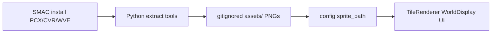

# Graphics assets roadmap

## Constraints and settled decisions

- **No shipped art**: the game binary and repo never redistribute SMAC assets. A player (or developer) with a legal install runs Python extractors that write PNGs/media into the paths configs already expect under `assets/`. Same model as [`extract_faction.py`](extract_faction.py).
- **Source of truth**: local SMAC install at `/home/martok/.PlayOnLinux/wineprefix/AlphaCentauri_gog/drive_c/GOG Games/Sid Meier's Alpha Centauri/`.
- **Every phase ships an extractor**: renderer/config work is incomplete without a script that recreates that phase’s assets from the install into their expected paths. Detailed plans must list the script name, inputs, and output tree.
- **Runtime format**: PNG; no atlas UV work until profiling says we need it.
  - Art SMAC shades (terrain and coast cells from `texture.pcx`) is **palette-index art**:
    grey = `palette.pcx` index, alpha = coverage, drawn through `assets/sprites/palette.png` by
    `Graphics::DrawTileSprite`'s palette shader. SMAC shades by adding to the palette index, so a
    colour multiply cannot reproduce its ramps.
  - Art SMAC draws unshaded (`ter1.pcx` objects; later bases, units, UI) stays RGBA through
    `DrawSprite`.
- **Replicate SMAC's mechanics**: port the rule from `terranx.exe` (shading, relief, sprite
  anchoring, cell selection) instead of approximating its output. Record each finding in
  `docs/thinker/`, then verify against the running game side by side: measure exact-palette
  pixel share, ramp usage and sprite offsets rather than judging by eye.
- **Config hook**: continue the optional `sprite_path` string pattern already used by terrain/improvements ([`ImprovementConfig_t::spritePath`](include/game/map/ImprovementConfigParser.h)).
- **Units**: workshop units are Caviar `.cvr` voxels, not PCX. **Bake offline to facing PNG sheets** (option 1). `Units.pcx` covers static natives only.
- **Video**: secret projects are `.wve` (not AVI) under `movies/`. Separate later phase.
- **Phase 1 focus**: world-map terrain (this plan’s first detailed follow-up).

## Current baseline

| Piece | State |
|---|---|
| [`Graphics`](include/graphics/Graphics.h) / SFML | Sprite draw, palette-shaded tile draw (`DrawTileSprite`), shape fills |
| [`TileRenderer`](src/ui/TileRenderer.cpp) | SMAC terrain: autotiled land/fungus/forest/river cells, coasts, depth-shaded sea, relief and slope shading, fog; procedural fallback when art is missing |
| [`extract_terrain.py`](extract_terrain.py) | `texture.pcx` cells as index art, coasts, `palette.pcx`, `ter1.pcx` bonuses and Monolith |
| [`improvements.json`](config/improvements.json) | Terraform improvements and bases have no art yet |
| [`extract_faction.py`](extract_faction.py) | Faction sheet slicer only |

## Asset pipeline (shared across phases)

Grow extraction into a tool family (evolve from `extract_faction.py`). Each family extractor is a **phase deliverable**, not a follow-up polish item.

- Shared PCX helpers: paletted load, magenta key (index 255), guide-box crops, contact sheets, `--game-dir`.
- Default game-dir override for this machine; keep Windows default as fallback.
- Output under `assets/` (gitignore extracted binaries; keep scripts + region tables in repo).
- **`extract_all.py` orchestrator** (cross-phase todo): runs every family extractor so a fresh checkout + SMAC install can populate the full expected `assets/` tree in one command. Grow it as each phase lands its script.

Document layout discoveries next to each extractor (region tables are reverse-engineered; SMAC has no sprite-index TXT).

| Phase | Extractor (in-repo) | Typical outputs |
|---|---|---|
| 1 Terrain | `extract_terrain.py` | `assets/sprites/landforms/…`, bonuses, forest, etc. |
| 2 Bases | `extract_faction.py` (existing; harden) | `assets/factions/<name>/bases/…`, `colors.json` |
| 3 Icons | `extract_icons.py` | `assets/sprites/techs/…`, `facilities/…`, `projects/…` |
| 4 UI | `extract_ui.py` | `assets/ui/…` chrome, cursors, notice thumbs |
| 5 Units | `extract_units.py` + `bake_cvr_units.py` | `assets/units/natives/…`, `assets/units/baked/…` |
| 6 Media | `extract_media.py` | `assets/media/flc/…`, `assets/media/movies/…` |
| All | `extract_all.py` | invokes the above into the expected layout |

## Phase order

### Phase 1 — World map terrain (next detailed plan)

**Goal:** map tiles look like SMAC land/sea/fungus/forest/moisture/rockiness instead of colored rects.

**Source sheets:** `texture.pcx` (base land/sea/fungus/river/road/cliffs), then `ter1.pcx` / `ter1wreck.pcx` (improvements, bonuses, monolith). `S#L#C#.pcx` are orbital planet art, not map tiles — out of Phase 1.

**Elevation (settled):** not a `TileLayer`. Tile corners rise with the terrain and slopes are
shaded by palette offset, as SMAC does; the map display setting picks smooth heights, SMAC's
whole-level steps, or flat. Water is shaded by depth on SMAC's 50 m detail scale, and its deep
or shelf art follows the corners' depth. Detailed plans:
[terrain-relief.md](../../docs/plans/terrain-relief.md),
[terrain-palette-shading.md](../../docs/plans/terrain-palette-shading.md),
[sea-depth-shading.md](../../docs/plans/sea-depth-shading.md).

**Extractor + renderer:** see the Phase 1 detailed plans (`extract_terrain.py`, `TileLayerResolver` draw path, palette-shaded terrain cells).

Phase 1 deliberately skips bases, units, and UI chrome.

### Phase 1b — Isometric map viewport

**Goal:** SMAC-style diamond presentation; gameplay grid stays square.

See detailed plan: [isometric_map_viewport.plan.md](isometric_map_viewport.plan.md) — `MapViewport` project/unproject, hit-test, back-to-front draw, diamond `TileRenderer` footprint, art mask/crops. Relief (raised corners) landed separately in
[terrain-relief.md](../../docs/plans/terrain-relief.md).

Land this before Phase 2 so faction bases sit on the diamond grid.

### Phase 1c — Remaining world-map art and rules

**Goal:** finish the world map before bases.

- **Terraform improvements:** extend `extract_terrain.py` to the `texture.pcx` road, mag tube
  and farm cells and the `ter1.pcx` mine, solar collector, condenser, mirror, borehole, bunker,
  airbase, sensor, kelp, platform and harness sprites
  ([smac-terrain-textures.md](../../docs/thinker/smac-terrain-textures.md) lists the crops), and
  wire them into `improvements.json`.
- **Landmarks:** extract the volcano, crater, mesa and dunes cells, and port SMAC's per-vertex
  brightness offsets and lift percentages for those landmarks
  ([smac-palette-lighting.md](../../docs/thinker/smac-palette-lighting.md)).
- **Unit and base seating:** units, base labels and markers still sit on the raised tile centre;
  confirm SMAC's anchor for them (terrain objects use the corners' mean) and match it.
- **Map content:** SMAC maps carry more fungus, rivers and supply pods than ours; tune
  `decoration.json` and the generator against a SMAC map.

### Phase 2 — Faction bases on the map

**Extractor:** harden [`extract_faction.py`](extract_faction.py) (game-dir defaults, `--all`, gitignore `assets/factions/`); ensure output paths stay the contract for map drawing. Hook into `extract_all.py`.

**Renderer/config work:**

- Replace yellow base-name-only markers in [`WorldDisplay`](src/ui/world/WorldDisplay.cpp) with size/defense/water base sprites from `assets/factions/<id>/bases/…`, using faction colors from `colors.json`.
- Name labels stay as overlay text.

### Phase 3 — Content icons (tech / building / project)

**Extractor:** `extract_icons.py` — 1:1 convert `techs/techNNN.pcx`, `facs/facNNN.pcx`, `projs/projNNN.pcx` → the PNG paths written into config. Hook into `extract_all.py`.

**Renderer/config work:**

- Add `sprite_path` to building / tech / secret-project configs + parsers (`KnownBuildingKeys_` for buildings).
- Wire research / base / production UI placeholders to those icons.

### Phase 4 — UI chrome

**Extractor:** `extract_ui.py` — slice/convert `iface.pcx`, `console*.pcx`, `artbox*`, cursors, `*_sm` notice thumbs into `assets/ui/…`. Hook into `extract_all.py`.

**Renderer/config work:**

- Point [`config/ui/style.json`](config/ui/style.json) (and view code) at chrome sprites; keep rect+text fallbacks.

### Phase 5 — Units (natives + CVR bake)

**Extractors:**

- `extract_units.py` — slice `Units.pcx` → native/static unit PNGs.
- `bake_cvr_units.py` — offline CVR bake (build on CVR-Colorizer / format docs): compose chassis+weapon parts, render N facings (and faction `vehicle_color` recolor), write PNG sheets under `assets/units/baked/…`.
- Both registered in `extract_all.py` (bake may be opt-in / slower).

**Renderer/config work:**

- `sprite_path` / facing table on [`native_units.json`](config/native_units.json); draw in [`UnitMarkerRenderer`](include/ui/world/UnitMarkerRenderer.h).
- Per-component art keys (chassis primary; weapon overlay if needed) + facing index from unit facing state (add facing to unit model if missing — leave a TODO until that phase confirms the data field).
- Replace cyan letter-chips when sprites exist; keep chips as fallback.

### Phase 6 — Motion media

**Extractor:** `extract_media.py` — FLC → PNG sequences (or playable intermediate); WVE → playable files the engine can open; map stems via `movlist.txt` / `movlistx.txt`. Hook into `extract_all.py`.

**Renderer/config work:**

- Playback hooks for leader/diplomacy/FX and secret-project completion UI.

## Cross-cutting rules

- Extraction scripts live in-repo; **extracted art does not**. The shipped product assumes the player ran the extractors against their own SMAC install.
- Each phase’s definition of done includes: **extractor script + assets land in expected paths + game reads those paths**. No phase is “renderer only.”
- Never invent SMAC art in C++; missing asset → existing procedural/placeholder path.
- Prefer config paths over hard-coded texture ids.
- Each phase gets its own detailed plan before implementation (and that plan must name the extractor).
- Architecture docs update when the live draw path changes (Phase 1+).

## SMAC rules every phase reuses

- **Palette:** art loads into palette slots 10 and up (slot = `palette.pcx` index + 10); PCX
  246 marks shadow pixels, 252/253 are keys.
- **Object anchor:** a `ter1.pcx` cell (100 × 62) draws from the tile's top corner down, seated
  at the mean of the tile's four corner heights. A tile draws terrain, then its grid edges,
  then its objects.
- **Fog:** terrain under fog is shaded 2 palette steps darker with a black haze; objects draw
  clear on top.
- **Map content shapes the look:** sea depth, shelf width and fungus cover come from world
  generation, so compare palette usage before blaming the renderer (`ocean_depth_exponent`
  brought our sea in line).

## Immediate next step

Write the **Phase 1c detailed plan**, starting with terraform improvement art.
