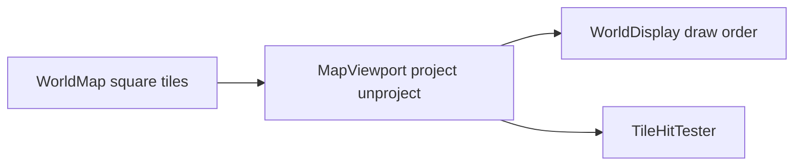

# Isometric map viewport

## Settled approach

- **Gameplay stays square.** `WorldMap` / `Tile` neighbors, wrap-X, pathfinding, and territory are unchanged.
- **Presentation only.** All isometric math lives in the UI viewport/renderer seam ([`MapViewport`](include/ui/world/MapViewport.h), hit-testing, [`WorldDisplay`](src/ui/world/WorldDisplay.cpp) / [`TileRenderer`](include/ui/TileRenderer.h)).
- **SMAC-like diamond (2:1)** — tile footprint width : height ≈ 2 : 1; grid axes run diagonally on screen.
- **Flattened first.** Elevation as tint (Phase 1) stays; topographic Y-shift + cliff compositing is a follow-on slice after the diamond grid works.
- **Base workable-area UI** can stay orthogonal for this phase (small schematic); only the world map goes isometric unless we explicitly extend it later.

## What changes (not “just lines”)

| Concern | Today (orthogonal) | Target (isometric) |
|---|---|---|
| Tile origin | `(col * s, row * s)` | `x = (col - row) * (w/2)`, `y = (col + row) * (h/2)` (+ camera) |
| Tile footprint | Axis-aligned square | Diamond `w × h` (h ≈ w/2) |
| Hit-test | `floor(px / s)` | Inverse of project; pick nearest diamond |
| Draw order | Row-major | Back-to-front (e.g. increasing `col+row`) |
| Borders / rivers / paths | Square edges / centers | Diamond edges / `PixelCenterOf` |
| Art | Square crops stretched to square | Diamond-aware crops or masked diamonds |

Call sites that already go through `PixelOriginOf` / `PixelCenterOf` / `ForEachVisibleTile` mostly follow the viewport once those APIs change. Places that assume a square `DrawFilledRect(tileX, tileY, tileSize, tileSize)` (shroud, `TileRenderer` border) need diamond drawing.

## Implementation slices

### 1. Viewport math

In [`MapViewport`](include/ui/world/MapViewport.h) / `.cpp`:

- Replace scalar `m_tileSize` with diamond metrics: `tileWidth`, `tileHeight` (or keep `TileSize()` as width and derive height).
- Implement `Project(worldX, worldY) -> pixel` and `Unproject(pixel) -> optional world` with wrap-X handled the same way as today’s camera.
- Recompute visible set: iterate a screen-space diamond/AABB of candidate tiles, not a simple col×row rectangle (isometric windows are skewed).
- Keep `ForEachVisibleTile` callback `(tile, pixelX, pixelY)` as the origin of the diamond’s bounding box (or top vertex — pick one and document it).

Unit-test project/unproject round-trips and wrap-X edge cases (no SFML required).

### 2. Hit-testing and input

- Update [`TileHitTester`](include/ui/TileHitTester.h) world-map path to use `Unproject` (or move hit-test entirely onto `MapViewport::WorldCoordsAtPixel`).
- Wire camera scroll / click handlers in [`WorldView`](include/ui/world/WorldView.h) / order controllers so they use the same API.
- Path preview and combat overlays already prefer `PixelCenterOf` — re-verify after the transform.

### 3. Draw path

- [`WorldDisplay`](src/ui/world/WorldDisplay.cpp): sort / iterate visible tiles back-to-front; shroud as diamond (filled diamond or masked sprite), not a square rect.
- [`TileRenderer`](src/ui/TileRenderer.cpp): accept diamond size (width/height); draw terrain sprite scaled to the diamond bounds; border as four diamond edges (or a diamond outline helper on `Graphics` if needed).
- Markers (bases, sensors, units): anchor on `PixelCenterOf`; stop assuming “bottom of square.”
- Rivers / path lines: keep center-to-center; thickness ratios stay style-driven.

### 4. Art alignment

- Prefer diamond-native crops from `ter1.pcx` / cliff regions where they exist.
- For square `texture.pcx` landforms: either (a) draw full square texture inside the diamond AABB with a diamond alpha mask, or (b) re-extract with diamond masks in `extract_terrain.py`.
- Document the choice in the extractor; keep gitignored `assets/sprites/` contract.

### 5. Elevation perspective (follow-on, same epic)

- Screen Y offset from elevation meters (config/style knobs).
- Composite `assets/sprites/cliffs/*` from neighbor height deltas.
- Optional “flattened terrain” toggle mirroring SMAC Ctrl+Shift+X.

## Out of scope

- Changing `WorldMap` topology or neighbor rules.
- CVR units / faction bases (roadmap Phases 2 and 5) — but their map markers must use the new centers once this lands.
- Full minimap isometric redraw (can stay top-down schematic).

## Docs

- Update [`docs/architecture/graphics-system.md`](docs/architecture/graphics-system.md) and the map-system tile-layer note: presentation is isometric; model is square; elevation tint vs perspective called out.
- Insert this phase into the graphics assets roadmap as **Phase 1b** (before or after faction bases — default: **after Phase 1, before Phase 2**, so bases land on the diamond grid).

## Definition of done

- World map reads as a diamond grid; clicks select the correct tile including wrap-X.
- Terrain sprites / shroud / borders / rivers / unit chips align to diamonds.
- Headless tests cover project/unproject; existing UI tests updated for the new geometry.
- Orthographic square map is gone from `MapViewport` (no dual-mode flag unless needed for a short migration).
