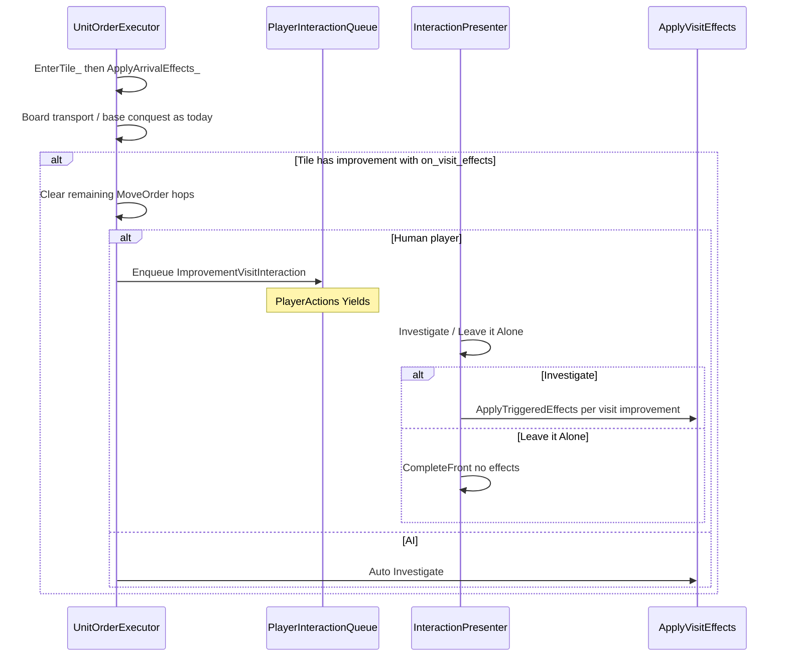

# Monolith visit via on_visit_effects

Arrival on a tile that hosts an improvement with `on_visit_effects` prompts Investigate / Leave it Alone. Investigate runs that list against the mover through `ApplyTriggeredEffects`. Continuous yields stay Continuous.



| Piece | Role |
| --- | --- |
| `on_visit_effects` | Already on `ImprovementConfig_t`; parser rejects non-empty until this wires the fire site |
| `GrantXp` | Existing triggered type; Monolith uses `oncePer: {scope: unit, key: "monolith_xp"}` |
| `RestoreHitPoints` | New triggered type (heal the context unit) |
| `remove_host_chance` | Optional Rational on `GrantXp`; roll only after XP actually increases |
| `ImprovementVisitInteraction_t` | `PlayerInteraction_t` arm (unit id) |
| `ApplyVisitEffects` | Stamps mover + tile + host improvement id; runs each visit list |

- Prompt and effects target the **arriver only**; co-located units are untouched until they enter.
- Heal every Investigate (no `oncePer` on RestoreHitPoints). GrantXp latches via existing `oncePer` only when XP increases.
- Disappear only when GrantXp increases XP and `remove_host_chance` rolls.
- Leave it Alone: stay on tile; no triggered apply; no latch spend; later re-entry can prompt again.
- AI / non-player: auto-Investigate (dispatch immediately; no popup).

## Trigger: Investigate vs Leave alone

Same production-abandon spine ([player-interaction-system.md](docs/architecture/player-interaction-system.md)): enqueue → Yield → present → domain resolve → `CompleteFront` → Advance.

1. After `EnterTile_`, in `ApplyArrivalEffects_` (shared with airdrop): if any improvement on the mover’s tile has a non-empty `onVisitEffects`, treat it as a visit opportunity.
2. Clear remaining `MoveOrder` hops so the unit does not walk off before the choice.
3. Player faction: `EnqueueForPlayer(ImprovementVisitInteraction_t{ unitId })` without dispatching. `PlayerActions` Yields while pending.
4. `InteractionPresenter`: `ListSelectorPopup` — “Investigate …” / “Leave it Alone” (improvement name when useful). Investigate → `ApplyVisitEffects` → `CompleteAndAdvance_`. Leave alone → `CompleteAndAdvance_` only.
5. AI / non-player: `ApplyVisitEffects` immediately.

Wire enqueue through the same session path conquest already uses (`IUnitOrderWorld` / `GameState`). Escape / click-outside keeps Front pending and re-presents.

## Effect types

**GrantXp** — already shipped (`amount` + `op`, optional `condition`, optional `oncePer`). Add optional `remove_host_chance` (Rational string, e.g. `"1/32"`). Add `RollRational` to [RandomRoll.h](include/lib/RandomRoll.h).

Apply steps for one GrantXp (existing plus host remove):

1. Existing `oncePer` gate / condition / subject skip as today.
2. Apply XP via `ApplyModifierStack` + `SetXp`; `oncePer` spends only when XP actually changes (existing rule).
3. If XP increased and `remove_host_chance` is set and `RollRational` succeeds → remove the host improvement named on the visit context from `subjects.pTile`.

Train / prototype GrantXp omit `remove_host_chance`. Visit fire site stamps the host improvement id on the context for the duration of that list.

**RestoreHitPoints** — new triggered variant; subject is `pUnit`. Required `amount` + `op`:

| `op` | Meaning for current HP |
| --- | --- |
| `Add` | Heal `amount` HP |
| `AddPercent` | Heal `maxHp * amount / 100` |
| `MaxClamp` | `hp = min(hp, amount)` |
| `MinClamp` | `hp = max(hp, amount)` |
| `SetPercent` | Raise HP up to `maxHp * amount / 100` (never reduces) |

Reject `MultiplyGeometric`. Returns whether HP changed (so a future `oncePer` on heal would only latch on a real heal). Monolith uses `{ "amount": 100, "op": "SetPercent" }`.

## Dispatch (Investigate only)

```cpp
void ApplyVisitEffects(Unit& rMover, TileEffectsContext& rTileEffects, std::mt19937& rRng);
```

For each improvement on the mover’s tile with a non-empty `onVisitEffects`:

1. Build `TriggeredEffectContext_t` with `pUnit = &rMover`, `pTile` / target tile = mover’s tile, host improvement id = that improvement’s config id, session RNG (or `rRng`).
2. `ApplyTriggeredEffects(improvement.onVisitEffects, ctx)`.

Boarding and base conquest stay unconditional in `ApplyArrivalEffects_`. Drop the ImprovementConfigParser reject of non-empty `on_visit_effects` once this path exists.

## Monolith config

Keep Continuous 2-2-2 yields. Add:

```json
"on_visit_effects": [
  {
    "type": "RestoreHitPoints",
    "parameters": { "amount": 100, "op": "SetPercent" }
  },
  {
    "type": "GrantXp",
    "parameters": { "amount": 1, "op": "Add", "remove_host_chance": "1/32" },
    "once_per": { "scope": "unit", "key": "monolith_xp" }
  }
]
```

Update the description. Second Investigate on any Monolith heals again but skips GrantXp once the unit has spent `monolith_xp` (including after visiting a different Monolith tile).

## Tests and docs

- Parser: RestoreHitPoints ops; GrantXp `remove_host_chance`; reject MultiplyGeometric on heal.
- Prompt: step onto Monolith as player → visit interaction Front; Leave alone → no heal/XP; Investigate → heal/XP; co-located unit unchanged.
- Multi-hop stops on the visit tile until Investigate/Leave completes.
- AI: effects apply without a queue item.
- GrantXp: `oncePer` latches only after XP increases; second Investigate heals but does not add XP; at-max Investigate does not latch (heal still works); `remove_host_chance` only when XP increased; ProbeTeam can gain XP.
- Docs: mark `on_visit_effects` fired; visit gate in [effects-system.md](docs/architecture/effects-system.md), [player-interaction-system.md](docs/architecture/player-interaction-system.md), [unit-movement-system.md](docs/architecture/unit-movement-system.md); remove monolith from World events in [turn-structure.md](docs/game-rules/turn-structure.md).
