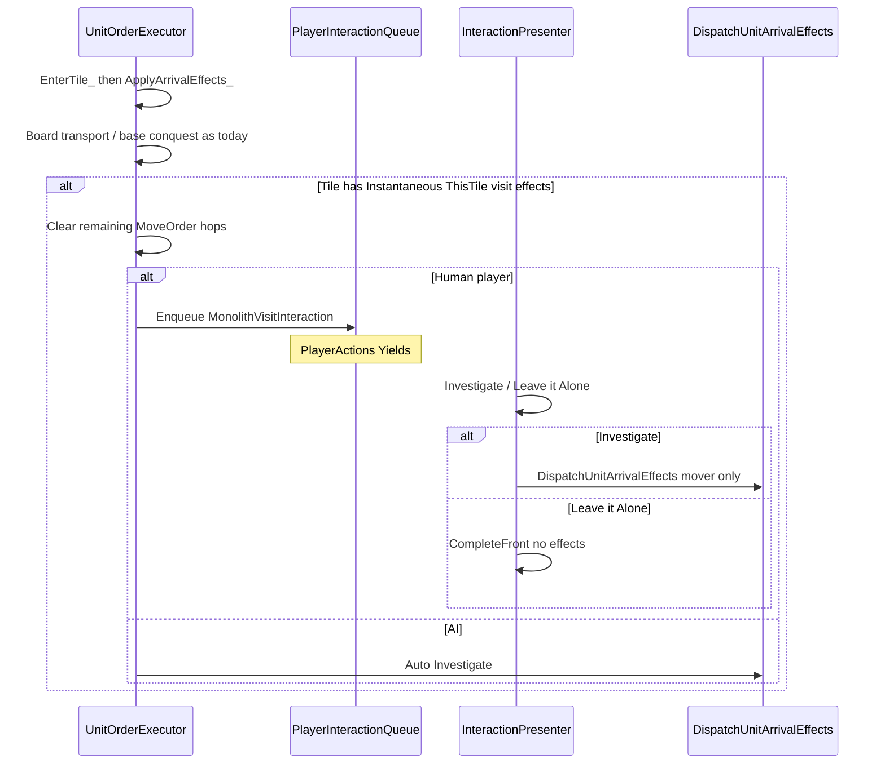

# Monolith visit via Instantaneous effects

Instantaneous `RestoreHitPoints` and `GrantExperience` on improvements. Unit arrival on a visit tile prompts Investigate / Leave it Alone; only Investigate applies those effects to the mover. Continuous yields stay Continuous.




| Piece                                  | Role                                                                                |
| -------------------------------------- | ----------------------------------------------------------------------------------- |
| `RestoreHitPoints` / `GrantExperience` | Instantaneous effect types on the improvement                                       |
| `MonolithVisitInteraction_t`           | Typed `PlayerInteraction_t` arm (unit id)                                           |
| `DispatchUnitArrivalEffects`           | Applies Instantaneous `ThisTile` visit effects to the mover only, after Investigate |
| Unit latch                             | Once-per-unit GrantExperience memory by source improvement id                       |


- Prompt and effects target the **arriver only**; co-located units are untouched until they enter.
- Heal only on Investigate (every Investigate can heal; no once latch on RestoreHitPoints).
- GrantExperience applies to any unit, including ProbeTeam.
- Disappear only when GrantExperience increases XP and `remove_host_chance` rolls.
- Leave it Alone: stay on tile; no Instantaneous effects; no latch; later re-entry can prompt again.
- AI / non-player: auto-Investigate (dispatch immediately; no popup).
- Remove `TryPromote`’s ProbeTeam early-out (probe-vs-probe kills use the same promotion roll; attack eligibility stays in the order handler).

## Trigger: Investigate vs Leave alone

Production-abandon spine (`[player-interaction-system.md](docs/architecture/player-interaction-system.md)`): enqueue → Yield → present → domain resolve → `CompleteFront` → Advance.

1. After `EnterTile_`, in `ApplyArrivalEffects_` (shared with airdrop): if the mover’s tile has Instantaneous `ThisTile` RestoreHitPoints / GrantExperience on an improvement, treat it as a visit opportunity.
2. Clear any remaining `MoveOrder` hops so the unit does not walk off before the choice.
3. Player faction: `EnqueueForPlayer(MonolithVisitInteraction_t{ unitId })` without dispatching. `PlayerActions` Yields while pending.
4. `InteractionPresenter`: `ListSelectorPopup` — “Investigate the Monolith” / “Leave it Alone” (use improvement name when useful). Investigate → `DispatchUnitArrivalEffects` → `CompleteAndAdvance_`. Leave alone → `CompleteAndAdvance_` only.
5. AI / non-player: `DispatchUnitArrivalEffects` immediately.

Wire enqueue through the same session path conquest already uses (`IUnitOrderWorld` / `GameState`). Domain APIs for Investigate / Leave; presenter only chooses. Escape / click-outside keeps Front pending and re-presents.

## Effect types

In `[EffectConfig.h](include/game/effects/EffectConfig.h)` / parser / `EffectVariant_t`. Add `RollRational` to `[RandomRoll.h](include/lib/RandomRoll.h)`.

**RestoreHitPoints** — Instantaneous; `ThisTile` on Improvement. Required `amount` + `op`:


| `op`         | Meaning for current HP                                 |
| ------------ | ------------------------------------------------------ |
| `Add`        | Heal `amount` HP                                       |
| `AddPercent` | Heal `maxHp * amount / 100` (percent of max HitPoints) |
| `MaxClamp`   | `hp = min(hp, amount)`                                 |
| `MinClamp`   | `hp = max(hp, amount)`                                 |
| `SetPercent` | Raise HP up to `maxHp * amount / 100` (never reduces)  |


Reject `MultiplyGeometric`. Monolith: ~~~~`{ "amount": 100, "op": "SetPercent" }`~~. Heal-then-absolute-cap: two effects in order (~~`AddPercent` ~~then~~ `MaxClamp`~~).~~

~~**GrantExperience** — Instantaneous; same op set (percents relative to~~ `MaxLevel()`~~). Optional~~ `once_per_unit` ~~(bool, default~~ `false`~~); optional~~ `remove_host_chance` ~~(Rational).~~

Monolith: `{ "amount": 1, "op": "Add", "once_per_unit": true, "remove_host_chance": "1/32" }`.

### `once_per_unit` semantics

This flag is only on **GrantExperience** (not RestoreHitPoints, not the visit prompt).


| Rule                                       | Behavior                                                                                                                                                                                                                       |
| ------------------------------------------ | ------------------------------------------------------------------------------------------------------------------------------------------------------------------------------------------------------------------------------ |
| Latch key                                  | Host **improvement config id** (`sourceId`, e.g. `"Monolith"`). One latch entry per id per unit.                                                                                                                               |
| When latch is written                      | Only when this effect **increases** the unit’s XP.                                                                                                                                                                             |
| When latch is read                         | If `once_per_unit` and the unit already has this `sourceId` latched → skip the effect entirely (no XP op, no remove roll).                                                                                                     |
| XP unchanged                               | At max level, `SetPercent` already met, `MaxClamp` with no change, etc. → **do not** latch; **do not** roll remove. The unit may Investigate again later for heal, and if XP can rise again the once-bonus is still available. |
| Investigate vs latch                       | Choosing Investigate does not latch by itself. Leave it Alone never latches.                                                                                                                                                   |
| Heal independence                          | RestoreHitPoints always runs on Investigate regardless of GrantExperience latches.                                                                                                                                             |
| Lifetime                                   | Latch lives on the `Unit` for its life (survives ownership transfer). A newly built unit has an empty set.                                                                                                                     |
| Default `false`                            | Every Investigate may apply the XP op again (modding). Stock Monolith sets `true`.                                                                                                                                             |
| Several GrantExperience on one improvement | They share one latch key (the improvement id). First successful XP increase latches; later once-effects on that same id no-op. Stock Monolith has a single GrantExperience.                                                    |


Apply steps for one GrantExperience:

1. If `once_per_unit` and `sourceId` already latched → return.
2. Compute new XP from `amount`/`op`; if equal to current → return.
3. `SetXp(newXp)`; if `once_per_unit`, record `sourceId`.
4. If XP increased and `remove_host_chance` is set and `RollRational` succeeds → `RemoveImprovementWithEffects` for `sourceId`.

## Dispatch (Investigate only)

```cpp
void DispatchUnitArrivalEffects(Unit& rMover, TileEffectsContext& rTileEffects,
                                std::mt19937& rRng);
```

Subject is `rMover` only. Walk Instantaneous `ThisTile` RestoreHitPoints / GrantExperience on that tile’s improvements. Reject Instantaneous StatModifier on Improvement at parse; update WeirdAura fixture. Humans call this only from Investigate; AI from the auto path. Boarding and base conquest stay unconditional in `ApplyArrivalEffects_`.

## Unit latch

`Unit` holds the set of improvement ids for which a `once_per_unit` GrantExperience has already increased XP. API shape: query/record by `sourceId` (names can match existing latch style on `Unit`). Not a RuleFlag.

## Monolith config

Keep Continuous yields; add the Instantaneous pair above; update description.

## Tests and docs

- Parser coverage for both effect types and ops.
- Prompt: step onto Monolith as player → visit interaction Front; Leave alone → no heal/XP; Investigate → heal/XP; co-located unit unchanged.
- Multi-hop stops on the visit tile until Investigate/Leave completes.
- AI: effects apply without a queue item.
- GrantExperience: `once_per_unit` latches only after XP increases; second Investigate on same Monolith heals but does not add XP; at-max Investigate does not latch (heal still works); `remove_host_chance` only when XP increased; ProbeTeam can gain XP; TryPromote allows ProbeTeam survivors.
- Docs: Instantaneous unit-arrival + interaction gate in `[effects-system.md](docs/architecture/effects-system.md)`, `[player-interaction-system.md](docs/architecture/player-interaction-system.md)`, `[unit-movement-system.md](docs/architecture/unit-movement-system.md)`; remove monolith from World events in `[turn-structure.md](docs/game-rules/turn-structure.md)`.

