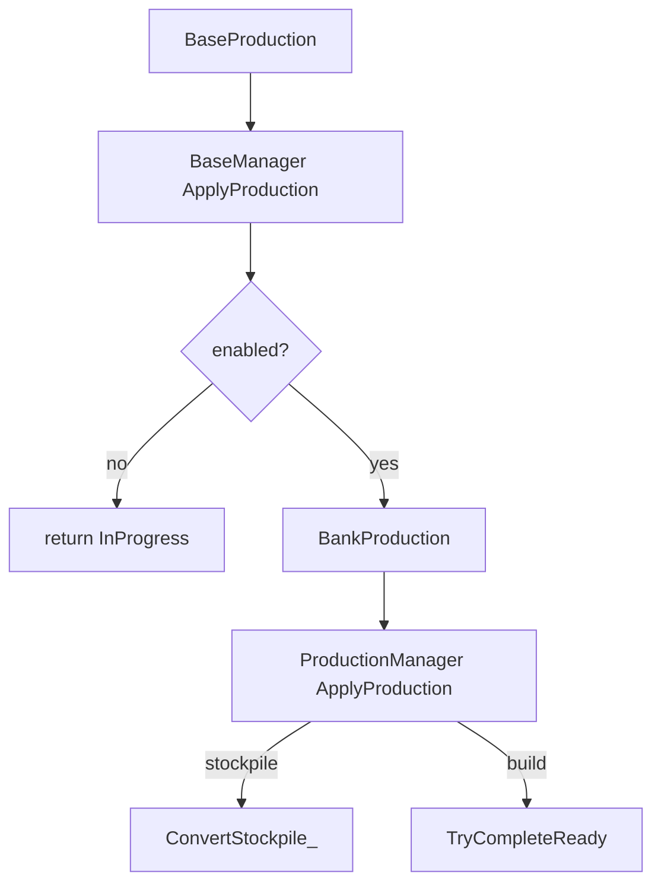

# Clean up ApplyProduction orchestration

## Replace `NeverCompletes` with `IsStockpile`

Only [`StockpileConfig_t`](include/game/stockpiles/StockpileConfig.h) returns true today, and it already reports `ConstructableKind_t::Stockpile`. Remove `NeverCompletes`; add non-virtual on [`IConstructable`](include/game/IConstructable.h):

```cpp
bool IsStockpile() const
{
    return GetConstructableKind() == ConstructableKind_t::Stockpile;
}
```

Update all call sites and the ProductionCostTests stub (return `Stockpile` kind).

## Can ProductionManager own ProductionCompletion?

**Yes.** Nest under PM with `BaseManager&`. BaseManager keeps thin facades. `OnProductionChanged` → `NotifyProductionChanged` stays inside PM.

## Mechanic

**Disabled:** early-return `InProgress`.

**Enabled:** bank `ConsumeMinerals` into PM, then **either** convert **or** complete — never both. Post-completion leftovers stay unconverted until a later turn.

## SRP / single abstraction for `ProductionManager::ApplyProduction`

Dispatcher only — no inlined conversion math:

```cpp
ProductionApplyResult_t ProductionManager::ApplyProduction()
{
    if (m_pCurrentItem && m_pCurrentItem->IsStockpile())
    {
        return ConvertStockpile_();
    }
    return m_pCompletion->TryCompleteReady(/*bNewTurn=*/true);
}
```

| Method | Single responsibility |
|--------|----------------------|
| `ProductionManager::ApplyProduction` | Choose convert vs complete for the queued item |
| `ConvertStockpile_` | Drain PM stockpile through `ApplyStockpileConversionAtBase`, stamp turn original, return `InProgress` |
| `TryCompleteReady(bNewTurn)` | Abandon/defer/finish gates only (`ProductionCompletion`; **delete `Apply`**) |
| `BaseManager::ApplyProduction` | Disable gate → bank leftovers → `GetProduction().ApplyProduction()` |

## Target flow

```text
BaseManager::ApplyProduction()
  if disabled: return InProgress
  BankProduction(ConsumeMinerals())
  return ProductionManager::ApplyProduction()
           → ConvertStockpile_()  |  TryCompleteReady(newTurn=true)
```



## Ownership

| Concern | Owner |
|---------|--------|
| Queue, bank, `ApplyProduction`, `ConvertStockpile_`, owns Completion | `ProductionManager` |
| Abandon / defer / finish | `ProductionCompletion` |
| Disable + `ConsumeMinerals` | `BaseManager::ApplyProduction` |

## ConvertStockpile_ sketch

```cpp
ProductionApplyResult_t ProductionManager::ConvertStockpile_()
{
    const int toConvert = m_mineralStockpile;
    m_mineralStockpile = 0;
    if (toConvert > 0)
    {
        ApplyStockpileConversionAtBase(
            m_rBase, m_rBase.GetStockpileRegistry().Get(m_pCurrentItem->GetId()), toConvert);
    }
    m_pTurnOriginalItem = m_pCurrentItem;
    return {ProductionApplyKind_t::InProgress, {}};
}
```

Expose `GetStockpileRegistry()` on BaseManager (or pass registry into PM). Delete `AllocateOrConvertLeftoverMinerals`, `ProductionCompletion::Apply`, and `BaseManager::m_pCompletion`.

## Tests / docs

- Riot early-return; bank/stockpile unchanged
- No same-turn complete+convert
- `NeverCompletes` → `IsStockpile`
- Replace `AllocateOrConvertLeftoverMinerals` call sites
- `./bd test` on `[production]` / riot
