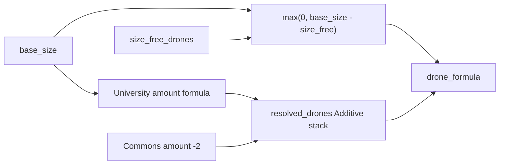
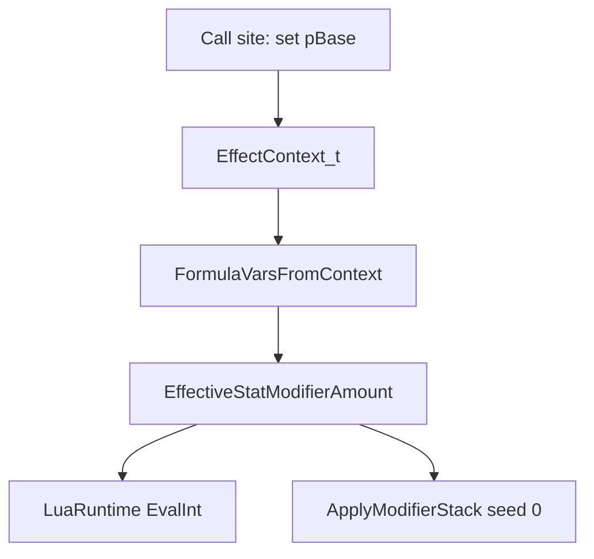

# Drone effects via overloaded amount (formula string)

## Why the prior plan was the wrong shape

`ResolveIndependentSeedStat` (mult@`base_size` + adds@0) hardcoded a new composition law at a drone call site. That fights `StatKind_t` / `KindFor` / `SeedFor`. University is not “scale the whole Drones stack”; it is **an Add that is a function of base size**.

## Target math



Example (effects only): size 13, University `floor(base_size / 4)`, Commons −2 → `3 + (−2) = 1`.

- **Size drones**: `max(0, base_size - size_free_drones)` in [config/pop_composition.json](config/pop_composition.json) — not via the `Drones` stack.
- **Effect drones**: normal Additive `ResolveStatModifiers` with `SeedFor(Drones)` (= 0).
- **No** `ResolveIndependentSeedStat`. **No** new `StatKind`. **No** second drone StatId. **No** separate `amount_formula` JSON key.

## Design: overload `amount`, parser infers

One wire field; JSON type chooses the meaning:

| JSON | Meaning |
|------|---------|
| `"amount": -2` (number) | Literal contribution (today) |
| `"amount": "floor(base_size / 4)"` (string) | Lua expression → contribution; then existing `op` applies |
| `"amount_source": "..."` + numeric `"amount"` | Unchanged: scale × context field |

University config shape:

```json
{
  "type": "StatModifier",
  "scope": "AllOwnerBases",
  "parameters": {
    "stat": "drones",
    "op": "Add",
    "amount": "floor(base_size / 4)"
  }
}
```

Recreation Commons stays `"amount": -2`.

### Parser / model ([ParseStatModifier_](src/game/effects/EffectConfigParser.cpp))

- If `amount` is a **number** → `statModifier.amount = …`; leave formula unset (current path).
- If `amount` is a **string** → require non-empty; store in `StatModifierEffect_t::amountFormula` (`std::optional<std::string>`); `amount` field unused for eval (or left 0).
- If `amount` is missing → keep today’s defaults (0, or 1 when `amount_source` is set).
- Reject: non-number/non-string `amount`; empty string; **string `amount` together with `amount_source`** (scale must stay numeric).
- v1: formula `amount` requires `op: Add` (same restriction as `amount_source`), unless a later need for formula×percent appears.
- No dedicated `ModifierOp_t::Formula`.

In-memory: keep `double amount` for literals/`amount_source` scale; add `std::optional<std::string> amountFormula` when the wire value was a string. Callers/tests that build modifiers in C++ set one or the other explicitly (no JSON inference).

## Feeding formula vars

Closed catalog via `EffectContext_t` — not ad-hoc maps, not `resolve(other_stat)` in v1.

### Call sites do not supply vars manually

Resolve sites only attach **context handles** they already have (same pattern as conditions / `amount_source` today). One helper derives the formula map:

| Layer | Responsibility |
|-------|----------------|
| Call site | `ctx.pBase = this` (and later `targetTile`, etc. when that lane needs them) |
| `FormulaVarsFromContext(ctx)` | Fills every catalog entry derivable from those handles |
| `EffectiveStatModifierAmount` | Calls the helper + `LuaRuntime::EvalInt` |

So the drone supplier stays:

```cpp
EffectContext_t ctx;
ctx.pBase = this;  // not base_size=, not a growing var list
```

As the catalog grows (`faction_base_count`, map dims, …), **extend `FormulaVarsFromContext`** (and add a handle on `EffectContext_t` only when the value cannot be reached from an existing handle). Existing call sites that already set `pBase` pick up new base-derived vars with **no per-site edits**.

v1 catalog from `pBase`: `base_size` (population size). Missing handle when a formula needs a var that requires it → throw. Use existing `LuaRuntime::EvalInt` (chunk cache, clear globals after call).



### Filter / context-free rules

- Include formula-amount modifiers in `FilterBaseLevelByStatId` when `pCtx` can supply the catalog (`pBase`).
- Exclude them when `pCtx` is null (context-free), like condition-carrying effects.
- Keep dropping `amountSource` from this filter (other resolve paths).
- [GetDroneModifier()](src/game/faction/base/BaseManager.cpp) stays context-free (facility flat Adds). Composition uses the supplier with `pCtx`.

## Drone supplier

```cpp
EffectContext_t ctx;
ctx.pBase = this;
inputs.resolvedDrones = FinalizeResolvedStat(
    ResolveStatModifiers(
        FilterBaseLevelByStatId(rBaseEffects, StatId_t::Drones, &ctx),
        SeedFor(StatId_t::Drones),
        &ctx)
        .total);
```

`resolvedDrones` = effect contribution only. Stop seeding with `baseSize`.

## pop_composition formula

- `max(0, resolved_drones - size_free_drones)`
- → `max(0, base_size - size_free_drones) + resolved_drones`

Keep outer `max(0, min(base_size, …))`.

## What stays untouched

- Bureaucracy, assimilation, `conquered_drone_cap`, map/residue.
- `SizeFreeDrones` / difficulty.
- `KindFor(Drones)` Additive.
- Away-from-home / garrison police TODO.
- Talents can reuse string `amount` later; not required this pass.

## Implementation outline

1. **Parse** — overload `amount` in `ParseStatModifier_` as above; strictness tests for type inference and `amount_source` conflict.
2. **Evaluate** — `EffectiveStatModifierAmount` runs `amountFormula` via Lua when set; thread `LuaRuntime` like calculators (no hidden global).
3. **Context vars** — `FormulaVarsFromContext`.
4. **Filters** — formula mods with `pCtx` only.
5. **Drone formula + supplier** — as above.
6. **Tests** — parse number vs string; size 13 Uni+Commons → 1; size drones with `resolvedDrones=0`; stack cap; GetDroneModifier unchanged.
7. **Docs** — [docs/architecture/effects-system.md](docs/architecture/effects-system.md): overloaded `amount`, var catalog, filters; fix University 1.25 comments.

## Risks

- Empty-stack ⇒ `resolved_drones == base_size` callers must update.
- Threading `LuaRuntime` into amount resolution widens some APIs.
- Keep the formula var catalog small and documented.
- A string that is only digits (e.g. `"2"`) is a formula, not a literal — acceptable; prefer numeric JSON for constants.

## Rejected alternatives

- **Separate `amount_formula` key** — redundant with overloaded `amount`.
- **ResolveIndependentSeedStat / IndependentSeed StatKind / two StatIds**.
- **Open arbitrary var injection / cross-stat resolve in formulas** — v1 out of scope.
