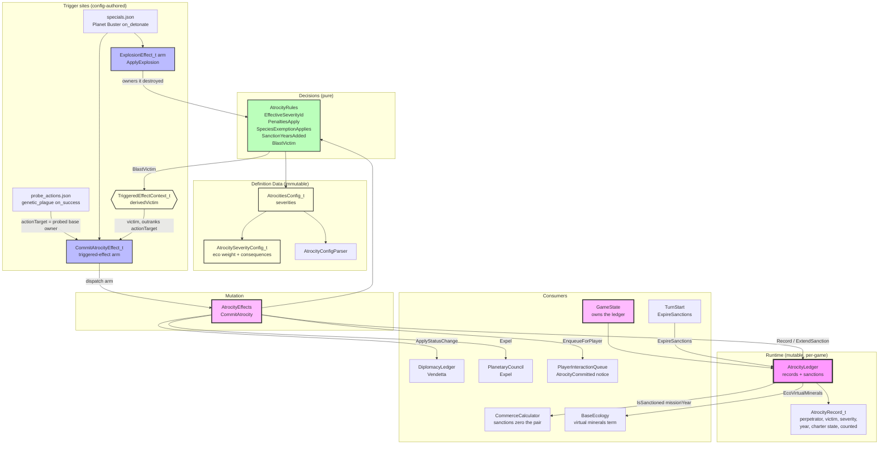

# Atrocity System Architecture

## Component Overview

### Severities are a closed enum

`AtrocitySeverityId_t` is `Simple` and `Major`, the two tiers the Datalinks name. `config/atrocities.json`
must configure both and may not add another. `CommitAtrocity` parses the authored name with
`EnumFromName`, so a typo fails when the effect list is loaded.

### Two counters, and only counted acts move them

`CommitAtrocity` applies the Charter and species gates to the **authored** severity first. An act
that fails them is recorded with `bCounted` false and stays the tier it was authored as. An excused
Simple act is not reclassified as Major.

A counted Simple act increments `SimpleCount`. The counter is read as if this act were already
included: while that total is still at or under the threshold, the act stays Simple. Past it,
the act is answered for as Major.

Both thresholds come off the **session** difficulty level, which is the only level
`CommitAtrocity` ever resolves: `player_atrocity_threshold` for a human perpetrator,
`ai_atrocity_threshold` for an AI one. Shipping player values are 4 × (8 − difficulty) with
Citizen = 0, so Talent is 24 and the 25th counted Simple act is the first Major, and Transcend
is 12. Every shipping level states the same `ai_atrocity_threshold` of 20, so the AI answers
at one standard whatever the player picked — but it is a per-level key, so a mod can vary it
without touching C++.

A counted Major act, including a Planet Buster and a Simple act that just escalated, is the other
counter. It does not increment `SimpleCount` and adds no commerce sanction.

A counted Simple act adds `sanction_years_per_atrocity` × `SimpleCount` (the count after this
act) onto whatever sanction time is left. The first adds 10 years, the second 20, and five in
the same year come to 150. An excused act does not lengthen it.

The Charter gates every tier. With it repealed, nothing is counted: no universal Vendetta, no
expulsion, no sanction, and that record adds no eco weight. The act is still an attack on the
victim, so the victim pair goes to Vendetta either way (`ApplyHostileAct`). The victim fact is the
record itself (`HasVictimized`, `HasCommittedMajorAgainst`), counted or not.

A perpetrator named as its own victim is recorded **victimless**: razing your own ground is
still an atrocity, but it is not a victim relationship, and the ledger rejects a record that
claims otherwise rather than leaving every query to discount it.

Either party being a Progenitor excuses every tier. Native life is not a Progenitor, and a
victimless act has no Progenitor victim, so a human perpetrator is still answered for. A
Progenitor perpetrator is excused even with no victim.

`eco_virtual_minerals` is read from config for counted records only.

### AtrocityRules (pure)

`EffectiveSeverityId`, `PenaltiesApply`, `SpeciesExemptionApplies`, `SanctionYearsAdded`,
`BlastVictim`. The escalation rule, the Charter gate, the Progenitor gate, the duration curve,
and who a blast is answered to are separate game rules consulted together. Pure, so tests pin
them directly without a GameState. Mirrors the `BaseConquestRules` / `ProbeRules` split.

`BlastVictim` is the warhead rule: a razed base outranks a killed unit, the first owner the
disk reached wins within each, and the detonator is never their own victim. It lives here and
not in `game/map/` — `ApplyExplosion` reports the owners it cost something (`baseOwnersDestroyed`,
`unitOwnersDestroyed`, each in blast order with no faction twice) and holds no opinion about
which of them answers for it.

### AtrocityEffects (mutation)

`CommitAtrocity` orchestrates: gather config, decide whether the authored act is counted, classify
the severity from the simple counter, write the record, then — only if it was counted — charge for
it and announce it. **The record is written either way**, because the victim's memory is that
record. Escalation, sanctions, and the eco term read `bCounted` only.

`AtrocityCommitted_t` reports the severity actually answered for (which escalation may have
raised), the `AtrocityExcuse_t` saying why nothing was charged when nothing was, and the
sanction expiry year when this act added one. The excuse is decided once at the gates so the
notice states the reason rather than re-deriving it from world state that may have moved.

### AtrocityLedger

World-scoped, `GameState`-owned, sibling of `DiplomacyLedger`. Records are append-only. It also
holds the standing commerce sanction: the mission year each sanctioned faction's sanction lifts.

`GetRevision()` moves on every record and sanction change; `CommerceManager` folds it into its
per-base memo key, because a sanction zeroes a pair without touching any treaty or effect pool.

`EcoVirtualMinerals` takes the config (the weight is authored there) and sums counted records
only. `HasVictimized` and `HasCommittedMajorAgainst` read every record of that pair, including
ones that were not counted.

`IsSanctioned(faction, missionYear)` answers from the stored expiry rather than from the entry
existing, so a reader is right whether or not `ExpireSanctions` has swept yet this turn.
`ExpireSanctions` is housekeeping — it drops entries the query already reports as lifted, and
its revision bump is what invalidates `CommerceManager`'s memo.

## Consequences

| Consequence | Where it lands |
|---|---|
| Commerce sanctions | `AtrocityLedger::ExtendSanction`, counted Simple acts only; `CommerceCalculator` drops the owner and skips sanctioned partners |
| Victim memory | `AtrocityLedger::HasVictimized` and `HasCommittedMajorAgainst`. Written with the record, before the gates |
| Victim Vendetta | `ApplyHostileAct(perpetrator, victim)`, before the gates: the perpetrator declares Vendetta on the victim, which obliges the victim's Pact partners (see `diplomacy-system.md`) |
| Universal Vendetta | Living AI factions only, excluding the victim and anyone already at Vendetta, via `JoinVendetta` (evicts what Vendetta no longer allows, grants a commlink, obliges nobody: the world defends the victim, so the perpetrator's AI Pact partners' Pacts end and nobody is asked to defend it). Humans are never forced |
| Council expulsion | `PlanetaryCouncil::Expel`, counted acts whose tier sets it |
| Eco-damage | `AtrocityLedger::EcoVirtualMinerals`, counted records only (eco calculator not yet built) |
| Player notice | `EnqueueForPlayer`, gated by `PauseOnEventId_t::AtrocityCommitted`. Phrased from `AtrocitySeverityLabel`, not from the enumerator name |

Sanctions lapse in `TurnStart`, which is world-scoped and owns the mission year; per-faction
`Upkeep` would run the sweep once per faction.

## Gaps

Acts that should commit an atrocity but do not exist yet: nerve stapling, nerve gas pods, and
deliberate base obliteration by a military unit (razing from pop loss is **not** an atrocity).
Each lands as a `CommitAtrocity` entry in its own config, with no C++ here.

Sunspots are not implemented. The record is written before the gates, so a later sunspot window
would not erase `HasVictimized`.

Usurper and Caretaker are not factions in this repo. When they exist, they start with mutual
major-atrocity victim records.

A blast that costs several factions a base records one victim, so `HasVictimized` is false for
the others. That matters once the AI attitude model reads those queries; whether a warhead
wrongs every faction it hit is an unrecorded rules question.

Every commission announces to the human, including one between two AI factions they have never
met. Whether atrocities are common knowledge or gated on contact is unrecorded, and carries a
`TODO(atrocity)` in `AnnounceToPlayer_`.

Consumers that do not exist yet: AI diplomatic reaction, integrity / blemishes / grievances,
and the eco-damage calculator. The calculator reads `EcoVirtualMinerals` for the
`5 * Atrocities` term.
