# Planetary Council System Architecture

```mermaid
graph TB
    subgraph "Runtime (mutable, per-game)"
        PlanetaryCouncil[PlanetaryCouncil<br/>voting state machine]
        CouncilEffects[CouncilEffects<br/>active-effect store]
        CouncilOutcomeApplier[CouncilOutcomeApplier<br/>game mutation]
        PendingProposal[PendingProposal_t<br/>ballots / electionVotes]
        Signals[Signals<br/>OnProposalOpened<br/>OnResolved]
    end

    subgraph "Definition Data (immutable)"
        CouncilProposalRegistry[CouncilProposalRegistry]
        CouncilProposalConfig[CouncilProposalConfig_t]
        CouncilRulesConfig[CouncilRulesConfig_t]
        ProposalParser[CouncilProposalConfigParser]
        RulesParser[CouncilRulesConfigParser]
    end

    subgraph "Collaborators"
        GameState[GameState<br/>owns the council]
        Faction[Faction<br/>members]
        DiplomacyLedger[DiplomacyLedger<br/>commlinks / infiltration]
        EconomyManager[EconomyManager<br/>energy grants]
        ResearchManager[ResearchManager<br/>tech gating]
        ActiveEffect[ActiveEffect_t<br/>effects system]
        WorldEvents[(WorldEvents<br/>future sea-level trigger)]
    end

    GameState --> PlanetaryCouncil
    GameState -->|CollectWorldEffects| CouncilEffects

    PlanetaryCouncil --> CouncilEffects
    PlanetaryCouncil --> CouncilOutcomeApplier
    PlanetaryCouncil --> PendingProposal
    PlanetaryCouncil --> Signals
    PlanetaryCouncil --> CouncilProposalRegistry
    PlanetaryCouncil -->|members, population, votes| Faction
    PlanetaryCouncil -->|commlinks, SetKnown| DiplomacyLedger
    PlanetaryCouncil -->|tech gating| ResearchManager

    CouncilEffects --> ActiveEffect
    CouncilOutcomeApplier -->|AddEnergy| EconomyManager
    CouncilOutcomeApplier -->|SetInfiltration| DiplomacyLedger
    CouncilOutcomeApplier -.->|TODO: world-parameter trigger| WorldEvents

    CouncilProposalRegistry --> CouncilProposalConfig
    CouncilProposalRegistry --> ProposalParser
    CouncilRulesConfig --> RulesParser
    PlanetaryCouncil --> CouncilRulesConfig

    style PlanetaryCouncil fill:#f9f,stroke:#333,stroke-width:4px
    style CouncilEffects fill:#fbf,stroke:#333,stroke-width:2px
    style CouncilOutcomeApplier fill:#fbf,stroke:#333,stroke-width:2px
    style CouncilProposalRegistry fill:#bbf,stroke:#333,stroke-width:2px
    style CouncilProposalConfig fill:#ffd,stroke:#333,stroke-width:2px
    style CouncilRulesConfig fill:#ffd,stroke:#333,stroke-width:2px
    style GameState fill:#fbf,stroke:#333,stroke-width:3px
    style ActiveEffect fill:#fbf,stroke:#333,stroke-width:2px
    style Signals fill:#f9f,stroke:#333,stroke-width:2px
```

## Component Overview

### PlanetaryCouncil
- **Purpose**: The council's voting state machine — the one runtime object that runs a
  proposal from agenda to outcome. It holds the fixed membership, the single pending vote,
  the governorship, and the set of proposals currently in force.
- **In force vs enacted** — two different questions, and conflating them was a shipped bug:
  - `IsActive(id)` — *in force*: this proposal contributes continuous world effects right now.
    Only proposals that carry a `Continuous` + `WorldGlobal` effect ever enter this set.
  - `HasPassed(id)` — *enacted*: it has been voted through at least once (pass-count history).
    One-shots and pure repeals are only ever this.
  Marking every passed proposal "in force" made `CanPropose`'s `IsActive && !repeatable` rule
  consume `repeal_un_charter` permanently, so a reinstated charter could never be repealed
  again.
- **Responsibilities**:
  - Membership (fixed at construction; every member must have
    `identity.participatesInCouncil`) and eligibility — `CanPropose` owns proposal
    availability: member, proposable, tech, required/forbidden rule flags, `required_proposals`
    (satisfied by *enacted*, so a one-shot prerequisite like `launch_solar_shade` still counts),
    the repeal gate (a proposal with `repeals` is available only while one of its targets is in
    force), and repeatability. Repeatability has two exemptions — continuous world laws and
    repeals — because both become meaningful again when their subject changes state.
    `Propose` adds the propose-time gates it excludes (commlinks, cooldown).
  - The vote lifecycle: `Propose` → `CastVote`/`CastElectionVote` (+ governor `VetoPending`)
    → `Resolve`. Only one `PendingProposal_t` exists at a time.
  - **Absentees abstain.** `Resolve` has no "everyone voted" precondition: a member with no
    ballot counts as an abstention, which is what both tallies already did with a missing
    entry. Requiring unanimous participation made the pending slot terminal — nothing else
    clears it and `Propose` throws while it is set. `AllMembersVoted()` remains as an advisory
    query. `Propose` also clears the pending slot if an `OnProposalOpened` observer throws,
    for the same reason.
  - **Election eligibility** is the council's rule, not the UI's: `EligibleCandidates()` returns
    `GovernorCandidates()` (the two most populous members) for a Planetary Governor election
    and the whole council for Supreme Leader. The set is snapshotted into the pending proposal
    when the vote opens — it derives from live population, so recomputing it per ballot would
    let a faction drop out mid-vote while ballots already cast for it silently stood.
    `CastElectionVote` and the tally both validate against that snapshot.
  - Governorship bookkeeping and the Supreme Leader victory stub.
  - Delegating outward effects to `CouncilEffects` (continuous) and
    `CouncilOutcomeApplier` (instantaneous / governor).
- **Owned by**: `GameState` (`std::unique_ptr<PlanetaryCouncil> m_pCouncil`), created by
  `GameState::CreatePlanetaryCouncil`. Non-copyable/non-movable (holds `Signal`s).
- **Depends on**: `CouncilProposalRegistry` + `CouncilRulesConfig_t` (references),
  `Faction*` members (non-owning, must outlive the council), and — through those members and
  `GameState` — `DiplomacyLedger` and `ResearchManager`.

### CouncilEffects
- **Purpose**: Owns the continuous `ActiveEffect_t`s the council projects, keeping each
  wrapper together with its backing `EffectConfig_t` so `ActiveEffect_t::config` pointers stay
  valid across rebuilds.
- **Two lanes**:
  - **World** — continuous `WorldGlobal` effects gathered from the proposals in force
    (Trade Pact, U.N. Charter, …), rebuilt by `RebuildWorld` whenever the active set changes.
  - **Governor** — continuous `FactionGlobal` effects from the council rules, set by
    `SetGovernorEffects` when a governor is elected.
- **Shared predicate**: `IsContinuousWorldEffect` is the single definition of "a continuous
  world-global council effect," used both here and by the council's proposal eligibility.
- **Conversion**: builds wrappers via the codebase's canonical `AppendActiveEffects` rather
  than a hand-rolled loop.

### CouncilOutcomeApplier
- **Purpose**: Applies the game-state mutations a passed proposal produces, keeping this
  outward-facing mutation out of the voting logic.
- **Responsibilities**:
  - `ApplyInstantaneousEffects` — energy grants to every member (`EconomyManager::AddEnergy`).
    World-parameter effects (sea level) are a documented **TODO**: they must trigger a
    `WorldEvents` world event, not mutate the map here.
  - `ApplyGovernor` — applies Instantaneous `governorEffects` via shared infiltration
    helpers. Continuous `Infiltration` + `factionFilter: CouncilMembers` is query-time.
- **Depends on**: `CouncilRulesConfig_t` (reference); `GameState`/`Faction`/`DiplomacyLedger`
  passed per call.

### CouncilProposalRegistry / config
- **CouncilProposalConfig_t**: one proposal definition — `kind` (Standard/Election),
  `voteWeight` (Representative/Population), `voteThreshold`, `repeatable`, `initiallyActive`,
  `proposable`, `requiredTech`, `requiredProposals`, `repeals`, `requires/forbidsRuleFlags`,
  `electionOutcome`, and `effects`.
- **CouncilRulesConfig_t**: standing rules — `governorProposeIntervalYears`,
  `memberProposeIntervalYears`, and `governorEffects`.
- **CouncilProposalRegistry**: loads/validates the proposal list (rejects `requiredProposals`
  / `repeals` that reference unknown ids). Parsed by `CouncilProposalConfigParser`; rules by
  `CouncilRulesConfigParser`. Loaded from `config/council/`.
- **Honored effect shapes** (load-time; anything else throws — a passed proposal must not be a
  silent no-op):
  - **Proposals** (`EffectSourceKind_t::CouncilProposal`):
    1. `Continuous` + `WorldGlobal` (any type the continuous world store can hold)
    2. `Instantaneous` + `GrantEnergy` (any scope; the applier ignores scope and grants all
       members)
    3. `Instantaneous` + `WorldParameter` + `WorldGlobal` — **explicit deferred** shape:
       load is allowed, apply is a no-op until `WorldEvents` exposes a trigger API
  - **Governor** (`EffectSourceKind_t::CouncilRules`, via `governor_effects`):
    1. `Continuous` + `FactionGlobal`
    2. `Instantaneous` + `Infiltration` (scopes already enforced by Infiltration parse)

### Notifications
- `Signal<Faction&, const std::string&> OnProposalOpened` — fired when a proposal is put
  before the council; the UI raises the vote popup and AI observers decide their ballots.
- `Signal<const std::string&, ResolveProposalResult_t> OnResolved` — fired once per
  resolution, for every outcome. Complements the pull-based `Revision` counter.

## Usage Flow

### Proposing and voting
1. UI lists proposals via `GetRegistry()` filtered by `CanPropose`; `YearsUntilCanPropose`
   supplies the cooldown notice.
2. `Propose` validates eligibility → commlinks → cooldown, shares commlinks among members
   (`DiplomacyLedger::SetKnown`), opens the `PendingProposal_t`, and emits `OnProposalOpened`.
3. Members cast ballots (`CastVote` / `CastElectionVote`); the governor may `VetoPending`.
   The UI reads live tallies from `GetPending()` and weights from `ComputeVoteWeight`.
4. `Resolve` (single exit): `ResolveOutcome_` decides veto → tally → apply; then the pending
   vote is cleared, the revision bumped, and `OnResolved` emitted.

### A passed proposal
1. `ApplyPassedProposal_` runs repeals (`RemoveActiveProposal_`), records the pass, and applies
   instantaneous effects via `CouncilOutcomeApplier`.
2. Continuous proposals are activated (`ActivateProposal_` → `CouncilEffects::RebuildWorld`).
3. Governor / Supreme Leader election outcomes apply governor privileges or record the
   victory stub.
4. `GameState::CollectWorldEffects…` folds `CouncilEffects` world + governor effects into the
   faction effect pool, so council law reaches stat resolution.

## Design Decisions

### Single responsibility
`PlanetaryCouncil` is the vote lifecycle only. The continuous-effect store (`CouncilEffects`)
and outward game mutation (`CouncilOutcomeApplier`) are separate objects it owns, so each has
one reason to change.

### The council never mutates the world map
World-parameter outcomes (sea level, climate) are triggers, not direct edits — gradual map
mutation belongs to the `WorldEvents` system. Until that system exposes a trigger API, the
applier holds a TODO and no world state lives on the council. Stock proposals that declare
`Instantaneous` + `WorldParameter` + `WorldGlobal` (solar shade, polar caps) are still
**allowed at load** as a deferred surface; apply is a documented no-op until WorldEvents.

### Moddability
Governor benefits are fully config-driven via `governorEffects` (continuous FactionGlobal
bonuses, including Continuous `Infiltration` filtered to council members). Proposals, vote
weights, thresholds, tech gates, and rule-flag interactions all come from `config/council/`.

### Event-driven for the UI
The council exposes `Signal`s for the AI-initiates-a-vote popup flow rather than forcing the
UI to diff a `Revision`, matching the engine's internal signal pattern (e.g.
`UnitManager::OnUnitCreated`).
