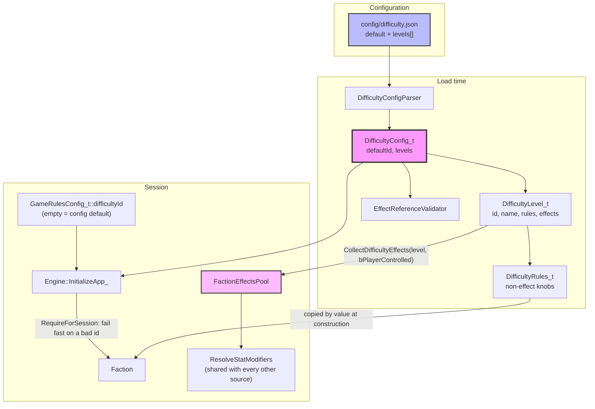

# Difficulty System

Session difficulty is a **named level in config**, not a compiled enum. `config/difficulty.json`
declares the levels; almost everything a level does is expressed as ordinary effect-system
entries, so difficulty stacks with tech, facility, and social-engineering modifiers through the
one resolve path instead of a parallel set of `if (difficulty == …)` branches.

## Shape



## Two channels, deliberately separate

A level carries two different kinds of setting, and they reach the game by different routes.

**`effects`** — anything expressible as a `StatModifier`. These are parsed by the shared
`EffectConfigParser` under `EffectSourceKind_t::Difficulty`, validated at load by
`ValidateEffectReferences` alongside every other effect source, and injected into each
faction's `FactionEffectsPool`. From that point difficulty is indistinguishable from any other
modifier source at the resolve site — which is the whole point.

**`rules`** — knobs with no stat to attach to (`random_events_after_turn`,
`colony_pod_preserves_size_1_base`, `combat_handicap`, …). `DifficultyRules_t` is a flat POD.
**Nothing reads it yet**: all six consumers carry `TODO(difficulty)` markers at the site that
will read them, and no accessor exists until one of them is written — a getter with no caller
is what the coding guidelines forbid. The first consumer should snapshot what it needs at
`Faction` construction, next to the effects, rather than re-resolving from `GameSettings`.

Prefer the effects channel. A knob only belongs in `rules` when there is genuinely no stat to
modify — a rule that gates whether a *system runs at all*, rather than scaling a number.

## Resolving the session level

`GameRulesConfig_t::difficultyId` names a level. **Empty means "use `difficulty.json`'s
`default`"**, so the shipping default lives in exactly one place; the settings struct does not
duplicate it. `DifficultyConfig_t::RequireForSession` applies that rule and throws on an
unknown id.

`Engine::InitializeApp_` calls it once immediately after `LoadGameData`, so a bad id in
`user_settings.json` fails at startup with a message pointing at the settings, rather than
from the first `Faction` constructor.

**Difficulty is changeable mid-campaign**, so nothing may snapshot it. `FactionEffectsPool`
re-resolves the level on every rebuild, and `CollectRevisions_` samples
`GameSettings::GetGameRulesRevision()` — so switching difficulty invalidates every live
faction's cached effect list without rebuilding the factions themselves.

`CollectDifficultyEffects_` appends from the level's **own** `effects` storage and then erases
the entries this faction does not match. It must not filter into a local vector first:
`ActiveEffect_t` borrows its `EffectConfig_t` by pointer, so every pointer would dangle the
moment that local went out of scope.

### Why the filtered list is not precomputed in `GameDataContext`

Only two filtered variants exist (player and AI), so caching them centrally is tempting.
`GameDataContext` is the wrong home: it holds definition data "all reconstructible from config
files" and is built in `InitializeApp_`, which is process-wide and session-independent — a
future "new game" must not re-run it. A list filtered for the *selected* difficulty is not
reconstructible from config alone; it needs the session's `difficultyId`. All six levels do
belong there, and are there: keeping them all is what lets `ValidateEffectReferences` check
every level's effects at startup rather than only the one being played, and what lets a
new-game picker enumerate `id` + `name`.

### Save state

`difficultyId` currently lives on `GameRulesConfig_t`, which is documented as player
preferences excluded from saves. That is wrong for difficulty and is flagged in the header: a
save must carry the id (not the resolved level, so config and mod edits reach existing saves).
Until a save system exists there is nowhere better to put it.

## Player vs AI

Levels handicap the human and the AI differently (AI `cost_multiplier` runs +30% on Citizen
down to −30% on Transcend). That is expressed with a `factionFilter`:

```json
{ "kind": "PlayerType", "type": "AI" }
```

`CollectDifficultyEffects` applies it **once at construction** via `FactionFilterMatchesOwner`,
keeping an entry only when it matches the owning faction's control. An effect with no
`PlayerType` filter is kept for everyone.

This is distinct from `FactionFilterCoversTarget`, which answers "does this effect reach that
*other* faction" for cross-faction dispatch such as infiltration. `PlayerType` works there too,
but the two functions answer different questions — owner-side filtering versus target-side
matching — and neither substitutes for the other.

## Clamps

Difficulty made `MaxClamp` / `MinClamp` necessary: several levels cap a value rather than
scaling it (Citizen cancels the last-defender pop-loss baseline; each level caps Command
Center upkeep).
`ApplyModifierStack` applies clamps *after* the Add / AddPercent / MultiplyGeometric math, so
a clamp bounds the final resolved value. The tightest clamp of each kind wins, and when a
MinClamp and MaxClamp cross, MinClamp wins.

Clamps are only honoured by resolve sites that go through `ApplyModifierStack`. The
deliberately Add-only collectors (`ResolveAdditiveStat` over a `UnitDesign`, the
`MoraleCalculator` additive pass, stockpile `MineralsConverted`) ignore them silently — do not
write a clamp against a stat those paths own.

## Stat kinds

Difficulty stats split cleanly by whether the resolve site holds a raw number:

| Stat | Kind | Seed |
|---|---|---|
| `SizeFreeDrones` | Additive | `0.0` — free pops before size drones; difficulty is the sole source |
| `Bureaucracy` | PureMultiplier | `1.0` — difficulty and Efficiency SE emit MultiplyGeometric; map root stays in the Lua limit formula |
| `TechCostDiff` | Additive | `0.0` — ordinals fed to the Lua formulas |
| `LastDefenderPopLoss`, `CapturePopLoss` | Additive | `0.0` — `base_conquest.json`'s effects list Adds the baseline |
| `ConqueredDroneCap` | Additive | `0.0` — difficulty Adds `0.25 × level` (Citizen = 1); `base_conquest.json` Adds −0.5 |
| `FacilityEnergyUpkeep` | RawScaled | `BuildingConfig_t::upkeep` |
| `EcologicalDamage` | RawScaled | the accrued amount the resolve site holds |

A stat is only RawScaled when there is a pre-existing number for modifiers to act on. A
difficulty-only count is Additive: `SeedFor` throws for RawScaled, so classifying one of those
as RawScaled makes its consumer throw at runtime.

## Adding a level or a knob

1. Add the level to `config/difficulty.json`. Unknown keys are rejected, ids must be unique,
   and `default` must name a real level.
2. Prefer an `effects` entry. If the stat does not exist yet, add it to `StatId_t`, give
   `KindFor` a kind using the table above, add the wire name to `ParseStatId`, and pin the kind
   with a `static_assert` in `tests/effects/ValidationTests.cpp`.
3. Only if no stat fits, add a field to `DifficultyRules_t`, parse it in
   `DifficultyConfigParser`, and leave a `TODO(difficulty)` at the consuming site rather than
   inventing a magnitude.
