# Diplomacy and Trade Architecture

```mermaid
graph TB
    subgraph "Session (GameState)"
        GameState[GameState]
        DiplomacyLedger[DiplomacyLedger<br/>pairwise status + known-ness]
        DiplomaticActionExecutor[DiplomaticActionExecutor<br/>validate, then apply]
        FirstContactResolver[FirstContactResolver<br/>marks factions known]
    end

    subgraph "Proposal data"
        DiplomaticProposal[DiplomaticProposal_t<br/>proposer, recipient,<br/>requestedStatus, give, demand]
        TradeItem[TradeItem_t<br/>variant]
        TradeCredits[TradeCredits_t]
        TradeTechnology[TradeTechnology_t]
        TradeBase[TradeBase_t]
        TradeCommFrequency[TradeCommFrequency_t]
        TradeWorldMap[TradeWorldMap_t]
        TradeDeclareVendetta[TradeDeclareVendetta_t]
        TradeKind[TradeKind_t<br/>+ TradeKindOf trait]
    end

    subgraph "Legality rules (DiplomacyActions)"
        CanPropose[CanProposeTruce / Friendship / Pact<br/>CanDeclareVendetta / CanCancelTreaty]
        CanTrade[CanTrade<br/>relationship gate per item type]
        GetAvailableActions[GetAvailableActions]
        GetAvailableTrades[GetAvailableTrades<br/>folds over the variant]
    end

    subgraph "Affected faction state"
        EconomyManager[EconomyManager<br/>SpendEnergy / AddEnergy]
        ResearchManager[ResearchManager<br/>AddDiscoveredTech]
        FactionExploredMap[FactionExploredMap<br/>MergeFrom]
        Bases[Faction::TransferBaseTo]
    end

    GameState --> DiplomacyLedger
    GameState --> DiplomaticActionExecutor
    GameState --> FirstContactResolver
    FirstContactResolver -->|SetKnown| DiplomacyLedger

    DiplomaticActionExecutor --> DiplomaticProposal
    DiplomaticProposal --> TradeItem
    TradeItem --> TradeCredits
    TradeItem --> TradeTechnology
    TradeItem --> TradeBase
    TradeItem --> TradeCommFrequency
    TradeItem --> TradeWorldMap
    TradeItem --> TradeDeclareVendetta
    TradeItem -.->|one trait per alternative| TradeKind

    DiplomaticActionExecutor -->|Validate_| CanPropose
    DiplomaticActionExecutor -->|Validate_| CanTrade
    GetAvailableActions --> CanPropose
    GetAvailableTrades --> CanTrade
    CanPropose --> DiplomacyLedger
    CanTrade --> DiplomacyLedger

    DiplomaticActionExecutor -->|Apply_| EconomyManager
    DiplomaticActionExecutor -->|Apply_| ResearchManager
    DiplomaticActionExecutor -->|Apply_| FactionExploredMap
    DiplomaticActionExecutor -->|Apply_| Bases
    DiplomaticActionExecutor -->|SetStatus| DiplomacyLedger

    style DiplomacyLedger fill:#fbf,stroke:#333,stroke-width:3px
    style DiplomaticActionExecutor fill:#f9f,stroke:#333,stroke-width:4px
    style TradeItem fill:#bbf,stroke:#333,stroke-width:3px
    style CanTrade fill:#bfb,stroke:#333,stroke-width:2px
```

## Why diplomacy is world-scoped

A relationship is a property of a **pair**, not of either side. `DiplomacyLedger` lives on
`GameState` and keys its symmetric axes on a `FactionPair`, so "A has a truce with B" cannot
disagree with "B has a truce with A". Storing a per-faction `Diplomacy` object — which older
versions of the faction doc described — would mean two copies of one fact.

`Faction` therefore owns **no** diplomacy member. What it owns is the state a trade *moves*:
its treasury, its discovered techs, its explored map, its bases.

## DiplomacyLedger

Five axes. Two are directional and one is per-faction rather than pairwise, which is why they are
separate maps rather than fields of one relationship record:

| Axis | Key | Meaning |
|---|---|---|
| `m_statuses` | `FactionPair` (symmetric) | `None` / `Truce` / `Friendship` / `Pact` / `Vendetta` |
| `m_known` | `FactionPair` (symmetric) | the two have met; a precondition for every action |
| `m_grievances` | `DirectedFactionPair` | how much **holder** resents **against** — A may resent B without B resenting A |
| `m_infiltration` | `DirectedFactionPair` | **infiltrator** has a probe foothold in **target** — emphatically one-way |
| `m_integrity` | `FactionId_t` | a faction's own reputation for keeping its word; not about any pair |

- **Known-ness** is set by `FirstContactResolver` during visibility rebuilds, and by
  `TradeCommFrequency_t` as a trade item (introducing a third party).
- **Status legality** lives in `DiplomacyActions` (`CanProposeTruce` and friends), not in the
  ledger — the ledger stores, the rules decide.

## TradeItem_t and TradeKind_t

`TradeItem_t` is a `std::variant`; each alternative is a payload struct. `TradeKind_t` is the
category a UI or AI offers, and the mapping between them is **one trait per alternative**
(`TradeKindOf<T>`) declared next to the variant.

This matters because the mapping used to be three parallel hand-kept tables (the enum, a probe
array, and a `kindOrder` array), and nothing failed to compile when they drifted.
`GetAvailableTrades` now folds over `std::variant_size`, so a new alternative without a trait is a
compile error rather than a category that silently never appears.

`CanTrade` gates on the **relationship and the item's type only**, never on payload values —
`TradeBase_t` and `TradeDeclareVendetta_t` require a Pact, everything else needs only "known and
not at vendetta". The fold relies on that: it probes with a default-constructed alternative.

## The proposal lifecycle

1. **`Propose`** validates the whole proposal (below). An invalid proposal is rejected without
   touching any state.
2. If the recipient is **AI**, `EvaluateResponse_` decides (currently a stub that always agrees)
   and the proposal applies immediately.
3. If the recipient is the **player**, the proposal is held in `m_pending` and `PendingPlayer` is
   returned. There is exactly one slot: a second proposal arriving while one is pending is
   refused with `Busy` rather than overwriting it, because the first proposer has already been
   told to wait.
4. **`Accept`** re-validates (state may have moved since the proposal arrived) and applies.
   **`Reject`** drops it.

## Validation is aggregate, application is not transactional

Validation happens in two layers, and the distinction is load-bearing:

- **Per item** (`ValidateItem_`) — does the giver have this tech, own this base, know this
  faction?
- **Per giver, across the whole proposal** (`ValidateGiverTotals_`) — do the *total* credits fit
  in the treasury, and is any base offered twice? Without this, two `TradeCredits_t` items each
  worth the whole balance both passed (each was checked against the full treasury independently)
  and both applied, ending the trade at a negative treasury with no error anywhere.

`give` and `demand` run in opposite directions and are costed against their own givers.

Application then goes through `EconomyManager::SpendEnergy`, so the class that owns the treasury
is the second line of defence.

**Known limitation:** application is *not* a transaction. If `Faction::TransferBaseTo` throws
part-way through a multi-item proposal, earlier items stay applied. Closing that needs
snapshot/rollback for base ownership, techs, ledger entries and explored maps, which wants the
save-game serialisation work to exist first. Recorded in
`docs/full-review-fix-prompts/17-faction-services.md`.

## Where the rules live

| Question | Answer |
|---|---|
| May these two factions talk at all? | `DiplomacyLedger::AreKnown` |
| Is this status change legal? | `DiplomacyActions::CanPropose*` / `CanDeclareVendetta` / `CanCancelTreaty` |
| May this *kind* of item be traded between them? | `DiplomacyActions::CanTrade` |
| Does the giver actually have it? | `DiplomaticActionExecutor::ValidateItem_` |
| Can the giver afford all of it at once? | `DiplomaticActionExecutor::ValidateGiverTotals_` |
| What does accepting change? | `DiplomaticActionExecutor::ApplyItem_` |

## Not yet built

- **AI evaluation.** `EvaluateResponse_` always agrees. Real evaluation needs an AI attitude
  model, which does not exist.
- **A proposal queue.** One pending slot, with `Busy` as the refusal. A per-recipient queue needs
  ordering and expiry rules that are not specified anywhere.
- **Treaty terms with duration** (tribute per turn, ceasefire timers). `DiplomaticProposal_t`
  carries only immediate transfers and a status change.
