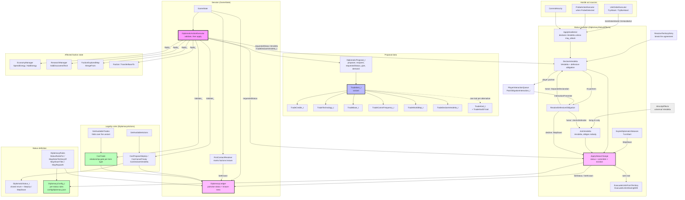

# Diplomacy and Trade Architecture

```mermaid
graph TB
    subgraph "Session (GameState)"
        GameState[GameState]
        DiplomacyLedger[DiplomacyLedger<br/>pairwise status + known-ness]
        DiplomaticActionExecutor[DiplomaticActionExecutor<br/>validate, then apply]
        FirstContactResolver[FirstContactResolver<br/>marks factions known]
    end

    subgraph "Proposal data"
        DiplomaticProposal[DiplomaticProposal_t<br/>proposer, recipient,<br/>requestedStatus, give, demand]
        TradeItem[TradeItem_t<br/>variant]
        TradeCredits[TradeCredits_t]
        TradeTechnology[TradeTechnology_t]
        TradeBase[TradeBase_t]
        TradeCommFrequency[TradeCommFrequency_t]
        TradeWorldMap[TradeWorldMap_t]
        TradeDeclareVendetta[TradeDeclareVendetta_t]
        TradeKind[TradeKind_t<br/>+ TradeKindOf trait]
    end

    subgraph "Status definition"
        DiplomaticStatus[DiplomaticStatus_t<br/>closed enum + StepUp / StepDown]
        DiplomacyConfig[DiplomacyConfig_t<br/>per-status rules<br/>config/diplomacy.json]
        DiplomacyRules[DiplomacyRules<br/>StatusRulesFor / MayEnterTerritoryOf<br/>MayShareTiles / MayRepairAt]
    end

    subgraph "Status mutation (DiplomacyStatusEffects)"
        ApplyStatusChange[ApplyStatusChange<br/>status + commlink + eviction]
        ExpireStatuses[ExpireDiplomaticStatuses<br/>TurnStart]
        ApplyHostileAct[ApplyHostileAct<br/>declares Vendetta unless may_attack]
        DeclareVendetta[DeclareVendetta<br/>Vendetta + defensive obligation]
        JoinVendetta[JoinVendetta<br/>Vendetta, obliges nobody]
        ResolveObligation[ResolveDefensiveObligation]
        EvacuateTerritory[EvacuateUnitsFromTerritory<br/>EvacuateUnitsSharingWith]
    end

    subgraph "Hostile act sources"
        Combat[UnitOrderExecutor<br/>TryAttack / TryBombard]
        Probe[ProbeActionExecutor<br/>when ProbeDetected]
        Atrocity[CommitAtrocity]
    end

    subgraph "Legality rules (DiplomacyActions)"
        CanPropose[CanProposeStepUp / CanCancelTreaty<br/>CanDeclareVendetta]
        CanTrade[CanTrade<br/>relationship gate per item type]
        GetAvailableActions[GetAvailableActions]
        GetAvailableTrades[GetAvailableTrades<br/>folds over the variant]
    end

    subgraph "Affected faction state"
        EconomyManager[EconomyManager<br/>SpendEnergy / AddEnergy]
        ResearchManager[ResearchManager<br/>AddDiscoveredTech]
        FactionExploredMap[FactionExploredMap<br/>MergeFrom]
        Bases[Faction::TransferBaseTo]
    end

    GameState --> DiplomacyLedger
    GameState --> DiplomaticActionExecutor
    GameState --> FirstContactResolver
    FirstContactResolver -->|SetKnown| DiplomacyLedger

    DiplomaticActionExecutor --> DiplomaticProposal
    DiplomaticProposal --> TradeItem
    TradeItem --> TradeCredits
    TradeItem --> TradeTechnology
    TradeItem --> TradeBase
    TradeItem --> TradeCommFrequency
    TradeItem --> TradeWorldMap
    TradeItem --> TradeDeclareVendetta
    TradeItem -.->|one trait per alternative| TradeKind

    DiplomaticActionExecutor -->|Validate_| CanPropose
    DiplomaticActionExecutor -->|Validate_| CanTrade
    GetAvailableActions --> CanPropose
    GetAvailableTrades --> CanTrade
    CanPropose --> DiplomacyLedger
    CanTrade --> DiplomacyLedger

    DiplomaticActionExecutor -->|Apply_| EconomyManager
    DiplomaticActionExecutor -->|Apply_| ResearchManager
    DiplomaticActionExecutor -->|Apply_| FactionExploredMap
    DiplomaticActionExecutor -->|Apply_| Bases
    DiplomaticActionExecutor -->|requestedStatus| ApplyStatusChange
    DiplomaticActionExecutor -->|requestedStatus Vendetta<br/>TradeDeclareVendetta_t| DeclareVendetta
    CanPropose --> DiplomaticStatus
    AtrocityEffects[AtrocityEffects<br/>universal Vendetta] -->|living AI only| JoinVendetta
    TerritoryEntry[ResolveTerritoryEntry<br/>break the agreement] --> DeclareVendetta
    ExpireStatuses -->|StepDown| ApplyStatusChange
    Combat -->|IUnitOrderWorld::OnHostileAct| ApplyHostileAct
    Probe --> ApplyHostileAct
    Atrocity --> ApplyHostileAct
    ApplyHostileAct --> DeclareVendetta
    DeclareVendetta --> ApplyStatusChange
    DeclareVendetta -->|AI partners| ResolveObligation
    DeclareVendetta -->|player partner| PlayerInteractionQueue[PlayerInteractionQueue<br/>PactObligationInteraction_t]
    PlayerInteractionQueue -->|InteractionPresenter| ResolveObligation
    ResolveObligation -->|honor: JoinAsDefender| JoinVendetta
    ResolveObligation -->|honor: SeparateDeclaration| DeclareVendetta
    JoinVendetta --> ApplyStatusChange
    ResolveObligation -->|decline: StepDown| ApplyStatusChange
    ApplyStatusChange -->|SetStatus / SetKnown| DiplomacyLedger
    ApplyStatusChange -->|rules lost| EvacuateTerritory
    ApplyStatusChange --> DiplomacyConfig
    DiplomacyRules --> DiplomacyConfig
    DiplomacyRules --> DiplomacyLedger

    style DiplomacyLedger fill:#fbf,stroke:#333,stroke-width:3px
    style DiplomaticActionExecutor fill:#f9f,stroke:#333,stroke-width:4px
    style TradeItem fill:#bbf,stroke:#333,stroke-width:3px
    style CanTrade fill:#bfb,stroke:#333,stroke-width:2px
    style ApplyStatusChange fill:#fbf,stroke:#333,stroke-width:3px
    style DiplomacyConfig fill:#bfb,stroke:#333,stroke-width:2px
    style AtrocityEffects fill:#eee,stroke:#999,stroke-width:1px
```

## Why diplomacy is world-scoped

A relationship is a property of a **pair**, not of either side. `DiplomacyLedger` lives on
`GameState` and keys its symmetric axes on a `FactionPair`, so "A has a truce with B" cannot
disagree with "B has a truce with A". Storing a per-faction `Diplomacy` object — which older
versions of the faction doc described — would mean two copies of one fact.

`Faction` therefore owns **no** diplomacy member. What it owns is the state a trade *moves*:
its treasury, its discovered techs, its explored map, its bases.

## DiplomacyLedger

Five axes. Two are directional and one is per-faction rather than pairwise, which is why they are
separate maps rather than fields of one relationship record:

| Axis | Key | Meaning |
|---|---|---|
| `m_statuses` | `FactionPair` (symmetric) | `Neutral` / `Truce` / `Treaty` / `Pact` / `Vendetta`, and how many turns the pair has held it |
| `m_known` | `FactionPair` (symmetric) | the two have met; a precondition for every action |
| `m_grievances` | `DirectedFactionPair` | how much **holder** resents **against** — A may resent B without B resenting A |
| `m_infiltration` | `DirectedFactionPair` | **infiltrator** has a probe foothold in **target** — emphatically one-way |
| `m_integrity` | `FactionId_t` | a faction's own reputation for keeping its word; not about any pair |

- **Known-ness** is set by `FirstContactResolver` during visibility rebuilds, and by
  `TradeCommFrequency_t` as a trade item (introducing a third party).
- **Status legality** lives in `DiplomacyActions` (`CanProposeStepUp`, `CanCancelTreaty`), not
  in the ledger — the ledger stores, the rules decide.
- **Integrity, grievances, and blemishes are not implemented.** `DiplomacyLedger` keeps the
  maps, but nothing writes or reads them yet. A counted major's universal Vendetta goes through
  `ApplyVendetta` (`game/faction/DiplomacyStatusEffects.h`) for living AI factions only. See
  `atrocity-system.md`. Whether a faction has ever been the victim of an atrocity is
  `AtrocityLedger::HasVictimized` / `HasCommittedMajorAgainst`, not a grievance total.
- **Every status change goes through `ApplyStatusChange`** (`game/faction/DiplomacyStatusEffects.h`):
  proposals, `TradeDeclareVendetta_t`, atrocity universal Vendetta, expiry, hostile acts, and
  defensive obligations. See [Diplomatic statuses](#diplomatic-statuses).

## Diplomatic statuses

`DiplomaticStatus_t` is a closed enum. Game logic names its members (Neutral is the default,
Vendetta is where hostile acts lead, Truce is the way out of Vendetta), so a mod cannot add
one. What a mod tunes is each status's **rules**, in `config/diplomacy.json`:

| Rule | Neutral | Truce | Treaty | Pact | Vendetta |
|---|---|---|---|---|---|
| `enter_territory` | ✓ | ✓ | ✗ | ✓ | ✓ |
| `share_tiles` | ✗ | ✗ | ✗ | ✓ | ✗ |
| `repair_at_bases` | ✗ | ✗ | ✗ | ✓ | ✗ |
| `effects` (`CommerceRate`) | ×0 | ×0 | ×0.5 | ×1 | ×0 |
| `may_attack` | ✗ | ✗ | ✗ | ✗ | ✓ |
| `defensive_obligation` | ✗ | ✗ | ✗ | ✓ | ✗ |
| `duration_turns` | null | 20 | null | null | null |

(Shipping values. `null` duration means the status lasts until changed.) `DiplomacyConfigParser`
requires all five statuses and every key but `effects`, and refuses a duration on a status with
nowhere to step down to.

A status's `effects` may only be unconditional `FactionPair` `StatModifier commerce_rate`
entries. Each faction's effect pool carries them once per partner, tagged with that partner
(a faction can hold a Treaty with one partner and a Pact with another), and they resolve only
when a context names the partner. `CommerceCalculator` resolves `CommerceRate` toward each
partner; a rate of 0 means the pair does not trade, so whether a status trades is its rate,
not a separate flag. Use `MultiplyGeometric` for a status's factor. AddPercents sum before they
multiply, so a Treaty's `AddPercent -50` beside Global Trade Pact's `AddPercent 100` would give
×1.5 instead of ×1.0, and only a geometric ×0 keeps a non-trading status at zero.

### Transitions

The transitions are code (`StepUp` / `StepDown` in `DiplomaticStatus.h`):

| From | Propose (`StepUp`) | Cancel / decline / expire (`StepDown`) |
|---|---|---|
| Neutral | Treaty | — |
| Truce | Treaty | Neutral |
| Treaty | Pact | Neutral |
| Pact | — | Treaty |
| Vendetta | Truce | — |

Any status can go to Vendetta. A proposal's `requestedStatus` must be `StepUp(current)`,
`StepDown(current)` (a cancel), or Vendetta.

### Where each rule is read

| Rule | Read by |
|---|---|
| `enter_territory` | `CanEnterTile` via `MayEnterTerritoryOf`, and `StepEvaluator` (`BlockedByTerritory`). A player's move order stops at the border and asks: break the agreement (Vendetta) and continue, or cancel (`TerritoryEntryInteraction_t`, `ResolveTerritoryEntry`). Path planning avoids forbidden territory when it can. Attack legality uses `CanPhysicallyEnterTile`, since the attack itself declares Vendetta. |
| `share_tiles` | `HasFriendlyOccupant`, `HasFriendlyBase`, and `StepEvaluator`'s hostile-occupant check, via `MayShareTiles` |
| `repair_at_bases` | `MayRepairAt`. Per-turn healing does not exist yet; it should ask this. |
| `effects` | Each faction's effect pool (`FactionPair` scope); `CommerceCalculator` resolves `CommerceRate` toward the partner, and skips the pair at 0 |
| `may_attack` | `ApplyHostileAct`: an attack under a status that does not allow it declares Vendetta |
| `defensive_obligation` | `DeclareVendetta` |
| `duration_turns` | `ExpireDiplomaticStatuses`, run by the TurnStart stage |

### ApplyStatusChange

Sets the status and compares the old status's rules with the new one's. When `enter_territory`
is lost, each side's units leave the other's territory (`EvacuateUnitsFromTerritory`). When
`share_tiles` is lost, each side's units leave tiles shared with the other and the other's bases
(`EvacuateUnitsSharingWith`). Vendetta also grants mutual known-contact. A Pact ending in Vendetta
therefore clears shared tiles and bases but not territory, because Vendetta allows entering it.

### Expiry

The ledger counts the turns each pair has held its status; changing the status restarts the
count. `ExpireDiplomaticStatuses` ages every pair once per turn and applies `StepDown` to any
status held for its `duration_turns` (a Truce becomes Neutral).

### Declaring Vendetta and the defensive obligation

Vendetta is entered one of two ways. `DeclareVendetta(declarer, target)` starts a conflict
and obliges the target's partners. `JoinVendetta(defender, aggressor)` enters a conflict
already under way on the defending side and obliges nobody. Both are no-ops for a pair
already at Vendetta.

Declarations:

- a proposal whose `requestedStatus` is Vendetta (the proposer declares), and
  `TradeDeclareVendetta_t` (the receiver declares on the third party);
- breaking an agreement at a territory border (`ResolveTerritoryEntry`);
- a hostile act, below;
- honoring a defensive obligation under `SeparateDeclaration`.

Joins:

- atrocity universal Vendetta: every living AI comes to the victim's defence. Nobody is obliged
  to defend the perpetrator, and its AI Pact partners' Pacts end as they join, so the atrocity's
  Vendetta overrides every defensive obligation toward the perpetrator without a special case;
- honoring a defensive obligation under `JoinAsDefender`.

After a declaration, every faction whose status with the **target** carries
`defensive_obligation`, and that is not already at Vendetta with the **declarer**, must choose:

- **Honor:** `HonorDefensiveObligation`, by `DefensiveObligationMode_t`:
  - `JoinAsDefender` — `JoinVendetta` against the declarer; nobody further is obliged.
  - `SeparateDeclaration` — `DeclareVendetta` on the declarer, which obliges the declarer's own
    partners in turn; the chain ends because a pair already at Vendetta is never asked again.

  **Hardcoded** to `JoinAsDefender` for now (TODO: a `config/diplomacy.json` setting).
- **Decline:** its status with the target steps down (Pact → Treaty).

AI factions decide at once (**stub:** they always declare, pending an AI attitude model). The
player gets a `PactObligationInteraction_t` on the `PlayerInteractionQueue`, which
`InteractionPresenter` shows as a choice; the turn waits on it like any queued interaction. The
same obligation is not queued twice. `ResolveDefensiveObligation` applies either answer. Native
life has no diplomacy: its status can change, but it neither obliges nor is obliged.

### Hostile acts

`ApplyHostileAct(aggressor, victim)` declares Vendetta on the victim unless their status allows
attacks (`may_attack`). An attack on a faction already at Vendetta therefore obliges nobody. It
is called by:

- `UnitOrderExecutor::TryAttack` and `TryBombard`, through `IUnitOrderWorld::OnHostileAct`, before
  combat resolves. A bombard counts against every faction whose units it targets, or the
  territory owner of an empty tile's improvements.
- `ProbeActionExecutor`, when `ProbeDetected` says the target identified the sender. **Stub:** the
  detection roll is not implemented and nothing is detected yet.
- `CommitAtrocity`, for the victim, whether or not the atrocity's penalties apply.

Native life has no diplomacy and is ignored on either side.

## TradeItem_t and TradeKind_t

`TradeItem_t` is a `std::variant`; each alternative is a payload struct. `TradeKind_t` is the
category a UI or AI offers, and the mapping between them is **one trait per alternative**
(`TradeKindOf<T>`) declared next to the variant.

This matters because the mapping used to be three parallel hand-kept tables (the enum, a probe
array, and a `kindOrder` array), and nothing failed to compile when they drifted.
`GetAvailableTrades` now folds over `std::variant_size`, so a new alternative without a trait is a
compile error rather than a category that silently never appears.

`CanTrade` gates on the **relationship and the item's type only**, never on payload values —
`TradeBase_t` and `TradeDeclareVendetta_t` require a Pact, everything else needs only "known and
not at vendetta". The fold relies on that: it probes with a default-constructed alternative.

## The proposal lifecycle

1. **`Propose`** validates the whole proposal (below). An invalid proposal is rejected without
   touching any state.
2. If the recipient is **AI**, `EvaluateResponse_` decides (currently a stub that always agrees)
   and the proposal applies immediately.
3. If the recipient is the **player**, the proposal is held in `m_pending` and `PendingPlayer` is
   returned. There is exactly one slot: a second proposal arriving while one is pending is
   refused with `Busy` rather than overwriting it, because the first proposer has already been
   told to wait.
4. **`Accept`** re-validates (state may have moved since the proposal arrived) and applies.
   **`Reject`** drops it.

## Validation is aggregate, application is not transactional

Validation happens in two layers, and the distinction is load-bearing:

- **Per item** (`ValidateItem_`) — does the giver have this tech, own this base, know this
  faction?
- **Per giver, across the whole proposal** (`ValidateGiverTotals_`) — do the *total* credits fit
  in the treasury, and is any base offered twice? Without this, two `TradeCredits_t` items each
  worth the whole balance both passed (each was checked against the full treasury independently)
  and both applied, ending the trade at a negative treasury with no error anywhere.

`give` and `demand` run in opposite directions and are costed against their own givers.

Application then goes through `EconomyManager::SpendEnergy`, so the class that owns the treasury
is the second line of defence.

**Known limitation:** application is *not* a transaction. If `Faction::TransferBaseTo` throws
part-way through a multi-item proposal, earlier items stay applied. Closing that needs
snapshot/rollback for base ownership, techs, ledger entries and explored maps, which wants the
save-game serialisation work to exist first. Recorded in
`docs/full-review-fix-prompts/17-faction-services.md`.

## Where the rules live

| Question | Answer |
|---|---|
| May these two factions talk at all? | `DiplomacyLedger::AreKnown` |
| Is this status change legal? | `DiplomacyActions::CanPropose*` / `CanDeclareVendetta` / `CanCancelTreaty` |
| May this *kind* of item be traded between them? | `DiplomacyActions::CanTrade` |
| Does the giver actually have it? | `DiplomaticActionExecutor::ValidateItem_` |
| Can the giver afford all of it at once? | `DiplomaticActionExecutor::ValidateGiverTotals_` |
| What does accepting change? | `DiplomaticActionExecutor::ApplyItem_` |
| What may two factions do to each other? | `DiplomacyRules` reading `DiplomacyConfig_t` for their status |
| How are guest units cleared off host territory? | `ApplyStatusChange`, when the new status loses `enter_territory` or `share_tiles` |

## Not yet built

- **AI evaluation.** `EvaluateResponse_` always agrees. Real evaluation needs an AI attitude
  model, which does not exist.
- **A proposal queue.** One pending slot, with `Busy` as the refusal. A per-recipient queue needs
  ordering and expiry rules that are not specified anywhere.
- **Treaty terms with duration** (tribute per turn). `DiplomaticProposal_t` carries only immediate
  transfers and a status change; the only timer is a status's own `duration_turns`.
- **Probe detection.** `ProbeDetected` never detects, so probe actions do not yet cause Vendetta.
- **Healing.** `MayRepairAt` answers the diplomacy half; per-turn healing does not exist.
- **Integrity, grievances, and blemishes.** The Datalinks name six integrity levels
  (Noble → Treacherous) and directed grievances. None of that is wired yet.
