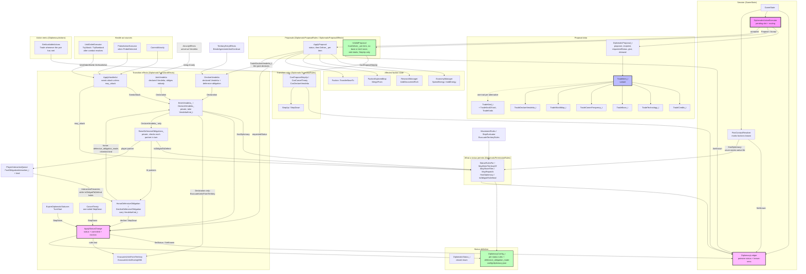

# Diplomacy and Trade Architecture

```mermaid
graph TB
    subgraph "Session (GameState)"
        GameState[GameState]
        DiplomacyLedger[DiplomacyLedger<br/>pairwise status + known-ness]
        DiplomaticActionExecutor[DiplomaticActionExecutor<br/>pending slot + routing]
        FirstContactResolver[FirstContactResolver<br/>marks factions known]
    end

    subgraph "Proposal data"
        DiplomaticProposal[DiplomaticProposal_t<br/>proposer, recipient,<br/>requestedStatus, give, demand]
        TradeItem[TradeItem_t<br/>variant]
        TradeCredits[TradeCredits_t]
        TradeTechnology[TradeTechnology_t]
        TradeBase[TradeBase_t]
        TradeCommFrequency[TradeCommFrequency_t]
        TradeWorldMap[TradeWorldMap_t]
        TradeDeclareVendetta[TradeDeclareVendetta_t]
        TradeKind[TradeKind_t<br/>+ TradeKindOf trait, TradeKinds]
    end

    subgraph "Proposals (DiplomaticProposalRules / DiplomaticProposalEffects)"
        IsValidProposal[IsValidProposal<br/>CanDeliver_ per item, no base or tech twice,<br/>side totals; StepUp only]
        ApplyProposal[ApplyProposal<br/>status, then Deliver_ per item]
    end

    subgraph "Status definition"
        DiplomaticStatus[DiplomaticStatus_t<br/>closed enum]
        DiplomacyConfig[DiplomacyConfig_t<br/>per-status rules + defensive_obligation_mode<br/>config/diplomacy.json]
    end

    subgraph "What a status permits (DiplomaticPermissionRules)"
        PermissionRules[StatusRulesFor / MayEnterTerritoryOf<br/>MayShareTiles / MayRepairAt<br/>HasDiplomacy / IsObligedToDefend]
    end

    subgraph "Transition rules (DiplomaticTransitionRules)"
        StepUpDown[StepUp / StepDown]
        CanPropose[CanProposeStepUp / CanCancelTreaty<br/>CanDeclareVendetta]
    end

    subgraph "Transition effects (DiplomaticTransitionEffects)"
        ApplyStatusChange[ApplyStatusChange<br/>status + commlink + eviction]
        ExpireStatuses[ExpireDiplomaticStatuses<br/>TurnStart]
        CancelTreaty[CancelTreaty<br/>one-sided StepDown]
        ApplyHostileAct[ApplyHostileAct<br/>sneak attack unless may_attack]
        DeclareVendetta[DeclareVendetta<br/>declared Vendetta + defensive obligation]
        JoinVendetta[JoinVendetta<br/>declared Vendetta, obliges nobody]
        VendettaImpl[EnterVendetta_ / DeclareVendetta_<br/>private, take VendettaKind_t]
        RaiseObligations[RaiseDefensiveObligations_<br/>private, checks each partner in turn]
        HonorDecline[HonorDefensiveObligation / DeclineDefensiveObligation<br/>carry VendettaKind_t]
        EvacuateTerritory[EvacuateUnitsFromTerritory<br/>EvacuateUnitsSharingWith]
    end

    subgraph "Hostile act sources"
        Combat[UnitOrderExecutor<br/>TryAttack / TryBombard<br/>after combat resolves]
        Probe[ProbeActionExecutor<br/>when ProbeDetected]
        Atrocity[CommitAtrocity]
    end

    subgraph "Action menu (DiplomacyActions)"
        GetAvailableActions[GetAvailableActions<br/>Trade whenever the pair has met]
    end

    subgraph "Affected faction state"
        EconomyManager[EconomyManager<br/>SpendEnergy / AddEnergy]
        ResearchManager[ResearchManager<br/>AddDiscoveredTech]
        FactionExploredMap[FactionExploredMap<br/>MergeFrom]
        Bases[Faction::TransferBaseTo]
    end

    GameState --> DiplomacyLedger
    GameState --> DiplomaticActionExecutor
    GameState --> FirstContactResolver
    FirstContactResolver -->|SetKnown| DiplomacyLedger
    FirstContactResolver -->|HasDiplomacy:<br/>never meets native life| PermissionRules

    DiplomaticActionExecutor --> DiplomaticProposal
    DiplomaticProposal --> TradeItem
    TradeItem --> TradeCredits
    TradeItem --> TradeTechnology
    TradeItem --> TradeBase
    TradeItem --> TradeCommFrequency
    TradeItem --> TradeWorldMap
    TradeItem --> TradeDeclareVendetta
    TradeItem -.->|one trait per alternative| TradeKind

    DiplomaticActionExecutor -->|Propose / Accept| IsValidProposal
    DiplomaticActionExecutor -->|accepted| ApplyProposal
    IsValidProposal -->|CanProposeStepUp| CanPropose
    IsValidProposal -->|AreKnown| DiplomacyLedger
    GetAvailableActions --> CanPropose
    CanPropose --> DiplomacyLedger

    ApplyProposal --> EconomyManager
    ApplyProposal --> ResearchManager
    ApplyProposal --> FactionExploredMap
    ApplyProposal --> Bases
    ApplyProposal -->|requestedStatus| ApplyStatusChange
    ApplyProposal -->|TradeDeclareVendetta_t:<br/>the giver declares| DeclareVendetta
    CancelTreaty -->|StepDown| ApplyStatusChange
    CanPropose --> StepUpDown
    AtrocityEffects[AtrocityEffects<br/>universal Vendetta] -->|living AI only| JoinVendetta
    TerritoryEntry[TerritoryEntryEffects<br/>BreakAgreementAndContinue] --> DeclareVendetta
    ExpireStatuses -->|StepDown| ApplyStatusChange
    Combat -->|IUnitOrderWorld::OnHostileAct| ApplyHostileAct
    Probe --> ApplyHostileAct
    Atrocity --> ApplyHostileAct
    ApplyHostileAct -->|SneakAttack| VendettaImpl
    ApplyHostileAct -->|may_attack| PermissionRules
    DeclareVendetta -->|Declaration| VendettaImpl
    JoinVendetta -->|Declaration| VendettaImpl
    VendettaImpl -->|HasDiplomacy| PermissionRules
    VendettaImpl --> ApplyStatusChange
    VendettaImpl -->|Declaration only:<br/>EvacuateUnitsFromTerritory| EvacuateTerritory
    VendettaImpl -->|DeclareVendetta_ only| RaiseObligations
    RaiseObligations -->|IsObligedToDefend| PermissionRules
    RaiseObligations -->|AI partners| HonorDecline
    RaiseObligations -->|player partner| PlayerInteractionQueue[PlayerInteractionQueue<br/>PactObligationInteraction_t<br/>+ kind]
    PlayerInteractionQueue -->|InteractionPresenter,<br/>while IsObligedToDefend holds| HonorDecline
    HonorDecline -->|honor: defensive_obligation_mode,<br/>inherited kind| VendettaImpl
    HonorDecline -->|decline: StepDown| ApplyStatusChange
    ApplyStatusChange -->|SetStatus / SetKnown| DiplomacyLedger
    ApplyStatusChange -->|rules lost| EvacuateTerritory
    ApplyStatusChange --> DiplomacyConfig
    Movement[MovementRules / StepEvaluator<br/>EvacuateTerritoryRules] --> PermissionRules
    PermissionRules --> DiplomacyConfig
    PermissionRules --> DiplomacyLedger

    style DiplomacyLedger fill:#fbf,stroke:#333,stroke-width:3px
    style DiplomaticActionExecutor fill:#f9f,stroke:#333,stroke-width:4px
    style TradeItem fill:#bbf,stroke:#333,stroke-width:3px
    style IsValidProposal fill:#bfb,stroke:#333,stroke-width:2px
    style ApplyStatusChange fill:#fbf,stroke:#333,stroke-width:3px
    style DiplomacyConfig fill:#bfb,stroke:#333,stroke-width:2px
    style AtrocityEffects fill:#eee,stroke:#999,stroke-width:1px
```

## Why diplomacy is world-scoped

A relationship is a property of a **pair**, not of either side. `DiplomacyLedger` lives on
`GameState` and keys its symmetric axes on a `FactionPair`, so "A has a truce with B" cannot
disagree with "B has a truce with A". Storing a per-faction `Diplomacy` object — which older
versions of the faction doc described — would mean two copies of one fact.

`Faction` therefore owns **no** diplomacy member. What it owns is the state a trade *moves*:
its treasury, its discovered techs, its explored map, its bases.

## DiplomacyLedger

Five axes. Two are directional and one is per-faction rather than pairwise, which is why they are
separate containers rather than fields of one relationship record. Contact and infiltration are
sets: a pair is either in them or not.

| Axis | Key | Meaning |
|---|---|---|
| `m_statuses` | `FactionPair` (symmetric) | `Neutral` / `Truce` / `Treaty` / `Pact` / `Vendetta`, and how many turns the pair has held it |
| `m_known` | `FactionPair` (symmetric) | the two have met; a precondition for every action |
| `m_grievances` | `DirectedFactionPair` | how much **holder** resents **against** — A may resent B without B resenting A |
| `m_infiltration` | `DirectedFactionPair` | **infiltrator** has a probe foothold in **target** — emphatically one-way |
| `m_integrity` | `FactionId_t` | a faction's own reputation for keeping its word; not about any pair |

- **Known-ness** is set by `FirstContactResolver` during visibility rebuilds, and by
  `TradeCommFrequency_t` as a trade item (introducing a third party). Native life is never met:
  it has no diplomacy (`HasDiplomacy`), so every rule that asks whether two factions have met
  already excludes it.
- **Status legality** lives in `DiplomaticTransitionRules` (`CanProposeStepUp`, `CanCancelTreaty`,
  `CanDeclareVendetta`), not in the ledger — the ledger stores, the rules decide.
- **Integrity, grievances, and blemishes are not implemented.** `DiplomacyLedger` keeps the
  maps, but nothing writes or reads them yet. A counted major's universal Vendetta goes through
  `JoinVendetta` (`game/faction/DiplomaticTransitionEffects.h`) for living AI factions only, and
  never native life. See
  `atrocity-system.md`. Whether a faction has ever been the victim of an atrocity is
  `AtrocityLedger::HasVictimized` / `HasCommittedMajorAgainst`, not a grievance total.
- **Every status change goes through `ApplyStatusChange`** (`game/faction/DiplomaticTransitionEffects.h`):
  proposals, cancellations, `TradeDeclareVendetta_t`, atrocity universal Vendetta, expiry,
  hostile acts, and defensive obligations. See [Diplomatic statuses](#diplomatic-statuses).

## Diplomatic statuses

`DiplomaticStatus_t` is a closed enum. Game logic names its members (Neutral is the default,
Vendetta is where hostile acts lead, Truce is the way out of Vendetta), so a mod cannot add
one. What a mod tunes is each status's **rules**, in `config/diplomacy.json`:

| Rule | Neutral | Truce | Treaty | Pact | Vendetta |
|---|---|---|---|---|---|
| `enter_territory` | ✓ | ✓ | ✗ | ✓ | ✓ |
| `share_tiles` | ✗ | ✗ | ✗ | ✓ | ✗ |
| `repair_at_bases` | ✗ | ✗ | ✗ | ✓ | ✗ |
| `effects` (`CommerceRate`) | ×0 | ×0 | ×0.5 | ×1 | ×0 |
| `may_attack` | ✗ | ✗ | ✗ | ✗ | ✓ |
| `defensive_obligation` | ✗ | ✗ | ✗ | ✓ | ✗ |
| `duration_turns` | null | 20 | null | null | null |

(Shipping values. `null` duration means the status lasts until changed.) `DiplomacyConfigParser`
requires all five statuses and every key but `effects`, and refuses a duration or a
`defensive_obligation` on a status with nowhere to step down to. It also requires the top-level
`defensive_obligation_mode` (see [the defensive obligation](#declaring-vendetta-and-the-defensive-obligation)).

A status's `effects` may only be unconditional `FactionPair` `StatModifier commerce_rate`
entries. Each faction's effect pool carries them once per partner, tagged with that partner
(a faction can hold a Treaty with one partner and a Pact with another), and they resolve only
when a context names the partner. `CommerceCalculator` resolves `CommerceRate` toward each
partner; a rate of 0 means the pair does not trade, so whether a status trades is its rate,
not a separate flag. Use `MultiplyGeometric` for a status's factor. AddPercents sum before they
multiply, so a Treaty's `AddPercent -50` beside Global Trade Pact's `AddPercent 100` would give
×1.5 instead of ×1.0, and only a geometric ×0 keeps a non-trading status at zero.

### Transitions

The transitions are code (`StepUp` / `StepDown` in `DiplomaticTransitionRules.h`):

| From | Propose (`StepUp`) | Cancel / decline / expire (`StepDown`) |
|---|---|---|
| Neutral | Treaty | — |
| Truce | Treaty | Neutral |
| Treaty | Pact | Neutral |
| Pact | — | Treaty |
| Vendetta | Truce | — |

Any status can go to Vendetta. A proposal's `requestedStatus` can only be `StepUp(current)`.
Cancelling (`CancelTreaty`) and declaring Vendetta (`DeclareVendetta`) are one-sided, so the other
side has nothing to accept.

### Where each rule is read

| Rule | Read by |
|---|---|
| `enter_territory` | `CanEnterTile` via `MayEnterTerritoryOf`, and `StepEvaluator` (`BlockedByTerritory`). A player's move order stops at the border and asks: break the agreement (Vendetta) and continue (`BreakAgreementAndContinue` in `units/TerritoryEntryEffects.h`), or cancel the order (`TerritoryEntryInteraction_t`). Path planning avoids forbidden territory when it can. Attack legality uses `CanPhysicallyEnterTile`, since the attack itself declares Vendetta. |
| `share_tiles` | `HasFriendlyOccupant`, `HasFriendlyBase`, and `StepEvaluator`'s hostile-occupant check, via `MayShareTiles` |
| `repair_at_bases` | `MayRepairAt`. Per-turn healing does not exist yet; it should ask this. |
| `effects` | Each faction's effect pool (`FactionPair` scope); `CommerceCalculator` resolves `CommerceRate` toward the partner, and skips the pair at 0 |
| `may_attack` | `ApplyHostileAct`: an attack under a status that does not allow it declares Vendetta |
| `defensive_obligation` | `IsObligedToDefend`: when a declaration raises obligations, and again when the player's prompt is shown |
| `duration_turns` | `ExpireDiplomaticStatuses`, run by the TurnStart stage |

### ApplyStatusChange

Sets the status and compares the old status's rules with the new one's. When `enter_territory`
is lost, each side's units leave the other's territory (`EvacuateUnitsFromTerritory`). When
`share_tiles` is lost, each side's units leave tiles shared with the other and the other's bases
(`EvacuateUnitsSharingWith`). Vendetta also grants mutual known-contact. A Pact ending in Vendetta
therefore clears shared tiles and bases but not territory, because Vendetta allows entering it.

### Expiry

The ledger counts the turns each pair has held its status; changing the status restarts the
count. `ExpireDiplomaticStatuses` ages every pair once per turn and applies `StepDown` to any
status held for its `duration_turns` (a Truce becomes Neutral).

### Declaration vs. sneak attack

The entry point decides which kind of Vendetta begins. Callers never choose it:

| Kind | Entry point | Started by | Territory | Shared tiles and bases |
|---|---|---|---|---|
| Declaration | `DeclareVendetta`, `JoinVendetta` | the diplomacy menu's Declare Vendetta, `TradeDeclareVendetta_t`, breaking an agreement at a territory border, atrocity universal Vendetta | each side's units leave the other's territory (`EvacuateUnitsFromTerritory`) | cleared (`ApplyStatusChange`, when `share_tiles` is lost) |
| Sneak attack | `ApplyHostileAct` | a hostile act | units stay where they are | cleared (`ApplyStatusChange`, when `share_tiles` is lost) |

Both run through the private `EnterVendetta_`: the status change and, for a declaration, the
withdrawal. `DeclareVendetta_` then raises the target's partners' obligations. Both take a
`VendettaKind_t`.

The territory withdrawal is part of declaring, not a rule of the Vendetta status, which allows
entering territory. It runs only where the previous status let units in: breaking a Treaty at
its border withdraws nothing, because a Treaty kept both sides out.

A defensive obligation inherits the kind of the Vendetta that raised it, through every link of
the chain: partners honoring a sneak attack's obligation are part of the surprise and withdraw
from nothing. This is the one place the kind is decided earlier and acted on later, so it
travels as data: `HonorDefensiveObligation` takes a `VendettaKind_t`, and
`PactObligationInteraction_t` carries it so the player's answer keeps it. Native life never enters
a Vendetta, so it never withdraws.

### Declaring Vendetta and the defensive obligation

Vendetta is entered one of two ways. Starting a conflict obliges the target's partners;
entering a conflict already under way on the defending side obliges nobody. Both are no-ops
for a pair already at Vendetta, and for native life on either side.

Starting a conflict:

- `DeclareVendetta`: called directly (declaring is one-sided, not a proposal), by
  `TradeDeclareVendetta_t` (the item's giver declares on the third party), and by breaking an
  agreement at a territory border (`BreakAgreementAndContinue`);
- `ApplyHostileAct`: a hostile act, below, as a sneak attack;
- honoring a defensive obligation under `SeparateDeclaration`, with the obligation's kind.

Entering a conflict on the defending side:

- atrocity universal Vendetta: every living AI comes to the victim's defence. Nobody is obliged
  to defend the perpetrator, and its AI Pact partners' Pacts end as they join, so the atrocity's
  Vendetta overrides every defensive obligation toward the perpetrator without a special case;
- honoring a defensive obligation under `JoinAsDefender`, with the obligation's kind.

After a conflict starts, every faction obliged to defend the **target** must choose
(`IsObligedToDefend`: its status with the target carries `defensive_obligation`, and it is not
already at Vendetta with the **declarer**):

- **Honor:** `HonorDefensiveObligation`, by `DefensiveObligationMode_t`:
  - `JoinAsDefender` — enter the conflict against the declarer; nobody further is obliged.
  - `SeparateDeclaration` — start a conflict with the declarer, which obliges the declarer's own
    partners in turn; the chain ends because a pair already at Vendetta is never asked again.

  The mode is `defensive_obligation_mode` in `config/diplomacy.json` (shipping: `JoinAsDefender`).
- **Decline:** `DeclineDefensiveObligation` steps its status with the target down (Pact →
  Treaty). The parser guarantees every status with the obligation has a rung to step down to.

AI factions decide at once (**stub:** they always declare, pending an AI attitude model). The
player gets a `PactObligationInteraction_t` on the `PlayerInteractionQueue`, which
`InteractionPresenter` shows as a choice; the turn waits on it like any queued interaction. The
same obligation is not queued twice. Each faction is checked as the loop reaches it, so a later
partner sees an earlier one's answer.

The player's prompt is checked again when it is shown. An AI's whole pass runs before the player
answers, so by then the player may already be at Vendetta with the aggressor, or no longer hold
the obligating status; an obligation that no longer stands completes without asking. Native life
never holds a status, so it neither obliges nor is obliged.

### Hostile acts

`ApplyHostileAct(aggressor, victim)` starts a Vendetta as a `SneakAttack` unless their status
allows attacks (`may_attack`). An attack on a faction already at Vendetta therefore obliges
nobody. It is called by:

- `UnitOrderExecutor::TryAttack` and `TryBombard`, through `IUnitOrderWorld::OnHostileAct`, after
  combat resolves (including an attack ended by interception). A sneak attack on a Pact partner
  clears shared tiles, and doing that first would teleport a stacked attacker or defender away
  before the blow. A bombard counts against every faction whose units it targets, or the
  territory owner of an empty tile's improvements, collected before the strikes.
- `ProbeActionExecutor`, when `ProbeDetected` says the target identified the sender. **Stub:** the
  detection roll is not implemented and nothing is detected yet.
- `CommitAtrocity`, for the victim, whether or not the atrocity's penalties apply.

Native life has no diplomacy and is ignored on either side.

## TradeItem_t and TradeKind_t

`TradeItem_t` is a `std::variant`; each alternative is a payload struct. `TradeKind_t` is the
category a UI or AI offers, and the mapping between them is **one trait per alternative**
(`TradeKindOf<T>`) declared next to the variant. `TradeKinds()` lists one kind per alternative
through the trait, so a new alternative without a trait is a compile error rather than a category
that silently never appears.

Two factions that have met may trade any item under any status, Vendetta included: a Truce can be
bought with credits. A Vendetta only makes the other side less likely to accept, which is AI
evaluation's concern. Whether the giver actually has the item is validation's question, below.

## The proposal lifecycle

1. **`Propose`** validates the whole proposal (`IsValidProposal`, below). An invalid proposal,
   including one that asks for nothing, is rejected without touching any state.
2. If the recipient is **AI**, `EvaluateResponse_` decides (currently a stub that always agrees)
   and the proposal applies immediately.
3. If the recipient is the **player**, the proposal is held in `m_pending` and `PendingPlayer` is
   returned. There is exactly one slot: a second proposal arriving while one is pending is
   refused with `Busy` rather than overwriting it, because the first proposer has already been
   told to wait.
4. **`Accept`** re-validates (state may have moved since the proposal arrived) and applies
   (`ApplyProposal`). **`Reject`** drops it.

Declaring Vendetta and cancelling an agreement are not proposals: the other side cannot refuse
them.

## Validation is aggregate, application is not transactional

`IsValidProposal` (`DiplomaticProposalRules`) checks each side against its own giver (`give`
runs from proposer to recipient, `demand` the other way) in two layers, and the distinction is
load-bearing:

- **Per item** (`CanDeliver_`) — does the giver have this tech, own this base, know this faction,
  have these credits?
- **Per side** (`IsValidSide_`) — do the *total* credits fit in the giver's treasury, and is any
  base or tech offered twice? Each item passing on its own does not make the whole side
  deliverable: two credit items can each fit a treasury that cannot hold both, and a tech handed
  over a second time throws.

`CanDeliver_` and `ApplyProposal`'s `Deliver_` are visitors with one `operator()` per alternative,
so a new `TradeItem_t` alternative fails to compile until both handle it.

`ApplyProposal` (`DiplomaticProposalEffects`) applies the requested status, then `give`, then
`demand`. Credits go through `EconomyManager::SpendEnergy`, so the class that owns the treasury is
the second line of defence.

**Known limitation:** application is *not* a transaction. If `Faction::TransferBaseTo` throws
part-way through a multi-item proposal, earlier items stay applied. Closing that needs
snapshot/rollback for base ownership, techs, ledger entries and explored maps, which wants the
save-game serialisation work to exist first. Recorded in
`docs/full-review-fix-prompts/17-faction-services.md`.

## Where the rules live

| Question | Answer |
|---|---|
| May these two factions talk at all? | `DiplomacyLedger::AreKnown` (never true for native life) |
| Does this faction take part in diplomacy at all? | `DiplomaticPermissionRules::HasDiplomacy` |
| Must this faction defend its ally? | `DiplomaticPermissionRules::IsObligedToDefend` |
| Is this status change legal? | `DiplomaticTransitionRules::CanProposeStepUp` / `CanDeclareVendetta` / `CanCancelTreaty` |
| What does changing a status do? | `DiplomaticTransitionEffects::ApplyStatusChange`, and the Vendetta, cancel and obligation entry points around it |
| Is this proposal valid? | `DiplomaticProposalRules::IsValidProposal` |
| Does the giver actually have it? | `IsValidProposal`'s per-item visitor, `CanDeliver_` |
| Can the giver afford all of it at once? | `IsValidProposal`'s per-side check, `IsValidSide_` |
| What does accepting change? | `DiplomaticProposalEffects::ApplyProposal` |
| What may two factions do to each other? | `DiplomaticPermissionRules` reading `DiplomacyConfig_t` for their status |
| How are guest units cleared off host territory? | `ApplyStatusChange`, when the new status loses `enter_territory` or `share_tiles`; `DeclareVendetta` / `JoinVendetta`, and obligations a declaration raised |

## Not yet built

- **AI evaluation.** `EvaluateResponse_` always agrees. Real evaluation needs an AI attitude
  model, which does not exist. It should weigh the relationship: a recipient at Vendetta with the
  proposer is less likely to accept.
- **A proposal queue.** One pending slot, with `Busy` as the refusal. A per-recipient queue needs
  ordering and expiry rules that are not specified anywhere.
- **Treaty terms with duration** (tribute per turn). `DiplomaticProposal_t` carries only immediate
  transfers and a status change; the only timer is a status's own `duration_turns`.
- **Probe detection.** `ProbeDetected` never detects, so probe actions do not yet cause Vendetta.
- **Healing.** `MayRepairAt` answers the diplomacy half; per-turn healing does not exist.
- **Integrity, grievances, and blemishes.** The Datalinks name six integrity levels
  (Noble → Treacherous) and directed grievances. None of that is wired yet.
