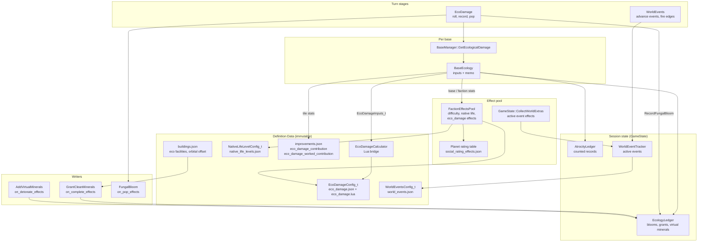

# Ecology System Architecture

Per-base ecological damage (SMACX): each base's score is the percentage chance of a fungal pop
in its radius, rolled every turn by the `EcoDamage` stage. The score is assembled from authored
tile, base and faction effects, per-faction ledger history, and a Lua formula; every number that
could be tuned is config.



## The score

```text
Terraform     = (Σ tile contributions in the base radius) / 8 × EcoTerraformScale
Cleanmins     = EcoCleanMinerals + fungal blooms + clean-mineral grants
Cleanmins1    = Terraform > 0 ? min(Cleanmins, Terraform) : 0
Cleanmins2    = Cleanmins - Cleanmins1
DamageFactor  = max(0, floor((Terraform - Cleanmins1)
                   + (Minerals + EcoMineralOffset - Cleanmins2 + VirtualMinerals)
                     / (1 + EcoDamageReduction)))
EcoDamage%    = floor(DamageFactor × Techs × EcologicalDamage / 300)
```

The arithmetic lives in `config/eco_damage.lua`; `EcoDamageCalculator` evaluates its
`damage_formula` with the inputs as Lua globals and rejects a negative result. The `EcoDamage`
stage caps the roll at `eco_damage.json`'s `fungal_pop.max_chance_percent`.

## Stats

| Stat | Kind | Domain | Emitters |
|---|---|---|---|
| `EcoDamageContribution` | Additive | Tile | improvements: Borehole 9, Mirror 7, Condenser 5, Farm / Mine / Solar Collector / Soil Enricher / Road / Mag Tube / Kelp Farm 1, Forest −1, Base +1 on water |
| `EcoDamageWorkedContribution` | Additive | Tile | the same improvements except Kelp Farm and Forest; counted only on tiles this base's own pops work |
| `EcoTerraformScale` | PureMultiplier | Base | Tree Farm ×0.5, Hybrid Forest ×0 |
| `EcoCleanMinerals` | Additive | Faction | `eco_damage.json` `effects` (16) |
| `EcoDamageReduction` | Additive | Base | good facilities (Goodfacs) |
| `EcoMineralOffset` | Additive (signed) | Base | Nessus Mining Station −1 (orbital minerals are not charged) |
| `EcologicalDamage` | PureMultiplier | Base | difficulty ×3 / ×5, Planet rating (−3…+3 → ×6…×1, 0 → ×3), native life ×1 / ×2 / ×3, Perihelion ×2 |

## Components

- **`BaseEcology`** (owned by `BaseManager`): walks the base tile plus
  `WorkerAssignmentManager::GetWorkableTiles()`, resolving each tile's own
  `CollectTileEffects` in the tile's context (so a `TargetTileHas` condition such as the
  sea-base term applies). A tile adds its worked weight only when `IsTileWorkedByThisBase`
  accepts it, so a supply-crawled tile — or one a neighbour works — counts its unworked weight.
  Resolves the base and faction stats, reads blooms, grants and virtual minerals from the
  `EcologyLedger` and counted atrocities from `AtrocityLedger::EcoVirtualMinerals`, and hands
  `EcoDamageInputs_t` to the calculator. The result is memoized on the faction effects version,
  research, population and mood revisions, the base map's worked-tile and appearance revisions,
  and both ledgers' revisions. Throws when the faction is not bound to a `GameState`.
- **`EcologyLedger`** (owned by `GameState`): per-faction fungal blooms, clean-mineral grants
  and virtual minerals, each permanent. Every write bumps its revision.
- **`GrantCleanMinerals`**: authored in eco facilities' `on_complete_effects`, so a captured or
  granted facility never credits. `requires_first_bloom` withholds the grant before the
  faction's first bloom.
- **`AddVirtualMinerals`**: eco damage no production caused. The Tectonic Payload authors 5
  before `DestroyUnit`. Not an atrocity and not gated by the Charter; it still answers to good
  facilities because it sits inside the mineral term.
- **`NativeLifeLevelConfig_t`**: the session level named by
  `GameRulesConfig_t::nativeLifeLevelId` (settings key `game_rules.native_life`), collected by
  `FactionEffectsPool::CollectNativeLifeEffects_` like difficulty.
- **`WorldEventTracker`**: the world-event registry's active set. The `WorldEvents` stage
  evaluates each `Cycle` event (`(years − start_year_offset) mod cycle_years < duration_years`)
  and fires `on_start_effects` / `on_end_effects` on the edges; `CollectWorldExtras` serves
  active events' `effects` to every faction, and its revision is part of the world composition
  stamp. `Engine` creates it with `GameState::CreateWorldEvents`.

## Turn flow

`WorldEvents` runs before `EcoDamage`, so an event that starts this turn is already in the
multiplier stack. `EcoDamage` (per faction) rolls each base: on a hit it picks a pop tile
uniformly among the workable tiles that are neither bases nor fungus, records the bloom,
publishes `EvFungalBloom`, sends the player a `FungalBloom` notice for their own bases, and
applies `on_pop_effects` with base, owner and pop tile stamped. `FungalBloom` then plants the
fungus, drops incompatible improvements and spawns native lifeforms.

## Known gaps

- Tree Farm, Hybrid Forest, Centauri Preserve's eco half, Temple of Planet, Nanoreplicator,
  Pholus Mutagen and Singularity Inductor are not authored in the shipping building/project
  configs, so `EcoTerraformScale`, `EcoDamageReduction` and the grants have no shipping emitters.
- No base-screen eco row and no new-game native life menu row.
- Sea level rise from sustained eco damage waits on `WorldParameter`.
