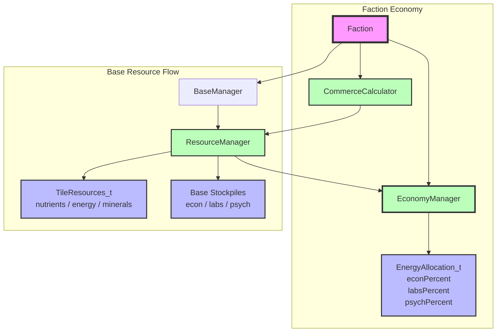

# Economy System Architecture

## Component Overview

### EconomyManager
- **Purpose**: Owns the faction energy treasury and the faction-wide allocation split.
- **Responsibilities**:
  - Hold the treasury. `AddEnergy` is income; spending goes through `SpendEnergy`, which throws
    on a negative amount or one the treasury cannot cover, and `CanAfford` answers the question
    beforehand. The "treasury never goes negative" rule belongs to the class that owns the
    resource, not to each of its spenders — there is no bankruptcy rule, so an overdraft is a
    caller bug and is loud.
  - Store the `EnergyAllocation_t` percentages for econ, labs, and psych.
  - Provide `SetEnergyAllocation()` / `GetEnergyAllocation()` for configuration (`SetEnergyAllocation` throws if the percentages do not sum to 100).
  - Calculate how much of a given base's collected energy goes to each category via `CalculateEnergyForEcon()`, `CalculateEnergyForLabs()`, and `CalculateEnergyForPsych()`.
- **Rounding rule**: Labs and psych receive floored percentage shares; economy receives the remainder (SMAC residual-economy rule). The three results always sum to the input energy.
- **Ownership**: Owned by `Faction` and shared by every base belonging to that faction.
- **Rationale**: Centralizing the allocation split keeps the split consistent across all bases and makes it easy to change from a single UI or AI decision point.

### EnergyAllocation_t
- **Purpose**: Plain data structure holding the three allocation percentages.
- **Invariant**: The three percentages must always sum to 100 (enforced by `SetEnergyAllocation`).
- **Defaults**: 40% econ, 50% labs, 10% psych.

### ResourceManager
- **Purpose**: Calculates and caches per-base resource production.
- **Responsibilities**:
  - Read energy from worked tiles (plus crawlers / base center / Energy StatModifiers).
  - Add per-base **commerce** energy to that pre-inefficiency total when `ProduceResources` is given a commerce amount.
  - Apply inefficiency, then ask the faction's `EconomyManager` how to split energy into econ, labs, and psych.
  - Add the split amounts to the base's stockpiles.
- **Interaction**: Holds a `const EconomyManager*` so it can query the split without mutating it.
- **`GetEnergyProduction()`**: pre-commerce raw energy only (used for commerce pairing ranks).

### CommerceCalculator
- **Purpose**: Pure per-turn commerce income math for Friendship / Pact partners.
- **Config**: `config/commerce.json` (`pair_multiplier`, `treaty_multiplier`) via `CommerceConfig_t`.
- **Formula** (per paired bases, owning faction):
  1. Rank each side's bases by pre-commerce `GetEnergyProduction()` (descending).
  2. Pair top-to-top; ignore surplus bases.
  3. `ceil((energyA + energyB) * pair_multiplier)`.
  4. Apply faction `CommerceRate` (PureMultiplier; Global Trade Pact emits +100% AddPercent).
  5. Multiply by `(commerceTech + 1) / (totalCommerceTech + 1)` (integer floor).
  6. If Friendship (not Pact), multiply by `treaty_multiplier` and floor.
  7. Add base `CommerceEnergyBonus` (Planetary Governor and similar).
  8. TODO: zero when sanctions apply to either faction.
- **commerceTech**: resolved `CommerceRating` for the owning base (discovered economic techs'
  `commerce_rating` Adds + Economy SE + faction bonuses).
- **totalCommerceTech**: sum across living factions of `commerce_rating` **Add** amounts on
  discovered tech configs only (SE / faction bonuses excluded).
- **Wiring**: `ResourceCollection` → `Faction::ProduceBaseResources(GameState&)` → calculator → `ResourceManager::ProduceResources(..., commerceEnergy)`. Commerce that becomes econ reaches the treasury only through `IncomeCollection` / `CollectIncome`.
- **Net income**: `GetNetIncomePerTurn` projects econ with the same commerce seed when a `GameState` is bound.

### Economic technologies
Economic techs emit FactionGlobal `commerce_rating` +1 in `techs.json`: Industrial Economics, Industrial Automation, Planetary Economics, Industrial Nanorobotics, Sentient Econometrics, Environmental Economics. (Costs/prerequisites for stub entries remain content TODOs.)

## Design Rationale

- **Single source of truth**: The allocation lives in `EconomyManager` on the faction, not inside each base.
- **Per-base application**: Each base's `ResourceManager` applies the same percentages to its own collected energy. This is linear, so the faction-wide result is the same as splitting the faction-wide total by the same percentages (up to integer rounding).
- **Commerce as raw energy**: Commerce joins tile energy before inefficiency and the split, so labs/psych also share commerce income.
- **Moddability**: Rates live in `commerce.json` and effect stats; economic techs contribute via
  `commerce_rating` StatModifiers on the tech itself.
