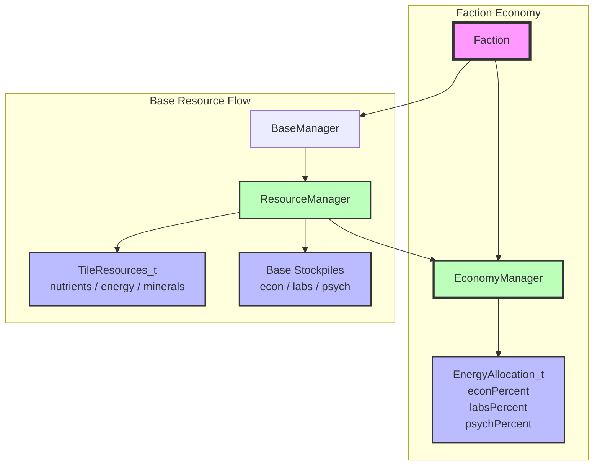

# Economy System Architecture

## Component Overview

### EconomyManager
- **Purpose**: Owns the faction-wide energy allocation split.
- **Responsibilities**:
  - Store the `EnergyAllocation_t` percentages for econ, labs, and psych.
  - Provide `SetEnergyAllocation()` / `GetEnergyAllocation()` for configuration.
  - Calculate how much of a given base's collected energy goes to each category via `CalculateEnergyForEcon()`, `CalculateEnergyForLabs()`, and `CalculateEnergyForPsych()`.
- **Lifetime**: Owned by `Faction` and shared by every base belonging to that faction.
- **Rationale**: Centralizing the allocation split keeps the split consistent across all bases and makes it easy to change from a single UI or AI decision point.

### EnergyAllocation_t
- **Purpose**: Plain data structure holding the three allocation percentages.
- **Invariant**: The three percentages should always sum to 100.
- **Defaults**: 40% econ, 50% labs, 10% psych.

### ResourceManager
- **Purpose**: Calculates and caches per-base resource production.
- **Responsibilities**:
  - Read energy from worked tiles.
  - Ask the faction's `EconomyManager` how to split that energy into econ, labs, and psych.
  - Add the split amounts to the base's stockpiles.
- **Interaction**: Holds a `const EconomyManager*` so it can query the split without mutating it.

## Design Rationale

- **Single source of truth**: The allocation lives in `EconomyManager` on the faction, not inside each base.
- **Per-base application**: Each base's `ResourceManager` applies the same percentages to its own collected energy. This is linear, so the faction-wide result is the same as splitting the faction-wide total by the same percentages (up to integer rounding).
- **Moddability**: The allocation is stored as a plain struct with public fields, so Lua or binary plugins can read or replace it without touching the calculation logic.
