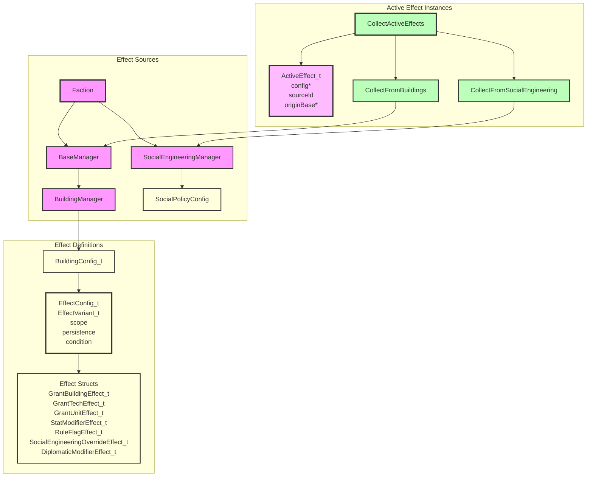

# Effects System Architecture

## Component Overview

### EffectConfig_t
- **Purpose**: A single static effect definition loaded from configuration.
- **Responsibilities**:
  - Holds the typed effect variant via `EffectVariant_t`.
  - Stores metadata: `scope`, `persistence`, and `condition`.
- **Lifetime**: Lives inside static configuration data such as `BuildingConfig_t`.

### EffectVariant_t
- **Purpose**: A `std::variant` of all concrete effect structs.
- **Alternatives**:
  - `GrantBuildingEffect_t`
  - `GrantTechEffect_t`
  - `GrantUnitEffect_t`
  - `StatModifierEffect_t`
  - `RuleFlagEffect_t`
  - `SocialEngineeringOverrideEffect_t`
  - `DiplomaticModifierEffect_t`
  - `TileYieldModifierEffect_t`

### StatModifierEffect_t
- **Purpose**: Modifies a base stat (e.g. `Nutrients`, `Minerals`, `Energy`, `Power`).
- **Responsibilities**:
  - Identifies the target stat via `StatId`.
  - Stores an `amount` and a `ModifierOp`.

### StatId
- **Purpose**: Identifies a stat or resource. Defined in `include/lib/effects/StatId.h` so it can be shared across the game and effects systems.
- **Values**: `Nutrients`, `Minerals`, `Energy`, `Power` (extend as more stats are defined).
- **Consumers**: `StatModifierEffect_t::stat` and `TileYieldModifierEffect_t::resource`.

### ImprovementType
- **Purpose**: Identifies a tile improvement type for `TileSelector_t`.
- **Values**: `Farm`, `Condenser` (extend as more improvement types are defined).

### TileSelectorKind / TileSelector_t
- **Purpose**: Selects which tiles a `TileYieldModifierEffect_t` applies to.
- **Values**:
  - `BaseTile` — the base's own tile.
  - `HasImprovement` — any worked tile that has a specific `ImprovementType`.

### TileYieldModifierEffect_t
- **Purpose**: Modifies the yield of selected tiles.
- **Responsibilities**:
  - Specifies the `StatId` resource to modify.
  - Selects target tiles via `TileSelector_t`.
  - Applies an `amount` with a `ModifierOp`.

### ModifierOp
- **Purpose**: Describes how a stat modifier combines with the running total.
- **Values**:
  - `Add` — adds the amount to the additive base.
  - `MultiplyArithmetic` — treats the amount as a percentage factor relative to the additive base; all arithmetic factors are summed before the geometric step.
  - `MultiplyGeometric` — multiplies the running total by the amount.

### ActiveEffect_t
- **Purpose**: A runtime instance of an effect tied to a specific source.
- **Responsibilities**:
  - Points back to the static `EffectConfig_t`.
  - Records the source id (e.g., building id or social policy id) for UI breakdowns.
  - Records the originating `BaseManager` for `ThisBase`-scoped effects.

### StatBreakdown_t
- **Purpose**: A resolved view of stat modifiers for a single stat.
- **Responsibilities**:
  - Holds a `total` computed from all additive contributions and all multiplicative factors.
  - Records every `Contribution` with its `sourceId`, `amount`, and `op` so the UI can show the breakdown.

### ResolveStatModifiers
- **Purpose**: Resolves a set of `ActiveEffect_t` instances into a `StatBreakdown_t`.
- **Responsibilities**:
  - Collects `StatModifierEffect_t` and `TileYieldModifierEffect_t` effects from the input list.
  - Sorts contributions by `sourceId` for deterministic order.
  - Sums all `Add` contributions into a base value.
  - Combines `MultiplyArithmetic` factors into a single additive percentage: `arithmeticFactor = 1 + (m1-1) + (m2-1) + ...`
  - Combines `MultiplyGeometric` factors into a product: `geometricFactor = m1 * m2 * ...`
  - Computes `total = addTotal * arithmeticFactor * geometricFactor`.
- **Returns**: A `StatBreakdown_t` with `total` and `contributions`.

### FilterByStatId
- **Purpose**: Filters active effects to only `StatModifierEffect_t` instances targeting a given `StatId`.
- **Returns**: A vector of matching `ActiveEffect_t` instances.

### FilterForBase
- **Purpose**: Filters active effects to only those that apply to a specific base.
- **Responsibilities**:
  - Includes `ThisBase` effects whose `originBase` is the given base.
  - Includes `AllOwnerBases`, `FactionGlobal`, and `WorldGlobal` effects.
- **Returns**: A vector of relevant `ActiveEffect_t` instances.

### CollectActiveEffects
- **Purpose**: Gathers all active effects for a faction.
- **Responsibilities**:
  - Takes a `Faction` and the `BuildingRegistry` (from `GameDataContext`) as parameters.
  - Calls `CollectFromBuildings` to gather effects from buildings in all bases.
  - `CollectFromBuildings` uses a two-pass approach:
    1. Append effects from constructed buildings.
    2. Iterate over the collected effects, expanding any `GrantBuildingEffect_t` by looking up the granted building in the passed `BuildingRegistry` and appending its effects. The `sourceId` is chained (e.g., `command_nexus -> network_node`).
  - Calls `CollectFromSocialEngineering` to gather effects from current social engineering selections.
- **Returns**: A vector of `ActiveEffect_t` instances.

### ResourceManager Integration
- **Purpose**: Applies active effects to base resource production.
- **Responsibilities**:
  - `Faction::ProduceBaseResources()` collects active effects once per faction and passes them to each base.
  - `BaseManager::ProduceResources()` uses `FilterForBase` to keep only effects relevant to this base.
  - `ResourceManager::ProduceResources()` stores the effects and uses them when calculating nutrients, minerals, and energy:
    - `StatModifierEffect_t` matching `StatId::Nutrients`, `StatId::Minerals`, or `StatId::Energy` are filtered with `FilterByStatId`, resolved via `ResolveStatModifiers`, and added to the total.
    - `TileYieldModifierEffect_t` with `BaseTile` or `HasImprovement` selectors are resolved via `ResolveStatModifiers`. The raw tile yield is injected as an `Add` contribution so multipliers apply to the actual yield, and `Add` amounts for `HasImprovement` are multiplied by the number of matching worked tiles.
  - Stored effects are also used by the live `Get*Production()` queries.

### BuildingManager / BaseManager Constructed Buildings
- **Purpose**: Track only buildings actually constructed in a base.
- **Responsibilities**:
  - `GetBuildings()` returns only buildings that were actually constructed in the base.
  - `AddBuilding()` and `DestroyBuilding()` only mutate constructed buildings.
  - Granted buildings are not stored; they are discovered dynamically by the effects system.

## Design Rationale

- **Typed effect structs**: Replace the previous string-keyed parameter map with strongly typed structs, making effect consumers type-safe and easier to extend.
- **Static config vs. runtime instances**: `EffectConfig_t` lives in immutable configuration data; `ActiveEffect_t` records the runtime context (source, origin base).
- **Moddability**: New effect types can be added by extending `EffectVariant_t` and adding a corresponding parser branch.
