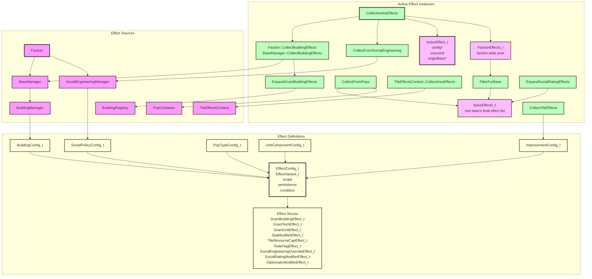

# Effects System Architecture



## Component Overview

### Universal scope routing

The system is **scope-routed, source-agnostic**: an effect declared on *any* config (building,
improvement, unit component, pop type, social policy, rating table) is routed by its `scope`,
not by which config declared it. Each scope has one "lane":

| Scope | Resolved by | Collected via |
|---|---|---|
| `ThisBase` | owning base | source collector tags `originBase`; `FilterForBase` |
| `AllOwnerBases` / `FactionGlobal` | every base of the faction | faction pool (`CollectActiveEffects`) |
| `WorldGlobal` | every base of every faction | own pool + `GameState::CollectWorldEffects` (other factions' contributions, passed into `ProduceBaseResources`/`ApplyBaseGrowth` by the turn stages) |
| `FactionUnits` | live units of the faction (home-base scoped when `originBase` is set) | faction pool → `CollectLiveUnitEffects`; building effects tag `originBase` so train bonuses apply only to units home to that base. Combat Attack/Defense also fold in morale `AddPercent` from `morale_levels.json` via `ResolveCombatStat`. `EffectContext_t::combatRole` enables `IsDefending` (SE Morale defense-in-base). |
| `ThisUnit` | the unit itself | `CollectUnitEffects` (design components) |
| `ThisPop` | the pop itself | `Pop::ApplyTileMultipliers` |
| `ThisTile` | tile resolvers | `CollectTileEffects`/`CollectAreaEffects` — features on the tile, radius-reaching features nearby, and units projecting component effects |

In code, this table is a single constexpr function: `LaneFor(EffectScope_t) -> EffectLane_t`
in `BonusEffect.h`, with the derived predicate `IsFactionLane`. Every collector/filter
routes through it (`FilterForBase`, `AppendFactionLaneEffects`,
`AppendTileEffects`/`TileEffectReaches`), so adding a scope means the compiler forces one
routing decision in `LaneFor`'s exhaustive switch and every collector follows automatically.
`tests/effects/ValidationTests.cpp` pins each scope's lane with `static_assert`s.

Load-time validation (`BonusEffectParser::ValidateScopeForSource`) rejects only the
certainly-impossible combinations — `ThisPop` off a pop type, `ThisUnit` off a unit
component — with a clear error. Every other combination loads; combinations whose anchor
concept doesn't exist yet are **legal but inert**:

- **Faction-lane scopes on improvements** (e.g. a monolith granting `FactionGlobal` energy):
  improvements will be faction-owned by territory, which isn't implemented yet. The config
  loads; no collector picks it up until territory lands.
- **`ThisTile` on buildings**: use a `selector: BaseTile` `StatModifier` instead (already
  supported) — a building-projected tile aura would need a base-tile anchor.

### EffectConfig_t
- **Purpose**: A single static effect definition loaded from configuration.
- **Responsibilities**:
  - Holds the typed effect variant via `EffectVariant_t`.
  - Stores metadata: `scope`, `persistence`, `condition`, and `radius`.
  - `radius` (default `0`) applies to `ThisTile`-scoped effects: how far (Manhattan tiles)
    beyond the host tile the effect reaches. Parsed from the effect entry's own `"radius"`
    field; an improvement-level `"radius"` acts as the parse-time default for its effects.
- **Lifetime**: Lives inside static configuration data such as `BuildingConfig_t`.

### EffectVariant_t
- **Purpose**: A `std::variant` of all concrete effect structs.
- **Alternatives**:
  - `GrantBuildingEffect_t`
  - `GrantTechEffect_t`
  - `GrantUnitEffect_t`
  - `StatModifierEffect_t`
  - `RuleFlagEffect_t`
  - `SocialEngineeringOverrideEffect_t`
  - `SocialRatingModifierEffect_t`
  - `DiplomaticModifierEffect_t`

### StatModifierEffect_t
- **Purpose**: Modifies any stat identified by `StatId_t` — both base resources and unit stats. Also expresses **per-tile yield modifiers** via its optional `selector` (see below); there is no separate tile-yield effect type.
- **Responsibilities**:
  - Identifies the target stat via `StatId_t`.
  - Stores an `amount` and a `ModifierOp_t`.
  - Optionally carries a `TileSelector_t selector`. When **absent**, the modifier is either an intrinsic tile yield (`ThisTile` scope) or a flat base/unit modifier (resolved once). When **present**, the modifier applies to each worked tile whose features satisfy the selector — e.g. a building's "+1 mineral to every worked Mine".

### StatId_t
- **Purpose**: Identifies a stat or resource. Defined in `include/game/effects/EffectEnums.h` so it can be shared across the game and effects systems.
- **Values**:
  - Base resources: `Nutrients`, `Minerals`, `Energy`.
  - Base output allocated directly rather than via energy split: `Econ`, `Labs`, `Psych`.
  - Unit stats: `Attack`, `Defense`, `Movement`, `HitPoints`, `DisengageChance`, `Fuel`, `DamageFromOutOfFuel`, `CargoCapacity`, `DifficultTerrainCost`, `CostMultiplier` (also used for base production cost after Industry rating expansion).
  - Population modifier: `GrowthRate` (`AddPercent`, base = 100%) — modifies the faction-wide population growth rate.
  - Terrain mutation: `MoistureTier` — resolved back into `Tile::SetMoisture` by `RecomputeMoisture`; not a runtime-queried stat (see Tile Improvement Effects).
- **Consumers**: `StatModifierEffect_t::stat`. `Defense` is also the target stat for tile-granted combat bonuses (rockiness, fungus, improvements) — see Tile Improvement Effects below.

### StatKind_t / KindFor / SeedFor
- **Purpose**: The seed-semantics single source of truth, mirroring `LaneFor`. Defined next
  to `StatId_t` in `EffectEnums.h`.
- **`StatKind_t`**: `Additive` (contributions add onto an empty base; seed `0.0`),
  `PureMultiplier` (the stat *is* a multiplier, resolved purely through
  `AddPercent`/`MultiplyGeometric`; seed `1.0` — a `0.0` seed silently collapses to 0), or
  `RawScaled` (modifiers scale a raw value only the resolve site knows: `GrowthRate`'s 100%
  baseline, `MoistureTier`'s base tier).
- **`constexpr KindFor(StatId_t) -> StatKind_t`**: exhaustive switch — adding a `StatId_t` forces a
  seed-semantics decision the same way adding a scope forces a routing decision in `LaneFor`.
  `tests/effects/ValidationTests.cpp` pins every stat's kind with `static_assert`s.
- **`constexpr SeedFor(StatId_t) -> double`**: derives the context-free seed from the kind
  (`0.0`/`1.0`); throws for `RawScaled`, forcing those sites to pass their raw value
  explicitly. Sites that deliberately resolve an Additive stat against a raw base (tile
  yield's elevation energy seed, pop tile multipliers, the tile defense multiplier) also
  pass their seed explicitly and say so in a comment.

### TileSelectorKind_t / TileSelector_t
- **Purpose**: On a `StatModifierEffect_t`, selects which worked tiles the modifier applies to. A tile improvement is identified by its plain string id (`ImprovementConfig_t::id`), matching `Tile::HasImprovement()` — there is no separate improvement-type enum.
- **Values** (`TileSelectorKind_t`):
  - `BaseTile` — the base's own center tile.
  - `HasImprovement` — any tile that has the improvement named in `selector.improvement` (`std::optional<std::string>`).

### ConditionKind_t / Condition_t
- **Purpose**: An optional runtime predicate on `EffectConfig_t` (`std::optional<Condition_t> condition`). When present, the effect only applies in a context that satisfies the condition, and is excluded from context-free resolution (base economy, intrinsic unit stats). This is how situational modifiers — e.g. "+25% attack vs a Base", "+25% attack into Forest" — are expressed, replacing the former `UnitBonusTableEffect_t`.
- **Values** (`ConditionKind_t`):
  - `TargetTileHas` — the targeted tile has the feature id in `condition.value`, matched via `Tile::HasFeature`. One kind covers terrain classification (`Rocky`), river/fungus, and any improvement id — including `Base` (a founded base registers itself as the `Base` improvement) and tile specials (formerly "bonus"/"landmark"). In combat the target is the defender's tile.
- **Evaluation**: `ConditionSatisfied(config, EffectContext_t)` in `ActiveEffect`. `EffectContext_t` carries the runtime target (`targetTile`); combat builds one from the defender. `FilterByStatIdInContext` includes unconditional effects plus condition-satisfied ones; `FilterByStatId`/`FilterBaseLevelByStatId` exclude all condition-carrying effects.

### ModifierOp_t
- **Purpose**: Describes how a stat modifier combines with the running total.
- **Values**:
  - `Add` — adds the amount to the additive base.
  - `AddPercent` — amount is in percent points (`25` = +25%, `-25` = -25%), matching the UI's bonus display; all `AddPercent` contributions are summed into one arithmetic factor before the geometric step.
  - `MultiplyGeometric` — multiplies the running total by the amount (factor form, e.g. `0.5` halves).

### EffectScope_t
- **Purpose**: Describes which entities an effect applies to.
- **Values**:
  - `ThisBase` — only the base the effect originates in (a constructed building, a pop
    living there, or — via `FilterForBase` — any source that tagged `originBase`).
  - `AllOwnerBases` — every base owned by the faction.
  - `ThisUnit` — only the unit the component belongs to (intrinsic component stats).
  - `FactionUnits` — all live units owned by the faction. Consumed by `Unit::Get*` /
    `Is*` resolution, which merges the design's own `ThisUnit` effects with the faction
    pool's `FactionUnits` effects (so a building or policy can boost every unit).
  - `FactionGlobal` — the whole faction.
  - `WorldGlobal` — all factions. A faction's own pool carries its own `WorldGlobal`
    effects; turn stages add other factions' via `GameState::CollectWorldEffects`.
  - `ThisPop` — only the specific pop instance the effect belongs to (pop type tile-multiplier effects use this scope). Resolved locally by `Pop::ApplyTileMultipliers` and never enters the base-wide active effects pool — `FilterForBase` always excludes it, same as `ThisUnit`/`FactionUnits`.
  - `ThisTile` — only the specific tile the effect belongs to (terrain classification, river, fungus, or improvement). Resolved locally via `CollectTileEffects`/`ResolveTileYield`/`ResolveTileDefenseMultiplier` and never enters the base-wide active effects pool — `FilterForBase` always excludes it too. See Tile Improvement Effects below.

### ActiveEffect_t
- **Purpose**: A runtime instance of an effect tied to a specific source.
- **Responsibilities**:
  - Points back to the static `EffectConfig_t`.
  - Records the source id (e.g., building id or social policy id) for UI breakdowns.
  - Records the originating `BaseManager` for `ThisBase`-scoped effects.

### FactionEffects_t / BaseEffects_t (typed pools)
- **Purpose**: Make the two consumer-side pipeline stages distinct types instead of two
  `std::vector<ActiveEffect_t>`s that happen to share a shape, so using the wrong list at
  the wrong stage is a compile error — the consumer-side counterpart of `LaneFor` making
  scope routing compiler-enforced.
- **`FactionEffects_t`**: what `CollectActiveEffects` returns (plus other factions' WorldGlobal
  contributions appended by turn stages). Still contains every base's `ThisBase` effects and
  the `FactionUnits` lane, so it must never be resolved against directly at base level.
- **`BaseEffects_t`**: one base's final effect list — produced only by `FilterForBase`, then
  extended by the pop merge (`CollectFromPops`) and rating expansion
  (`ExpandSocialRatingEffects`) inside `BaseManager::BuildBaseEffects_`. This is the type
  `FilterBaseLevelByStatId`, `ResolveTileYield(tile, isBaseTile, baseEffects)`,
  `ResourceManager::ProduceResources`, and the growth path accept.
- Both are thin structs holding a `std::vector<ActiveEffect_t> effects;`. Pre-pool source
  collections (a building's effects, a pop's effects, grant expansion input) remain raw
  vectors — the typing guards the pool→base narrowing, not collection.

### StatBreakdown_t
- **Purpose**: A resolved view of stat modifiers for a single stat.
- **Responsibilities**:
  - Holds a `total` computed from all additive contributions and all multiplicative factors.
  - Records every `Contribution` with its `sourceId`, `amount`, and `op` so the UI can show the breakdown.

### ResolveStatModifiers
- **Purpose**: Resolves a set of `ActiveEffect_t` instances into a `StatBreakdown_t`.
- **Signature**: `ResolveStatModifiers(matching, baseValue)` — `baseValue` is deliberately
  **not defaulted**. Context-free resolve sites derive it from the stat via
  `SeedFor(statId)` (see StatKind_t above), so a pure-multiplier stat can no longer be seeded
  `0.0` by habit; raw-scaled sites pass the raw value the modifiers scale (tile yield,
  GrowthRate's `100.0`).
- **Responsibilities**:
  - Collects `StatModifierEffect_t` effects from the input list.
  - Sorts contributions by `sourceId` for deterministic order.
  - Sums all `Add` contributions into a base value.
  - Combines `AddPercent` contributions into a single additive percentage: `arithmeticFactor = 1 + p1/100 + p2/100 + ...`
  - Combines `MultiplyGeometric` factors into a product: `geometricFactor = m1 * m2 * ...`
  - Computes `total = addTotal * arithmeticFactor * geometricFactor`.
- **Returns**: A `StatBreakdown_t` with `total` and `contributions`.

### FilterByStatId
- **Purpose**: Filters active effects to only `StatModifierEffect_t` instances targeting a given `StatId_t` (including any that carry a tile `selector`).
- **Returns**: A vector of matching `ActiveEffect_t` instances.

### FilterBaseLevelByStatId
- **Purpose**: Like `FilterByStatId`, but for **base-level** resolution: excludes
  selector-carrying (per-tile) modifiers and condition-carrying effects. Per-tile
  modifiers have already been applied to each worked tile and must not be counted a
  second time.
- **Signature**: Accepts only a `BaseEffects_t` — never a raw vector or the faction pool —
  so running this filter at any other stage is a compile error.
- **Returns**: A lazy view of matching `ActiveEffect_t` instances.

### FilterByScope
- **Purpose**: Filters active effects to only those with an exact `EffectScope_t` match.
- **Used by**: `Pop::ApplyTileMultipliers`/`Pop::GetSpecialistOutput` to split a pop type's own effects into the `ThisPop` (tile multiplier) and `ThisBase` (flat generation) subsets before resolving each separately — see Pop Type Effects below.

### FilterForBase
- **Purpose**: Narrows the faction pool to the effects that apply to a specific base — the
  only constructor of a `BaseEffects_t` from a `FactionEffects_t`.
- **Responsibilities** (switching on `LaneFor(scope)`):
  - `EffectLane_t::Base`: includes `ThisBase` effects whose `originBase` is the given base.
  - `EffectLane_t::FactionWide`: includes `AllOwnerBases`, `FactionGlobal`, and `WorldGlobal` effects.
  - All other lanes (`FactionUnits`, `UnitLocal`, `PopLocal`, `TileLocal`) are excluded — resolved by their own owning instance (unit, pop, or tile) and never apply at the base level.
- **Returns**: A `BaseEffects_t`.

### Collection helpers (AppendActiveEffects and variants)
- **Purpose**: The single config→`ActiveEffect_t` conversion. One core loop owns the two
  universal rules — `Instantaneous` effects never enter the continuous pool (they fire once
  via `DispatchInstantaneousEffects`), and `ThisBase` effects get their `originBase` tag.
- **Variants** (all in `ActiveEffect.h`):
  - `AppendActiveEffects(effects, pOriginBase, sourceId, out)` — every continuous effect.
    `CollectUnitEffects`/`CollectPopEffects`, `BuildingManager::CollectEffects`, and
    `SocialEngineeringManager` collect through this.
  - `AppendFactionLaneEffects(effects, sourceId, out)` — only `IsFactionLane` scopes; what a
    source contributes to the faction pool when its local scopes are resolved elsewhere.
    Used by `Faction::CollectPopFactionEffects`.
  - `AppendTileEffects(effects, sourceId, distance, out)` — only effects satisfying
    `TileEffectReaches(e, distance)` (ThisTile lane, continuous, `radius >= distance`).
    Used by own-tile collection (`distance` 0), neighbor auras, and unit auras alike.
- **Adding a new effect source** is therefore two calls: `BonusEffectParser::ParseEffects`
  at load time, and one of these at collection time — no hand-rolled loops.

### CollectActiveEffects
- **Purpose**: Gathers all active effects for a faction — the faction pool.
- **Responsibilities**:
  - Takes only a `const Faction&` as a parameter; returns a `FactionEffects_t`.
  - Calls `Faction::CollectBuildingEffects`, which calls `BaseManager::CollectBuildingEffects` on every base to collect raw building effects, then passes the combined list to `ExpandGrantBuildingEffects` (along with the faction's `BuildingRegistry` and base list) to expand any `GrantBuildingEffect_t` entries. The `sourceId` is chained (e.g., `command_nexus -> network_node`). `ThisBase`-scoped sub-effects of a faction-wide grant are cloned once per base with the correct `originBase`. A grant whose target already appears in its own source chain is skipped (cycle guard).
  - Calls `CollectFromSocialEngineering` (delegating to `Faction::CollectSocialEffects`) to gather the active social policies' effects — including `SocialRatingModifier` entries, which pass through as ordinary effects (see Social Ratings below).
  - Calls `Faction::CollectPopFactionEffects` — pop effects on the faction lanes (`IsFactionLane`); the locally-resolved `ThisPop`/`ThisBase` stay with `Pop::ApplyTileMultipliers` and `CollectFromPops` respectively.
  - Calls `Faction::CollectUnitFactionEffects` — live units' component effects on the faction lanes (e.g. a component that generates faction-wide energy while a unit carrying it exists); `ThisUnit`/`ThisTile` are resolved by the unit design and the tile resolvers.
- **Returns**: A vector of `ActiveEffect_t` instances.

### Social Ratings (two-level)
- `SocialRatingModifier` effects are ordinary effects and can come from **any** source: a
  policy's faction-wide `+2 Growth`, a building's `ThisBase` `+1 Growth`, etc.
- `SocialRatingResolver` (`game/social-engineering/SocialRatingResolver.h`). Both functions
  take `BaseEffects_t` — accumulation is only meaningful after the list is filtered to its
  final base context, and the type makes running it on the raw pool a compile error:
  - `AccumulateSocialRatings(baseEffects)` sums modifier contributions per rating axis.
  - `ExpandSocialRatingEffects(baseEffects, ratingRegistry)` maps each non-zero accumulated
    level through `SocialRatingConfig_t::levelEffects` (SMAC clamp-at-extremes: totals outside
    `[min, max]` of the table use that extreme; in-range missing keys, including typical
    absent 0, still produce nothing) and appends the resulting gameplay effects with sourceId
    `se_rating_<axis>_<level>` (clamped level).
- **Per-base effective ratings fall out automatically**: `BaseManager::BuildBaseEffects_`
  runs the expansion *after* `FilterForBase` + pop merge, so faction-wide modifiers reach
  every base while `ThisBase` modifiers shift only their own base — a `+2 Growth` policy
  plus a `+1 Growth` shrine resolves that base at level 3 and every other base at level 2.
  `BaseManager::GetEffectiveSocialRating(rating, pool)` exposes the per-axis total.
- **Growth rating → growth rate**: the growth axis's levels map to `GrowthRate`
  `AddPercent` modifiers (`config/social_rating_effects.json`, ±10% per level), which
  `GrowthCalculator::ComputeNutrientsRequired` resolves per base — so the SE Growth score
  directly scales each base's growth threshold, both at turn end (`ApplyGrowth`) and in the
  UI (`GrowthDisplay` passes the faction pool to `GetNutrientsRequired`). The extreme
  levels emit `NearZeroGrowth` / `PopulationBoom` rule flags instead (see Known Gaps).
- **Industry rating → production cost**: the industry axis's levels map to `CostMultiplier`
  `AddPercent` modifiers (±10% per level, matching SMAC's ±10% mineral-cost change), which
  `ProductionCostCalculator::ComputeCost` resolves from the base effect list
  (`baseCost * 10 * CostMultiplier`). Same seam as Growth: the rating table defines the
  gameplay effects; the calculator never sees the raw Industry score.

### ResourceManager Integration
- **Purpose**: Applies active effects to base resource production.
- **Responsibilities**:
  - `Faction::ProduceBaseResources()` collects active effects once per faction and passes them to each base.
  - `BaseManager::ProduceResources()` builds the base's final effect list via `BuildBaseEffects_`: `FilterForBase` over the faction pool, plus this base's own pop-generated effects via `CollectFromPops(GetPopContainer(), *this)` (see Pop Type Effects above), plus the gameplay effects of this base's effective social rating levels via `ExpandSocialRatingEffects` (see Social Ratings above). `ApplyGrowth` and `GetNutrientsRequired` use the same helper.
  - `ResourceManager::ProduceResources()` stores the effects and uses them when calculating nutrients, minerals, and energy. There is a **single per-tile pass**: `ResourceManager::ComputeWorked_` sums `WorkerAssignmentManager::ComputeWorkedResources(baseEffects)` (every worker pop's tile) plus the base center tile (worked for free, no pop). Each tile's full yield is resolved once by `TileEffectsContext::ResolveTileYield(tile, isBaseTile, baseEffects)`, which folds in every selector-matching `StatModifier` from `baseEffects`, then applies configurable **TileResourceCap** effects still present in that list: each resource is clamped to `max`. Caps declare `removed_by_tech` on the `EffectConfig_t`; `FactionEffectsPool` drops them once Research discovers that tech (research revision is in the pool stamp). StatModifiers with `apply_after_restriction: true` (resource-bonus specials) are added **after** the cap. Pop tile multipliers then scale that whole yield. Flat base-level bonuses remain uncapped. Per-tile `Add`/`Multiply` modifiers summed across tiles are mathematically equivalent to the old aggregate-with-counts approach, so no separate delta pass is needed.
    - `CalculateResource_` then adds only **flat** (non-selector) `StatModifier` contributions for `StatId_t::Nutrients`/`Minerals`/`Energy` via `FilterBaseLevelByStatId`/`ResolveStatModifiers` — selector-carrying modifiers are excluded here because they were already applied per tile.
    - `StatId_t::Econ`/`Labs`/`Psych` are not produced from tiles — `CalculateEcon_`/`CalculateLabs_`/`CalculatePsych_` take the percentage-of-energy split from `EconomyManager` and add any flat `StatModifier` contributions (e.g. specialist pop output) on top via `FilterBaseLevelByStatId`/`ResolveStatModifiers`, the same pattern used by `AllocateEnergy_` when stockpiling each turn. **All base-level resolution uses `FilterBaseLevelByStatId`** — selector-carrying modifiers belong exclusively to the per-tile pass (and parse-time validation restricts selectors to tile-resource stats anyway).
  - Stored effects are also used by the live `Get*Production()` queries.

### BuildingManager / BaseManager Constructed Buildings
- **Purpose**: Track only buildings actually constructed in a base.
- **Responsibilities**:
  - `GetBuildings()` returns only buildings that were actually constructed in the base.
  - `AddBuilding()` and `DestroyBuilding()` only mutate constructed buildings.
  - Granted buildings are not stored; they are discovered dynamically by the effects system.

### BonusEffectParser

- **Purpose**: Single shared implementation of the JSON `effects` array schema, used by every config parser that defines `EffectConfig_t` entries.
- **Location**: `include/game/effects/BonusEffectParser.h` / `src/game/effects/BonusEffectParser.cpp`.
- **Responsibilities**:
  - `ParseStatId`, `ParseRuleFlagId`, `ParseModifierOp`, `ParseEffectScope`, `ParseEffectPersistence` — the canonical string&lt;-&gt;enum mappings. These previously existed as separate, drifting copies in `BuildingConfigParser` and `UnitComponentConfigParser`.
  - `ParseNumber` — reads a JSON field as either a number or a numeric string (used for `amount` and `value`).
  - `ParseTileSelector` — parses a `TileSelector_t` from a `selector` JSON object. Called by the `StatModifier` branch when a `selector` field is present, making that modifier a per-tile yield modifier. A `selector` on any stat other than `nutrients`/`minerals`/`energy` is rejected at parse time — selectors only take part in tile-yield resolution, so such a modifier would silently never apply.
  - `ParseEffectConfig` — parses one entry of an `effects` array (`type`/`scope`/`persistence`/`condition`/`parameters`) into an `EffectConfig_t`. Covers every `EffectVariant_t` alternative, and parses the optional typed `condition` object via `ParseCondition`.
  - `ParseEffects` — parses the `effects` array of a containing JSON object, returning `{}` if absent.
- **Consumers**: `BuildingConfigParser` and `UnitComponentConfigParser` both call `BonusEffectParser::ParseEffects` directly on the building/component JSON object — there is no per-domain effect schema anymore. Adding a new effect source (e.g. a future social-engineering or diplomacy parser) means calling the same function.

### EffectReferenceValidator (post-load id validation)

- **Location**: `include/game/EffectReferenceValidator.h` / `src/game/EffectReferenceValidator.cpp`.
- **Purpose**: catches config typos at startup instead of as silent no-op effects. Individual
  parsers can't do this — an effect may legitimately reference a config that loads later —
  so it runs once from `Engine` after **all** registries are loaded:
  `ValidateEffectReferences(*m_gameDataContext)`.
- **Checks** (throws naming the source config and the bad id): `GrantBuilding` targets
  against `BuildingRegistry`, `GrantTech` targets against `TechRegistry`, `HasImprovement`
  selector ids against `ImprovementRegistry`, and `TargetTileHas` condition values against
  improvement ids plus `AllTerrainFeatureIds()` (the `Tile.h` list of everything
  `Tile::HasFeature` can match). `GrantUnit` is not validated — unit designs are runtime
  data with no config registry.
- **Coverage**: every effect-declaring config — buildings, improvements, pop types, unit
  components, social policies, and each rating level's effect list.
- Deliberately **not** part of `Registry::Validate_`: test fixtures intentionally contain
  dangling grant ids (to test that expansion skips unknown targets), and single registries
  can't see cross-registry references anyway.

### RequiredTechValidator (post-load required_tech validation)

- **Location**: `include/game/RequiredTechValidator.h` / `src/game/RequiredTechValidator.cpp`.
- **Purpose**: same fail-at-startup standard as `EffectReferenceValidator`, applied to the
  separate `requiredTech` scalar field (not an effect list) that buildings, improvements,
  unit components, unit slots, social policies, and pop types all carry. Kept as its own
  component rather than folded into `EffectReferenceValidator` — same lifecycle point and
  `GameDataContext`-shaped entry point, but a distinct concern. Runs once from `Engine` right
  after `ValidateEffectReferences`: `ValidateRequiredTechReferences(*m_gameDataContext)`.
- **Checks**: for every config in each of the six registries, if `requiredTech` is non-empty
  it must be a known id in `TechRegistry`; throws naming the source config and the bad tech
  id otherwise. A null registry (including a null `TechRegistry`) skips the checks that need
  it, matching `EffectReferenceValidator`'s convention.
- **Coverage**: `BuildingRegistry`, `ImprovementRegistry`, `UnitComponentRegistry`,
  `UnitSlotRegistry`, `SocialPolicyRegistry`, `PopTypeRegistry` — every registry whose config
  struct declares a `requiredTech` field.

### Unit Component Effects

- Unit components (`config/unit_components/*.json`) use the exact same `effects` array shape as buildings — no more `stats`/`flags`/`bonus_tables` shorthand.
- Intrinsic unit stats use `"scope": "ThisUnit"`. Components can also declare other scopes:
  `ThisTile` (+ `radius`) makes the component a mobile tile aura (see Unit auras above), and
  faction-lane scopes (e.g. `FactionGlobal`) apply while a unit carrying the component exists
  (collected by `Faction::CollectUnitFactionEffects`).
- A live `Unit`'s stat getters resolve `ThisUnit` component effects **plus** the faction
  pool's `FactionUnits` effects; `UnitDesign`'s getters stay intrinsic (designer UI).
- A stat with a flat bonus (e.g. a weapon's base attack) is a `StatModifier` effect with `op: "Add"`. A percentage bonus uses `op: "AddPercent"` (amount in percent points, e.g. `25`); a compounding factor uses `op: "MultiplyGeometric"`.
- A situational combat bonus (e.g. "+25% attack into Forest" or "+25% attack vs a Base") is a `StatModifier` on `attack`/`defense` with `op: "AddPercent"`, `amount: 25`, plus a `condition` (e.g. `{ "kind": "TargetTileHas", "value": "Forest" }`). It is resolved per-combat via `Unit::GetAttackAgainst`, not through the context-free `GetAttack`.
- A unit rule flag (e.g. `flight`) is a `RuleFlag` effect; flags that don't apply are simply omitted rather than written as `false`.

### Pop Type Effects

Pop types (`config/pop_types.json`) also use the standard `effects` array. Unlike buildings/units, a `Pop` has exactly one `PopTypeConfig_t` at a time — there's no stacking of multiple sources — so pop effects are resolved locally rather than through `CollectActiveEffects`/`FilterForBase`. Two distinct scopes are used, resolved differently:

- **`ThisBase` effects (flat output)** — e.g. a Doctor's `+2 psych`, a Technician's `+3 econ`. These are `StatModifier`/`Add` effects targeting `StatId_t::Nutrients`/`Minerals`/`Energy`/`Econ`/`Labs`/`Psych`. `CollectFromPops(popContainer, base)` gathers the `ThisBase`-scoped effects from every pop in a base (filtered via `FilterByScope`), tags them with `originBase`, and `BaseManager::ProduceResources` merges them into the base's active effects alongside building effects — so one Doctor contributes `+2` psych, three Doctors contribute `+6`. `Pop::GetSpecialistOutput()` (used by `PopContainer::ComputePsychOutput()` for riot/golden-age composition math, and by the population UI) resolves the same `ThisBase` subset independently, per-pop.
- **`ThisPop` effects (tile multipliers)** — e.g. "this pop type's worked-tile nutrient yield is scaled by +50%". These are `StatModifier` effects with `op: "AddPercent"`/`"MultiplyGeometric"` targeting `StatId_t::Nutrients`/`Energy`/`Minerals`. `Pop::ApplyTileMultipliers(rawTileYield)` resolves only the `ThisPop` subset of its own config's effects, seeding `ResolveStatModifiers` with the raw tile value as `baseValue` so the multiplier scales that pop's own worked tile. **`ThisPop` effects must never be added to `ThisBase`/flat resolution in the same call** — `ResolveStatModifiers` sums `Add` contributions into the seeded base *before* applying multiplicative factors, so mixing a flat `Add` bonus into a raw-seeded multiplier resolve would incorrectly scale the flat bonus too. This is why `Pop` always splits by `FilterByScope` first instead of resolving a pop type's whole effect list in one call. No current pop type uses a non-1.0 tile multiplier; the mechanism exists for future use (e.g. a Worker variant with a +50% mineral tile bonus):
  ```json
  {
    "type": "StatModifier",
    "scope": "ThisPop",
    "persistence": "Continuous",
    "parameters": { "stat": "minerals", "amount": 50, "op": "AddPercent" }
  }
  ```

### Tile Improvement Effects

- **Purpose**: Unifies every "thing on a tile" — terrain classification (Rockiness_t, Moisture_t), natural features (River, Fungus), player-built improvements (Farm, Mine, Bunker), tile specials that were formerly separate "bonus"/"landmark" slots, and a founded Base — behind one config type, since they all answer the same two questions: what effects do they grant, and what do they exclude. Defined in `include/game/map/ImprovementConfigParser.h` / `config/improvements.json`.
- **`ImprovementConfig_t`**: `id`, `name`, `description`, `mineralCost`, `requiredTech`, `excludes` (other feature ids that can't coexist with this one on a tile), `radius` (default `0`), `frequency`, `spritePath`, `effects` (the standard `EffectConfig_t` vector, parsed via `BonusEffectParser::ParseEffects`).
- **How a tile holds features**: improvements are stored directly as non-owning `const ImprovementConfig_t*` in `Tile::GetImprovements()` (the same pattern `BuildingManager` uses for `BuildingConfig_t*`); the caller resolves the id via `ImprovementRegistry` (the funnel is `TileEffectsContext`). Terrain stays as typed enums/bools on `Tile` — world-gen and rendering need the exhaustive/exclusive guarantee (every tile is *exactly one* of Flat/Rolling/Rocky) — and is exposed for effect resolution as string ids via `Tile::GetTerrainFeatureIds()` (Rockiness_t, Moisture_t, River, Fungus). `Tile::HasFeature(id)` answers "is this feature present?" across both (terrain strings + improvement ids) for conditions/selectors/`CanBuildImprovement`.
- **`CollectTileEffects(tile, improvementRegistry)`**: collects a tile's own `ThisTile`-scoped effects into a flat `ActiveEffect_t` list (sourceId = the feature's id) in two passes — terrain ids from `GetTerrainFeatureIds()` looked up via `registry.Find`, plus each `GetImprovements()` config read directly (no lookup). Mirrors `CollectPopEffects`/`CollectUnitEffects`. Only ever resolves a tile's *own* effects (radius 0) — it has no `WorldMap` to look at neighbors.
- **`radius` (aura effects)**: radius is a **per-effect** property (`EffectConfig_t::radius`, default `0` = the host tile only). An improvement-level `"radius"` in JSON acts as the parse-time default for that improvement's effects, so existing configs keep working — e.g. `Sensor` (`radius: 2`) projects its `+25%` defense bonus, `Mirror` (`radius: 2`) its `+1 energy`, `Condenser` (`radius: 1`) its `+1 moisture_tier`. An individual effect can declare its own `"radius"` to differ from its siblings. Only continuous `ThisTile`-scoped effects take part in aura resolution — neighbor collection applies the exact same scope/persistence filter as own-tile collection.
- **Unit auras**: unit components can carry `ThisTile`-scoped effects with a radius (e.g. a sensor pod granting `+25%` defense within 2 tiles). `CollectAreaEffects` scans `WorldMap::GetUnitsOnTile` over the aura radius — including units standing on the resolved tile itself — so the aura follows the unit as it moves. `TileEffectsContext` takes the `UnitComponentRegistry` at construction to size its scan bound.
- **`CollectAreaEffects(tile, worldMap, registry)`**: the single function powering all three radius-aware resolvers (defense, yield, and moisture recompute). `WorldMap` is needed to look up neighboring tiles and units.
- **`ResolveTileDefenseMultiplier(tile, worldMap, improvementRegistry)`**: `ResolveStatModifiers(FilterByStatId(CollectAreaEffects(...), Defense), 1.0).total`.
- **`ResolveTileYield(tile)`**: returns `TileYieldView_t` from `CollectAreaEffects` (so a nearby Mirror's energy aura IS included), including `apply_after_restriction` bonuses, with **no** `TileResourceCap` (`effective == potential`). Used where only intrinsic + area yield is wanted (e.g. the auto-assign tile scorer).
- **`ResolveTileYield(tile, isBaseTile, baseEffects)`**: the full worked-tile yield as `TileYieldView_t`. Starts from `CollectAreaEffects`, then appends every `baseEffects` `StatModifier` whose `selector` matches this tile, splits the list into pre-cap vs `apply_after_restriction` lanes, clamps the pre-cap lane via any `TileResourceCap` effects still in `baseEffects`, then adds the after-restriction lane. Caps with `removed_by_tech` are omitted from the faction pool once that tech is discovered. Production reads `.effective`; UI may also use `.potential`.
- **`ResolvePreviewTileYield(tile, capEffects)`**: same cap / after-restriction assembly without building selectors — used by the base workable-area UI for unworked tiles.
- **`StatId_t::MoistureTier`** (`"moisture_tier"` in JSON): integer tile tier (Arid=0, Moist=1, Wet=2), used exclusively by `RecomputeMoisture` as a terrain-mutation target. Not queryable at runtime — it is a seed for `SetMoisture()`, not a cached stat. `Condenser`'s `+1 moisture_tier Add` effect flows through `RecomputeMoisture` to actually call `Tile::SetMoisture()`, making the change visible in rendering and tile-yield resolution.
- **`Tile::m_baseMoisture`/`GetBaseMoisture()`/`SetBaseMoisture()`**: the natural, un-condensed terrain truth set once by `WorldGenerator`. `m_moisture`/`GetMoisture()`/`SetMoisture()` is the current/effective value (what rendering and `GetTerrainFeatureIds()` see), mutated by `RecomputeMoisture` from the base + nearby Condensers. World-gen sets both to the same initial random value; `RecomputeMoisture` derives `m_moisture` from `m_baseMoisture` fresh each time — never increments/decrements in place — so overlapping Condensers and add/remove order can never cause drift.
- **`RecomputeMoisture(tile, worldMap, registry)`**: re-derives `tile`'s effective moisture from `tile.GetBaseMoisture()` + any `moisture_tier` `Add` effects from `CollectAreaEffects`, clamps to `[Arid, Wet]`, calls `tile.SetMoisture()`. Single function, always called from the current live world state — idempotent, consistent with any number of overlapping Condensers.
- **`AddImprovementWithEffects` / `RemoveImprovementWithEffects`**: the single safe entry point for adding/removing any improvement. After the raw `Tile::AddImprovement/RemoveImprovement`, calls `RecomputeMoisture` for every tile within the improvement's maximum effect reach (improvement-level radius or any larger per-effect radius, including the host tile) — so a Condenser addition immediately updates moisture on itself and 8 neighbors, and removal automatically reverts them. `BaseManager` uses this for `"Base"` (radius 0, a no-op recompute, but consistent). When a future improvement-construction UI is added, it must go through these functions.
- **`CanBuildImprovement(tile, candidateConfig)`**: returns false if any id in `candidateConfig.excludes` is present on the tile per `tile.HasFeature(id)` (e.g. Farm excludes Rocky). Exposed as a resolver only — no improvement-construction UI/flow exists yet to enforce it.
- **"Base" as an improvement**: `BaseManager`'s constructor calls `AddImprovementWithEffects(m_tile, "Base", worldMap, registry)`, so a founded base grants its own `ThisTile` defense bonus (`config/improvements.json`'s `Base` entry, currently a placeholder `+100%`) through the exact same mechanism as Bunker/Rocky/Fungus. This is also why `BaseManager` now holds a non-const `Tile&` (previously `const Tile&`), `Faction::CreateBase` takes a non-const `Tile*`, and `Faction::CreateBase` takes a non-const `WorldMap&`.
- **Building bonuses to worked improvements**: a building can boost worked tiles that have a given improvement by attaching a `HasImprovement` `selector` to a `StatModifier` (e.g. Nutrient Bank's "+1 nutrients to worked Farms"). The selector's `improvement` is the plain `ImprovementConfig_t::id` string and is matched against `Tile::HasImprovement()` during the per-tile yield resolve — the same string-id lookup used everywhere else, with no separate improvement-type enum.

## How to add a new producer or consumer

### A new producer (a config type that declares effects)

Producers only differ in which top-level JSON fields they read; the `effects` array itself is
parsed and collected identically everywhere.

1. **Parse**: add an `EffectSourceKind_t` enumerator (`BonusEffect.h`) and call
   `config.effects = BonusEffectParser::ParseEffects(json, EffectSourceKind_t::X, config.id);`
   in the config parser — exactly what `BuildingConfigParser`, `PopTypeConfigParser`, etc.
   do. Only add a `ValidateScopeForSource` rejection if a scope is *certainly impossible*
   for the source; scopes whose anchor concept is pending stay legal-but-inert (see
   Universal scope routing).
2. **Collect**: never hand-roll the config→`ActiveEffect_t` loop — use a collection helper,
   which owns the Instantaneous exclusion and `originBase` tagging (see Collection helpers):
   - Faction-anchored source (policy-like): `AppendActiveEffects(effects, nullptr, id, out)`
     from a collector wired into `CollectActiveEffects`.
   - Base-anchored source (building-like): `AppendActiveEffects(effects, pBase, id, out)` so
     `ThisBase` effects are attributed to their base, then feed the faction pool.
   - Source whose local scopes are resolved elsewhere (pop/unit-like):
     `AppendFactionLaneEffects(effects, id, out)` for the pool, and resolve the local lanes
     at their owner (the way `Pop::ApplyTileMultipliers` and `CollectUnitEffects` do).
   - Tile-anchored source: `AppendTileEffects(effects, id, distance, out)` — the same filter
     all tile/aura resolution uses.
3. **Validate**: add the new registry to the `ValidateEffectReferences(GameDataContext)`
   walker so the source's id references (grant targets, selector improvements, condition
   features) fail at startup instead of loading as silent no-ops.
4. **Test**: add a fixture config under `tests/fixtures/` and a collection test asserting
   the effect lands in the right lane (`UniversalRoutingTests.cpp` has the pattern).

That's it — routing is scope-driven, so the new source's effects automatically reach bases,
units, pops, or tiles according to each entry's `scope`.

### A new consumer

**A new stat** (the most common case):

1. Add the `StatId_t` enumerator (`EffectEnums.h`) and its string mapping in `ParseStatId`
   (`BonusEffectParser.cpp`); extend the mapping test in `ParserTests.cpp`.
2. Classify its seed semantics in `KindFor` (`EffectEnums.h`) — the compiler forces this via
   the exhaustive switch — and pin it in `ValidationTests.cpp` alongside the others.
3. Resolve it where the value is needed, choosing the filter by context:
   - `FilterBaseLevelByStatId` for **base-level** resolution — excludes per-tile selector
     modifiers and conditional effects, and only accepts a `BaseEffects_t`; always the
     right choice at base level.
   - `FilterByStatId` for tile and unit resolution (selector effects are folded in
     deliberately during the tile pass; conditional effects are still excluded).
   - `FilterByStatIdInContext` when a runtime target exists (e.g. combat vs a defender's
     tile).
4. Seed `ResolveStatModifiers` with `SeedFor(statId)` — it derives `0.0`/`1.0` from the
   stat's kind and throws for `RawScaled` stats, whose sites pass the raw value the
   modifiers scale (a tile yield, `GrowthRate`'s `100.0`) explicitly.

**A new rule flag**: add the `RuleFlagId_t` enumerator and its `ParseRuleFlagId` string, then
check it with a `std::get_if<RuleFlagEffect_t>` scan over the relevant pool — see
`Unit::ResolveFlag_` for the pattern.

**A new effect type** (a new `EffectVariant_t` alternative):

1. Define the struct in `BonusEffect.h` and add it to `EffectVariant_t`.
2. Add the parser branch in `ParseEffectConfig`, validating required parameters there
   (throw on missing/empty ids — don't parse permissively).
3. If it references other configs by id, add the check to `ValidateEffectReferences`.
4. Consume it with `std::get_if<YourEffect_t>` wherever it applies (`SocialRatingResolver`
   is the model for a type-specific consumer). If it can be `Instantaneous`, it also needs a
   branch in `DispatchInstantaneousEffects`.

**A new resolution site** (consuming existing effects somewhere new): fetch the right pool
rather than building a parallel collection path — the faction pool via
`CollectActiveEffects(faction)` (a `FactionEffects_t`), a base's final list via
`BaseManager::BuildBaseEffects_` (a `BaseEffects_t`, already including pop effects and
rating expansion), a live unit's via its design's `ThisUnit` effects plus the pool's
`FactionUnits` (see `CollectLiveUnitEffects_` in `Unit.cpp`), a tile's via
`TileEffectsContext`. The pool types enforce the stage: base-level filters and the per-tile
selector pass won't compile against the raw pool.

## Design Rationale

- **Typed effect structs**: Replace the previous string-keyed parameter map with strongly typed structs, making effect consumers type-safe and easier to extend.
- **Static config vs. runtime instances**: `EffectConfig_t` lives in immutable configuration data; `ActiveEffect_t` records the runtime context (source, origin base).
- **Moddability**: New effect types can be added by extending `EffectVariant_t` and adding a corresponding parser branch in `BonusEffectParser`.
- **One parser, every source**: `BonusEffectParser` is the single place that knows how to turn JSON into `EffectConfig_t`. Buildings and unit components only differ in which top-level fields they read (`mineral_cost`, `required_tech`, etc.) — the `effects` array itself is parsed identically everywhere.

## Known Gaps

- **Unit `MoistureTier` auras don't retrigger `RecomputeMoisture` on movement**: moisture
  recompute is event-driven from improvement add/remove (`AddImprovementWithEffects`). A unit
  component with a `moisture_tier` effect would be collected by `CollectAreaEffects` but the
  recompute isn't hooked to `UnitPositionIndex::TryMoveUnit` yet. Yield/defense unit auras
  are resolved on demand and unaffected.
- **Improvement faction-lane effects are inert pending territory**: legal to declare (see
  Universal scope routing), but no collector attributes an improvement to a faction until
  territory ownership exists.
- **Faction pools are collected on demand, uncached**: `CollectActiveEffects` runs per query
  (production, growth, each live-unit stat read). Fine at current scale; a per-turn cache
  with explicit invalidation is a future optimization if profiling warrants it.

- **`NearZeroGrowth` / `PopulationBoom` rule flags are emitted but not consumed**: the growth
  rating's extreme levels (and the `population_boom` project) declare them, and they reach the
  base pool, but `GrowthCalculator` doesn't check them yet — their gameplay rules are undefined
  (TODO at the resolve site).
- **No combat system consumes `ResolveTileDefenseMultiplier` yet**: `Unit::GetDefense()` still returns only the unit's own design stat. Wiring an actual attack/defense resolution (and deciding how/whether it multiplies the attacker's tile bonus too) is a separate, larger feature.
- **No improvement-construction flow consumes `CanBuildImprovement` yet**: `Tile::AddImprovement()` has no caller besides `BaseManager`'s `"Base"` wiring — there's no UI/production path for the player to actually build Farm/Mine/Bunker, so the `excludes` exclusivity check is unenforced in practice today.
- **`Base`'s defense bonus value (+100%) is an unconfirmed placeholder**, same as the other round test-data numbers (`test_tech_1`, etc.) in this repo — needs real balance input.
