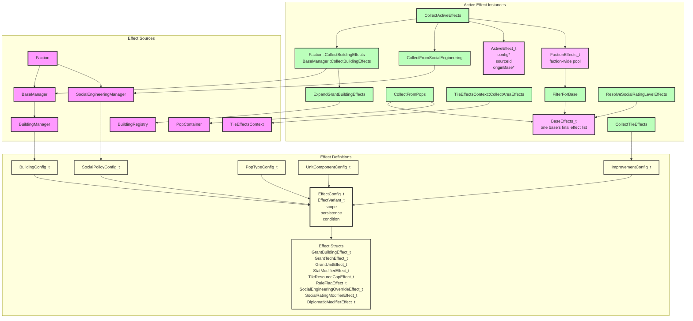

# Effects System Architecture



## Component Overview

### Universal scope routing

The system is **scope-routed, source-agnostic**: an effect declared on *any* config (building,
improvement, unit component, pop type, social policy, rating table) is routed by its `scope`,
not by which config declared it. Each scope has one "lane":

| Scope | Resolved by | Collected via |
|---|---|---|
| `ThisBase` | owning base | source collector tags `originBase`; `FilterForBase` |
| `AllOwnerBases` / `FactionGlobal` | every base of the faction | faction pool (`CollectActiveEffects`) |
| `WorldGlobal` | every base of every faction | composed into `Faction::GetActiveEffects()` (local `FactionEffectsPool` + `IWorldEffectsSource` / `GameState::CollectWorldExtras` for peer WorldGlobal and council extras). Turn stages call no-arg `ProduceBaseResources` / `ApplyBaseGrowth`; they do not append a second list. |
| `FactionUnits` | live units of the faction (home-base scoped when `originBase` is set) | faction pool → `CollectLiveUnitEffects`; building effects tag `originBase` so train bonuses apply only to units home to that base. Combat Attack/Defense also fold in morale `AddPercent` from `morale_levels.json` via `ResolveCombatStat`. `EffectContext_t::combatRole` enables `IsDefending` (SE Morale defense-in-base). |
| `ThisUnit` | the unit itself | `CollectUnitEffects` (design components) |
| `ThisPop` | the pop itself | `Pop::ApplyTileMultipliers` (per worked-tile Add / %) |
| `ThisTile` | tile resolvers | `CollectTileEffects`/`CollectAreaEffects` — features on the tile, radius-reaching features nearby, and units projecting component effects |

In code, this table is a single constexpr function: `LaneFor(EffectScope_t) -> EffectLane_t`
in `EffectEnums.h`, with the derived predicate `IsFactionLane`. Every collector/filter
routes through it (`FilterForBase`, `AppendFactionLaneEffects`,
`AppendTileEffects`/`TileEffectReaches`), so adding a scope means the compiler forces one
routing decision in `LaneFor`'s exhaustive switch and every collector follows automatically.
`tests/effects/ValidationTests.cpp` pins each scope's lane with `static_assert`s.

Load-time validation (`EffectConfigParser::ValidateScopeForSource`) rejects the
certainly-impossible combinations — with a clear error:

- `ThisPop` only on a pop type
- `ThisUnit` only on a unit component
- `ThisBase` / `ProducedAtThisBase` only on sources that can supply an origin base or
  pop-merge path: `Building`, `PopType`, `SocialPolicy`, `SocialRating`. Rejected on
  `UnitComponent`, `Improvement`, `ProbeAction`, `Faction`, `CouncilProposal`,
  `CouncilRules`, `TileYieldRules`.

Every other combination loads; combinations whose anchor concept doesn't exist yet are
**legal but inert**:

- **Faction-lane scopes on improvements** (e.g. a monolith granting `FactionGlobal` energy):
  improvements will be faction-owned by territory, which isn't implemented yet. The config
  loads; no collector picks it up until territory lands.
- **`ThisTile` on buildings**: use a `selector: BaseTile` `StatModifier` instead (already
  supported) — a building-projected tile aura would need a base-tile anchor.

### EffectConfig_t
- **Header**: `EffectConfig.h` holds `EffectConfig_t` / `EffectVariant_t` / effect structs;
  enums and snake_case wire parsers live in `EffectEnums.h`.
- **Purpose**: A single static effect definition loaded from configuration.
- **Responsibilities**:
  - Holds the typed effect variant via `EffectVariant_t`.
  - Stores metadata: `scope`, `persistence`, `condition`, and `radius`.
  - `radius` (default `0`) applies only to `ThisTile`-scoped effects: how far (Chebyshev
    tiles) beyond the host tile the effect reaches. A nonzero `"radius"` on any other
    scope is rejected at parse time. Parsed from the effect entry's own `"radius"` field —
    there is no container-level default, so a `"radius"` placed beside `"effects"` (e.g. on
    an improvement) is ignored.
- **Lifetime**: Lives inside static configuration data such as `BuildingConfig_t`.

### EffectVariant_t
- **Purpose**: A `std::variant` of all concrete effect structs.
- **Alternatives**:
  - `GrantBuildingEffect_t`
  - `GrantTechEffect_t`
  - `GrantUnitEffect_t`
  - `StatModifierEffect_t`
  - `RuleFlagEffect_t`
  - `SocialEngineeringOverrideEffect_t`
  - `SocialRatingModifierEffect_t`
  - `DiplomaticModifierEffect_t`

### StatModifierEffect_t
- **Purpose**: Modifies any stat identified by `StatId_t` — both base resources and unit stats. Also expresses **per-tile yield modifiers** via its optional `selector` (see below); there is no separate tile-yield effect type.
- **Responsibilities**:
  - Identifies the target stat via `StatId_t`.
  - Stores an `amount` and a `ModifierOp_t`.
  - Optionally carries a `TileSelector_t selector`. When **absent**, the modifier is either an intrinsic tile yield (`ThisTile` scope) or a flat base/unit modifier (resolved once). When **present**, the modifier applies to each worked tile whose features satisfy the selector — e.g. a building's "+1 mineral to every worked Mine".

### StatId_t
- **Purpose**: Identifies a stat or resource. Defined in `include/game/effects/EffectEnums.h` so it can be shared across the game and effects systems.
- **Values**:
  - Base resources: `Nutrients`, `Minerals`, `Energy`.
  - Base output allocated directly rather than via energy split: `Econ`, `Labs`, `Psych`.
  - Unit stats: `Attack`, `Defense`, `Movement`, `HitPoints`, `DisengageChance`, `TurnsOfFuel`, `DamageFromOutOfFuel`, `CargoCapacity`, `DifficultTerrainCost`, `MineralUpkeep` (home-base mineral support cost; floored at 0), `FreeUnitSupport` (base-level free support slots), `CostMultiplier` (also used for base production cost after Industry rating expansion), `FacilityEnergyUpkeep` (PureMultiplier on constructed-facility energy maintenance; optional `buildingFilter`), `StartingExperience` (seeded into unit XP at spawn), `StartingMinerals` (credited to a new base's production stockpile at founding; resolved from the new base's effects plus the founding unit).
  - Population modifier: `GrowthRate` (`AddPercent`, base = 100%) — modifies the faction-wide population growth rate.
  - Terrain mutation: `MoistureTier` — resolved back into `Tile::SetMoisture` by `RecomputeMoisture`; not a runtime-queried stat (see Tile Improvement Effects).
- **Consumers**: `StatModifierEffect_t::stat`. `Defense` is also the target stat for tile-granted combat bonuses (rockiness, fungus, improvements) — see Tile Improvement Effects below.

### StatKind_t / KindFor / SeedFor
- **Purpose**: The seed-semantics single source of truth, mirroring `LaneFor`. Defined next
  to `StatId_t` in `EffectEnums.h`.
- **`StatKind_t`**: `Additive` (contributions add onto an empty base; seed `0.0`),
  `PureMultiplier` (the stat *is* a multiplier, resolved purely through
  `AddPercent`/`MultiplyGeometric`; seed `1.0` — a `0.0` seed silently collapses to 0), or
  `RawScaled` (modifiers scale a raw value only the resolve site knows: `GrowthRate`'s 100%
  baseline, `MoistureTier`'s base tier).
- **`constexpr KindFor(StatId_t) -> StatKind_t`**: exhaustive switch — adding a `StatId_t` forces a
  seed-semantics decision the same way adding a scope forces a routing decision in `LaneFor`.
  `tests/effects/ValidationTests.cpp` pins every stat's kind with `static_assert`s.
- **`constexpr SeedFor(StatId_t) -> double`**: derives the context-free seed from the kind
  (`0.0`/`1.0`); throws for `RawScaled`, forcing those sites to pass their raw value
  explicitly. Sites that deliberately resolve an Additive stat against a raw base (tile
  yield's elevation energy seed, pop tile multipliers, the tile defense multiplier,
  `ResourceManager` base-level production) also pass their seed explicitly and say so in a
  comment.
- **`FinalizeResolvedStat(double) -> int`**: the single float→int rule for a resolved
  modifier total — `std::lround`, half away from zero. Every consumer of a
  `ResolveStatModifiers` / `ApplyModifierStack` total goes through it: `ResolveStat` (design
  and live unit) and `ResolveAdditiveStat`, `MoraleCalculator::ResolveCombatStat`,
  `PlanetaryCouncil` vote weight, `ResourceManager` base-level production and the
  Econ/Labs/Psych splits, `Pop::ApplyTileMultipliers` and specialist output,
  `TileEffectsContext::ResolveResource_` (per-tile yield), `UnitDesign::GetBaseCost`,
  `ResearchManager`'s tech-cost modifier, and `FactionVisibleMap`'s vision range. Do not
  truncate or `std::round` a total anywhere else — a fork means one stat resolves to two
  values depending on which path asked, which is what this helper exists to prevent. The one
  deliberate exception is `MoraleCalculator`'s `PositiveMoraleScale` step, which truncates
  toward zero to match integer halving and says so at the call site.

### TileSelector_t
- **Purpose**: On a `StatModifierEffect_t`, selects which worked tiles the modifier applies to. A tile improvement is identified by its plain string id (`ImprovementConfig_t::id`), matching `Tile::HasFeature()` — there is no separate improvement-type enum.
- **Shape**: `std::variant` so invalid kind/parameter combos are unrepresentable:
  - `TileSelectorBaseTile_t` — the base's own center tile.
  - `TileSelectorHasImprovement_t` — any tile that has the feature named in `improvement`.

### Condition_t
- **Purpose**: An optional runtime predicate on `EffectConfig_t` (`std::optional<Condition_t> condition`). When present, the effect only applies in a context that satisfies the condition, and is excluded from context-free resolution (base economy, intrinsic unit stats). This is how situational modifiers — e.g. "+25% attack vs a Base", "+25% attack into Forest" — are expressed, replacing the former `UnitBonusTableEffect_t`.
- **Shape**: inherits `std::variant` (so `AllOf_t` can recurse). Alternatives:
  - `TargetTileHas_t` — the targeted tile has `featureId`, matched via `Tile::HasFeature`. One alternative covers terrain classification (`Rocky`), river/fungus, and any improvement id — including `Base` (a founded base registers itself as the `Base` improvement) and tile specials. In combat the target is the defender's tile.
  - `AllOf_t` — every nested `Condition_t` is satisfied (AND). Wire JSON may still supply `"values": ["A","B"]` and/or `"conditions"`; the parser desugars each values entry to `TargetTileHas_t` so only nested conditions exist in memory.
  - `IsDefending_t`, `OriginBaseIsTargetBase_t`, `AttackerIsEmbarked_t` — parameterless situational predicates.
- **Evaluation**: `ConditionSatisfied(config, EffectContext_t)` in `ActiveEffect` via exhaustive `std::visit`. `EffectContext_t` carries the runtime target (`targetTile`); combat builds one from the defender. `FilterByStatIdInContext` includes unconditional effects plus condition-satisfied ones; `FilterByStatId`/`FilterBaseLevelByStatId` exclude all condition-carrying effects.

### UnitFilter_t
- **Purpose**: Restricts which units an effect applies to in `CollectLiveUnitEffects` (context-free identity predicates, not combat situations).
- **Shape**: `std::variant` of `UnitFilterDomain_t` / `UnitFilterHasComponent_t` / `UnitFilterHasFlag_t` / `UnitFilterIsPrototype_t` with required fields as plain members. `IsPrototype` is true while the unit's design still has a component the owning faction has never fielded (prototype starting XP).

### ModifierOp_t
- **Purpose**: Describes how a stat modifier combines with the running total.
- **Values**:
  - `Add` — adds the amount to the additive base.
  - `AddPercent` — amount is in percent points (`25` = +25%, `-25` = -25%), matching the UI's bonus display; all `AddPercent` contributions are summed into one arithmetic factor before the geometric step.
  - `MultiplyGeometric` — multiplies the running total by the amount (factor form, e.g. `0.5` halves).

### EffectScope_t
- **Purpose**: Describes which entities an effect applies to.
- **Values**:
  - `ThisBase` — only the base the effect originates in (a constructed building, a pop
    living there, or — via `FilterForBase` — any source that tagged `originBase`).
  - `AllOwnerBases` — every base owned by the faction.
  - `ThisUnit` — only the unit the component belongs to (intrinsic component stats).
  - `FactionUnits` — all live units owned by the faction. Consumed by `Unit::Get*` /
    `Is*` resolution, which merges the design's own `ThisUnit` effects with the faction
    pool's `FactionUnits` effects (so a building or policy can boost every unit).
  - `FactionGlobal` — the whole faction.
  - `WorldGlobal` — all factions. A faction's own `FactionEffectsPool` carries its own
    `WorldGlobal` effects; `Faction::GetActiveEffects()` (when bound to `IWorldEffectsSource`)
    also appends peer WorldGlobal and council extras. `GetLocalActiveEffects()` is the
    uncomposed pool used when harvesting peers.
  - `ThisPop` — only the specific pop instance the effect belongs to (pop type tile-multiplier effects use this scope). Resolved locally by `Pop::ApplyTileMultipliers` and never enters the base-wide active effects pool — `FilterForBase` always excludes it, same as `ThisUnit`/`FactionUnits`.
  - `ThisTile` — only the specific tile the effect belongs to (terrain classification, river, fungus, or improvement). Resolved locally via `CollectTileEffects`/`ResolveTileYield`/`ResolveTileDefenseMultiplier` and never enters the base-wide active effects pool — `FilterForBase` always excludes it too. See Tile Improvement Effects below.

### ActiveEffect_t
- **Purpose**: A runtime instance of an effect tied to a specific source.
- **Construction**: `ActiveEffect_t(const EffectConfig_t&, sourceId, originBase?)` — `config` is
  always non-null after construction. Hand-rolled null configs are not a valid instance.
- **Responsibilities**:
  - Points back to the registry-owned `EffectConfig_t` (buildings, pop types, unit components,
    council proposals, council rules) — every source is loaded once and outlives the wrapper.
  - Records the source id (e.g., building id or social policy id) for UI breakdowns.
  - Records the originating `BaseManager` when `TagsOriginBase(scope)` (ThisBase,
    ProducedAtThisBase, FactionUnits).

### FactionEffects_t / BaseEffects_t (typed pools)
- **Purpose**: Make the two consumer-side pipeline stages distinct types instead of two
  `std::vector<ActiveEffect_t>`s that happen to share a shape, so using the wrong list at
  the wrong stage is a compile error — the consumer-side counterpart of `LaneFor` making
  scope routing compiler-enforced.
- **`FactionEffects_t`**: what `CollectActiveEffects` / `IEffectsProvider::GetActiveEffects`
  returns (local pool plus, when bound, peer WorldGlobal and council extras). Still contains
  every base's `ThisBase` effects and the `FactionUnits` lane, so it must never be resolved
  against directly at base level.
- **`BaseEffects_t`**: one base's final effect list — produced only by `FilterForBase`, then
  extended by the pop merge (`CollectFromPops`) and the rating level effects
  (`ResolveSocialRatingLevelEffects`) inside `BaseManager::BuildBaseEffects_`. This is the type
  `FilterBaseLevelByStatId`, `ResolveTileYield(tile, bIsBaseTile, baseEffects)`,
  `ResourceManager::ProduceResources`, and the growth path accept.
- Both are thin structs holding a `std::vector<ActiveEffect_t> effects;`. Pre-pool source
  collections (a building's effects, a pop's effects, grant expansion input) remain raw
  vectors — the typing guards the pool→base narrowing, not collection.

### StatBreakdown_t
- **Purpose**: A resolved view of stat modifiers for a single stat.
- **Responsibilities**:
  - Holds a `total` computed from all additive contributions and all multiplicative factors.
  - Records every `Contribution_t` with its `sourceId`, `amount`, and `op` so the UI can show the breakdown.

### ResolveStatModifiers
- **Purpose**: Resolves a set of `ActiveEffect_t` instances into a `StatBreakdown_t`.
- **Signature**: `ResolveStatModifiers(matching, baseValue)` — `baseValue` is deliberately
  **not defaulted**. Context-free resolve sites derive it from the stat via
  `SeedFor(statId)` (see StatKind_t above), so a pure-multiplier stat can no longer be seeded
  `0.0` by habit; raw-scaled sites pass the raw value the modifiers scale (tile yield,
  GrowthRate's `100.0`).
- **Responsibilities**:
  - Collects `StatModifierEffect_t` effects from the input list.
  - Sorts contributions by `sourceId` for deterministic order.
  - Sums all `Add` contributions into a base value.
  - Combines `AddPercent` contributions into a single additive percentage: `arithmeticFactor = 1 + p1/100 + p2/100 + ...`
  - Combines `MultiplyGeometric` factors into a product: `geometricFactor = m1 * m2 * ...`
  - Computes `total = addTotal * arithmeticFactor * geometricFactor`.
- **Returns**: A `StatBreakdown_t` with `total` and `contributions`.

### FilterByStatId
- **Purpose**: Filters active effects to only `StatModifierEffect_t` instances targeting a given `StatId_t` (including any that carry a tile `selector`).
- **Borrowing**: Lazy views borrow the lvalue `effects` vector — rvalue overloads are deleted so temporaries cannot silently dangle. Materialize (`CollectEffects()` into a named local) before filtering when the source is a temporary.
- **Returns**: A lazy view of matching `ActiveEffect_t` instances.

### FilterBaseLevelByStatId
- **Purpose**: Like `FilterByStatId`, but for **base-level** resolution: excludes
  selector-carrying (per-tile) modifiers and condition-carrying effects. Per-tile
  modifiers have already been applied to each worked tile and must not be counted a
  second time.
- **Signature**: Accepts only a `BaseEffects_t` — never a raw vector or the faction pool —
  so running this filter at any other stage is a compile error.
- **Returns**: A lazy view of matching `ActiveEffect_t` instances.

### FilterByScope
- **Purpose**: Filters active effects to only those with an exact `EffectScope_t` match.
- **Used by**: `Pop::ApplyTileMultipliers`/`Pop::GetSpecialistOutput` to split a pop type's own effects into the `ThisPop` (tile multiplier) and `ThisBase` (flat generation) subsets before resolving each separately — see Pop Type Effects below.

### FilterForBase
- **Purpose**: Narrows the faction pool to the effects that apply to a specific base — the
  only constructor of a `BaseEffects_t` from a `FactionEffects_t`.
- **Responsibilities** (switching on `LaneFor(scope)`):
  - `EffectLane_t::Base`: includes `ThisBase` effects whose `originBase` is the given base.
  - `EffectLane_t::FactionWide`: includes `AllOwnerBases`, `FactionGlobal`, and `WorldGlobal` effects.
  - All other lanes (`FactionUnits`, `UnitLocal`, `PopLocal`, `TileLocal`) are excluded — resolved by their own owning instance (unit, pop, or tile) and never apply at the base level.
- **Returns**: A `BaseEffects_t`.

### Collection helpers (AppendActiveEffects and variants)
- **Purpose**: The single config→`ActiveEffect_t` conversion. One core loop owns the two
  universal rules — `Instantaneous` effects never enter the continuous pool (they fire once
  via `DispatchInstantaneousEffects`), and `originBase` is tagged when `TagsOriginBase(scope)`
  (next to `LaneFor` / `IsFactionLane` in `EffectEnums.h`).
- **Variants** (all in `ActiveEffect.h`):
  - `AppendActiveEffects(effects, pOriginBase, sourceId, out)` — every continuous effect.
    `CollectUnitEffects`/`CollectPopEffects`, `BuildingManager::CollectEffects(rOriginBase)`,
    and `SocialEngineeringManager` collect through this. Base-anchored sources pass the
    owning base so tagging happens at append time (no post-pass re-tag).
  - `AppendFactionLaneEffects(effects, sourceId, out)` — only `IsFactionLane` scopes; what a
    source contributes to the faction pool when its local scopes are resolved elsewhere.
    Used by `Faction::CollectPopFactionEffects`.
  - `AppendTileEffects(effects, sourceId, distance, out)` — only effects satisfying
    `TileEffectReaches(e, distance)` (ThisTile lane, continuous, `radius >= distance`).
    Used by own-tile collection (`distance` 0), neighbor auras, and unit auras alike.
- **Adding a new effect source** is therefore two calls: `EffectConfigParser::ParseEffects`
  at load time, and one of these at collection time — no hand-rolled loops.

### DispatchInstantaneousEffects
- **Signature**: `DispatchInstantaneousEffects(building, base, GameState&)` — no default; a live
  session is required so Instantaneous Infiltration can write the diplomacy ledger.
- **Production completion**: `BaseManager` reads `Faction::GetGameState()` (bound by
  `GameState::AddFaction` via `BindGameState`) and throws if null. Both that check and the
  registry check run *before* the completed building is added, so a throw never leaves a base
  holding a building whose Instantaneous effects were never dispatched.
- GrantTech / GrantUnit remain TODO stubs; Infiltration always calls `ApplyInfiltrationEffect`.

### CollectLiveUnitEffects
- Returns design + FactionUnits + matching ProducedAtThisBase effects. The list already
  satisfies `UnitFilterSatisfied` and the ProducedAt origin match — `HasPermission` /
  resolve paths re-check conditions only, not unitFilter.

### CouncilEffects
- **Borrows, never copies**: wrappers point straight at the `EffectConfig_t` entries owned by
  the `CouncilProposalRegistry` and the council rules config — the same arrangement as building
  and pop-type effects pointing at their registries. Both sources load once and outlive the
  council, so `ActiveEffect_t::config` addresses are stable for the whole session: a retained
  wrapper survives any number of rebuilds, and an unchanged proposal keeps the same address
  across them. `CouncilEffects` owns no config storage and needs no retirement scheme.
- The effect *vectors* are rebuilt in place, so the const references returned by
  `PlanetaryCouncil::CollectWorldEffects` / `CollectFactionEffects` are invalidated by the next
  `RebuildWorld` / `SetGovernorEffects`. Consumers copy the wrappers out (see
  `GameState::CollectWorldExtras`); the council revision bump tells composed-pool caches to
  recompose.

### CollectActiveEffects / `FactionEffectsPool::Rebuild_`
- **Purpose**: Assembles the faction's *local* active effect pool (memoized on
  `FactionEffectsPool`, bound to its owning `Faction`). Peer `WorldGlobal` and council
  extras are composed later by `Faction::GetActiveEffects` — they never enter this rebuild.
- **Pipeline** (strict order):
  1. **Collect** raw continuous contributors: tile-yield rules, faction definition,
     discovered-tech `effects[]`, constructed buildings (no grant expand yet), social
     engineering, pop faction-lane, unit faction-lane.
  2. **Gate** `removed_by_tech` (erase effects whose tech is already discovered). Every
     expansion below is bracketed by this gate: a derivative outlives its producer
     otherwise, and derivatives (a granted building's effects, a rating level's effects)
     do not inherit the gate that was on the effect that produced them.
  3. **Expand grants** via `ExpandGrantBuildingEffects`. `processedGrantedIds` is
     pre-seeded from each base's `BuildingManager::GetBuildings()` (`{pBase, id}` and
     `{nullptr, id}`) so a grant of a building already constructed does not double-count
     that building's continuous effects. Grant `sourceId` is chained
     (e.g. `command_nexus -> network_node`). `ThisBase` sub-effects of a faction-wide
     grant are cloned once per base; a grant whose target appears in its own source
     chain is skipped (cycle guard).
  4. **Gate** again — the grant derivatives are now in the list, and a gated
     `SocialRatingModifier` arriving through a grant must not reach the accumulation in
     step 5.
  5. **Expand faction-lane social ratings** via `ExpandFactionLaneSocialRatingEffects`
     (`FactionEffects_t`): accumulate only `LaneFor(scope) == FactionWide` modifiers,
     append only `FactionUnits` gameplay effects from the level table.
  6. **Gate** a last time (a level table's own effects may carry the field).
  7. **Stamp** the cache from the pre-rebuild revision snapshot (`m_scratchRevisions`);
     do not re-walk contributors after rebuild.
- **Returns**: `FactionEffects_t` (local pool). Composed view is
  `Faction::GetActiveEffects()`.

### SocialEngineeringManager
- **Starting policies come from config.** Each category declares exactly one policy with
  `"default": true` in `social_policies.json`; `SocialPolicyRegistry::GetDefaultForCategory`
  resolves it and throws, naming the category, when a category declares none or more than one.
  The ids used to be compiled in, which meant a mod shipping its own policy set threw from every
  faction constructor rather than from config load.
- **`GetSocialRating` is memoized** against the manager's own `Revision` (bumped by
  `SetActivePolicy`). Answering one axis re-collected every policy's effects and re-accumulated
  the whole map, and the UI asks once per axis per frame.

### Social Ratings (two-level)
- `SocialRatingModifier` effects are ordinary effects from **faction-internal** sources: a
  policy's faction-wide `+2 Growth`, a building's `ThisBase` `+1 Growth`, a pop/unit
  faction-lane modifier, etc. Ratings are a local axis — peer `WorldGlobal` and council
  extras do not move them: both lanes read `IEffectsProvider::GetLocalActiveEffects()`.
  The restriction is currently **silent** — a mod can still declare a `WorldGlobal`
  `SocialRatingModifier` and it moves neither lane (load-time rejection for that shape is
  not yet wired).
- `SocialRatingResolver` (`game/social-engineering/SocialRatingResolver.h`). Both lanes
  share one level-lookup path (`FindSocialRatingLevelEffects` + sourceId + append), so a
  clamp or sourceId change cannot drift between them:
  - `AccumulateSocialRatings(effects, laneFilter?)` sums modifier contributions per rating
    axis. Base-context callers pass no filter (`FilterForBase` established the context);
    the faction lane passes `FactionWide`.
  - `ResolveSocialRatingLevelEffects(const BaseEffects_t&, ratingRegistry)` — base lane:
    maps each non-zero accumulated level through `SocialRatingConfig_t::levelEffects`
    (SMAC clamp-at-extremes) and **returns** the gameplay effects with sourceId
    `se_rating_<axis>_<level>` (clamped level). It returns rather than appends because the
    accumulation source (local pool, filtered + pop-merged) is not the list the base
    resolves against (composed pool).
  - `ExpandFactionLaneSocialRatingEffects(FactionEffects_t&, ratingRegistry)` — faction
    lane: accumulates **FactionWide** modifiers only (ignores `ThisBase`), appends only
    `FactionUnits` gameplay effects. Do not re-expand FactionWide economy effects here.
- **Per-base effective ratings fall out automatically**: `BaseManager::CollectRatingSource_`
  filters the *local* pool for the base and merges its pops; that one list feeds both
  `GetEffectiveSocialRating` and the level effects spliced into `BuildBaseEffects_`, so the
  number the UI reports and the effects the base resolves cannot disagree. Faction-wide
  modifiers reach every base while `ThisBase` modifiers shift only their own base — a
  `+2 Growth` policy plus a `+1 Growth` shrine resolves that base at level 3 and every
  other base at level 2.
- **Growth rating → growth rate**: the growth axis's levels map to `GrowthRate`
  `AddPercent` modifiers (`config/social_rating_effects.json`, ±10% per level), which
  `GrowthCalculator::ComputeNutrientsRequired` resolves per base — so the SE Growth score
  directly scales each base's growth threshold, both at turn end (`ApplyGrowth`) and in the
  UI (`GrowthDisplay` → `GetNutrientsRequired()`, which uses the same memoized
  `BuildBaseEffects_()` as turn resolution). The extreme
  levels emit `NearZeroGrowth` / `PopulationBoom` rule flags instead (see Known Gaps).
- **Industry rating → production cost**: the industry axis's levels map to `CostMultiplier`
  `AddPercent` modifiers (±10% per level, matching SMAC's ±10% mineral-cost change), which
  `ProductionCostCalculator::ComputeCost` resolves from the base effect list
  (`baseCost * CostMultiplier`). Same seam as Growth: the rating table defines the
  gameplay effects; the calculator never sees the raw Industry score.

### ResourceManager Integration
- **Purpose**: Applies active effects to base resource production.
- **Responsibilities**:
  - `Faction::ProduceBaseResources()` / `ApplyBaseGrowth()` route to every base with no
    external effect vector. Each base resolves against `BuildBaseEffects_()` over the
    composed `IEffectsProvider` pool (local contributors plus bound world/council extras).
  - `BaseManager::ProduceResources()` / `ApplyGrowth()` / production getters /
    `GetNutrientsRequired` / tile-yield queries all use that same memoized list.
  - `ResourceManager::ProduceResources()` stores the effects and uses them when calculating nutrients, minerals, and energy. There is a **single per-tile pass**: `ResourceManager::ComputeWorked_` sums `WorkerAssignmentManager::ComputeWorkedResources(baseEffects)` (every worker pop's tile) plus the base center tile (worked for free, no pop). Each tile's full yield is resolved once by `TileEffectsContext::ResolveTileYield(tile, bIsBaseTile, baseEffects)`, which folds in every selector-matching `StatModifier` from `baseEffects`, then applies configurable **TileResourceCap** effects still present in that list: each resource is clamped to `max`. Caps declare `removed_by_tech` on the `EffectConfig_t`; `FactionEffectsPool` drops them once Research discovers that tech (research revision is in the pool stamp). StatModifiers with `apply_after_restriction: true` (resource-bonus specials) are added **after** the cap. Pop tile multipliers then scale that whole yield. Flat base-level bonuses remain uncapped. Per-tile `Add`/`Multiply` modifiers summed across tiles are mathematically equivalent to the old aggregate-with-counts approach, so no separate delta pass is needed.
    - `CalculateResource_` seeds `ResolveStatModifiers` with the **worked** nutrient/mineral/energy total (not `SeedFor`, which is 0 for Additive stats), so selector-free base-level `AddPercent` (e.g. Economy rating minerals −10%/−20%) scales production. Only **non-selector** modifiers remain here via `FilterBaseLevelByStatId` — selector-carrying modifiers were already applied per tile.
    - `StatId_t::Econ`/`Labs`/`Psych` are not produced from tiles — `CalculateEcon_`/`CalculateLabs_`/`CalculatePsych_` seed `ResolveStatModifiers` with the energy-split integer from `EconomyManager`, then finalize once (same pattern as worked resources). **All base-level resolution uses `FilterBaseLevelByStatId`** — selector-carrying modifiers belong exclusively to the per-tile pass (and parse-time validation restricts selectors to tile-resource stats anyway).
    - Float→int for these totals goes through `FinalizeResolvedStat` (`std::lround`) — including the per-tile pass upstream, so a tile yield is not truncated once and rounded again at base level. See `FinalizeResolvedStat` under Core Vocabulary for the full list of sites.
  - Stored effects are also used by the live `Get*Production()` queries.

### BuildingManager / BaseManager Constructed Buildings
- **Purpose**: Track only buildings actually constructed in a base.
- **Responsibilities**:
  - `GetBuildings()` returns only buildings that were actually constructed in the base.
  - `AddBuilding()` and `DestroyBuilding()` only mutate constructed buildings.
  - Granted buildings are not stored; they are discovered dynamically by the effects system.

### EffectConfigParser

- **Purpose**: Single shared implementation of the JSON `effects` array schema, used by every config parser that defines `EffectConfig_t` entries.
- **Location**: `include/game/effects/EffectConfigParser.h` / `src/game/effects/EffectConfigParser.cpp`.
- **Responsibilities**:
  - `ParseModifierOp`, `ParseEffectScope`, `ParseEffectPersistence` — the canonical string&lt;-&gt;enum mappings for effect-config enums. These previously existed as separate, drifting copies in `BuildingConfigParser` and `UnitComponentConfigParser`. The snake_case id maps (`ParseStatId`, `ParseRuleFlagId`, `ParseSocialRatingId`) live next to their enums in `EffectEnums.h` at `ac` scope, per the one-map-next-to-the-enum guideline.
  - `ParseNumber` — reads a JSON field as either a number or a numeric string (used for optional numeric params with a caller-supplied default).
  - `RequireNumber` — same, but throws if the key is absent (no silent balance defaults). Used for `TileResourceCap.max`, `OrbitalAttack.chance` / `cooldown_turns`, and `InterceptAttempt.chance`.
  - `ParseTileSelector` — parses a `TileSelector_t` from a `selector` JSON object. Called by the `StatModifier` branch when a `selector` field is present, making that modifier a per-tile yield modifier. A `selector` on any stat other than `nutrients`/`minerals`/`energy` is rejected at parse time — selectors only take part in tile-yield resolution, so such a modifier would silently never apply.
  - `ParseEffectConfig` — parses one entry of an `effects` array (`type`/`scope`/`persistence`/`condition`/`parameters`) into an `EffectConfig_t`. Required keys `type` and `scope` use `.at()` (missing → throw). Dispatches on `type` via a static table of per-type parse functions (one focused function per `EffectVariant_t` alternative). Additional strictness:
    - Nonzero `radius` requires `scope: ThisTile`.
    - `StatModifier` with `amount_source` requires `op: Add` (or omitted op, which defaults to Add).
    - Balance keys listed under `RequireNumber` above have no C++ invent-defaults.
  - `ParseEffects` — parses the `effects` array of a containing JSON object, returning `{}` if absent; throws if `"effects"` is present but not an array. The validating overload takes an `EffectSourceKind_t` (`Building`, `UnitComponent`, `PopType`, `Improvement`, `SocialPolicy`, `SocialRating`, `Faction`, `CouncilProposal`, `CouncilRules`, `ProbeAction`, `TileYieldRules`) and runs `ValidateScopeForSource` on every entry.
- **Consumers**: Every effect-declaring config parser calls `EffectConfigParser::ParseEffects` (or `ParseEffectConfig` + `ValidateScopeForSource`). Council proposal / governor parsers add a second honored-shape check after scope validation (see council-system.md).

### EffectReferenceValidator (post-load id validation)

- **Location**: `include/game/EffectReferenceValidator.h` / `src/game/EffectReferenceValidator.cpp`.
- **Purpose**: catches config typos at startup instead of as silent no-op effects. Individual
  parsers can't do this — an effect may legitimately reference a config that loads later —
  so it runs once from `Engine` after **all** registries are loaded:
  `ValidateEffectReferences(*m_gameDataContext)`.
- **Checks** (throws naming the source config and the bad id): `GrantBuilding` targets
  against `BuildingRegistry`, `GrantTech` targets against `TechRegistry`, `HasImprovement`
  selector ids against `ImprovementRegistry`, and `TargetTileHas` condition values against
  improvement ids. Every `HasFeature` id is an improvement entry — terrain classifications
  (Flat / Arid) and intrinsic features alike (`Water` / `Ocean` / `River` / …) — so this
  check has no special cases. Payload dispatch is an exhaustive `std::visit` over
  `EffectVariant_t` (compile break when a new alternative is added without an arm).
  `GrantUnit` is intentionally an empty arm — unit designs are runtime data with no config
  registry.
- **Null policy**: the list overload (`ValidateEffectReferences(effects, sourceId, …)`)
  keeps nullable registry pointers so unit tests can validate one family in isolation
  (null = skip that family's checks). The `GameDataContext` overload throws if any target
  registry or walked effect-source unique_ptr that `LoadGameData` always installs is null —
  never silently no-ops the whole check.
- **`ValidateTerrainFeatures(improvements)`** (`game/map/TerrainFeatureValidation.h`) runs
  alongside it: every `Rockiness_t`, `Moisture_t` and `TerrainFeature_t` enumerator must have
  an improvement entry whose id matches the enumerator name. `Tile` mirrors those enums into
  `GetTerrainFeatures()` by name, so a missing entry would otherwise cost a tile its terrain
  effects silently.
- **Coverage**: every effect-declaring config — buildings, improvements, pop types, unit
  components, social policies, each rating level's effect list, factions, council proposals,
  council governor effects, probe actions, and `tileYieldRules`.
- Deliberately **not** part of `Registry::Validate_`: test fixtures intentionally contain
  dangling grant ids (to test that expansion skips unknown targets), and single registries
  can't see cross-registry references anyway.

### RequiredTechValidator (post-load required_tech validation)

- **Location**: `include/game/RequiredTechValidator.h` / `src/game/RequiredTechValidator.cpp`.
- **Purpose**: same fail-at-startup standard as `EffectReferenceValidator`, applied to the
  separate `requiredTech` scalar field (not an effect list) that buildings, improvements,
  unit components, unit slots, social policies, pop types, council proposals, and probe
  actions all carry. Kept as its own component rather than folded into
  `EffectReferenceValidator` — same lifecycle point and `GameDataContext`-shaped entry
  point, but a distinct concern. Runs once from `Engine` right after
  `ValidateEffectReferences`: `ValidateRequiredTechReferences(*m_gameDataContext)`.
- **Checks**: for every config in each walked source, if `requiredTech` is non-empty it must
  be a known id in `TechRegistry`; throws naming the source config and the bad tech id
  otherwise. Throws if `techRegistry` or any walked source registry/config that
  `LoadGameData` always installs is null — never silently no-ops.
- **Coverage**: `BuildingRegistry`, `ImprovementRegistry`, `UnitComponentRegistry`,
  `UnitSlotRegistry`, `SocialPolicyRegistry`, `PopTypeRegistry`, `CouncilProposalRegistry`,
  and `probeActionsConfig` — every source whose config declares a `requiredTech` field.

### Unit Component Effects

- Unit components (`config/unit_components/*.json`) use the exact same `effects` array shape as buildings — no more `stats`/`flags`/`bonus_tables` shorthand.
- Intrinsic unit stats use `"scope": "ThisUnit"`. Components can also declare other scopes:
  `ThisTile` (+ `radius`) makes the component a mobile tile aura (see Unit auras above), and
  faction-lane scopes (e.g. `FactionGlobal`) apply while a unit carrying the component exists
  (collected by `Faction::CollectUnitFactionEffects`).
- A live `Unit`'s stat getters resolve `ThisUnit` component effects **plus** the faction
  pool's `FactionUnits` effects; `UnitDesign`'s getters stay intrinsic (designer UI).
- A stat with a flat bonus (e.g. a weapon's base attack) is a `StatModifier` effect with `op: "Add"`. A percentage bonus uses `op: "AddPercent"` (amount in percent points, e.g. `25`); a compounding factor uses `op: "MultiplyGeometric"`.
- A situational combat bonus (e.g. "+25% attack into Forest" or "+25% attack vs a Base") is a `StatModifier` on `attack`/`defense` with `op: "AddPercent"`, `amount: 25`, plus a `condition` (e.g. `{ "kind": "TargetTileHas", "value": "Forest" }`). It is resolved per-combat via `Unit::GetAttackAgainst`, not through the context-free `GetAttack`.
- A unit rule flag (e.g. `flight`) is a `RuleFlag` effect; flags that don't apply are simply omitted rather than written as `false`.

### Pop Type Effects

Pop types (`config/pop_types.json`) also use the standard `effects` array. Unlike buildings/units, a `Pop` has exactly one `PopTypeConfig_t` at a time — there's no stacking of multiple sources — so pop effects are resolved locally rather than through `CollectActiveEffects`/`FilterForBase`. Two distinct scopes are used, resolved differently:

- **`ThisBase` effects (flat output)** — e.g. a Doctor's `+2 psych`, a Technician's `+3 econ`. These are `StatModifier`/`Add` effects targeting `StatId_t::Nutrients`/`Minerals`/`Energy`/`Econ`/`Labs`/`Psych`. `CollectFromPops(popContainer, base)` gathers the `ThisBase`-scoped effects from every pop in a base (filtered via `FilterByScope`), tags them with `originBase`, and `BaseManager::ProduceResources` merges them into the base's active effects alongside building effects — so one Doctor contributes `+2` psych, three Doctors contribute `+6`. `Pop::GetSpecialistOutput()` (used by `PopContainer::ComputePsychOutput()` for riot/golden-age composition math, and by the population UI) resolves the same `ThisBase` subset independently, per-pop.
- **`ThisPop` effects (per worked tile)** — applied by `Pop::ApplyTileMultipliers` after tile-level yield is resolved. Use this for a pop type's contribution to the tile it is working — flat `Add` or `AddPercent`/`MultiplyGeometric` scales. No production pop type declares one today; the mechanism exists for future use (e.g. a Worker variant with a `+1` nutrient tile bonus), and `tests/fixtures/pop_types.json` exercises both shapes. `ThisTile` on a pop type is a no-op: that scope is only collected from improvements/terrain/unit auras. `ApplyTileMultipliers` seeds `ResolveStatModifiers` with the raw tile value so both adds and multipliers apply to that pop's own worked tile. **`ThisPop` effects must never be added to `ThisBase`/flat resolution in the same call** — `ResolveStatModifiers` sums `Add` contributions into the seeded base *before* applying multiplicative factors, so mixing a flat base-wide `Add` into a raw-seeded tile resolve would incorrectly scale that bonus too. This is why `Pop` always splits by `FilterByScope` first:
  ```json
  {
    "type": "StatModifier",
    "scope": "ThisPop",
    "parameters": { "stat": "nutrients", "amount": 1, "op": "Add" }
  }
  ```

### Tile Improvement Effects

- **Purpose**: Unifies every "thing on a tile" — terrain classification (Rockiness_t, Moisture_t), natural features (River, Fungus), player-built improvements (Farm, Mine, Bunker), tile specials that were formerly separate "bonus"/"landmark" slots, and a founded Base — behind one config type, since they all answer the same two questions: what effects do they grant, and what do they exclude. Defined in `include/game/map/ImprovementConfigParser.h` / `config/improvements.json`.
- **`ImprovementConfig_t`**: `id`, `name`, `description`, `mineralCost`, `requiredTech`, `excludes` (other feature ids that can't coexist with this one on a tile), `radius` (default `0`), `frequency`, `spritePath`, `effects` (the standard `EffectConfig_t` vector, parsed via `EffectConfigParser::ParseEffects`).
- **How a tile holds features**: improvements are stored directly as non-owning `const ImprovementConfig_t*` in `Tile::GetImprovements()` (the same pattern `BuildingManager` uses for `BuildingConfig_t*`); the caller resolves the id via `ImprovementRegistry` (the funnel is `TileEffectsContext`). Terrain stays as typed enums/bools on `Tile` — world-gen and rendering need the exhaustive/exclusive guarantee (every tile is *exactly one* of Flat/Rolling/Rocky) — and is exposed for effect resolution as resolved config pointers via `Tile::GetTerrainFeatures()` (Rockiness_t, Moisture_t, and each active `TerrainFeature_t`), cached by `RefreshTerrainFeatures_` whenever a terrain setter runs. `Tile::HasFeature(id)` answers "is this feature present?" across both (terrain names + improvement ids) for conditions/selectors/`CanBuildImprovement`.
- **`CollectTileEffects(tile, improvementRegistry)`**: collects a tile's own `ThisTile`-scoped effects into a flat `ActiveEffect_t` list (sourceId = the feature's id) in two passes — each `GetTerrainFeatures()` config, plus each `GetImprovements()` config, both read directly (no lookup). Mirrors `CollectPopEffects`/`CollectUnitEffects`. Only ever resolves a tile's *own* effects (radius 0) — it has no `WorldMap` to look at neighbors.
- **`radius` (aura effects)**: radius is a **per-effect** property (`EffectConfig_t::radius`, default `0` = the host tile only), declared on the effect entry itself — e.g. `Sensor`'s `+25%` defense effect carries `radius: 2`, `Mirror`'s `+1 energy` carries `radius: 2`, `Condenser`'s `+1 moisture_tier` carries `radius: 1`. There is **no** improvement-level radius default: `ImprovementConfig_t` has no radius member and `ImprovementConfigParser` never reads one, so siblings do not inherit a radius from their container and each effect states its own. Only continuous `ThisTile`-scoped effects take part in aura resolution — neighbor collection applies the exact same scope/persistence filter as own-tile collection.
- **Unit auras**: unit components can carry `ThisTile`-scoped effects with a radius (e.g. a sensor pod granting `+25%` defense within 2 tiles). `CollectAreaEffects` scans `WorldMap::GetUnitsOnTile` over the aura radius — including units standing on the resolved tile itself — so the aura follows the unit as it moves. Each collected aura stamps `ActiveEffect_t::ownerFaction` from the projecting unit's faction (same gate as territory-owned improvements for defense / area Conceal; Detect additionally requires a stamped owner and fails closed without one). `TileEffectsContext` takes the `UnitComponentRegistry` at construction to size its scan bound.
- **`CollectAreaEffects(tile, worldMap, registry)`**: the single function powering all three radius-aware resolvers (defense, yield, and moisture recompute). `WorldMap` is needed to look up neighboring tiles and units.
- **`ResolveTileDefenseMultiplier(tile, worldMap, improvementRegistry)`**: `ResolveStatModifiers(FilterByStatId(CollectAreaEffects(...), Defense), 1.0).total`.
- **`ResolveTileYield(tile)`**: returns `TileYieldView_t` from `CollectAreaEffects` (so a nearby Mirror's energy aura IS included), including `apply_after_restriction` bonuses, with **no** `TileResourceCap` (`effective == potential`). Used where only intrinsic + area yield is wanted (e.g. the auto-assign tile scorer).
- **`ResolveTileYield(tile, bIsBaseTile, baseEffects)`**: the full worked-tile yield as `TileYieldView_t`. Starts from `CollectAreaEffects`, then appends every `baseEffects` `StatModifier` whose `selector` matches this tile, splits the list into pre-cap vs `apply_after_restriction` lanes, clamps the pre-cap lane via any `TileResourceCap` effects still in `baseEffects`, then adds the after-restriction lane. Caps with `removed_by_tech` are omitted from the faction pool once that tech is discovered. Production reads `.effective`; UI may also use `.potential`. Unworked-tile preview (`BaseManager::GetPreviewTileYield`) uses this same overload with `bIsBaseTile == false` — as-if-worked tile-level yield (selectors + caps), without pop `ApplyTileMultipliers`.
- **`StatId_t::MoistureTier`** (`"moisture_tier"` in JSON): integer tile tier (Arid=0, Moist=1, Wet=2), used exclusively by `RecomputeMoisture` as a terrain-mutation target. Not queryable at runtime — it is a seed for `SetMoisture()`, not a cached stat. `Condenser`'s `+1 moisture_tier Add` effect flows through `RecomputeMoisture` to actually call `Tile::SetMoisture()`, making the change visible in rendering and tile-yield resolution.
- **`Tile::m_baseMoisture`/`GetBaseMoisture()`/`SetBaseMoisture()`**: the natural, un-condensed terrain truth set once by `WorldGenerator`. `m_moisture`/`GetMoisture()`/`SetMoisture()` is the current/effective value (what rendering and `GetTerrainFeatures()` see), mutated by `RecomputeMoisture` from the base + nearby Condensers. World-gen sets both to the same initial random value; `RecomputeMoisture` derives `m_moisture` from `m_baseMoisture` fresh each time — never increments/decrements in place — so overlapping Condensers and add/remove order can never cause drift.
- **`RecomputeMoisture(tile, worldMap, registry)`**: re-derives `tile`'s effective moisture from `tile.GetBaseMoisture()` + any `moisture_tier` `Add` effects from `CollectAreaEffects`, clamps to `[Arid, Wet]`, calls `tile.SetMoisture()`. Single function, always called from the current live world state — idempotent, consistent with any number of overlapping Condensers.
- **`AddImprovementWithEffects` / `RemoveImprovementWithEffects`**: the single safe entry point for adding/removing any improvement. After the raw `Tile::AddImprovement/RemoveImprovement`, calls `RecomputeMoisture` for every tile within the improvement's maximum effect reach (`MaxEffectReach_` — the largest per-effect radius, including the host tile) — so a Condenser addition immediately updates moisture on itself and 8 neighbors, and removal automatically reverts them. `BaseManager` uses this for `"Base"` (radius 0, a no-op recompute, but consistent). When a future improvement-construction UI is added, it must go through these functions.
- **`CanBuildImprovement(tile, candidateConfig)`**: returns false if any id in `candidateConfig.excludes` is present on the tile per `tile.HasFeature(id)` (e.g. Farm excludes Rocky). Exposed as a resolver only — no improvement-construction UI/flow exists yet to enforce it.
- **"Base" as an improvement**: `BaseManager`'s constructor calls `AddImprovementWithEffects(m_tile, "Base", worldMap, registry)`, so a founded base grants its own `ThisTile` defense bonus (`config/improvements.json`'s `Base` entry, currently a placeholder `+100%`) through the exact same mechanism as Bunker/Rocky/Fungus. This is also why `BaseManager` now holds a non-const `Tile&` (previously `const Tile&`), `Faction::CreateBase` takes a non-const `Tile*`, and `Faction::CreateBase` takes a non-const `WorldMap&`.
- **Building bonuses to worked improvements**: a building can boost worked tiles that have a given improvement by attaching a `HasImprovement` `selector` to a `StatModifier` (e.g. Nutrient Bank's "+1 nutrients to worked Farms"). The selector's `improvement` is the plain `ImprovementConfig_t::id` string and is matched against `Tile::HasImprovement()` during the per-tile yield resolve — the same string-id lookup used everywhere else, with no separate improvement-type enum.

## How to add a new producer or consumer

### A new producer (a config type that declares effects)

Producers only differ in which top-level JSON fields they read; the `effects` array itself is
parsed and collected identically everywhere.

1. **Parse**: add an `EffectSourceKind_t` enumerator (`EffectEnums.h`) and call
   `config.effects = EffectConfigParser::ParseEffects(json, EffectSourceKind_t::X, config.id);`
   in the config parser — exactly what `BuildingConfigParser`, `PopTypeConfigParser`, etc.
   do. Only add a `ValidateScopeForSource` rejection if a scope is *certainly impossible*
   for the source; scopes whose anchor concept is pending stay legal-but-inert (see
   Universal scope routing).
2. **Collect**: never hand-roll the config→`ActiveEffect_t` loop — use a collection helper,
   which owns the Instantaneous exclusion and `originBase` tagging (see Collection helpers):
   - Faction-anchored source (policy-like): `AppendActiveEffects(effects, nullptr, id, out)`
     from a collector wired into `CollectActiveEffects`.
   - Base-anchored source (building-like): `AppendActiveEffects(effects, &base, id, out)` so
     `TagsOriginBase` scopes are attributed at append time (`BuildingManager::CollectEffects`
     takes the owning `BaseManager&`), then feed the faction pool.
   - Source whose local scopes are resolved elsewhere (pop/unit-like):
     `AppendFactionLaneEffects(effects, id, out)` for the pool, and resolve the local lanes
     at their owner (the way `Pop::ApplyTileMultipliers` and `CollectUnitEffects` do).
   - Tile-anchored source: `AppendTileEffects(effects, id, distance, out)` — the same filter
     all tile/aura resolution uses.
3. **Validate**: add the new registry to the `ValidateEffectReferences(GameDataContext)`
   walker so the source's id references (grant targets, selector improvements, condition
   features) fail at startup instead of loading as silent no-ops.
4. **Test**: add a fixture config under `tests/fixtures/` and a collection test asserting
   the effect lands in the right lane (`UniversalRoutingTests.cpp` has the pattern).

That's it — routing is scope-driven, so the new source's effects automatically reach bases,
units, pops, or tiles according to each entry's `scope`.

### A new consumer

**A new stat** (the most common case):

1. Add the `StatId_t` enumerator (`EffectEnums.h`) and its string mapping in `ParseStatId`
   (same header); extend the mapping test in `ParserTests.cpp`.
2. Classify its seed semantics in `KindFor` (`EffectEnums.h`) — the compiler forces this via
   the exhaustive switch — and pin it in `ValidationTests.cpp` alongside the others.
3. Resolve it where the value is needed, choosing the filter by context:
   - `FilterBaseLevelByStatId` for **base-level** resolution — excludes per-tile selector
     modifiers and conditional effects, and only accepts a `BaseEffects_t`; always the
     right choice at base level.
   - `FilterByStatId` for tile and unit resolution (selector effects are folded in
     deliberately during the tile pass; conditional effects are still excluded).
   - `FilterByStatIdInContext` when a runtime target exists (e.g. combat vs a defender's
     tile).
4. Seed `ResolveStatModifiers` with `SeedFor(statId)` — it derives `0.0`/`1.0` from the
   stat's kind and throws for `RawScaled` stats, whose sites pass the raw value the
   modifiers scale (a tile yield, `GrowthRate`'s `100.0`) explicitly.

**A new rule flag**: add the `RuleFlagId_t` enumerator and its `ParseRuleFlagId` string, then
check it with a `std::get_if<RuleFlagEffect_t>` scan over the relevant pool — see
`Unit::ResolveFlag_` for the pattern. Context-free `ResolveFlag` overloads skip effects
that carry a `condition` (same rule as `FilterByStatId`).

**Permissions** (`PermissionEffect_t` / `PermissionId_t`): capability grants consumed via
`HasPermission(unit, id, ctx)`. Stock Amphibious Pods use `Enter` (conditioned on
Water+Base) and unconditional `Attack` for channel-crossing fights. `Water` is a real
improvement entry covering any sea tile (`elevation < 0`), and it **stacks** with the depth
band rather than replacing it: a submerged tile carries `Water` plus exactly one of `Ocean` /
`OceanShelf` (split at `k_OceanShelfMinElevation`), in that order. Put rules shared by all sea
tiles on `Water` — including `suppress_yield_sources` for rockiness, moisture, river, and
`@resource_bonus` (sea tiles still carry those landform features, but they must not contribute
yield). Shelf-only rules stay on `OceanShelf` (+1 nutrient); deep `Ocean` adds nothing and is
excluded by sea terraform. Do not suppress `@landform` from `Water`: that tag includes
`OceanShelf` and would erase the shelf nutrient. `AttackerIsEmbarked` is available for
mod-scoped attack grants.

**Tile capability flags** are the `ThisTile`-scoped subset, resolved by two helpers in
`ActiveEffect.h` rather than by a hand-rolled scan:

- `ResolveFlag(const Tile&, RuleFlagId_t)` — the tile's own terrain features and
  improvements. Used by `DisengageRules` for `PreventsDisengage`.
- `TileProvidesFlag(const Tile&, RuleFlagId_t, const WorldMap&, FactionId_t)` — the above,
  plus any non-embarked unit of that faction standing on the tile whose design declares the
  flag at `ThisTile`. The faction check belongs to this helper: `TileEffectsContext`'s unit
  auras are deliberately not territory-owned.

Both require `radius == 0` and no condition — a capability describes its host tile, not the
host's neighbourhood, so radius auras never project flags.

This is the mechanism for "what can this tile do for me" questions, and the reason consumers
never name improvement or component ids. `TransportParamsEffect_t::loadSiteFlags` lists
capabilities (`loads_air_transport`), and `CanLoadAtTile` asks whether the tile provides any
of them; a Base, an Airbase, or a carrier deck participates purely by declaring the flag.
`RefuelsAir` and `LoadsAirTransport` are kept separate for exactly this reason — SMAC
co-locates them at bases and airbases, but a carrier deck declaring only `RefuelsAir` is the
stock rule, and adding `LoadsAirTransport` to it is the supported way to allow air transports
to load at sea. Note that `RuleFlagId_t` is a C++ enum: mods can add new *sites*, but not new
*capabilities*.

**A new effect type** (a new `EffectVariant_t` alternative):

1. Define the struct in `EffectConfig.h` and add it to `EffectVariant_t`.
2. Add a focused `ParseYourEffect_` function in `EffectConfigParser.cpp` and register it in
   the `EffectTypeParsers_` dispatch table (type string → parse fn). Validate required
   parameters there (throw on missing/empty ids — don't parse permissively).
3. If it references other configs by id, add an id-checking arm (not a catch-all) to the
   exhaustive `std::visit` in `ValidateEffectReferences`; otherwise add an explicit empty
   arm so the compile-time exhaustiveness guard stays intact.
4. Consume it with `std::get_if<YourEffect_t>` wherever it applies (`SocialRatingResolver`
   is the model for a type-specific consumer). If it can be `Instantaneous`, it also needs a
   branch in `DispatchInstantaneousEffects`.
5. Add parser coverage in `ParserTests.cpp`.

**A new resolution site** (consuming existing effects somewhere new): fetch the right pool
rather than building a parallel collection path — the faction pool via
`CollectActiveEffects(faction)` (a `FactionEffects_t`), a base's final list via
`BaseManager::BuildBaseEffects_` (a `BaseEffects_t`, already including pop effects and
rating expansion), a live unit's via its design's `ThisUnit` effects plus the pool's
`FactionUnits` (see `CollectLiveUnitEffects_` in `Unit.cpp`), a tile's via
`TileEffectsContext`. The pool types enforce the stage: base-level filters and the per-tile
selector pass won't compile against the raw pool.

## Design Rationale

- **Typed effect structs**: Replace the previous string-keyed parameter map with strongly typed structs, making effect consumers type-safe and easier to extend.
- **Static config vs. runtime instances**: `EffectConfig_t` lives in immutable configuration data; `ActiveEffect_t` records the runtime context (source, origin base).
- **Moddability**: New effect types can be added by extending `EffectVariant_t`, adding a
  focused parse function, and registering it in `EffectConfigParser`'s type dispatch table.
- **One parser, every source**: `EffectConfigParser` is the single place that knows how to turn JSON into `EffectConfig_t`. Buildings and unit components only differ in which top-level fields they read (`mineral_cost`, `required_tech`, etc.) — the `effects` array itself is parsed identically everywhere.

## Known Gaps

- **Unit `MoistureTier` auras don't retrigger `RecomputeMoisture` on movement**: moisture
  recompute is event-driven from improvement add/remove (`AddImprovementWithEffects`). A unit
  component with a `moisture_tier` effect would be collected by `CollectAreaEffects` but the
  recompute isn't hooked to `UnitPositionIndex::TryMoveUnit` yet. Yield/defense unit auras
  are resolved on demand and unaffected.
- **Improvement faction-lane effects are inert pending territory**: legal to declare (see
  Universal scope routing), but no collector attributes an improvement to a faction until
  territory ownership exists.
- **Faction pools are collected on demand, uncached**: `CollectActiveEffects` runs per query
  (production, growth, each live-unit stat read). Fine at current scale; a per-turn cache
  with explicit invalidation is a future optimization if profiling warrants it.

- **`NearZeroGrowth` / `PopulationBoom` rule flags are emitted but not consumed**: the growth
  rating's extreme levels (and the `population_boom` project) declare them, and they reach the
  base pool, but `GrowthCalculator` doesn't check them yet — their gameplay rules are undefined
  (TODO at the resolve site).
- **No combat system consumes `ResolveTileDefenseMultiplier` yet**: `Unit::GetDefense()` still returns only the unit's own design stat. Wiring an actual attack/defense resolution (and deciding how/whether it multiplies the attacker's tile bonus too) is a separate, larger feature.
- **No improvement-construction flow consumes `CanBuildImprovement` yet**: `Tile::AddImprovement()` has no caller besides `BaseManager`'s `"Base"` wiring — there's no UI/production path for the player to actually build Farm/Mine/Bunker, so the `excludes` exclusivity check is unenforced in practice today.
- **`Base`'s defense bonus value (+100%) is an unconfirmed placeholder**, same as the other round test-data numbers (`test_tech_1`, etc.) in this repo — needs real balance input.
