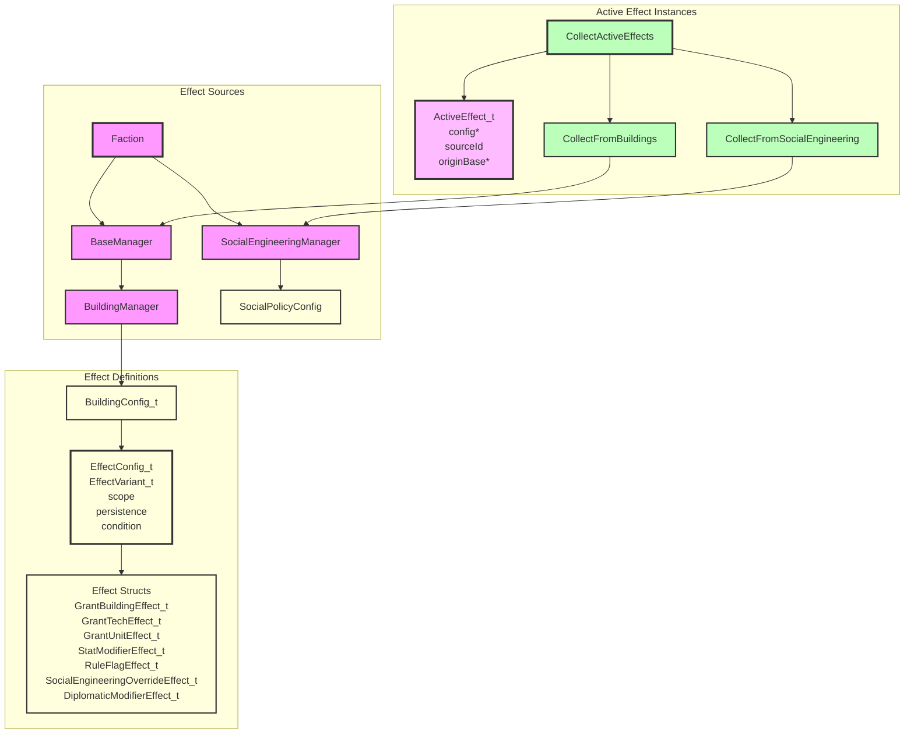

# Effects System Architecture



## Component Overview

### EffectConfig_t
- **Purpose**: A single static effect definition loaded from configuration.
- **Responsibilities**:
  - Holds the typed effect variant via `EffectVariant_t`.
  - Stores metadata: `scope`, `persistence`, and `condition`.
- **Lifetime**: Lives inside static configuration data such as `BuildingConfig_t`.

### EffectVariant_t
- **Purpose**: A `std::variant` of all concrete effect structs.
- **Alternatives**:
  - `GrantBuildingEffect_t`
  - `GrantTechEffect_t`
  - `GrantUnitEffect_t`
  - `StatModifierEffect_t`
  - `RuleFlagEffect_t`
  - `SocialEngineeringOverrideEffect_t`
  - `DiplomaticModifierEffect_t`
  - `TileYieldModifierEffect_t`
  - `UnitBonusTableEffect_t`

### StatModifierEffect_t
- **Purpose**: Modifies any stat identified by `StatId` — both base resources and unit stats.
- **Responsibilities**:
  - Identifies the target stat via `StatId`.
  - Stores an `amount` and a `ModifierOp`.

### StatId
- **Purpose**: Identifies a stat or resource. Defined in `include/lib/effects/EffectEnums.h` so it can be shared across the game and effects systems.
- **Values**:
  - Base resources: `Nutrients`, `Minerals`, `Energy`.
  - Unit stats: `Attack`, `Defense`, `Movement`, `HitPoints`, `DisengageChance`, `Fuel`, `DamageFromOutOfFuel`, `CargoCapacity`, `DifficultTerrainCost`, `CostMultiplier`.
- **Consumers**: `StatModifierEffect_t::stat` and `TileYieldModifierEffect_t::resource`.

### ImprovementType
- **Purpose**: Identifies a tile improvement type for `TileSelector_t`.
- **Values**: `Farm`, `Condenser` (extend as more improvement types are defined).

### TileSelectorKind / TileSelector_t
- **Purpose**: Selects which tiles a `TileYieldModifierEffect_t` applies to.
- **Values**:
  - `BaseTile` — the base's own tile.
  - `HasImprovement` — any worked tile that has a specific `ImprovementType`.

### TileYieldModifierEffect_t
- **Purpose**: Modifies the yield of selected tiles.
- **Responsibilities**:
  - Specifies the `StatId` resource to modify.
  - Selects target tiles via `TileSelector_t`.
  - Applies an `amount` with a `ModifierOp`.

### UnitBonusTableEffect_t
- **Purpose**: Adds an entry to a named bonus table for a unit (e.g. terrain attack bonuses).
- **Responsibilities**:
  - Identifies the table by `tableName` (e.g. `terrain_attack`).
  - Specifies the `key` within the table (e.g. `Forest`).
  - Contributes a `value` that is summed with other matching entries.

### ModifierOp
- **Purpose**: Describes how a stat modifier combines with the running total.
- **Values**:
  - `Add` — adds the amount to the additive base.
  - `MultiplyArithmetic` — treats the amount as a percentage factor relative to the additive base; all arithmetic factors are summed before the geometric step.
  - `MultiplyGeometric` — multiplies the running total by the amount.

### EffectScope_t
- **Purpose**: Describes which entities an effect applies to.
- **Values**:
  - `ThisBase` — only the base the building is constructed in.
  - `AllOwnerBases` — every base owned by the faction.
  - `ThisUnit` — only the unit the component belongs to (all unit component effects use this scope).
  - `FactionUnits` — all units owned by the faction.
  - `FactionGlobal` — the whole faction.
  - `WorldGlobal` — all factions.
  - `ThisPop` — only the specific pop instance the effect belongs to (pop type tile-multiplier effects use this scope). Resolved locally by `Pop::ApplyTileMultipliers` and never enters the base-wide active effects pool — `FilterForBase` always excludes it, same as `ThisUnit`/`FactionUnits`.

### ActiveEffect_t
- **Purpose**: A runtime instance of an effect tied to a specific source.
- **Responsibilities**:
  - Points back to the static `EffectConfig_t`.
  - Records the source id (e.g., building id or social policy id) for UI breakdowns.
  - Records the originating `BaseManager` for `ThisBase`-scoped effects.

### StatBreakdown_t
- **Purpose**: A resolved view of stat modifiers for a single stat.
- **Responsibilities**:
  - Holds a `total` computed from all additive contributions and all multiplicative factors.
  - Records every `Contribution` with its `sourceId`, `amount`, and `op` so the UI can show the breakdown.

### ResolveStatModifiers
- **Purpose**: Resolves a set of `ActiveEffect_t` instances into a `StatBreakdown_t`.
- **Responsibilities**:
  - Collects `StatModifierEffect_t` and `TileYieldModifierEffect_t` effects from the input list.
  - Sorts contributions by `sourceId` for deterministic order.
  - Sums all `Add` contributions into a base value.
  - Combines `MultiplyArithmetic` factors into a single additive percentage: `arithmeticFactor = 1 + (m1-1) + (m2-1) + ...`
  - Combines `MultiplyGeometric` factors into a product: `geometricFactor = m1 * m2 * ...`
  - Computes `total = addTotal * arithmeticFactor * geometricFactor`.
- **Returns**: A `StatBreakdown_t` with `total` and `contributions`.

### FilterByStatId
- **Purpose**: Filters active effects to only `StatModifierEffect_t` instances targeting a given `StatId`.
- **Returns**: A vector of matching `ActiveEffect_t` instances.

### FilterByScope
- **Purpose**: Filters active effects to only those with an exact `EffectScope_t` match.
- **Used by**: `Pop::ApplyTileMultipliers`/`Pop::GetSpecialistOutput` to split a pop type's own effects into the `ThisPop` (tile multiplier) and `ThisBase` (flat generation) subsets before resolving each separately — see Pop Type Effects below.

### FilterForBase
- **Purpose**: Filters active effects to only those that apply to a specific base.
- **Responsibilities**:
  - Includes `ThisBase` effects whose `originBase` is the given base.
  - Includes `AllOwnerBases`, `FactionGlobal`, and `WorldGlobal` effects.
  - Excludes `ThisUnit`, `FactionUnits`, and `ThisPop` effects — these are resolved locally by their own owning instance (unit design or pop) and never apply at the base level.
- **Returns**: A vector of relevant `ActiveEffect_t` instances.

### CollectActiveEffects
- **Purpose**: Gathers all active effects for a faction.
- **Responsibilities**:
  - Takes a `Faction` and the `BuildingRegistry` (from `GameDataContext`) as parameters.
  - Calls `CollectFromBuildings` to gather effects from buildings in all bases.
  - `CollectFromBuildings` uses a two-pass approach:
    1. Append effects from constructed buildings.
    2. Iterate over the collected effects, expanding any `GrantBuildingEffect_t` by looking up the granted building in the passed `BuildingRegistry` and appending its effects. The `sourceId` is chained (e.g., `command_nexus -> network_node`).
  - Calls `CollectFromSocialEngineering` to gather effects from current social engineering selections.
- **Returns**: A vector of `ActiveEffect_t` instances.

### ResourceManager Integration
- **Purpose**: Applies active effects to base resource production.
- **Responsibilities**:
  - `Faction::ProduceBaseResources()` collects active effects once per faction and passes them to each base.
  - `BaseManager::ProduceResources()` uses `FilterForBase` to keep only effects relevant to this base, then appends this base's own pop-generated effects via `CollectFromPops(GetPopContainer(), *this)` (see Pop Type Effects above) before handing the combined list to `ResourceManager`.
  - `ResourceManager::ProduceResources()` stores the effects and uses them when calculating nutrients, minerals, and energy:
    - `StatModifierEffect_t` matching `StatId::Nutrients`, `StatId::Minerals`, or `StatId::Energy` are filtered with `FilterByStatId`, resolved via `ResolveStatModifiers`, and added to the total.
    - `TileYieldModifierEffect_t` with `BaseTile` or `HasImprovement` selectors are resolved via `ResolveStatModifiers`. The raw tile yield is injected as an `Add` contribution so multipliers apply to the actual yield, and `Add` amounts for `HasImprovement` are multiplied by the number of matching worked tiles.
    - `StatId::Econ`/`Labs`/`Psych` are not produced from tiles — `CalculateEcon_`/`CalculateLabs_`/`CalculatePsych_` take the percentage-of-energy split from `EconomyManager` and add any flat `StatModifier` contributions (e.g. specialist pop output) on top via `FilterByStatId`/`ResolveStatModifiers`, the same pattern used by `AllocateEnergy_` when stockpiling each turn.
  - Stored effects are also used by the live `Get*Production()` queries.

### BuildingManager / BaseManager Constructed Buildings
- **Purpose**: Track only buildings actually constructed in a base.
- **Responsibilities**:
  - `GetBuildings()` returns only buildings that were actually constructed in the base.
  - `AddBuilding()` and `DestroyBuilding()` only mutate constructed buildings.
  - Granted buildings are not stored; they are discovered dynamically by the effects system.

### BonusEffectParser

- **Purpose**: Single shared implementation of the JSON `effects` array schema, used by every config parser that defines `EffectConfig_t` entries.
- **Location**: `include/lib/effects/BonusEffectParser.h` / `src/lib/effects/BonusEffectParser.cpp`.
- **Responsibilities**:
  - `ParseStatId`, `ParseRuleFlagId`, `ParseModifierOp`, `ParseEffectScope`, `ParseEffectPersistence`, `ParseImprovementType` — the canonical string&lt;-&gt;enum mappings. These previously existed as separate, drifting copies in `BuildingConfigParser` and `UnitComponentConfigParser`.
  - `ParseNumber` — reads a JSON field as either a number or a numeric string (used for `amount` and `value`).
  - `ParseTileSelector` — parses a `TileSelector_t` from a `selector` JSON object.
  - `ParseEffectConfig` — parses one entry of an `effects` array (`type`/`scope`/`persistence`/`condition`/`parameters`) into an `EffectConfig_t`. Covers every `EffectVariant_t` alternative, including `UnitBonusTableEffect_t` via the `UnitBonusTable` type.
  - `ParseEffects` — parses the `effects` array of a containing JSON object, returning `{}` if absent.
- **Consumers**: `BuildingConfigParser` and `UnitComponentConfigParser` both call `BonusEffectParser::ParseEffects` directly on the building/component JSON object — there is no per-domain effect schema anymore. Adding a new effect source (e.g. a future social-engineering or diplomacy parser) means calling the same function.

### Unit Component Effects

- Unit components (`config/unit_components/*.json`) use the exact same `effects` array shape as buildings — no more `stats`/`flags`/`bonus_tables` shorthand.
- Every unit component effect uses `"scope": "ThisUnit"` explicitly.
- A stat with a flat bonus (e.g. a weapon's base attack) is a `StatModifier` effect with `op: "Add"`. A percentage/multiplicative bonus uses `op: "MultiplyArithmetic"` or `op: "MultiplyGeometric"`.
- A terrain/unit bonus table entry (e.g. `terrain_attack: Forest -> 25`) is a `UnitBonusTable` effect: `parameters: { table_name, key, value }`.
- A unit rule flag (e.g. `flight`) is a `RuleFlag` effect; flags that don't apply are simply omitted rather than written as `false`.

### Pop Type Effects

Pop types (`config/pop_types.json`) also use the standard `effects` array. Unlike buildings/units, a `Pop` has exactly one `PopTypeConfig_t` at a time — there's no stacking of multiple sources — so pop effects are resolved locally rather than through `CollectActiveEffects`/`FilterForBase`. Two distinct scopes are used, resolved differently:

- **`ThisBase` effects (flat output)** — e.g. a Doctor's `+2 psych`, a Technician's `+3 econ`. These are `StatModifier`/`Add` effects targeting `StatId::Nutrients`/`Minerals`/`Energy`/`Econ`/`Labs`/`Psych`. `CollectFromPops(popContainer, base)` gathers the `ThisBase`-scoped effects from every pop in a base (filtered via `FilterByScope`), tags them with `originBase`, and `BaseManager::ProduceResources` merges them into the base's active effects alongside building effects — so one Doctor contributes `+2` psych, three Doctors contribute `+6`. `Pop::GetSpecialistOutput()` (used by `PopContainer::ComputePsychOutput()` for riot/golden-age composition math, and by the population UI) resolves the same `ThisBase` subset independently, per-pop.
- **`ThisPop` effects (tile multipliers)** — e.g. "this pop type's worked-tile nutrient yield is scaled by 1.5×". These are `StatModifier` effects with `op: "MultiplyArithmetic"`/`"MultiplyGeometric"` targeting `StatId::Nutrients`/`Energy`/`Minerals`. `Pop::ApplyTileMultipliers(rawTileYield)` resolves only the `ThisPop` subset of its own config's effects, seeding `ResolveStatModifiers` with the raw tile value as `baseValue` so the multiplier scales that pop's own worked tile. **`ThisPop` effects must never be added to `ThisBase`/flat resolution in the same call** — `ResolveStatModifiers` sums `Add` contributions into the seeded base *before* applying multiplicative factors, so mixing a flat `Add` bonus into a raw-seeded multiplier resolve would incorrectly scale the flat bonus too. This is why `Pop` always splits by `FilterByScope` first instead of resolving a pop type's whole effect list in one call. No current pop type uses a non-1.0 tile multiplier; the mechanism exists for future use (e.g. a Worker variant with a +50% mineral tile bonus):
  ```json
  {
    "type": "StatModifier",
    "scope": "ThisPop",
    "persistence": "Continuous",
    "parameters": { "stat": "minerals", "amount": 1.5, "op": "MultiplyArithmetic" }
  }
  ```

## Design Rationale

- **Typed effect structs**: Replace the previous string-keyed parameter map with strongly typed structs, making effect consumers type-safe and easier to extend.
- **Static config vs. runtime instances**: `EffectConfig_t` lives in immutable configuration data; `ActiveEffect_t` records the runtime context (source, origin base).
- **Moddability**: New effect types can be added by extending `EffectVariant_t` and adding a corresponding parser branch in `BonusEffectParser`.
- **One parser, every source**: `BonusEffectParser` is the single place that knows how to turn JSON into `EffectConfig_t`. Buildings and unit components only differ in which top-level fields they read (`mineral_cost`, `required_techs`, etc.) — the `effects` array itself is parsed identically everywhere.

## Known Gaps

- **`ResolveStatModifiers` needs a seeded base for pure-multiplier stats**: the formula `total = addTotal * arithmeticFactor * geometricFactor` starts `addTotal` at the caller-supplied `baseValue` (default `0.0`). Stats that are only ever modified via `MultiplyGeometric`/`MultiplyArithmetic` (no `Add` contribution) must pass `baseValue = 1.0`, or `total` resolves to `0`. `UnitDesign::GetBaseCost()` does this for `StatId::CostMultiplier`; any future pure-multiplier stat needs the same care.
- **`FactionGlobal`/`WorldGlobal`-scoped `GrantBuildingEffect_t` loses per-base attribution**: when a faction-wide effect grants a building, the granted building's `ThisBase`-scoped effects inherit `originBase = nullptr` (since the granting effect has no origin base of its own) and are then dropped by `FilterForBase` for every base. Not exercised by current data, but will silently no-op the first secret project that grants a building with a per-base bonus.
- **`BuildingConfig_t::IsDiscovered()` uses OR semantics**: a building becomes available once *any* listed `required_techs` entry is discovered, not all of them. May be intentional (alternate prerequisites) but is worth confirming against design intent.
