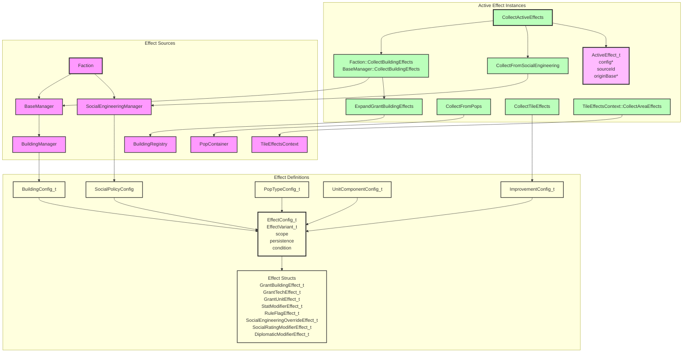

# Effects System Architecture



## Component Overview

### EffectConfig_t
- **Purpose**: A single static effect definition loaded from configuration.
- **Responsibilities**:
  - Holds the typed effect variant via `EffectVariant_t`.
  - Stores metadata: `scope`, `persistence`, and `condition`.
- **Lifetime**: Lives inside static configuration data such as `BuildingConfig_t`.

### EffectVariant_t
- **Purpose**: A `std::variant` of all concrete effect structs.
- **Alternatives**:
  - `GrantBuildingEffect_t`
  - `GrantTechEffect_t`
  - `GrantUnitEffect_t`
  - `StatModifierEffect_t`
  - `RuleFlagEffect_t`
  - `SocialEngineeringOverrideEffect_t`
  - `SocialRatingModifierEffect_t`
  - `DiplomaticModifierEffect_t`

### StatModifierEffect_t
- **Purpose**: Modifies any stat identified by `StatId` — both base resources and unit stats. Also expresses **per-tile yield modifiers** via its optional `selector` (see below); there is no separate tile-yield effect type.
- **Responsibilities**:
  - Identifies the target stat via `StatId`.
  - Stores an `amount` and a `ModifierOp`.
  - Optionally carries a `TileSelector_t selector`. When **absent**, the modifier is either an intrinsic tile yield (`ThisTile` scope) or a flat base/unit modifier (resolved once). When **present**, the modifier applies to each worked tile whose features satisfy the selector — e.g. a building's "+1 mineral to every worked Mine".

### StatId
- **Purpose**: Identifies a stat or resource. Defined in `include/lib/effects/EffectEnums.h` so it can be shared across the game and effects systems.
- **Values**:
  - Base resources: `Nutrients`, `Minerals`, `Energy`.
  - Base output allocated directly rather than via energy split: `Econ`, `Labs`, `Psych`.
  - Unit stats: `Attack`, `Defense`, `Movement`, `HitPoints`, `DisengageChance`, `Fuel`, `DamageFromOutOfFuel`, `CargoCapacity`, `DifficultTerrainCost`, `CostMultiplier`.
  - Population modifier: `GrowthRate` (`AddPercent`, base = 100%) — modifies the faction-wide population growth rate.
  - Terrain mutation: `MoistureTier` — resolved back into `Tile::SetMoisture` by `RecomputeMoisture`; not a runtime-queried stat (see Tile Improvement Effects).
- **Consumers**: `StatModifierEffect_t::stat`. `Defense` is also the target stat for tile-granted combat bonuses (rockiness, fungus, improvements) — see Tile Improvement Effects below.

### TileSelectorKind / TileSelector_t
- **Purpose**: On a `StatModifierEffect_t`, selects which worked tiles the modifier applies to. A tile improvement is identified by its plain string id (`ImprovementConfig_t::id`), matching `Tile::HasImprovement()` — there is no separate improvement-type enum.
- **Values** (`TileSelectorKind`):
  - `BaseTile` — the base's own center tile.
  - `HasImprovement` — any tile that has the improvement named in `selector.improvement` (`std::optional<std::string>`).

### ConditionKind / Condition_t
- **Purpose**: An optional runtime predicate on `EffectConfig_t` (`std::optional<Condition_t> condition`). When present, the effect only applies in a context that satisfies the condition, and is excluded from context-free resolution (base economy, intrinsic unit stats). This is how situational modifiers — e.g. "+25% attack vs a Base", "+25% attack into Forest" — are expressed, replacing the former `UnitBonusTableEffect_t`.
- **Values** (`ConditionKind`):
  - `TargetTileHas` — the targeted tile has the feature id in `condition.value`, matched via `Tile::HasFeature`. One kind covers terrain classification (`Rocky`), river/fungus, and any improvement id — including `Base` (a founded base registers itself as the `Base` improvement) and tile specials (formerly "bonus"/"landmark"). In combat the target is the defender's tile.
- **Evaluation**: `ConditionSatisfied(config, EffectContext_t)` in `ActiveEffect`. `EffectContext_t` carries the runtime target (`targetTile`); combat builds one from the defender. `FilterByStatIdInContext` includes unconditional effects plus condition-satisfied ones; `FilterByStatId`/`FilterFlatByStatId` exclude all condition-carrying effects.

### ModifierOp
- **Purpose**: Describes how a stat modifier combines with the running total.
- **Values**:
  - `Add` — adds the amount to the additive base.
  - `AddPercent` — amount is in percent points (`25` = +25%, `-25` = -25%), matching the UI's bonus display; all `AddPercent` contributions are summed into one arithmetic factor before the geometric step.
  - `MultiplyGeometric` — multiplies the running total by the amount (factor form, e.g. `0.5` halves).

### EffectScope_t
- **Purpose**: Describes which entities an effect applies to.
- **Values**:
  - `ThisBase` — only the base the building is constructed in.
  - `AllOwnerBases` — every base owned by the faction.
  - `ThisUnit` — only the unit the component belongs to (all unit component effects use this scope).
  - `FactionUnits` — all units owned by the faction.
  - `FactionGlobal` — the whole faction.
  - `WorldGlobal` — all factions.
  - `ThisPop` — only the specific pop instance the effect belongs to (pop type tile-multiplier effects use this scope). Resolved locally by `Pop::ApplyTileMultipliers` and never enters the base-wide active effects pool — `FilterForBase` always excludes it, same as `ThisUnit`/`FactionUnits`.
  - `ThisTile` — only the specific tile the effect belongs to (terrain classification, river, fungus, or improvement). Resolved locally via `CollectTileEffects`/`ResolveTileYield`/`ResolveTileDefenseMultiplier` and never enters the base-wide active effects pool — `FilterForBase` always excludes it too. See Tile Improvement Effects below.

### ActiveEffect_t
- **Purpose**: A runtime instance of an effect tied to a specific source.
- **Responsibilities**:
  - Points back to the static `EffectConfig_t`.
  - Records the source id (e.g., building id or social policy id) for UI breakdowns.
  - Records the originating `BaseManager` for `ThisBase`-scoped effects.

### StatBreakdown_t
- **Purpose**: A resolved view of stat modifiers for a single stat.
- **Responsibilities**:
  - Holds a `total` computed from all additive contributions and all multiplicative factors.
  - Records every `Contribution` with its `sourceId`, `amount`, and `op` so the UI can show the breakdown.

### ResolveStatModifiers
- **Purpose**: Resolves a set of `ActiveEffect_t` instances into a `StatBreakdown_t`.
- **Responsibilities**:
  - Collects `StatModifierEffect_t` effects from the input list.
  - Sorts contributions by `sourceId` for deterministic order.
  - Sums all `Add` contributions into a base value.
  - Combines `AddPercent` contributions into a single additive percentage: `arithmeticFactor = 1 + p1/100 + p2/100 + ...`
  - Combines `MultiplyGeometric` factors into a product: `geometricFactor = m1 * m2 * ...`
  - Computes `total = addTotal * arithmeticFactor * geometricFactor`.
- **Returns**: A `StatBreakdown_t` with `total` and `contributions`.

### FilterByStatId
- **Purpose**: Filters active effects to only `StatModifierEffect_t` instances targeting a given `StatId` (including any that carry a tile `selector`).
- **Returns**: A vector of matching `ActiveEffect_t` instances.

### FilterFlatByStatId
- **Purpose**: Like `FilterByStatId`, but **excludes** selector-carrying modifiers (i.e. keeps only flat, non-per-tile stat modifiers). Used for base-level resolution, where per-tile modifiers have already been applied to each worked tile and must not be counted a second time.
- **Returns**: A vector of matching `ActiveEffect_t` instances.

### FilterByScope
- **Purpose**: Filters active effects to only those with an exact `EffectScope_t` match.
- **Used by**: `Pop::ApplyTileMultipliers`/`Pop::GetSpecialistOutput` to split a pop type's own effects into the `ThisPop` (tile multiplier) and `ThisBase` (flat generation) subsets before resolving each separately — see Pop Type Effects below.

### FilterForBase
- **Purpose**: Filters active effects to only those that apply to a specific base.
- **Responsibilities**:
  - Includes `ThisBase` effects whose `originBase` is the given base.
  - Includes `AllOwnerBases`, `FactionGlobal`, and `WorldGlobal` effects.
  - Excludes `ThisUnit`, `FactionUnits`, `ThisPop`, and `ThisTile` effects — these are resolved locally by their own owning instance (unit design, pop, or tile) and never apply at the base level.
- **Returns**: A vector of relevant `ActiveEffect_t` instances.

### CollectActiveEffects
- **Purpose**: Gathers all active effects for a faction.
- **Responsibilities**:
  - Takes only a `const Faction&` as a parameter.
  - Calls `Faction::CollectBuildingEffects`, which calls `BaseManager::CollectBuildingEffects` on every base to collect raw building effects, then passes the combined list to `ExpandGrantBuildingEffects` (along with the faction's `BuildingRegistry` and base list) to expand any `GrantBuildingEffect_t` entries. The `sourceId` is chained (e.g., `command_nexus -> network_node`). `ThisBase`-scoped sub-effects of a faction-wide grant are cloned once per base with the correct `originBase`.
  - Calls `CollectFromSocialEngineering` (delegating to `Faction::CollectSocialEffects`) to gather effects from current social engineering selections.
- **Returns**: A vector of `ActiveEffect_t` instances.

### ResourceManager Integration
- **Purpose**: Applies active effects to base resource production.
- **Responsibilities**:
  - `Faction::ProduceBaseResources()` collects active effects once per faction and passes them to each base.
  - `BaseManager::ProduceResources()` uses `FilterForBase` to keep only effects relevant to this base, then appends this base's own pop-generated effects via `CollectFromPops(GetPopContainer(), *this)` (see Pop Type Effects above) before handing the combined list to `ResourceManager`.
  - `ResourceManager::ProduceResources()` stores the effects and uses them when calculating nutrients, minerals, and energy. There is a **single per-tile pass**: `ResourceManager::ComputeWorked_` sums `WorkerAssignmentManager::ComputeWorkedResources(baseEffects)` (every worker pop's tile) plus the base center tile (worked for free, no pop). Each tile's full yield is resolved once by `TileEffectsContext::ResolveTileYield(tile, isBaseTile, baseEffects)`, which folds in every selector-matching `StatModifier` from `baseEffects`; the pop's tile multipliers then scale that whole yield. Per-tile `Add`/`Multiply` modifiers summed across tiles are mathematically equivalent to the old aggregate-with-counts approach, so no separate delta pass is needed.
    - `CalculateResource_` then adds only **flat** (non-selector) `StatModifier` contributions for `StatId::Nutrients`/`Minerals`/`Energy` via `FilterFlatByStatId`/`ResolveStatModifiers` — selector-carrying modifiers are excluded here because they were already applied per tile.
    - `StatId::Econ`/`Labs`/`Psych` are not produced from tiles — `CalculateEcon_`/`CalculateLabs_`/`CalculatePsych_` take the percentage-of-energy split from `EconomyManager` and add any flat `StatModifier` contributions (e.g. specialist pop output) on top via `FilterByStatId`/`ResolveStatModifiers`, the same pattern used by `AllocateEnergy_` when stockpiling each turn.
  - Stored effects are also used by the live `Get*Production()` queries.

### BuildingManager / BaseManager Constructed Buildings
- **Purpose**: Track only buildings actually constructed in a base.
- **Responsibilities**:
  - `GetBuildings()` returns only buildings that were actually constructed in the base.
  - `AddBuilding()` and `DestroyBuilding()` only mutate constructed buildings.
  - Granted buildings are not stored; they are discovered dynamically by the effects system.

### BonusEffectParser

- **Purpose**: Single shared implementation of the JSON `effects` array schema, used by every config parser that defines `EffectConfig_t` entries.
- **Location**: `include/lib/effects/BonusEffectParser.h` / `src/lib/effects/BonusEffectParser.cpp`.
- **Responsibilities**:
  - `ParseStatId`, `ParseRuleFlagId`, `ParseModifierOp`, `ParseEffectScope`, `ParseEffectPersistence` — the canonical string&lt;-&gt;enum mappings. These previously existed as separate, drifting copies in `BuildingConfigParser` and `UnitComponentConfigParser`.
  - `ParseNumber` — reads a JSON field as either a number or a numeric string (used for `amount` and `value`).
  - `ParseTileSelector` — parses a `TileSelector_t` from a `selector` JSON object. Called by the `StatModifier` branch when a `selector` field is present, making that modifier a per-tile yield modifier.
  - `ParseEffectConfig` — parses one entry of an `effects` array (`type`/`scope`/`persistence`/`condition`/`parameters`) into an `EffectConfig_t`. Covers every `EffectVariant_t` alternative, and parses the optional typed `condition` object via `ParseCondition`.
  - `ParseEffects` — parses the `effects` array of a containing JSON object, returning `{}` if absent.
- **Consumers**: `BuildingConfigParser` and `UnitComponentConfigParser` both call `BonusEffectParser::ParseEffects` directly on the building/component JSON object — there is no per-domain effect schema anymore. Adding a new effect source (e.g. a future social-engineering or diplomacy parser) means calling the same function.

### Unit Component Effects

- Unit components (`config/unit_components/*.json`) use the exact same `effects` array shape as buildings — no more `stats`/`flags`/`bonus_tables` shorthand.
- Every unit component effect uses `"scope": "ThisUnit"` explicitly.
- A stat with a flat bonus (e.g. a weapon's base attack) is a `StatModifier` effect with `op: "Add"`. A percentage bonus uses `op: "AddPercent"` (amount in percent points, e.g. `25`); a compounding factor uses `op: "MultiplyGeometric"`.
- A situational combat bonus (e.g. "+25% attack into Forest" or "+25% attack vs a Base") is a `StatModifier` on `attack`/`defense` with `op: "AddPercent"`, `amount: 25`, plus a `condition` (e.g. `{ "kind": "TargetTileHas", "value": "Forest" }`). It is resolved per-combat via `Unit::GetAttackAgainst`, not through the context-free `GetAttack`.
- A unit rule flag (e.g. `flight`) is a `RuleFlag` effect; flags that don't apply are simply omitted rather than written as `false`.

### Pop Type Effects

Pop types (`config/pop_types.json`) also use the standard `effects` array. Unlike buildings/units, a `Pop` has exactly one `PopTypeConfig_t` at a time — there's no stacking of multiple sources — so pop effects are resolved locally rather than through `CollectActiveEffects`/`FilterForBase`. Two distinct scopes are used, resolved differently:

- **`ThisBase` effects (flat output)** — e.g. a Doctor's `+2 psych`, a Technician's `+3 econ`. These are `StatModifier`/`Add` effects targeting `StatId::Nutrients`/`Minerals`/`Energy`/`Econ`/`Labs`/`Psych`. `CollectFromPops(popContainer, base)` gathers the `ThisBase`-scoped effects from every pop in a base (filtered via `FilterByScope`), tags them with `originBase`, and `BaseManager::ProduceResources` merges them into the base's active effects alongside building effects — so one Doctor contributes `+2` psych, three Doctors contribute `+6`. `Pop::GetSpecialistOutput()` (used by `PopContainer::ComputePsychOutput()` for riot/golden-age composition math, and by the population UI) resolves the same `ThisBase` subset independently, per-pop.
- **`ThisPop` effects (tile multipliers)** — e.g. "this pop type's worked-tile nutrient yield is scaled by +50%". These are `StatModifier` effects with `op: "AddPercent"`/`"MultiplyGeometric"` targeting `StatId::Nutrients`/`Energy`/`Minerals`. `Pop::ApplyTileMultipliers(rawTileYield)` resolves only the `ThisPop` subset of its own config's effects, seeding `ResolveStatModifiers` with the raw tile value as `baseValue` so the multiplier scales that pop's own worked tile. **`ThisPop` effects must never be added to `ThisBase`/flat resolution in the same call** — `ResolveStatModifiers` sums `Add` contributions into the seeded base *before* applying multiplicative factors, so mixing a flat `Add` bonus into a raw-seeded multiplier resolve would incorrectly scale the flat bonus too. This is why `Pop` always splits by `FilterByScope` first instead of resolving a pop type's whole effect list in one call. No current pop type uses a non-1.0 tile multiplier; the mechanism exists for future use (e.g. a Worker variant with a +50% mineral tile bonus):
  ```json
  {
    "type": "StatModifier",
    "scope": "ThisPop",
    "persistence": "Continuous",
    "parameters": { "stat": "minerals", "amount": 50, "op": "AddPercent" }
  }
  ```

### Tile Improvement Effects

- **Purpose**: Unifies every "thing on a tile" — terrain classification (Rockiness, Moisture), natural features (River, Fungus), player-built improvements (Farm, Mine, Bunker), tile specials that were formerly separate "bonus"/"landmark" slots, and a founded Base — behind one config type, since they all answer the same two questions: what effects do they grant, and what do they exclude. Defined in `include/game/map/ImprovementConfigParser.h` / `config/improvements.json`.
- **`ImprovementConfig_t`**: `id`, `name`, `description`, `mineralCost`, `requiredTech`, `excludes` (other feature ids that can't coexist with this one on a tile), `radius` (default `0`), `frequency`, `spritePath`, `effects` (the standard `EffectConfig_t` vector, parsed via `BonusEffectParser::ParseEffects`).
- **How a tile holds features**: improvements are stored directly as non-owning `const ImprovementConfig_t*` in `Tile::GetImprovements()` (the same pattern `BuildingManager` uses for `BuildingConfig_t*`); the caller resolves the id via `ImprovementRegistry` (the funnel is `TileEffectsContext`). Terrain stays as typed enums/bools on `Tile` — world-gen and rendering need the exhaustive/exclusive guarantee (every tile is *exactly one* of Flat/Rolling/Rocky) — and is exposed for effect resolution as string ids via `Tile::GetTerrainFeatureIds()` (Rockiness, Moisture, River, Fungus). `Tile::HasFeature(id)` answers "is this feature present?" across both (terrain strings + improvement ids) for conditions/selectors/`CanBuildImprovement`.
- **`CollectTileEffects(tile, improvementRegistry)`**: collects a tile's own `ThisTile`-scoped effects into a flat `ActiveEffect_t` list (sourceId = the feature's id) in two passes — terrain ids from `GetTerrainFeatureIds()` looked up via `registry.Find`, plus each `GetImprovements()` config read directly (no lookup). Mirrors `CollectPopEffects`/`CollectUnitEffects`. Only ever resolves a tile's *own* effects (radius 0) — it has no `WorldMap` to look at neighbors.
- **`radius` (aura effects)**: most improvements only affect their own tile (`radius = 0`, e.g. Bunker/Rocky/Fungus/Base). An improvement with `radius > 0` also affects any tile within that many tiles (Manhattan distance) — e.g. `Sensor` (`radius: 2`) projects its `+25%` defense bonus, `Mirror` (`radius: 2`) projects its `+1 energy` bonus, and `Condenser` (`radius: 1`) projects its `+1 moisture_tier` shift to their respective radiuses. `CollectAreaEffects(tile, worldMap, registry)` is the shared implementation: it starts from `CollectTileEffects(tile, registry)` (the tile's own features) and then scans every tile within the registry's max configured `radius`, appending any improvement whose `radius` reaches the target tile.
- **`CollectAreaEffects(tile, worldMap, registry)`**: the single function powering all three radius-aware resolvers (defense, yield, and moisture recompute). `WorldMap` is needed to look up neighboring tiles.
- **`ResolveTileDefenseMultiplier(tile, worldMap, improvementRegistry)`**: `ResolveStatModifiers(FilterByStatId(CollectAreaEffects(...), Defense), 1.0).total`.
- **`ResolveTileYield(tile)`**: resolves `Nutrients`/`Minerals`/`Energy` from `CollectAreaEffects` (so a nearby Mirror's energy aura IS included). Energy is seeded from `GetElevationEnergySeed()` before resolving so River/improvement `Add` effects layer on top. Used where only intrinsic + area yield is wanted (e.g. the auto-assign tile scorer, `BaseWorkableAreaDisplay`).
- **`ResolveTileYield(tile, isBaseTile, baseEffects)`**: the full worked-tile yield. Starts from `CollectAreaEffects`, then appends every `baseEffects` `StatModifier` whose `selector` matches this tile (`BaseTile` matches iff `isBaseTile`; `HasImprovement` matches iff `tile.HasImprovement(id)`), and resolves each resource over the combined list. This is the single entry point `WorkerAssignmentManager::ComputeWorkedResources` and `ResourceManager::ComputeWorked_` use for a tile's pre-pop-multiplier yield.
- **`StatId::MoistureTier`** (`"moisture_tier"` in JSON): integer tile tier (Arid=0, Moist=1, Wet=2), used exclusively by `RecomputeMoisture` as a terrain-mutation target. Not queryable at runtime — it is a seed for `SetMoisture()`, not a cached stat. `Condenser`'s `+1 moisture_tier Add` effect flows through `RecomputeMoisture` to actually call `Tile::SetMoisture()`, making the change visible in rendering and tile-yield resolution.
- **`Tile::m_baseMoisture`/`GetBaseMoisture()`/`SetBaseMoisture()`**: the natural, un-condensed terrain truth set once by `WorldGenerator`. `m_moisture`/`GetMoisture()`/`SetMoisture()` is the current/effective value (what rendering and `GetTerrainFeatureIds()` see), mutated by `RecomputeMoisture` from the base + nearby Condensers. World-gen sets both to the same initial random value; `RecomputeMoisture` derives `m_moisture` from `m_baseMoisture` fresh each time — never increments/decrements in place — so overlapping Condensers and add/remove order can never cause drift.
- **`RecomputeMoisture(tile, worldMap, registry)`**: re-derives `tile`'s effective moisture from `tile.GetBaseMoisture()` + any `moisture_tier` `Add` effects from `CollectAreaEffects`, clamps to `[Arid, Wet]`, calls `tile.SetMoisture()`. Single function, always called from the current live world state — idempotent, consistent with any number of overlapping Condensers.
- **`AddImprovementWithEffects` / `RemoveImprovementWithEffects`**: the single safe entry point for adding/removing any improvement. After the raw `Tile::AddImprovement/RemoveImprovement`, calls `RecomputeMoisture` for every tile within the improvement's own `radius` (including the host tile) — so a Condenser addition immediately updates moisture on itself and 8 neighbors, and removal automatically reverts them. `BaseManager` uses this for `"Base"` (radius 0, a no-op recompute, but consistent). When a future improvement-construction UI is added, it must go through these functions.
- **`CanBuildImprovement(tile, candidateConfig)`**: returns false if any id in `candidateConfig.excludes` is present on the tile per `tile.HasFeature(id)` (e.g. Farm excludes Rocky). Exposed as a resolver only — no improvement-construction UI/flow exists yet to enforce it.
- **"Base" as an improvement**: `BaseManager`'s constructor calls `AddImprovementWithEffects(m_tile, "Base", worldMap, registry)`, so a founded base grants its own `ThisTile` defense bonus (`config/improvements.json`'s `Base` entry, currently a placeholder `+100%`) through the exact same mechanism as Bunker/Rocky/Fungus. This is also why `BaseManager` now holds a non-const `Tile&` (previously `const Tile&`), `Faction::CreateBase` takes a non-const `Tile*`, and `Faction::CreateBase` takes a non-const `WorldMap&`.
- **Building bonuses to worked improvements**: a building can boost worked tiles that have a given improvement by attaching a `HasImprovement` `selector` to a `StatModifier` (e.g. Nutrient Bank's "+1 nutrients to worked Farms"). The selector's `improvement` is the plain `ImprovementConfig_t::id` string and is matched against `Tile::HasImprovement()` during the per-tile yield resolve — the same string-id lookup used everywhere else, with no separate improvement-type enum.

## Design Rationale

- **Typed effect structs**: Replace the previous string-keyed parameter map with strongly typed structs, making effect consumers type-safe and easier to extend.
- **Static config vs. runtime instances**: `EffectConfig_t` lives in immutable configuration data; `ActiveEffect_t` records the runtime context (source, origin base).
- **Moddability**: New effect types can be added by extending `EffectVariant_t` and adding a corresponding parser branch in `BonusEffectParser`.
- **One parser, every source**: `BonusEffectParser` is the single place that knows how to turn JSON into `EffectConfig_t`. Buildings and unit components only differ in which top-level fields they read (`mineral_cost`, `required_techs`, etc.) — the `effects` array itself is parsed identically everywhere.

## Known Gaps

- **`ResolveStatModifiers` needs a seeded base for pure-multiplier stats**: the formula `total = addTotal * arithmeticFactor * geometricFactor` starts `addTotal` at the caller-supplied `baseValue` (default `0.0`). Stats that are only ever modified via `MultiplyGeometric`/`AddPercent` (no `Add` contribution) must pass `baseValue = 1.0`, or `total` resolves to `0`. `UnitDesign::GetBaseCost()` does this for `StatId::CostMultiplier`; any future pure-multiplier stat needs the same care.
- **`BuildingConfig_t::IsDiscovered()` uses OR semantics**: a building becomes available once *any* listed `required_techs` entry is discovered, not all of them. May be intentional (alternate prerequisites) but is worth confirming against design intent.
- **No combat system consumes `ResolveTileDefenseMultiplier` yet**: `Unit::GetDefense()` still returns only the unit's own design stat. Wiring an actual attack/defense resolution (and deciding how/whether it multiplies the attacker's tile bonus too) is a separate, larger feature.
- **No improvement-construction flow consumes `CanBuildImprovement` yet**: `Tile::AddImprovement()` has no caller besides `BaseManager`'s `"Base"` wiring — there's no UI/production path for the player to actually build Farm/Mine/Bunker, so the `excludes` exclusivity check is unenforced in practice today.
- **`Base`'s defense bonus value (+100%) is an unconfirmed placeholder**, same as the other round test-data numbers (`test_tech_1`, etc.) in this repo — needs real balance input.
