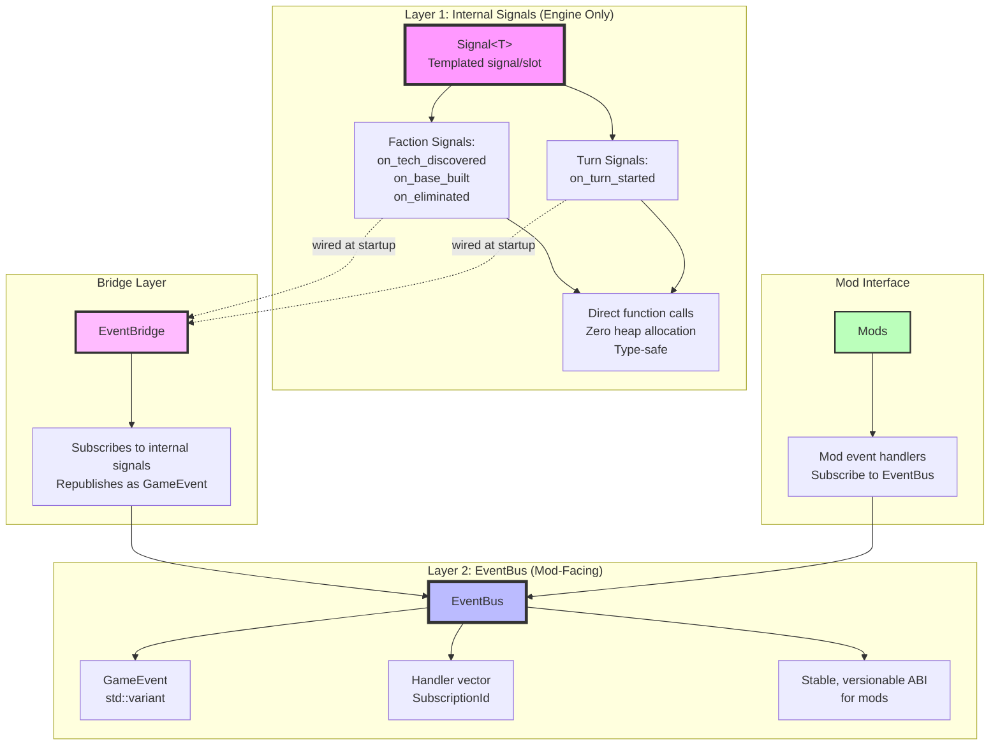

# Event System Architecture

The event system provides a two-layer architecture for communication between engine components and mods.



## Component Overview

### Signal<T> (Layer 1)
- **Purpose**: Internal engine-only signal/slot mechanism
- **Characteristics**:
  - Templated on event type
  - Zero heap allocation (small-buffer optimization)
  - Direct function calls, no indirection
  - Type-safe at compile time
- **Usage**: Engine modules wire directly to each other at startup
  - Combat resolver connects to faction.on_eliminated for victory checks
  - UI connects to faction.on_tech_discovered for tech popups
- **Performance**: Fast, no string lookups, no variant boxing
- **Mod Access**: None - this is engine-internal only

### EventBus (Layer 2)
- **Purpose**: Mod-facing event bus with stable ABI
- **Characteristics**:
  - Uses tagged std::variant (GameEvent) for type safety
  - Stable, versionable ABI that mods can depend on
  - Subscription-based handler management
  - Synchronous dispatch
- **API**:
  - `Subscribe(Handler)`: Subscribe to all events with a single handler
  - `Subscribe<T>(Handler)`: Subscribe to specific event type only
  - `Unsubscribe(SubscriptionId)`: Remove a subscription
  - `Publish(GameEvent)`: Publish an event to all handlers
- **Reentrancy contract** (part of the mod-facing ABI): a handler may `Subscribe` or
  `Unsubscribe` during dispatch. `Publish` snapshots the subscription ids and re-looks each one
  up before invoking it, so a handler removed earlier in the same dispatch is **not** called, and
  one added during dispatch does **not** see the in-flight event — it sees the next one. Iterating
  the live handler list instead was undefined behaviour: subscribing reallocates the vector and
  unsubscribing erases from it. `Signal::Emit` gives the same guarantee.
- **Mod Access**: Full - this is the primary mod interface for events

### EventBridge
- **Purpose**: Bridges internal signals to the mod-facing EventBus
- **Characteristics**:
  - Subscribes to all internal signals at startup
  - Converts internal signal events to GameEvent variants
  - Republishes events on the EventBus
- **Current Bridges**:
  - `faction.on_tech_discovered` → `EvTechDiscovered`
  - `faction.on_base_built` → `EvBaseBuilt`
  - `faction.on_eliminated` → `EvFactionElim`
  - `turn_loop.on_turn_started` → `EvTurnStarted`
- **Pattern**: One-way bridge from internal signals to EventBus (mods Publish, don't receive internal signals)

## Design Rationale

### Two-Layer Architecture
- **Layer 1 (Signal<T>)**: Optimized for engine performance
  - No overhead for internal communication
  - Compile-time type safety
  - Zero heap allocation
- **Layer 2 (EventBus)**: Optimized for mod stability
  - Stable ABI across engine versions
  - Runtime type checking via std::variant
  - Single subscription point for mods

### Separation of Concerns
- Engine modules use fast, type-safe signals internally
- Mods use stable, versioned event bus
- EventBridge isolates mods from internal engine changes
- Internal signal changes don't break mod ABI

### Performance Characteristics
- Internal signals: Zero overhead, direct calls
- EventBridge: One allocation per event (variant construction)
- EventBus: O(n) handler dispatch where n = number of subscribers
- Typical use: Few internal signal listeners, few mod subscribers

### Extensibility
- New internal signals: Add to engine modules, wire in EventBridge
- New event types: Add to GameEvent variant, update EventBridge
- New mod handlers: Subscribe via EventBus API
- No ABI breakage for adding new event types (variant is extensible)

## Integration Points

### Engine Module Wiring
At startup, engine modules connect directly to each other:
```cpp
// Example: Combat resolver wiring
combatResolver.OnUnitDestroyed.Connect([](UnitId id) {
    faction.on_unit_lost.Emit(id);
});
```

### EventBridge Initialization
EventBridge is constructed with GameState and EventBus, then wires all signals:
```cpp
EventBridge bridge(gameState, eventBus);
// Automatically subscribes to all internal signals
```

### Mod Subscription
Mods Subscribe to EventBus for events:
```cpp
auto id = eventBus.Subscribe<EvTechDiscovered>(
    [](const EvTechDiscovered& e) {
        // Handle tech discovery
    }
);
```

## Event Flow

### Internal Signal Flow
1. Engine module emits signal: `faction.on_tech_discovered.Emit(techId)`
2. Direct call to all connected slots
3. Slots execute immediately (synchronous)
4. No heap allocation, no variant boxing

### Mod Event Flow
1. Engine module emits internal signal
2. EventBridge slot receives signal
3. EventBridge creates GameEvent variant
4. EventBridge publishes to EventBus
5. EventBus dispatches to all mod handlers
6. Mod handlers execute (synchronous)

## Future Considerations

### Performance Optimization
- Consider async dispatch for mod events if handler count grows
- Profile EventBus dispatch overhead
- Consider event batching for high-frequency events

### Event Filtering
- Add event filtering support to reduce handler calls
- Allow mods to Subscribe to filtered event streams
- Consider event priority levels

### Event History
- Consider event logging/replay for debugging
- Event history for mod debugging tools
- Event replay for testing scenarios
