# Faction System Architecture

```mermaid
graph TB
    subgraph "Engine Integration"
        Engine[Engine]
        TurnProcessor[TurnProcessor]
        GameState[GameState]
    end

    subgraph "Faction System"
        Faction[Faction]
        FactionManager[FactionManager]
    end

    subgraph "Faction Identity"
        FactionIdentity[FactionIdentity]
        FactionName[FactionName<br/>string]
        FactionLeader[FactionLeader<br/>string]
        FactionColor[FactionColor<br/>enum]
        FactionLogo[FactionLogo<br/>texture ID]
    end

    subgraph "AI Profile"
        AIProfile[AIProfile]
        Personality[Personality<br/>aggressive, peaceful, etc.]
        Priorities[Priorities<br/>research, economy, military]
        BehaviorModifiers[BehaviorModifiers<br/>weights for decisions]
    end

    subgraph "Economy Subsystem"
        Economy[Economy]
        Minerals[Minerals<br/>int]
        Energy[Energy<br/>int]
        Credits[Credits<br/>int]
        TradeRoutes[TradeRoutes<br/>vector]
        IncomeCalculator[IncomeCalculator]
    end

    subgraph "Military Subsystem"
        Military[Military]
        Units[Units<br/>vector<Unit>]
        Bases[Bases<br/>vector<Base>]
        UnitFactory[UnitFactory]
        BaseManager[BaseManager]
    end

    subgraph "Base Subsystem"
        Base[Base]
        WorkerAssignmentManager[WorkerAssignmentManager<br/>popId→tileCoord map]
        PopulationManager[PopulationManager]
    end

    subgraph "Research Subsystem"
        Research[Research]
        TechTree[TechTree]
        CurrentTechs[CurrentTechs<br/>set<TechID>]
        ResearchQueue[ResearchQueue<br/>queue<TechID>]
        ResearchProgress[ResearchProgress<br/>map<TechID, int>]
    end

    subgraph "Diplomacy Subsystem"
        Diplomacy[Diplomacy]
        Relations[Relations<br/>map<FactionID, Relation>]
        Treaties[Treaties<br/>vector<Treaty>]
        AttitudeModifiers[AttitudeModifiers]
    end

    subgraph "Data Structures"
        Unit[Unit]
        Base[Base]
        Tech[Tech]
        Treaty[Treaty]
        Relation[Relation]
    end

    Engine --> GameState
    Engine --> TurnProcessor
    Engine --> FactionManager
    
    TurnProcessor --> FactionManager
    FactionManager --> Faction
    
    Faction --> FactionIdentity
    Faction --> AIProfile
    Faction --> Economy
    Faction --> Military
    Faction --> Research
    Faction --> Diplomacy
    
    FactionIdentity --> FactionName
    FactionIdentity --> FactionLeader
    FactionIdentity --> FactionColor
    FactionIdentity --> FactionLogo
    
    AIProfile --> Personality
    AIProfile --> Priorities
    AIProfile --> BehaviorModifiers
    
    Economy --> Minerals
    Economy --> Energy
    Economy --> Credits
    Economy --> TradeRoutes
    Economy --> IncomeCalculator
    
    Military --> Units
    Military --> Bases
    Military --> UnitFactory
    Military --> BaseManager
    
    Research --> TechTree
    Research --> CurrentTechs
    Research --> ResearchQueue
    Research --> ResearchProgress
    
    Diplomacy --> Relations
    Diplomacy --> Treaties
    Diplomacy --> AttitudeModifiers
    
    Military --> Unit
    Military --> Base
    Base --> WorkerAssignmentManager
    Base --> PopulationManager
    PopulationManager --> WorkerAssignmentManager
    Research --> Tech
    Diplomacy --> Treaty
    Diplomacy --> Relation

    style Faction fill:#f9f,stroke:#333,stroke-width:4px
    style FactionManager fill:#fbf,stroke:#333,stroke-width:3px
    style FactionIdentity fill:#bbf,stroke:#333,stroke-width:2px
    style AIProfile fill:#bbf,stroke:#333,stroke-width:2px
    style Economy fill:#bfb,stroke:#333,stroke-width:2px
    style Military fill:#bfb,stroke:#333,stroke-width:2px
    style Research fill:#bfb,stroke:#333,stroke-width:2px
    style Diplomacy fill:#bfb,stroke:#333,stroke-width:2px
```

## Component Overview

### FactionVector
- **Purpose**: Stores all Faction instances in the game
- **Implementation**: `std::vector<std::unique_ptr<Faction>>` owned by GameState
- **Responsibilities**:
  - Store all factions
  - Provide indexed access
- **Interaction**: Owned by GameState, accessed by TurnProcessor

### FactionFactory
- **Purpose**: Creates Faction instances from configuration or parameters
- **Responsibilities**:
  - Create Faction instances with proper initialization
  - Load faction data from configuration files
  - Validate faction creation parameters
- **Interaction**: Used during game initialization to populate FactionVector
- **Pattern**: Similar to TurnStageFactory, follows factory pattern for object creation

### Faction
- **Purpose**: Represents a single faction in the game (player or AI)
- **Responsibilities**:
  - Coordinate all faction subsystems
  - Provide unified interface for faction operations
  - Manage faction-specific state
  - Handle turn processing for the faction
- **Composition**: Owns FactionIdentity, AIProfile, Economy, Military, Research, Diplomacy
- **Signals**: Emits internal signals for engine communication:
  - `on_tech_discovered`: Fired when a technology is discovered
  - `on_base_built`: Fired when a new base is constructed
  - `on_eliminated`: Fired when the faction is eliminated from the game

### FactionIdentity
- **Purpose**: Static faction information (name, leader, visual identity)
- **Responsibilities**:
  - Store faction name and leader name
  - Manage faction color for UI rendering
  - Reference faction logo texture
- **Rationale**: Separated to allow easy faction customization and modding

### AIProfile
- **Purpose**: Defines AI behavior and decision-making parameters
- **Responsibilities**:
  - Store personality traits (aggressive, peaceful, etc.)
  - Define priority weights for different game aspects
  - Provide behavior modifiers for AI decisions
- **Rationale**: Separated to allow different AI personalities and easy AI tuning

### Economy
- **Purpose**: Manages faction's economic resources and income
- **Responsibilities**:
  - Track minerals, energy, and credits
  - Manage trade routes
  - Calculate income per turn
  - Handle resource spending
- **Rationale**: Economic logic is complex and should be isolated for testing

### Military
- **Purpose**: Manages faction's units and bases
- **Responsibilities**:
  - Own and manage all Unit instances
  - Own and manage all Base instances
  - Provide unit creation via UnitFactory
  - Provide base management via BaseManager
- **Rationale**: Military logic is substantial and benefits from separation

### Research
- **Purpose**: Manages faction's technological progress
- **Responsibilities**:
  - Track discovered technologies
  - Manage research queue
  - Track research progress for current techs
  - Interact with TechTree for tech dependencies
- **Rationale**: Research system is complex with its own data structures

### Diplomacy
- **Purpose**: Manages faction's relationships with other factions
- **Responsibilities**:
  - Track relations with all other factions
  - Manage active treaties
  - Apply attitude modifiers
  - Handle diplomatic actions
- **Rationale**: Diplomacy involves complex state and interactions between factions

### Base System
- **Purpose**: Represents individual bases that provide resources for a faction
- **Components**:
  - `Base`: Main base class managing population, buildings, and resources
  - `Population`: Abstract base class for population implementations
  - `PopulationManager`: API surface for the population component; manages pop composition, growth, and riot state for a single base
  - `WorkerAssignmentManager`: Maps stable pop IDs to workable tile coordinates; prunes stale assignments when population changes; computes aggregate worked resources via a tile-lookup callable
  - `PopFactory`: Creates individual `Pop` instances from config (looked up via `PopTypeRegistry`)
  - `RiotCalculator`: Tracks drone riot state and emits `will_riot`, `is_rioting`, and `riot_ended` signals
  - `GrowthCalculator`: Accumulates nutrient surplus across turns and emits `on_growth` / `on_starvation` when thresholds are crossed
  - `WorkerRoles`: Enum defining worker roles (Worker, Lab, Psych, Econ, Drone, Talent)
  - `Buildings`: Collection of building IDs in the base
  - `TileResources`: Resources (nutrients, energy, minerals) from worked tiles
  - `Position`: Map coordinates (x, y) used to calculate the workable tile radius
  - `StablePopId`: Each `Pop` carries a monotonically assigned integer ID (set by `PopContainer`), preserved across `ConvertTo()` type changes
  - `TradeRoutes`: Collection of trade routes providing additional energy
- **Responsibilities**:
  - Manage population growth and size (1-8 initially, expandable with buildings)
  - Expose the set of workable tiles via `GetWorkableTilePositions()` (5×5 grid minus corners, Manhattan distance ≤ 3 within [-2,2] offsets, 20 tiles, excluding own tile). Tiles already worked by another base or occupied by an enemy unit cannot be worked (enemy-unit check is TODO pending unit implementation).
  - Delegate worker-to-tile assignment tracking to `WorkerAssignmentManager` (owned as `m_workerAssignments`)
  - Connect `PopulationManager::on_pop_gained` and `on_pop_lost` to `WorkerAssignmentManager::OnPopulationChanged()` to automatically prune invalid assignments
  - Assign workers to different roles (tiles, labs, psych, econ, drones, talents)
  - Track buildings constructed in the base
  - Calculate resource output based on worker assignments:
    - Workers/Talents work tiles (produce nutrients, energy, minerals)
    - Lab workers contribute to research
    - Psych workers contribute to psych
    - Econ workers produce energy directly
    - Drones produce nothing
  - Manage trade routes for additional energy
  - Provide resource calculation methods (CalculateNutrients_, CalculateEnergyProduction_, CalculateMinerals_)
  - Evaluate drone riot conditions and manage riot lifecycle via signals:
    - `will_riot`: emitted during `AddPop()` when the new composition triggers drone riot but the base is not yet rioting
    - `is_rioting`: emitted at end of turn (`CheckRiotEndOfTurn`) when riot conditions are still met; sets `m_bRioting = true`
    - `riot_ended`: emitted at end of turn when riot conditions are no longer met and the base was previously rioting
- **Rationale**: Bases are the primary source of resources and require complex management of population with specialized worker roles, buildings, and tile resources

## Integration with Engine

### Turn Processing Flow
1. TurnProcessor iterates over FactionVector in GameState
2. For each Faction, TurnProcessor calls Faction::ProcessTurn()
3. Faction delegates to subsystems:
   - Economy::CalculateIncome()
   - Military::UpdateUnits()
   - Research::AdvanceResearch()
   - Diplomacy::UpdateRelations()
4. AIProfile guides AI decision-making during turn

### Engine Ownership
- Engine owns GameState
- GameState owns FactionVector (vector of unique_ptr<Faction>)
- Each Faction owns its subsystems
- FactionFactory is used during initialization to create factions
- This hierarchy ensures proper lifetime management

### Modding Integration
- FactionFactory loads faction data from configuration files
- FactionIdentity can be customized via config
- AIProfile can be customized via config
- TechTree can be extended via mods
- HookSystem can inject custom logic into turn processing

## Design Rationale

### Separation of Concerns
- Each subsystem has a single, well-defined responsibility
- Follows Single Responsibility Principle
- Makes testing and maintenance easier

### Moddability
- Static data (FactionIdentity, AIProfile) separated from dynamic state
- Easy to add new factions via configuration
- AI profiles can be customized without code changes

### Extensibility
- New subsystems can be added to Faction without affecting existing code
- Open/Closed Principle: open for extension, closed for modification
- Interface-based design allows different implementations

### Performance Considerations
- FactionManager provides O(1) faction lookup by ID
- Subsystems can be updated independently
- Data-oriented design possible for Units and Bases collections
