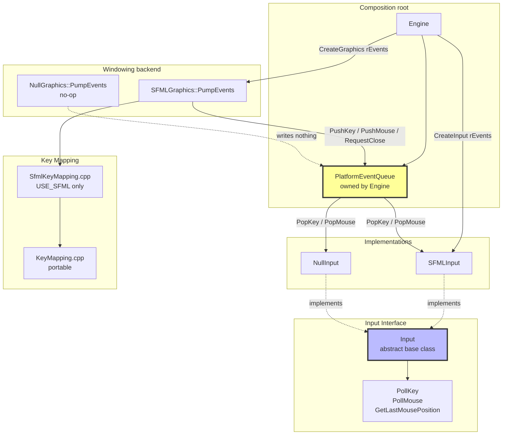

# Input System Architecture

## The seam

`PlatformEventQueue` is the only thing the windowing backend and the input backend share. The
composition root (`Engine`) owns one and passes it to both factories.

This is what makes the two independently substitutable. They previously communicated through
file-scope `std::deque`s behind free `PushPendingKeyEvent_t` / `PopPendingKeyEvent` functions,
filled from inside `SFMLGraphics::ProcessEvents_` — so `NullGraphics` paired with `SFMLInput`
produced a live `Input` object that never saw a key, the pairing was a fiction, and multi-window
use was impossible. Tests also shared one mutable process-wide queue.

`Graphics::PumpEvents()` is separate from `Display()` for the same reason: pumping used to hang
off the render call, which made rendering a prerequisite for receiving a keystroke.

## Component Overview

### PlatformEventQueue
- **Purpose**: Buffered keyboard/mouse events and the window-close request, between whatever
  pumps a window and whatever implements `Input`.
- **Producer side** (`PushKey`, `PushMouse`, `RequestClose`): called by the windowing backend.
- **Consumer side** (`PopKey`, `PopMouse`, `TakeCloseRequest`): called by `Input` and by the
  frame loop.
- **`GetLastMousePosition()`**: where the pointer was last seen, for consumers that need a
  position rather than an event (edge-scrolling). Empty until the first mouse event arrives —
  it is an `optional`, not a sentinel coordinate.
- Not thread-safe: pumped and drained from the same frame loop.

### Input (Abstract Base Class)
- **Purpose**: Read buffered input, without knowing where it came from.
- **Virtual Methods**:
  - `PollKey()` → `optional<KeyEvent_t>`: one buffered key event, or empty. Never blocks.
  - `PollMouse()` → `optional<MouseEvent_t>`: likewise.
  - `GetLastMousePosition()` → `optional<MousePosition_t>`.
- **Whole events, not keys**: `PollKey` returns `KeyEvent_t` including its `ModifierState_t`.
  The old `CaptureKey` popped a whole event and returned only the key, so any caller that needed
  a chord had to use the misnamed `CaptureKeyAsync` and any caller that used `CaptureKey`
  silently lost Ctrl/Alt/Shift.
- **Poll, not async**: the old `*Async` pair scheduled nothing and behaved differently per
  backend — SFML invoked the callback only when an event existed, Null always blocked on stdin
  and then invoked it with a synthesized `Key_t::Unknown`. Callers drain in a `while` loop.

### SFMLInput / NullInput
Both read the shared queue and nothing else; the only difference is the log line. `NullInput` is
a genuine null object: it never blocks and never synthesizes an event. It was previously a
blocking console prompt selected as *the* non-SFML `Input`, which stalled the frame loop on the
first tick of any headless run.

### KeyMapping
- `KeyMapping.cpp` (portable, in `ac-core`): `KeyFromAscii`, `KeyToAscii`, `Key_tToString`.
- `SfmlKeyMapping.cpp` (`USE_SFML` only, in the executable): `KeyFromSfKey`,
  `MouseButtonFromSfButton`, `GetModifierState`. Split out so the portable half is testable
  without linking SFML.
- `Key_tToString` derives names from the enumerator via `magic_enum`, except `Num0`–`Num9`,
  which display as bare digits. The hand-written switch it replaced had silently omitted
  `F1`–`F12` while `KeyFromSfKey` mapped them.
- `KeyFromSfKey` returns `nullopt` for an unmapped key. It used to return `Key_t::Unknown`, so
  every caller that correctly tested the optional pushed a `KeyEvent_t{Unknown}` for Tab,
  Backspace and all punctuation.

### CreateInput() / CreateGraphics()
- Selected by the `USE_SFML` compile-time flag; both take the shared `PlatformEventQueue&`.
- `CreateGraphics` also takes a `GraphicsConfig_t` (window size, title, FPS cap, font path
  candidates), so presentation is data rather than literals in the backend TU — and both
  backends report the same window size instead of matching by copy.

### Data Types
- **`Key_t`**: A–Z, 0–9, Space, Escape, Enter, F1–F12, arrows, Unknown
- **`KeyEvent_t`**: `Key_t` plus `ModifierState_t`
- **`MouseButton_t`**: Left, Right, Middle, None
- **`MouseEvent_t`**: button, x, y, `ModifierState_t`, and `bPressed` (press vs. release)
- **`MousePosition_t`**: x, y
