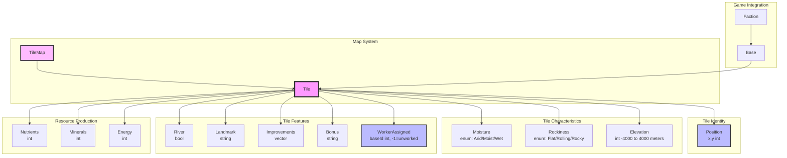

# Map System Architecture

## Component Overview

### Tile
- **Purpose**: Represents a single tile on the game map with all its characteristics
- **Responsibilities**:
  - Store terrain characteristics:
    - Moisture (enum: Arid, Moist, Wet)
    - Rockiness (enum: Flat, Rolling, Rocky)
    - Elevation (int: -4000 to 4000 meters)
  - Track tile features (Rivers, Landmarks, Improvements)
  - Calculate resource production (Nutrients, Minerals, Energy) from terrain
- **Composition**:
  - `Position`: x,y coordinates on the map grid
  - `Moisture`: Enum (Arid, Moist, Wet) - affects nutrient production
  - `Rockiness`: Enum (Flat, Rolling, Rocky) - affects mineral production  
  - `Elevation`: Integer in meters, range -4000 to 4000 - affects energy production
  - `River`: Boolean flag for river presence (provides energy bonus)
  - `Landmark`: Optional landmark identifier (e.g., "Monsoon Jungle", "Fungal Tower")
  - `Improvements`: Vector of built improvements (e.g., "Farm", "Mine", "Solar Collector")
  - `Bonus`: Optional tile bonus ID (e.g., "nutrient_rich_soil", "geothermal_vent")
  - `WorkerAssigned`: Integer base ID tracking which base has a worker on this tile (-1 if unworked; one worker per tile limit)
- **Resource Calculation**:
  - `GetNutrientProduction()`: Derived from moisture (only produces if worked)
  - `GetMineralProduction()`: Derived from rockiness (only produces if worked)
  - `GetEnergyProduction()`: Derived from elevation plus river bonus (only produces if worked)
- **Worker Assignment**:
  - `AssignWorker(baseId)`: Marks tile as worked by the given base
  - `UnassignWorker()`: Removes worker assignment (sets baseId to -1)
  - `IsWorkerAssigned()`: Check if tile already has a worker (enforces one worker per tile rule)
  - `GetWorkedByBaseId()`: Returns the base ID currently working this tile, or -1 if unworked

### Tile Bonus System
- **Purpose**: Defines special resource bonuses that can be applied to individual tiles
- **Components**:
  - `TileBonusConfig`: Data structure holding bonus definition (id, name, description, nutrient/mineral/energy bonuses, frequency, sprite path)
  - `TileBonusConfigParser`: Parses tile bonus definitions from JSON config
  - `TileBonusRegistry`: Loads and provides access to all tile bonuses at runtime
- **Configuration**: `config/tile_bonuses.json` - defines available bonuses and their effects
- **Example Bonuses**:
  - `nutrient_rich_soil`: +2 nutrients, frequency 100 (common)
  - `mineral_deposit`: +2 minerals, frequency 100 (common)
  - `geothermal_vent`: +2 energy, frequency 50 (uncommon)
  - `bounty`: +2 to all resources, frequency 10 (rare)
  - `rare_earth_deposit`: +2 nutrients, +2 minerals, frequency 30 (uncommon)
- **Frequency System**: Higher values = more common during map generation. Used by world generator to weight bonus placement probability.

### TileMap (Future)
- **Purpose**: Container managing all tiles on the game map
- **Responsibilities**:
  - Store 2D grid of Tile instances
  - Provide spatial queries and tile access
  - Handle map generation and persistence
- **Rationale**: Will be implemented when world generation and map persistence are added

## Integration with Game Systems

### Base System
- Bases work tiles to extract resources
- `Base::SetPosition(x, y)` / `Base::GetX()` / `Base::GetY()` track map position
- `Base::GetWorkableTilePositions()` returns all (x,y) pairs in a 5×5 grid with the four corners removed (Manhattan distance ≤ 3 within `[-2,2]` offsets), excluding the base's own tile — 20 tiles total. Enemy-unit blocking is a TODO pending unit implementation.
- `Base::SetWorkedTiles()` aggregates resources from worked tiles
- `TileResources_t` struct used to pass resource totals
- Each worker assigned to a tile contributes that tile's resource production
- `Tile::AssignWorker(baseId)` records which base is working the tile; prevents double-assignment by checking `IsWorkerAssigned()` before assigning

### Faction Economy
- Faction's economy aggregates resources from all bases
- Energy from tiles feeds into faction energy budget
- Minerals from tiles fund production
- Nutrients drive population growth

## Design Rationale

### Separation of Concerns
- Tile stores only its own state and calculates its own production
- Bases manage which tiles are worked
- Economy aggregates at faction level
- Follows Single Responsibility Principle

### Extensibility
- Improvements system allows extending tile functionality without modifying Tile class
- Landmark system supports special terrain features
- Resource calculation can be modified via configuration or Lua hooks

### Moddability
- Terrain characteristics use semantically meaningful types (enums for moisture/rockiness, actual meters for elevation)
- Improvements and Landmarks use string IDs for easy content addition
- Resource calculation formulas can be extracted to Lua configuration

## Future Enhancements

- **TileMap**: 2D grid container with spatial queries
- **World Generation**: Procedural map generation creating tiles with varied terrain
- **Terraforming**: Ability to modify tile characteristics (moisture, elevation)
- **Fungal Spread**: Alien fungus that spreads across tiles affecting terrain
- **Weather System**: Dynamic moisture/river modifications based on climate
