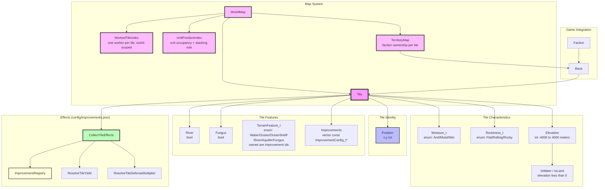
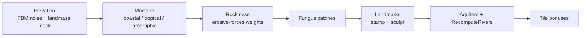

# Map System Architecture

## Distance Metrics

Spatial helpers live in `include/game/map/MapUtils.h`. The map uses two coherent metrics:

| Metric | Definition | Used for |
|--------|------------|----------|
| **Chebyshev** | `max(\|dx\|, \|dy\|)` (king-move / square) | Unit/base/Sensor **sight**, improvement **auras** (Sensor defense, Mirror, Condenser), unit ThisTile auras — `ForEachTileInChebyshevRadius` |
| **Euclidean disk** | `dx² + dy² ≤ R² + 1` | **Base workable area** (`R = 2`), **territory claim radius** (land `R = 7`, sea `R = 3`) — `InEuclideanRadius` / `ForEachTileInEuclideanRadius` |

Territory overlap between factions is broken by crow-flies distance (`dx² + dy²`) to the claiming base, then lower `BaseId` — not by Chebyshev.

## Component Overview

### Tile
- **Purpose**: Represents a single tile on the game map with all its characteristics. `Tile` itself stays a plain data holder — it has no knowledge of the effects system or `ImprovementRegistry`; all effects-based resolution (yield, defense) lives in free functions / `TileEffectsContext` that take a `Tile` and a registry, the same pattern used elsewhere in the effects system (e.g. `CollectFromBuildings` takes a `Faction` and a `BuildingRegistry`).
- **Responsibilities**:
  - Store terrain characteristics:
    - Moisture_t (enum: Arid, Moist, Wet)
    - Rockiness_t (enum: Flat, Rolling, Rocky)
    - Elevation (int: -4000 to 4000 meters)
  - Expose `IsWater()` / `IsLand()` — water is `elevation < 0` (same rule as landform rendering)
  - Track tile features (Rivers, Fungus, Improvements)
  - Expose `GetTerrainFeatures()` (terrain config pointers) and `GetImprovements()` (config pointers) so the effects system can resolve yield/defense from terrain and improvements through one mechanism — see Tile Improvement Effects below
  - Resolve intrinsic feature ids via `TerrainFeature_t`, whose enumerator names *are* the `improvements.json` ids (`magic_enum` maps between them, so there is no second list to keep in sync). `HasFeature` switches over it exhaustively — `-Werror=switch` on `ac-core` means adding an enumerator breaks the build until every site decides about it — and `ValidateTerrainFeatures` throws at load if any enumerator lacks an improvement entry. Features stack: a sea tile carries `Water` *and* one of `Ocean`/`OceanShelf`
- **Composition**:
  - `Position`: x,y coordinates on the map grid
  - `Moisture_t`: Enum (Arid, Moist, Wet) - affects nutrient production via its `Moist`/`Wet` entry in `config/improvements.json`
  - `Rockiness_t`: Enum (Flat, Rolling, Rocky) - affects mineral production and (for Rocky) grants a defense bonus, via its entry in `config/improvements.json`
  - `Elevation`: Integer in meters, range -4000 to 4000 - the raw seed for energy production (`GetElevationEnergySeed()`); River/improvement bonuses layer on top via effects
  - `River`: Boolean flag for river presence (grants an energy bonus via its improvements.json entry)
  - `Fungus`: Boolean flag for alien fungus presence (grants a defense bonus via its improvements.json entry). Presence-only for now — spreading fungus turn-over-turn is a separate future enhancement, not implemented.
  - `Improvements`: Vector of non-owning `const ImprovementConfig_t*` into `ImprovementRegistry` (like `BuildingManager`'s `BuildingConfig_t*`). Covers player-built improvements (e.g. "Farm", "Mine", "Bunker"), the `"Base"` marker added automatically when a `BaseManager` is founded on the tile, and tile specials that were formerly separate "bonus"/"landmark" slots (e.g. "Monsoon Jungle", "nutrient_rich_soil") — for the map all three are just improvements, with coexistence governed by `ImprovementConfig_t::excludes`
  - Note: `Tile` holds **no** worked/worker-assignment state — that lives in `WorkedTileIndex` (below), so `Tile` needs no `mutable` members and a `const Tile&` really is immutable. Likewise `Tile` holds **no** political ownership — that lives in `TerritoryMap`.

### WorkedTileIndex (worked-tile occupancy)
- **Purpose**: The single owner of the "which tiles are currently worked" state and the one enforcement point of the **one-worker-per-tile rule across all bases and factions** — two nearby bases, friendly or enemy, may never work the same tile. Owned by `WorldMap`, next to `UnitPositionIndex`.
- **Model**: An assignment is a move-only RAII `WorkedTileClaim` minted exclusively by `WorkedTileIndex::TryClaim(tile, bUserAssigned, onDisplaced)`, which atomically checks-and-claims (returns an empty claim if the tile is already worked by anyone). The claim is held by the working `Pop` and releases the tile automatically when the pop dies, converts to a non-worker type, or is reassigned — the invariant is structural, not a convention. The player-assignment flag lives on the claim, so it cannot outlive the assignment. Worker claims carry a `DisplacedWorkerHandler` so a base founding can displace them (see Base tiles below); base-tile claims carry none and can never be displaced.
- **Components**:
  - `WorkedTileIndex` / `WorkedTileClaim` (`include/game/map/WorkedTileIndex.h`)
  - `WorldMap::GetWorkedTiles()` — accessor used by every base's `WorkerAssignmentManager`
  - `WorkedTileIndex::GetRevision()` — monotonic change counter (see `lib/Revision.h`) bumped on every claim/release, for derived-state caches over worked-tile resources
- **Base tiles**: the base center tile is worked for free (no pop), and `BaseManager` claims it in the index for the base's entire life (`m_centerTileClaim`, via `WorkedTileIndex::ClaimDisplacing`) — a base can never work another base's own tile. Founding a base on a tile currently worked by a neighboring base's pop **displaces** that worker: its claim is emptied and its `DisplacedWorkerHandler` (registered by its `WorkerAssignmentManager` at claim time) re-runs auto-assignment, moving the worker to the best free tile in its own base's radius. The handler fires only after the founding base's claim is registered, so the displaced worker can never be reassigned back onto the founding tile. Founding on another base's *own* tile throws — a founding flow must never allow it.
- **Future seams**: revoking assignments when a tile turns hostile (e.g. enemy unit occupies it) and reconciling after save-game load both have exactly one place to live.

### UnitPositionIndex (unit occupancy)
- **Purpose**: The single owner of unit-position state, mirroring `WorkedTileIndex`'s ownership model. Owned by `WorldMap` (`WorldMap::GetUnitPositions()`; `GetUnitsOnTile()` remains as a convenience forward).
- **Model**: A `Unit` registers itself in its constructor and unregisters in its destructor (RAII — a destroyed unit can never linger in the index), and every move goes through `UnitPositionIndex::MoveUnit`, which updates the per-tile occupancy and the unit's own tile pointer together. Only the index writes either side, so `Unit::GetTile()` and `GetUnitsOnTile()` structurally cannot desync; `Unit` has no public position setter.
- **Stacking rule**: the original game allows any number of units per tile (the default). `UnitPositionIndex::SetSingleUnitPerTile(true)` restricts every tile to at most one *non-embarked* unit — a loaded carrier's cargo shares its tile by construction and does not count as an occupant. The setting is **per world**, held on the index beside the occupancy it constrains; it was previously a file-scope global in `MovementRules`, so two sessions could not disagree and a test leaked it into the next case.
  - `UnitPositionIndex::CanPlaceUnit` is the single definition of the predicate. `MovementRules::CanPlaceUnitOnTile` delegates to it. `StepEvaluator` keeps its own loop on purpose: it answers "which units block *this mover*, given what it knows", layering a visibility filter on the same occupancy test.
  - Enforcement is at the mutation boundary: unit creation on an occupied tile throws, and `MoveUnit` throws `std::logic_error` rather than silently overstacking. Callers that plan legality first (`StepEvaluator`) still should — the throw is a backstop for one that forgets.
  - **Known gap**: `Register_` and `Unit::Disembark` change occupancy without the check, so unloading a transport in place can leave an existing violation standing even though no new *move* can create one. What unloading onto a full tile should do is a game rule, not a refactor — see `docs/full-review-fix-prompts/07-units-movement-and-orders.md`.

### TerritoryMap (faction ownership)
- **Purpose**: World-scoped mutually exclusive ownership of tiles — “whose territory is this?” Owned by `WorldMap` (`WorldMap::GetTerritory()`), same placement pattern as `WorkedTileIndex` / `UnitPositionIndex`. `Tile` stays free of political state.
- **Components**:
  - `TerritoryMap` (`include/game/map/TerritoryMap.h`) — dense `FactionId` grid; `k_NoFactionOwner` (-1) for unclaimed
  - `GameState::RebuildTerritory()` — collects every base of every faction and calls `TerritoryMap::Rebuild`
  - Wired via `Faction::SetOnBaseListChanged` when a faction is added to `GameState`, so founding a base rebuilds ownership. Rebuild whenever a base is **created, destroyed, or changes hands** — population size is not an input.
- **Claim rules**:
  - **Land base** (`Tile::IsLand()`): Euclidean disk radius 7 (`dx² + dy² ≤ 50`), only land tiles reachable by orthogonal BFS through contiguous land inside that disk
  - **Sea base** (`Tile::IsWater()`): Euclidean disk radius 3 (`dx² + dy² ≤ 10`), only contiguous sea the same way
  - Land bases never claim sea; sea bases never claim land
- **Contested tiles**: among bases that can claim a tile, owner is the nearest base by Euclidean distance (`dx² + dy²`); ties go to the **lower `BaseId`**
- **Rebuild preconditions**: `Rebuild` throws unless the grid has been `Reset` and its dimensions equal the world's, and throws if a base sits outside the grid. Returning quietly left every caller reading `k_NoFactionOwner` as though ownership were current, and a desynced `Reset` indexed out of bounds.
- **Consumers**: territory-owned improvements (`owned_by_territory: true`, e.g. Sensor) stamp `ActiveEffect_t::ownerFaction` from `GetOwner` and only apply for that faction (defense aura / fog vision — see effects and visibility docs)

### World Generation pipeline

`WorldGenerator::Generate` runs a fixed stage order. It is load-bearing, not incidental:

- **Landmarks before rivers**: landmark placement is the last stage that changes elevation (the Mount Planet sculpt raises peaks and roughens slopes) or stamps a `terminates_river` feature (BoreholeCluster). River tracing walks strictly downhill and stops at terminators, so it has to see the finished terrain. Run the other way round, rivers flowed down pre-sculpt slopes and straight through boreholes.
- **Bonuses last**: landmarks exclude `@resource_bonus`, so bonuses must be placed against a tile set that already has its landmarks.
- **Fungus before landmarks**: `PlaceFungus` reads neither rivers nor moisture, and `TheRuins` sets fungus on its own footprint.
- **Rivers are a fixed point**: re-running `RecomputeRivers` on a finished world changes nothing. `WorldGenPipelineTests` pins this as the invariant of a correct order.
- **One seed**: the caller (composition root) resolves one session seed and passes it in; every stage draws from `m_rng`. `MapGenerationConfig_t::seed` is the *request* (`0` = pick one), never re-read during generation — otherwise the seed reported for a session could not reproduce it.

### Tile Visual Layer System

Two id domains meet here and must not be swapped: `TileLayerContent` holds lowercase **sprite** ids (`"farm"`), while `ImprovementIds` / `config/improvements.json` hold PascalCase **config** ids (`"Farm"`). The resolver probes tiles with config ids; the five fixed layers return `TileLayerContent` sprite ids.

The Improvement layer is the exception: it returns the config id verbatim, because there is no sprite-id mapping for the open-ended set of improvements that can occupy it (Borehole, Monolith, …). Its rendering priority and exclusion rules are still a TODO in `ResolveImprovementLayer_`; whatever resolves them owes this layer a mapping too.

- **Purpose**: Provides an ordered, render-only representation of a tile's visual contents
- **Components**:
  - `TileLayerType_t`: Enum defining the visual layer order (Landform, Moisture_t, Rockiness_t, Vegetation, Road, Improvement)
  - `TileLayer_t`: Pair of layer type and optional content ID string (`std::optional<std::string>`)
  - `ResolveTileLayers(const Tile&)`: Free function that maps a `Tile`'s gameplay data to the layer array
- **Rationale**: Separates tile gameplay data from rendering data, so changes to visuals do not affect resource calculation or other systems
- **Layer Order** (bottom to top):
  1. `Landform`: water (`Tile::IsWater()`), flat, or rolling
  2. `Moisture_t`: arid, moist, or wet
  3. `Rockiness_t`: rocky overlay (empty if not rocky)
  4. `Vegetation`: farm or forest
  5. `Road`: road
  6. `Improvement`: dominant non-vegetation, non-road improvement (e.g., Borehole, Monolith)
- **Open Questions / TODOs**:
  - Landform generation rules beyond the elevation water threshold
  - Vegetation mutual exclusivity and placement rules (Borehole/Base vs Farm/Forest)
  - Improvement rendering priority and monolith/landmark handling

### Tile Improvement Effects
- **Purpose**: Unifies terrain classification, natural features, player-built improvements, tile specials (formerly "bonus"/"landmark"), and a founded base behind one config type (`ImprovementConfig_t`), since all of them answer the same two questions: what effects do they grant, and what do they exclude. Terrain is resolved by name into cached config pointers (`Tile::GetTerrainFeatures()`); improvements are held directly as `const ImprovementConfig_t*` on the tile (`Tile::GetImprovements()`). Full details (scope semantics, the `ThisTile` resolution pattern, the seeded-energy pattern) are in `docs/architecture/effects-system.md`'s "Tile Improvement Effects" section — this is the map-system-facing summary.
- **Components**:
  - `ImprovementConfig_t` / `ImprovementConfigParser` / `ImprovementRegistry` (`include/game/map/ImprovementConfigParser.h`, `ImprovementRegistry.h`) — id, name, mineral cost, required tech, `excludes` (incompatible feature ids), per-effect `radius`, optional `owned_by_territory`, and an `effects` array.
  - `TileEffectsContext::CollectAreaEffects` / `ResolveTileYield` / `ResolveTileDefenseMultiplier` — gather own-tile and neighbor aura effects (Chebyshev scan).
  - `CanBuildImprovement(tile, candidate)` (`include/game/map/ImprovementConfigParser.h`) — exclusivity check (e.g. Farm excludes Rocky). Not wired into any UI yet; there's no improvement-construction flow to call it from.
- **Configuration**: `config/improvements.json` — one array covering terrain values (`Flat`/`Rolling`/`Rocky`, `Arid`/`Moist`/`Wet`), natural features (`River`, `Fungus`), and improvements (`Farm`, `Mine`, `Bunker`, `Base`, `Sensor`, …).
- **Combat bonus example**: `Rocky`, `Fungus`, and `Bunker` each grant a `StatModifier` effect on `StatId_t::Defense` with `op: AddPercent, amount: 25` (+25%, stacking additively per `ResolveStatModifiers`'s arithmetic-factor formula). `Base` grants a larger placeholder bonus the same way. No combat system exists yet to consume `ResolveTileDefenseMultiplier` — it's exposed as a ready-to-call resolver (takes a defending `FactionId` so territory-owned Sensor auras only apply for the owner).
- **Aura example**: `Sensor` declares `radius: 2` on its defense (and vision) effect entries and projects `+25%` defense to every tile within **Chebyshev** distance 2 — `AppendAreaEffectsFromNeighbors_` uses `ForEachTileInChebyshevRadius`. Prefer per-effect `"radius"` over the improvement-level default. `owned_by_territory: true` means only the faction that owns the Sensor's tile (via `TerritoryMap`) receives the aura and Sensor fog vision. `ResolveTileYield` / own-tile `CollectTileEffects` only look at a tile's own terrain features and improvements unless scanning neighbors for auras.

### Tile Bonuses (special resources)
- **Purpose**: Special resource bonuses on individual tiles (e.g. a nutrient-rich or mineral deposit).
- **Modeling**: These are **not a separate system** — a tile bonus is just an `ImprovementConfig_t` entry in `config/improvements.json` like any other improvement. It grants resources via `ThisTile` `StatModifier` effects, sets `frequency` > 0 for world-gen placement weighting, and may carry a `spritePath`/`description` for rendering and lore. It lives in the tile's single improvements collection (`Tile::GetImprovements()`), with coexistence governed by `excludes`.
- **Frequency System**: Higher `frequency` = more common during map generation; `PlaceTileBonuses` weights its pick by it and stops at `decoration.json`'s `tile_bonuses.land_fraction`.

### Improvement coexistence (`CanBuildImprovement`)
- **One predicate, both directions**: a candidate may be placed unless the candidate's own `excludes` name a feature already on the tile, **or** a feature already on the tile names the candidate. Modders declare the relationship once, on whichever side reads better — `MountPlanet` excluding `@resource_bonus` is enough to keep `Nutrients` off it, without `Nutrients` naming every landmark.
- Every placement path shares it: world-gen bonuses, landmark stamping, terraform orders, and fungus/forest spread. The incumbent side reads a tile's terrain-feature configs, which exist only after `Tile::BindImprovements` — so `WorldGenerator` binds the whole grid before its first stage, and an unbound tile never answers a coexistence question.
- `clearedFeatureId` is the one escape hatch: a caller that removes a feature as part of the same placement (forest spread wipes fungus) names it, instead of mutating the tile to probe.

### WorldMap
- **Purpose**: Container owning the tile grid plus world-scoped indexes (`WorkedTileIndex`, `UnitPositionIndex`, `TerritoryMap`).
- **Responsibilities**:
  - Store 2D grid of `Tile` instances; `GetTile(x, y)` (null out of bounds, X wraps)
  - Expose worked-tile, unit-position, and territory indexes
- **Invariants**:
  - Both dimensions are positive — the constructor throws otherwise, rather than yielding a map whose every generation stage silently no-ops.
  - Tile addresses are stable for the map's lifetime: units, bases, `UnitPositionIndex` and `WorkedTileIndex` all hold raw `Tile*`. `GetTiles()` therefore returns `std::span<const std::unique_ptr<Tile>>` — tiles stay mutable through the pointer, but the ownership vector cannot be cleared or reseated from outside.
- **Note**: Older docs called this `TileMap`; the live type is `WorldMap`.

## Integration with Game Systems

### Base System
- Bases work tiles to extract resources
- `BaseManager::GetX()` / `GetY()` track map position via the base's tile
- `WorkerAssignmentManager::GetWorkableTiles()` / `ForEachTileInWorkableArea` yield the **Euclidean radius-2** disk (`dx² + dy² ≤ 5`) around the base — the classic SMAC 5×5 with corners cut — excluding the base's own tile (20 surrounding tiles). Enemy-unit blocking is a TODO pending combat.
- `WorkerAssignmentManager::ComputeWorkedResources()` aggregates resources from worked tiles
- `TileResources_t` struct used to pass resource totals
- Each worker assigned to a tile contributes that tile's resource production
- Assignment claims the tile in `WorkedTileIndex` (see above); the atomic `TryClaim` prevents double-assignment, including by another faction's base
- `BaseManager`'s constructor adds `"Base"` to its tile's improvements, so the base's own garrison defense bonus flows through the same `ImprovementRegistry` lookup as Bunker/Rocky/Fungus (see Tile Improvement Effects above). This is also why `BaseManager` holds a non-const `Tile&` rather than `const Tile&`.

### Faction Economy
- Faction's economy aggregates resources from all bases
- Energy from tiles feeds into faction energy budget
- Minerals from tiles fund production
- Nutrients drive population growth

## Design Rationale

### Separation of Concerns
- Tile stores only its own state
- Bases manage which tiles are worked
- `TerritoryMap` owns political ownership; `WorkedTileIndex` owns worker exclusivity
- Economy aggregates at faction level
- Follows Single Responsibility Principle

### Extensibility
- Improvements system allows extending tile functionality without modifying Tile class
- A single improvements collection covers player-built improvements, tile specials, landmarks, and the Base marker — new kinds are added as `config/improvements.json` entries, not new C++ types
- Resource and defense calculation are entirely effects-driven via `config/improvements.json` — adding a new improvement, or changing what Rocky/Fungus grant, never touches `Tile` or its consumers' C++

### Moddability
- Terrain characteristics use semantically meaningful types (enums for moisture/rockiness, actual meters for elevation) for world-gen and rendering, but resolve through the same string-id effects lookup as improvements for yield/defense purposes
- Improvements are referenced by string ID in config for easy content addition; on a tile they're held as resolved `ImprovementConfig_t` pointers
- Resource and defense formulas live in `config/improvements.json`, not in code

## Future Enhancements

- **Weather System**: Dynamic moisture/river modifications based on climate
- **Orographic moisture after sculpting**: landmark sculpting is the last stage to change elevation, but moisture is derived before it, so a sculpted peak keeps its pre-sculpt moisture tier. Re-deriving moisture afterwards would re-roll tiers that landmark anchors were already chosen against (moisture ids are themselves `CanBuildImprovement` features) — resolving it needs a rule, not a reorder.
- **Seed persistence**: `Engine` resolves one session seed and the whole map derives from it, but nothing writes it down — replaying a finished game waits on a save system.
- **Combat system**: `ResolveTileDefenseMultiplier(tile, forFaction)` is ready to call but nothing resolves attacks yet
- **Territory UI**: WorldDisplay shows Sensor markers; border/ownership tint is not implemented yet
