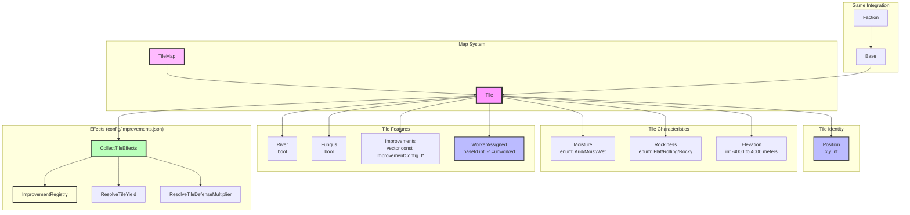
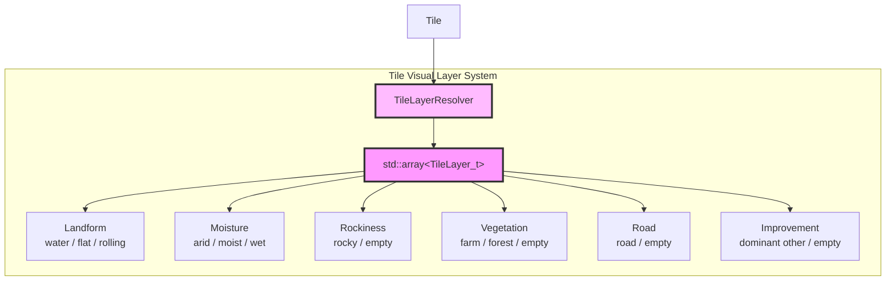

# Map System Architecture

## Component Overview

### Tile
- **Purpose**: Represents a single tile on the game map with all its characteristics. `Tile` itself stays a plain data holder — it has no knowledge of the effects system or `ImprovementRegistry`; all effects-based resolution (yield, defense) lives in free functions that take a `Tile` and a registry, the same pattern used elsewhere in the effects system (e.g. `CollectFromBuildings` takes a `Faction` and a `BuildingRegistry`).
- **Responsibilities**:
  - Store terrain characteristics:
    - Moisture (enum: Arid, Moist, Wet)
    - Rockiness (enum: Flat, Rolling, Rocky)
    - Elevation (int: -4000 to 4000 meters)
  - Track tile features (Rivers, Fungus, Improvements)
  - Expose `GetTerrainFeatureIds()` (terrain ids) and `GetImprovements()` (config pointers) so the effects system can resolve yield/defense from terrain and improvements through one mechanism — see Tile Improvement Effects below
- **Composition**:
  - `Position`: x,y coordinates on the map grid
  - `Moisture`: Enum (Arid, Moist, Wet) - affects nutrient production via its `Moist`/`Wet` entry in `config/improvements.json`
  - `Rockiness`: Enum (Flat, Rolling, Rocky) - affects mineral production and (for Rocky) grants a defense bonus, via its entry in `config/improvements.json`
  - `Elevation`: Integer in meters, range -4000 to 4000 - the raw seed for energy production (`GetElevationEnergySeed()`); River/improvement bonuses layer on top via effects
  - `River`: Boolean flag for river presence (grants an energy bonus via its improvements.json entry)
  - `Fungus`: Boolean flag for alien fungus presence (grants a defense bonus via its improvements.json entry). Presence-only for now — spreading fungus turn-over-turn is a separate future enhancement, not implemented.
  - `Improvements`: Vector of non-owning `const ImprovementConfig_t*` into `ImprovementRegistry` (like `BuildingManager`'s `BuildingConfig_t*`). Covers player-built improvements (e.g. "Farm", "Mine", "Bunker"), the `"Base"` marker added automatically when a `BaseManager` is founded on the tile, and tile specials that were formerly separate "bonus"/"landmark" slots (e.g. "Monsoon Jungle", "nutrient_rich_soil") — for the map all three are just improvements, with coexistence governed by `ImprovementConfig_t::excludes`
  - `WorkerAssigned`: Integer base ID tracking which base has a worker on this tile (-1 if unworked; one worker per tile limit)
  - `bWorked`: Mutable boolean flag set when a `Pop` is actively assigned to this tile; `Pop` clears it on destruction through its `const Tile*`
- **Worker Assignment**:
  - `AssignWorker(baseId)`: Marks tile as worked by the given base
  - `UnassignWorker()`: Removes worker assignment (sets baseId to -1)
  - `IsWorkerAssigned()`: Check if tile already has a worker (enforces one worker per tile rule)
  - `GetWorkedByBaseId()`: Returns the base ID currently working this tile, or -1 if unworked
  - `SetWorked(bWorked)`: Sets the worked flag directly (used by `Pop` assignment lifecycle)
  - `IsWorked()`: Returns the worked flag

### Tile Visual Layer System

- **Purpose**: Provides an ordered, render-only representation of a tile's visual contents
- **Components**:
  - `TileLayerType_t`: Enum defining the visual layer order (Landform, Moisture, Rockiness, Vegetation, Road, Improvement)
  - `TileLayer_t`: Pair of layer type and optional content ID string (`std::optional<std::string>`)
  - `ResolveTileLayers(const Tile&)`: Free function that maps a `Tile`'s gameplay data to the layer array
- **Rationale**: Separates tile gameplay data from rendering data, so changes to visuals do not affect resource calculation or other systems
- **Layer Order** (bottom to top):
  1. `Landform`: water, flat, or rolling
  2. `Moisture`: arid, moist, or wet
  3. `Rockiness`: rocky overlay (empty if not rocky)
  4. `Vegetation`: farm or forest
  5. `Road`: road
  6. `Improvement`: dominant non-vegetation, non-road improvement (e.g., Borehole, Monolith)
- **Open Questions / TODOs**:
  - Water threshold and landform generation rules
  - Vegetation mutual exclusivity and placement rules (Borehole/Base vs Farm/Forest)
  - Improvement rendering priority and monolith/landmark handling

### Tile Improvement Effects
- **Purpose**: Unifies terrain classification, natural features, player-built improvements, tile specials (formerly "bonus"/"landmark"), and a founded base behind one config type (`ImprovementConfig_t`), since all of them answer the same two questions: what effects do they grant, and what do they exclude. Terrain is resolved by string id (`Tile::GetTerrainFeatureIds()` → `ImprovementRegistry::Find(id)`); improvements are held directly as `const ImprovementConfig_t*` on the tile (`Tile::GetImprovements()`). Full details (scope semantics, the `ThisTile` resolution pattern, the seeded-energy pattern) are in `docs/architecture/effects-system.md`'s "Tile Improvement Effects" section — this is the map-system-facing summary.
- **Components**:
  - `ImprovementConfig_t` / `ImprovementConfigParser` / `ImprovementRegistry` (`include/game/map/ImprovementConfigParser.h`, `ImprovementRegistry.h`) — id, name, mineral cost, required tech, `excludes` (incompatible feature ids), and an `effects` array.
  - `CollectTileEffects`, `ResolveTileYield`, `ResolveTileDefenseMultiplier` (`include/lib/effects/ActiveEffect.h`) — gather and resolve a tile's own effects.
  - `CanBuildImprovement(tile, candidate)` (`include/game/map/ImprovementConfigParser.h`) — exclusivity check (e.g. Farm excludes Rocky). Not wired into any UI yet; there's no improvement-construction flow to call it from.
- **Configuration**: `config/improvements.json` — one array covering terrain values (`Flat`/`Rolling`/`Rocky`, `Arid`/`Moist`/`Wet`), natural features (`River`, `Fungus`), and improvements (`Farm`, `Mine`, `Bunker`, `Base`).
- **Combat bonus example**: `Rocky`, `Fungus`, and `Bunker` each grant a `StatModifier` effect on `StatId::Defense` with `op: AddPercent, amount: 25` (+25%, stacking additively per `ResolveStatModifiers`'s arithmetic-factor formula). `Base` grants a larger placeholder bonus the same way. No combat system exists yet to consume `ResolveTileDefenseMultiplier` — it's exposed as a ready-to-call resolver.
- **Aura example**: `Sensor` (`radius: 2`) projects its `+25%` defense bonus to every tile within 2 tiles (Manhattan), not just its own — `ResolveTileDefenseMultiplier` takes a `WorldMap` specifically to scan for these. This is the one tile resolver that needs map access; `ResolveTileYield`/`CollectTileEffects` only ever look at a tile's own terrain features and improvements.

### Tile Bonuses (special resources)
- **Purpose**: Special resource bonuses on individual tiles (e.g. a nutrient-rich or mineral deposit).
- **Modeling**: These are **not a separate system** — a tile bonus is just an `ImprovementConfig_t` entry in `config/improvements.json` like any other improvement. It grants resources via `ThisTile` `StatModifier` effects, sets `frequency` > 0 for world-gen placement weighting, and may carry a `spritePath`/`description` for rendering and lore. It lives in the tile's single improvements collection (`Tile::GetImprovements()`), with coexistence governed by `excludes`.
- **Frequency System**: Higher `frequency` = more common during map generation; used by the world generator to weight placement. (World-gen does not yet place bonuses — it currently sets only terrain.)

### TileMap (Future)
- **Purpose**: Container managing all tiles on the game map
- **Responsibilities**:
  - Store 2D grid of Tile instances
  - Provide spatial queries and tile access
  - Handle map generation and persistence
- **Rationale**: Will be implemented when world generation and map persistence are added

## Integration with Game Systems

### Base System
- Bases work tiles to extract resources
- `Base::SetPosition(x, y)` / `Base::GetX()` / `Base::GetY()` track map position
- `Base::GetWorkableTilePositions()` returns `const Tile*` pointers for all tiles in a 5×5 grid with the four corners removed (Manhattan distance ≤ 3 within `[-2,2]` offsets), excluding the base's own tile — 20 tiles total. Enemy-unit blocking is a TODO pending unit implementation.
- `Base::SetWorkedTiles()` aggregates resources from worked tiles
- `TileResources_t` struct used to pass resource totals
- Each worker assigned to a tile contributes that tile's resource production
- `Tile::AssignWorker(baseId)` records which base is working the tile; prevents double-assignment by checking `IsWorkerAssigned()` before assigning
- `BaseManager`'s constructor adds `"Base"` to its tile's improvements, so the base's own garrison defense bonus flows through the same `ImprovementRegistry` lookup as Bunker/Rocky/Fungus (see Tile Improvement Effects above). This is also why `BaseManager` holds a non-const `Tile&` rather than `const Tile&`.

### Faction Economy
- Faction's economy aggregates resources from all bases
- Energy from tiles feeds into faction energy budget
- Minerals from tiles fund production
- Nutrients drive population growth

## Design Rationale

### Separation of Concerns
- Tile stores only its own state and calculates its own production
- Bases manage which tiles are worked
- Economy aggregates at faction level
- Follows Single Responsibility Principle

### Extensibility
- Improvements system allows extending tile functionality without modifying Tile class
- A single improvements collection covers player-built improvements, tile specials, landmarks, and the Base marker — new kinds are added as `config/improvements.json` entries, not new C++ types
- Resource and defense calculation are entirely effects-driven via `config/improvements.json` — adding a new improvement, or changing what Rocky/Fungus grant, never touches `Tile` or its consumers' C++

### Moddability
- Terrain characteristics use semantically meaningful types (enums for moisture/rockiness, actual meters for elevation) for world-gen and rendering, but resolve through the same string-id effects lookup as improvements for yield/defense purposes
- Improvements are referenced by string ID in config for easy content addition; on a tile they're held as resolved `ImprovementConfig_t` pointers
- Resource and defense formulas live in `config/improvements.json`, not in code

## Future Enhancements

- **TileMap**: 2D grid container with spatial queries
- **World Generation**: Procedural map generation creating tiles with varied terrain
- **Terraforming**: Ability to modify tile characteristics (moisture, elevation)
- **Fungal Spread**: `Tile::GetHasFungus()` is presence-only today (manually settable, never placed by `WorldGenerator`); having fungus actually spread turn-over-turn is still future work
- **Weather System**: Dynamic moisture/river modifications based on climate
- **Improvement construction**: no UI/production flow lets a player actually build Farm/Mine/Bunker yet — `Tile::AddImprovement()` and `CanBuildImprovement()` exist but are unconsumed outside the automatic `"Base"` improvement
- **Combat system**: `ResolveTileDefenseMultiplier()` is ready to call but nothing resolves attacks yet
