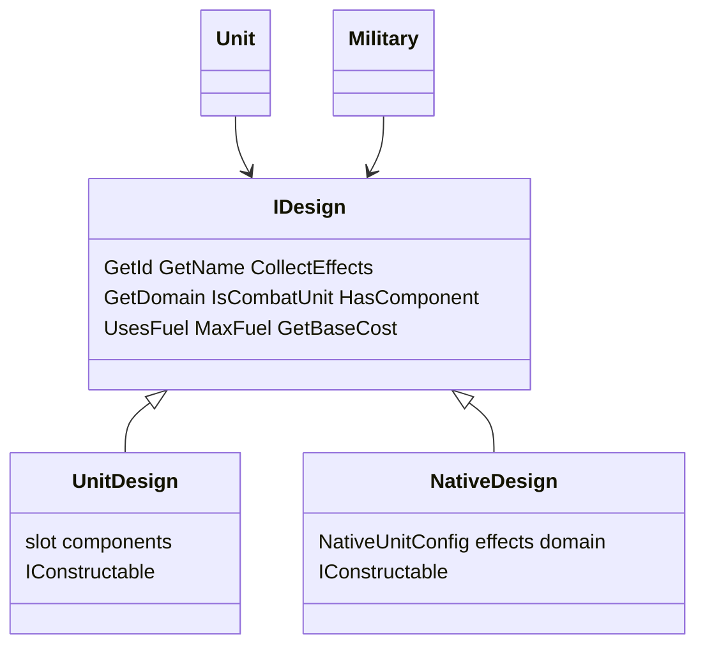

# Native Units System

Native life units are not player-composed component assemblies. They use a flat
`NativeDesign` loaded from `config/native_units.json`.

## Design hierarchy

- `Unit` and `Military` hold `IDesign` (player designs and natives share one ledger).
- `UnitDesign` and `NativeDesign` both implement `IConstructable`. A faction registers every
  native at construction, so they appear in the base build list. The unit designer only lists
  `UnitDesign`.
- `NativeDesign::HasComponent` is always false; the prototype ledger is a no-op for natives.

## Config

[`config/native_units.json`](../../config/native_units.json) — each entry: `id`, `name`,
`domain`, `mineral_cost`, `effects[]` (continuous `EffectConfig_t` with
`EffectSourceKind_t::NativeUnit`), and optional `on_hold_effects[]`. Combat natives declare the `native_life` RuleFlag. Alien Artifact does not.
`IDesign::IsNativeLife` reads that flag, so a composed `UnitDesign` is native life when any
filled component declares it. Combat natives Add `collateral_damage` 1, the fission-tier
splash they deal without a reactor. When one unit of a wild stack — native life owned by a
`NativeLife` faction — dies in the open, the other native occupants are destroyed. A
faction-owned native takes the numeric splash. Base and Bunker `MaxClamp`
`collateral_susceptibility` to 0, which skips that occupant, including the wild wipe. Combat natives Add `planet_pearls` 10. Killing a wild native — the
defender or a stackmate the fight destroys — pays that base times the intrinsic lifecycle
multiplier from `morale_levels.json` (1 through 7) to the attacker's energy treasury.
A faction-owned native pays nothing.

Shipping natives: Mind Worm, Isle of the Deep, Sea Lurk, Locusts of Chiron, Spore Launcher,
Fungal Tower, Alien Artifact. Fungal Tower is land, movement 0, psi combat, and +50% defense.
It declares `visible_in_fog`: once an observer has explored its tile, `IsUnitVisibleTo`
keeps the live tower drawn and attackable while that tile is fogged. Shroud still hides
it, and concealment still applies. Destroying the tower removes the marker.

## Factory

`EnsureNativeDesign(Faction&, GameDataContext&, nativeId)` registers (or returns) the
faction’s `NativeDesign` by stable config id — same role as `EnsureAdHocDesign` for
component lists. Eco-damage / fungal-pop spawning should call this when those systems land.

## Lifecycle starting XP

Centauri Preserve grants `GrantXp` +1 on `on_unit_produced_effects` when `IsNativeLife`
matches. Command Center and Aerospace Complex require `IsNativeLife` `"value": false`
alongside their domain check, so those train bonuses stay on units that are not native life. Rank names
use the `native` column of `morale_levels.json` when `IsNativeLife` is set. A native-life
unit homed at a base pays no mineral support when `UnitSupport` runs if its tile has fungus.
`GetMineralUpkeep` is unchanged, and a zero charge does not take a free support slot.

## Isle cargo (IntrinsicXp)

Isle of the Deep uses `amount_source: IntrinsicXp` on `cargo_capacity` (scale 1) plus
`TransportParams` `carries: [land]`. Live capacity is `Unit::GetXp() * amount` (intrinsic
lifecycle index, not SE-shifted effective morale). Design-only resolve drops the contribution.

## Fungus movement

Mind Worm and Spore Launcher declare a `move_cost` `MaxClamp` of `"1/3"` when the tile has
Fungus. Isle of the Deep and Sea Lurk declare the same stat with amount `1`. The clamp
ceilings the tile price and cancels the fungus entry rules. On sea fungus, `1` is the
open-sea cost.

## Sea concealment

Sea Lurk and the `Deep_Pressure_Hull` ability share Conceal channel `deep_pressure` gated by
`TargetTileHas Water` (covers Ocean and OceanShelf).

## Alien Artifact link

Alien Artifact declares `on_hold_effects` in [`config/native_units.json`](../../config/native_units.json):
`GrantTech` `selection: Available`, then `DestroyUnit`, both gated by `BaseHasBuilding`
`Network_Node`. Network Node is an ordinary building (mineral cost 20, upkeep 1). The prompt
fires when the artifact is ordered to Hold in a friendly base that has the node, and when the
node is completed under an artifact that is already Holding there. Linking spends the artifact.
A player design gathers the same list from its components.
