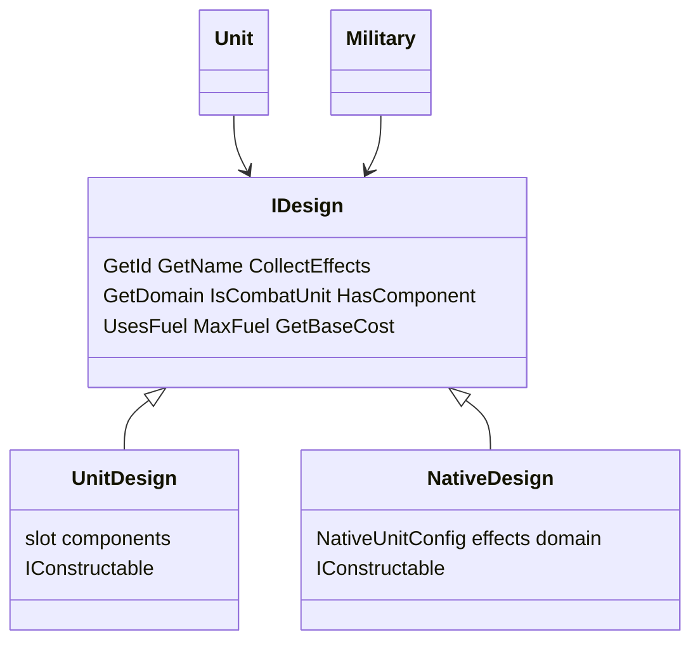

# Native Units System

Native life units are not player-composed component assemblies. They use a flat
`NativeDesign` loaded from `config/native_units.json`.

## Design hierarchy

- `Unit` and `Military` hold `IDesign` (player designs and natives share one ledger).
- `UnitDesign` and `NativeDesign` both implement `IConstructable`. A faction registers every
  native at construction, so they appear in the base build list. The unit designer only lists
  `UnitDesign`.
- `NativeDesign::HasComponent` is always false; the prototype ledger is a no-op for natives.

## Config

[`config/native_units.json`](../../config/native_units.json) — each entry: `id`, `name`,
`domain`, `mineral_cost`, `effects[]` (continuous `EffectConfig_t` with
`EffectSourceKind_t::NativeUnit`), and optional `on_hold_effects[]`.

Shipping natives: Mind Worm, Isle of the Deep, Sea Lurk, Locusts of Chiron, Spore Launcher,
Alien Artifact.

## Factory

`EnsureNativeDesign(Faction&, GameDataContext&, nativeId)` registers (or returns) the
faction’s `NativeDesign` by stable config id — same role as `EnsureAdHocDesign` for
component lists. Eco-damage / fungal-pop spawning should call this when those systems land.

## Isle cargo (IntrinsicXp)

Isle of the Deep uses `amount_source: IntrinsicXp` on `cargo_capacity` (scale 1) plus
`TransportParams` `carries: [land]`. Live capacity is `Unit::GetXp() * amount` (intrinsic
lifecycle index, not SE-shifted effective morale). Design-only resolve drops the contribution.

## Sea concealment

Sea Lurk and the `Deep_Pressure_Hull` ability share Conceal channel `deep_pressure` gated by
`TargetTileHas Water` (covers Ocean and OceanShelf).

## Alien Artifact link

Alien Artifact declares `on_hold_effects` in [`config/native_units.json`](../../config/native_units.json):
`GrantTech` `selection: Available`, then `DestroyUnit`, both gated by `BaseHasBuilding`
`Network_Node`. Network Node is an ordinary building (mineral cost 20, upkeep 1). The prompt
fires when the artifact is ordered to Hold in a friendly base that has the node, and when the
node is completed under an artifact that is already Holding there. Linking spends the artifact.
A player design gathers the same list from its components.
