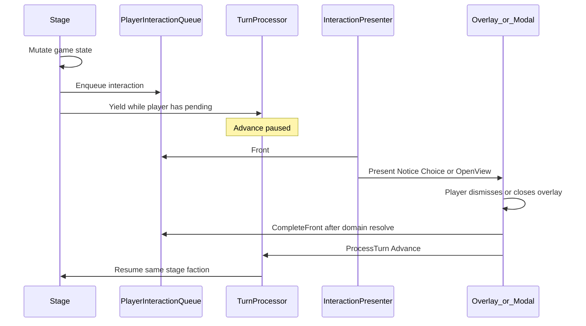

# Player interaction system

Mid-turn pauses where the player must see a notice, make a choice, or open a full
view (Base / Research / …) before turn processing continues. Stages **enqueue**;
the UI **presents**; domain rules stay on `BaseManager` / research / etc.

## Pipeline

## Ownership

| Piece | Owner | Role |
|---|---|---|
| `PlayerInteraction_t` / `QueuedInteraction_t` | headers under `include/game/` | Why the player is paused and how to present |
| `PlayerInteractionQueue` | `GameState` | FIFO; `Enqueue` / `Front` / `CompleteFront` / `HasPendingFor` |
| `YieldingPerFactionTurnStage` | turn stages | Faction bind + `PlayerHasPending_` |
| `EnqueueForPlayer` | free function by `PlayerInteractionQueue` | Address the player faction; no-op in an all-AI game |
| `InteractionPresenter` | `Engine` | Visit Front → Notice / OpenView; then CompleteFront + Advance |

Diplomacy and Planetary Council keep **their own** pending slots. They are not this queue.

## Yield contract

Same as the turn system: `StageResult_t::Yield` pauses; the next `Advance` re-enters the same stage/faction. Every queued item pauses the audience until `CompleteFront`. Completing an interaction always goes through `CompleteFront` then `Engine::ProcessTurn_` (soft-gated by `UIManager::CanAdvanceTurn` while overlays/modals are open).

`BaseProduction` resume is **prompt-agnostic**: if the player still has a pending queue item, Yield again; otherwise mark the awaiting base processed and continue. Opening abandon / idle production happens in `ProcessBase_` via Enqueue + Yield.

Open rule question: what an **AI** base should do when its production would empty the base. It currently defers every turn (TODO in `BaseProduction::HandleAbandonConfirm_`), which re-loses the stockpile each turn.

## Presenter

`InteractionPresenter::Update` (each frame after `UIManager::Update`):

1. If an overlay this presenter pushed is open → do nothing until the stack empties, then run the stored `m_onOverlayClosed` (CompleteFront + Advance for a queued OpenView; Advance only for idle→Assign, which already completed).
2. Else if any overlay or in-view modal is up → do nothing. That covers both "the prompt for this item is still on screen" and "an unrelated view owns the screen".
3. Else present Front. Presenting always ends in a modal/overlay or a CompleteFront, so this cannot spin.

Step 2 is also what makes dismissal safe: a `ListSelectorPopup` closed with Escape or a click outside never calls its selection callback, so the item is still Front and is simply presented again. A queued interaction is only ever cleared by completing it.

The visit is an overload set, so a new `PlayerInteraction_t` alternative fails to compile until it is handled (an `if constexpr` chain would silently ignore it, and an ignored item blocks the turn forever).

| Payload | Presentation |
|---|---|
| `NoticeInteraction_t` | `NoticePopup` on WorldView (+ optional camera tile) |
| `OpenViewInteraction_t` | `PushView` Base / Research / UnitDesigner / SE; close Completes |
| `ProductionAbandonInteraction_t` | Confirm / Defer → `BaseManager` API → Complete |
| `ProductionIdleInteraction_t` | Assign (open BaseView) / Later |

Modal widgets used from here must set `ShouldClose` **before** invoking their callback: `UIManager::CanAdvanceTurn` counts a still-open modal as a reason to refuse `Advance`, so a callback that completes an interaction would otherwise leave the turn stalled.

## Relation to EventBus

`EventBus` / `EventBridge` remain **mod-facing**. Do not drive player UI solely from EventBus (re-entrancy and ordering hazards). Stages (or a thin session helper called from stages) **Enqueue** explicitly. Mods can still observe the same domain events on the bus.

## v1 consumers and follow-ons

**Shipped in v1**

- Production would empty base → `ProductionAbandonInteraction_t`
- Production completed with empty queue → `NoticeInteraction_t` then `ProductionIdleInteraction_t`

**Follow-on PRs on the same spine**

- Population: growth / starvation / riot / golden age notices (+ optional OpenView Base)
- ResearchAccumulation: tech discovered notice; chain OpenView UnitDesigner / SE when unlocks apply
- WorldEvents: notice + camera tile
- AI path: AiReport notice + Yield the AI faction’s stage so the player sees news before more AI work

Not in scope: priority/coalesce policies (serial FIFO only); merging council/diplomacy pending into this queue.

Payload arms are added when a producer needs them — a generic index-resolved choice arm was removed for that reason. Prefer a typed interaction whose resolve the presenter can route to the owning domain API.
