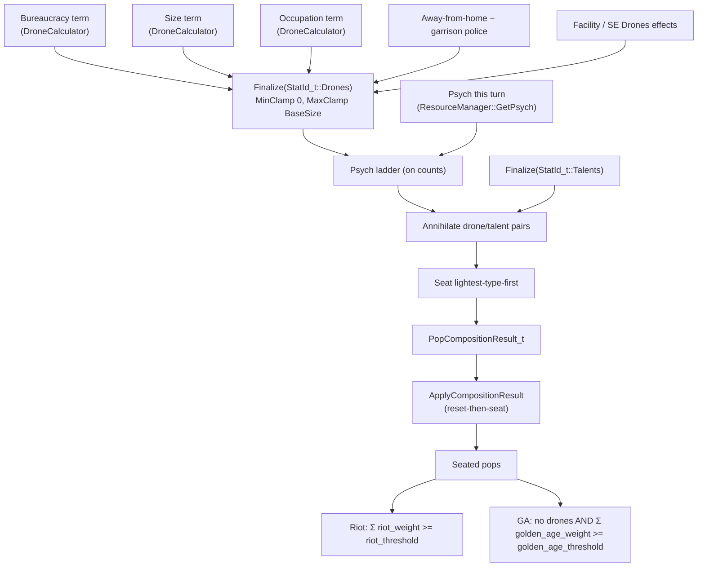
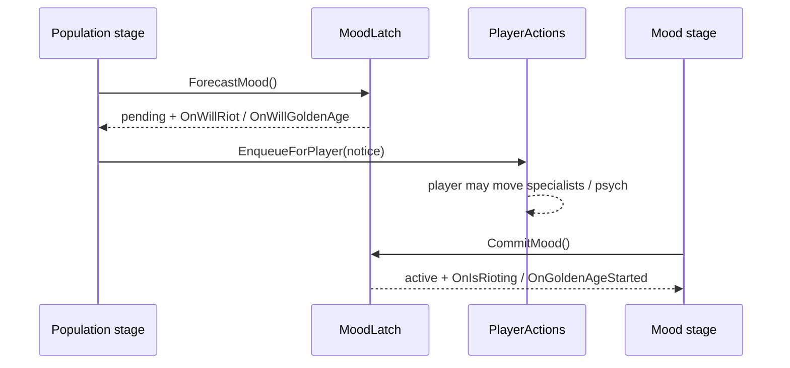

# Population system

Owns a base's pops: how many there are, what type each one is, and whether the base is rioting
or in a golden age — including how long a riot has been running, which is what drives
escalation up to rebellion.

## Composition pipeline



`BuildCompositionInputs` (a free function) assembles drone pressure and psych from the base
effect list. `PopulationManager` holds the owning `BaseManager&` and calls it on demand. Mood
thresholds are plain scalars in `pop_composition.json`; `PopulationManager` reads them from
`GetCompositionConfig()` — the same config its `PopCompositionCalculator` was built from.
`PopCompositionCalculator` owns everything from the ladder to the result. `PopulationManager`
applies it via reset-then-seat: participating pops return to default workers, then drone tiers
and talents are seated. Specialists and player-choice types are never touched.

## Drones are pressure, not a headcount

`StatId_t::Drones` is **drone pressure**. A body absorbs `drone_weight` of it: a Drone 1, a Super
Drone 2. There is no combined drone formula — pressure is an ordinary resolved stat whose seed
is the sum of the terms that need real math.

The floor and the base-size cap are effects too, in `pop_composition.json`: `MinClamp 0` and
`MaxClamp` with `amount_source: BaseSize`. `ApplyModifierStack` applies clamps after the Add
math, so this is exactly the old `max(0, min(base_size, ...))` with nothing left in C++.

Riot weight is a **different quantity**: a Super Drone absorbs two drones of pressure but riots
like any single citizen, at `+1`. Conflating the two is what the old `riot_contribution: 2` did.

## Overflow

Talents cancel drones before any super drone is minted. What is left is seated lightest-type
first: fill every available body at the lightest tier, then apply the cheapest upgrade step
repeatedly. Weight tiers are arbitrary — `{1,2,3}` with 3 bodies and 5 pressure gives `{2,2,1}`,
not `{3,1,1}`.

Pressure past what the pool can carry is **dropped**. A base with any super drone is already
saturated with drone-class bodies and has no talents, so it is rioting regardless; the
remainder can only change what the UI shows.

Non-contiguous weights can strand a remainder smaller than the next upgrade step (`{1,3}`, two
bodies, three pressure seats `{1,1}` and drops 1). Overshooting would invent pressure no source
produced.

## Pop classes come from the promotion graph

There is no `role` key. `PopTypeRegistry` derives `PopClass_t` at load from position relative to
the `is_default` type:

```text
promotes → … → default        → Drone       (SuperDrone, Drone)
is_default                      → PlainWorker (Worker)
default promotes → … → terminal → Talent
not in the graph                → Outside     (Doctor, Technician, …)
```

The registry enforces that the graph is a **single chain through `is_default`** — `promotes_to`
targets must exist, `psych_to_promote` and `promotes_to` must be set together, no cycles, no two
types promoting to the same target, no chain disconnected from the default. It also ties
`drone_weight` to class: every drone-class type needs a unique positive weight, non-drone types
must not declare one, and weight must strictly decrease toward `is_default` so the psych ladder's
"heaviest seated first" order matches graph depth. Branching graphs are a deferred feature, so
they are rejected at load rather than misclassified silently.

## Mood

Riot and golden age are the same shape: a sum of per-pop weights against a threshold. Both range
over the **composition pool only** — `GetMoodWeightSums` skips pops outside the promotion graph,
so specialists stay out of both sums even if a mod mistakenly gives them mood weights. Neither
calculation reads base size.

| | `riot_weight` | `golden_age_weight` |
|---|---|---|
| Drone | +1 | −1 |
| SuperDrone | +1 | −1 |
| Worker | 0 | −1 |
| Talent | −1 | +1 |
| Specialists | — | — |

Shipping thresholds: riot **1**, golden age **0**. The asymmetry is deliberate — riot needs
strict net unrest, golden age allows the tie. So the golden age rule reads
`talents >= workers + drones`.

Weights are real `ThisPop` effects resolved per pop (`Pop::GetMoodWeights`), never through
`ResolveBaseStat` — summing the actual population avoids building virtual citizens. Thresholds
are plain integers in `pop_composition.json` (`riot_threshold`, `golden_age_threshold`), read via
`PopulationManager::GetCompositionConfig()`.

> **Trap:** omitting `riot_threshold` from config fails at load. A value of **0** makes
> `riotSum 0 >= 0` true, so every calm base riots.

### Forecast and commit

Both moods run a two-phase lifecycle across the turn, shared by `MoodLatch` and specialised by
`RiotCalculator` / `GoldenAgeCalculator`:



The split exists so the warning lands *before* the player acts and the latch closes *after*.
Pending state carries no gameplay effect — only `IsRioting()` / `IsInGoldenAge()` do. A riot
additionally ages a probe-forced timer and counts consecutive commits.

`PopulationManager` owns both calculators privately and exposes only `ForecastMood` /
`CommitMood` / the query pair: the phase ordering is a turn-stage contract, not something an
arbitrary caller should be able to re-drive.

### Riot escalation

`riot_tiers` in `pop_composition.json` is a ladder keyed by `min_turns` against the consecutive
commit count; the highest matching entry is the active tier (`FindActiveRiotTier`). Each tier
carries `effects` (continuous, while at that tier) and `on_enter_effects` (instantaneous, each
commit at that tier — facility destruction, rebellion).

A tier's `effects` array **straddles both effect lanes**, and `BaseMoodEffects` is the one place
that splits it:

| Scope in the tier | Collected by | Reaches |
|---|---|---|
| `ThisBase` | `BaseEffectsCache` (base lane) | the rioting base's own resolves |
| `FactionUnits` | `FactionEffectsPool::CollectMoodEffects_` (faction lane) | units, narrowed by `OriginBaseIsHomeBase` |

> **Trap:** a `FactionUnits` effect appended only to the rioting base's local list reaches
> nothing — `CollectLiveUnitEffects` reads `FactionUnits` from the *faction pool*. That is how
> the riot morale penalty came to be configured and never applied. Both appenders stamp the
> rioting base as `originBase`, which is what lets `OriginBaseIsHomeBase` narrow the unit-side
> half to that base's own garrison.

Invalidation runs off `PopulationManager::GetMoodRevision()`, bumped on every commit (not only
on the on/off edge, because the consecutive count selects the tier). Both the faction pool and
`BaseEffectsCache` sample it.

Escalation resets on ownership change (`Faction::TransferBaseTo` → `ResetMoodEscalation`): a
base that rebelled at the top tier must not arrive at its new owner one commit from rebelling
again.

### Rebellion

`Rebel` (instantaneous, `ThisBase`) hands the base to another faction chosen by weight:
`RebelJoinWeight` (a Faction-domain Additive stat, seeded from `rebel_selection.base_join_weight`)
plus a distance bonus selected by `rebel_selection.distance_mode`. Every `rebel_selection` field
is required at load — these are the rebellion's tuning numbers, so a missing key fails rather
than resolving to whatever a C++ member initializer happened to say.

> Shipping `distance_mode` is `none`, so selection is currently weight-only. SMAC's actual rule
> for which faction a base defects to is not recorded in `docs/game-rules-decisions.md`; the
> other three modes exist for when it is.

## Psych

Psych is **per-turn and never consumed**. `ResourceManager` resets it in `ProduceResources` and
`GetPsych()` is a non-destructive read, unlike the four `Consume*` drains.

This is load-bearing once phase 2 seats from psych. `ComputeComposition` can run several times
a turn (preview, remove, convert), so a draining read would let the first pass empty the bank
and every later pass see zero psych and undo its own talents. It also lets the UI preview what
this turn's psych will do before the player commits, the same way minerals preview against
production.

The psych ladder is the **only** psych consumer. `StatId_t::Talents` contributions seat with no
psych cost.

## Deferred

- Branching promotion graphs (rejected at load).
