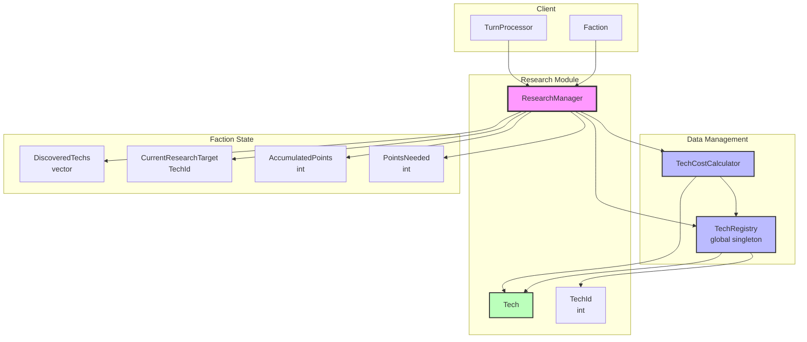

# Research System Architecture

## Component Overview

### ResearchManager
- **Purpose**: Manages a faction's research state and progress
- **Responsibilities**:
  - Track discovered technologies (`vector<TechId> m_discoveredTechs`)
  - Manage current research target (`TechId m_currentResearchTarget`)
  - Track accumulated research points (`int m_accumulatedPoints`)
  - Calculate points needed via TechCostCalculator
  - Handle tech discovery when points accumulated
- **Owned by**: Faction (each faction has its own ResearchManager)
- **Depends on**: TechRegistry (reference), TechCostCalculator (owned)

### Tech
- **Purpose**: Data structure representing a single technology
- **Responsibilities**:
  - Store tech ID, name, description
  - Manage prerequisites (vector<TechId>)
  - Store base cost for research
- **Owned by**: TechRegistry
- **Referenced by**: ResearchManager, TechCostCalculator

### TechRegistry
- **Purpose**: Global registry of all available technologies
- **Responsibilities**:
  - Register and store all `TechConfig_t` entries; lookup by id
  - **Validate the tech graph at load**: every prerequisite id exists, no tech is its own prerequisite, and the prerequisite graph is acyclic. A cycle is unreachable forever — `ResearchManager::GetAvailableTechs` only offers a tech once every prerequisite is discovered — so it must fail at load rather than present as techs quietly missing from the research menu.
- **Lifetime**: Loaded at game start into `GameDataContext`
- **Used by**: All ResearchManager instances

### TechCostCalculator
- **Purpose**: Calculate research points needed for a technology
- **Responsibilities**:
  - Evaluate the `cost_formula` from `config/tech_cost.lua` with the runtime inputs in `TechCostInputs_t` plus the tech's own `cost` as `base_cost`
  - Reject a non-positive result
- **No C++ formula and no minimum-cost floor**: both live in the Lua config. The floor used to be `std::max(1, cost)` in C++, which turned an empty or broken formula — `LuaRuntime::EvalInt` returned 0 for both — into a valid-looking research cost of 1. `EvalInt` now throws, the parser requires a non-empty `cost_formula`, and the calculator rejects a non-positive result, so a broken mod formula fails loudly instead of making every tech cost 1.
- **Pattern**: Thin Lua bridge, same shape as `PopCompositionCalculator`

## Usage Flow

### Setting Research Target
1. Faction calls `ResearchManager::SetResearchTarget(techId)`
2. ResearchManager validates tech exists in TechRegistry
3. ResearchManager calls `TechCostCalculator::CalculateCost()`
4. Points needed is stored for progress tracking

### Accumulating Research Points
1. TurnProcessor calls `ResearchManager::AddResearchPoints(points)` during ResearchAccumulation stage
2. Points are added to `m_accumulatedPoints`
3. UI can query `GetPointsNeededForCurrentTech()` for progress bar

### Tech Discovery
1. TurnProcessor checks `ResearchManager::CanDiscoverTech()`
2. If true, calls `ResearchManager::DiscoverTech()`
3. Tech ID added to `m_discoveredTechs`
4. Accumulated points reset
5. Research target cleared
6. `EvTechDiscovered` event emitted via EventBus

## Design Decisions

### Separation of Concerns
- **TechRegistry** holds static tech data (global)
- **ResearchManager** holds dynamic faction state (per-faction)
- **TechCostCalculator** encapsulates cost formula (reusable/testable)

### Moddability
- TechRegistry can load techs from configuration
- TechCostCalculator allows multiplier customization
- Formula can be adjusted without changing ResearchManager

### Testing
- TechCostCalculator can be unit tested independently
- ResearchManager can be tested with mock TechRegistry
- Tech is a simple data structure, easy to construct
