# Turn System Architecture

```mermaid
graph TB
    subgraph "Composition Root"
        Engine[Engine::Initialize_]
    end

    subgraph "Configuration"
        ConfigFile[config/turn_stages.json]
        TurnStageConfigParser[TurnStageConfigParser]
        TurnStageConfig[TurnStageConfig<br/>id, name, description<br/>repeat_for_each_faction<br/>hookContext]
    end

    subgraph "Stage Construction"
        TurnStageFactory[TurnStageFactory]
        TurnStageRegistrar["TurnStageRegistrar&lt;T&gt;<br/>(file-scope, self-registers T)"]
        CreatorRegistry[Creator registry<br/>id -> factory function]
        CustomGlobalTurnStage[CustomGlobalTurnStage]
        CustomPerFactionTurnStage[CustomPerFactionTurnStage]
    end

    subgraph "Stage Interfaces"
        TurnStageBase[TurnStageBase<br/>hook lifecycle: OnEnter/OnExit]
        GlobalTurnStage["GlobalTurnStage<br/>Execute(GameState&amp;)"]
        PerFactionTurnStage["PerFactionTurnStage<br/>Execute(GameState&amp;, Faction&amp;)"]
    end

    subgraph "Built-in Global Stages"
        TurnStart[TurnStart]
        NewYearBegins[NewYearBegins]
        WorldEvents[WorldEvents]
        VictoryConditionChecks[VictoryConditionChecks]
        TurnEnd[TurnEnd]
        Save[Save]
    end

    subgraph "Built-in Per-Faction Stages"
        ResourceCollection[ResourceCollection]
        IncomeCollection[IncomeCollection]
        ResearchAccumulation[ResearchAccumulation]
        BaseProduction[BaseProduction]
        Population[Population]
        Upkeep[Upkeep]
        PlayerActions[PlayerActions]
    end

    subgraph "Turn Execution"
        TurnProcessor[TurnProcessor]
        ProcessTurn["ProcessTurn(GameState&amp;)"]
        GlobalRegistry["m_globalRegistry<br/>map&lt;id, unique_ptr&lt;GlobalTurnStage&gt;&gt;"]
        PerFactionRegistry["m_perFactionRegistry<br/>map&lt;id, unique_ptr&lt;PerFactionTurnStage&gt;&gt;"]
        StageOrder["m_stageOrder<br/>vector&lt;id&gt;"]
    end

    subgraph "Hook System"
        HookContext[HookContext]
        Hook[Hook<br/>mod_id, script_path, callback]
    end

    Engine --> TurnStageFactory
    Engine --> TurnProcessor

    ConfigFile --> TurnStageConfigParser
    TurnStageConfigParser --> TurnStageConfig
    TurnStageConfig --> HookContext
    HookContext --> Hook

    TurnStageFactory --> TurnStageConfigParser
    TurnStageRegistrar -.->|registers at static init| CreatorRegistry
    TurnStageFactory --> CreatorRegistry
    CreatorRegistry -->|known id| TurnStageBase
    TurnStageFactory -->|unknown id, repeat=false| CustomGlobalTurnStage
    TurnStageFactory -->|unknown id, repeat=true| CustomPerFactionTurnStage

    TurnStageBase --> GlobalTurnStage
    TurnStageBase --> PerFactionTurnStage
    GlobalTurnStage --> TurnStart
    GlobalTurnStage --> NewYearBegins
    GlobalTurnStage --> WorldEvents
    GlobalTurnStage --> VictoryConditionChecks
    GlobalTurnStage --> TurnEnd
    GlobalTurnStage --> Save
    GlobalTurnStage --> CustomGlobalTurnStage
    PerFactionTurnStage --> ResourceCollection
    PerFactionTurnStage --> IncomeCollection
    PerFactionTurnStage --> ResearchAccumulation
    PerFactionTurnStage --> BaseProduction
    PerFactionTurnStage --> Population
    PerFactionTurnStage --> Upkeep
    PerFactionTurnStage --> PlayerActions
    PerFactionTurnStage --> CustomPerFactionTurnStage

    TurnStageFactory -->|dynamic_cast buckets each stage| GlobalRegistry
    TurnStageFactory -->|dynamic_cast buckets each stage| PerFactionRegistry

    TurnProcessor --> ProcessTurn
    TurnProcessor --> GlobalRegistry
    TurnProcessor --> PerFactionRegistry
    TurnProcessor --> StageOrder
    ProcessTurn -->|id in GlobalRegistry| GlobalTurnStage
    ProcessTurn -->|id in PerFactionRegistry, once per Faction| PerFactionTurnStage
    ProcessTurn -->|id in neither| Throw[throws std::runtime_error]

    style TurnProcessor fill:#bbf,stroke:#333,stroke-width:4px
    style TurnStageFactory fill:#bbf,stroke:#333,stroke-width:4px
    style TurnStageConfig fill:#ff9,stroke:#333,stroke-width:2px
    style ConfigFile fill:#bfb,stroke:#333,stroke-width:2px
    style GlobalTurnStage fill:#fbf,stroke:#333,stroke-width:2px
    style PerFactionTurnStage fill:#fbf,stroke:#333,stroke-width:2px
```



## Component Overview

### TurnStageBase / GlobalTurnStage / PerFactionTurnStage
(`include/game/TurnStages.h`)

A turn stage never receives a parameter it cannot use: rather than one interface with
nullable `GameState*`/`Faction*` arguments, there are two narrow interfaces, matching the
two ways a stage can run:

- **`TurnStageBase`**: shared hook lifecycle only (`OnEnter()`/`OnExit()` run pre/post
  hooks; `HasReplaceHooks()`/`ExecuteReplaceHooks()` are protected helpers for the two
  subclasses below). Declares no `Execute` — it carries no execution contract of its own.
- **`GlobalTurnStage`**: `Execute(GameState& rGameState)`, for stages that run once per
  turn (e.g. `TurnStart`, `Save`). NVI: the public, non-virtual `Execute` checks for a
  replace hook and otherwise calls the protected pure-virtual `ExecuteImpl(GameState&)`.
- **`PerFactionTurnStage`**: `Execute(GameState& rGameState, Faction& rFaction)`, for
  stages that run once per faction per turn (e.g. `IncomeCollection`, `BaseProduction`).
  Same NVI shape, with `ExecuteImpl(GameState&, Faction&)`.

Every concrete stage derives from exactly one of the two, declared and overridden
consistently as `protected` (no more private-in-base/public-in-derived mismatch).

### TurnStageFactory (`TurnStageFactory.{h,cpp}`)
Builds stage instances from parsed config and buckets them by interface:

- **`RegisterCreator(id, creator)`**: a static registration hook. Built-in stages don't
  need a case in this file — see `TurnStageRegistrar` below.
- **`CreateStageInstance(config)`**: looks up `config.id` in the creator registry; if
  found, invokes the creator. If not found (a mod-defined id with no C++ class), falls
  back to `CustomGlobalTurnStage` or `CustomPerFactionTurnStage` based on
  `config.repeat_for_each_faction` — the only place that flag decides a stage's shape,
  since mod stages have no static C++ type to derive it from.
- **`CreateStages()`**: for each config, creates the instance, then `dynamic_cast`s it
  into `GlobalTurnStageRegistry_t` or `PerFactionTurnStageRegistry_t` (throws if a stage
  is somehow neither — cannot happen for any type reachable via `RegisterCreator` or the
  `Custom*` fallback, but guards the invariant if a future stage type violates it).

### TurnStageRegistrar<T> (`TurnStageRegistrar.h`)
A template whose constructor calls `TurnStageFactory::RegisterCreator`. Each built-in
stage's `.cpp` defines one file-scope instance:
```cpp
namespace { TurnStageRegistrar<BaseProduction> g_registrar("BaseProduction"); }
```
This runs at static-init time, before `main`. Adding a new built-in stage means adding its
class and this one line — `TurnStageFactory.cpp` is never edited (Open/Closed).

### TurnProcessor (`TurnProcessor.{h,cpp}`)
- **State**: `m_globalRegistry`, `m_perFactionRegistry` (both populated once at
  construction), `m_stageOrder` (the ordered list of ids from config).
- **`ProcessTurn(GameState& rGameState)`**: for each id in `m_stageOrder`, looks it up in
  `m_globalRegistry` first, then `m_perFactionRegistry`. A hit in the global registry
  calls `Execute(rGameState)` once; a hit in the per-faction registry calls
  `Execute(rGameState, rFaction)` once per `rGameState.Factions()`. An id in neither
  **throws** `std::runtime_error` — a typo in `turn_stages.json` fails turn processing
  loudly instead of silently dropping the stage.
- Mission year comes from `rGameState.GetMissionYear()` (logged, not cached as a member);
  faction count comes from `rGameState.Factions()` directly — no separate `numFactions` or
  `repeatFlags` parameters to keep in sync with the registries.

### Custom (mod-defined) stages (`stages/CustomTurnStage.{h,cpp}`)
`CustomGlobalTurnStage` and `CustomPerFactionTurnStage` are thin, hook-only stages for ids
present in `turn_stages.json` but with no matching built-in C++ class (e.g.
`CustomModStage` in the sample config). Both require at least one hook (pre/post/replace)
at construction, or they would silently do nothing.

### HookContext / Hook (`HookContext.h`)
Unchanged: `pre`, `post`, and `replace` hook lists per stage, parsed from the stage's
`hooks` object in config. `Hook::callback` is still `std::function<void()>` — not yet
wired to any script runtime (see the moddability finding in
`docs/code-review-findings.md` §1.10; hooks receive no `GameState`/`Faction` context, so a
real mod script could not act on one yet even though the plumbing to invoke a callback
exists).

### Configuration (`config/turn_stages.json`)
A flat JSON array (no nesting/sub-stages). Each entry: `id` (matches a registrar id or is
a custom/mod stage), `name`, `description`, `repeat_for_each_faction`, and `hooks.{pre,
post,replace}` (each a list of `{mod_id, script_path}`). `TurnStageConfigParser` parses
this directly into a `std::vector<TurnStageConfig>` — order in the array is turn order.

### Built-in stages
- **Global** (`repeat_for_each_faction: false`): `TurnStart`, `NewYearBegins`,
  `WorldEvents`, `VictoryConditionChecks`, `TurnEnd`, `Save`.
- **Per-faction** (`repeat_for_each_faction: true`): `ResourceCollection`,
  `IncomeCollection`, `ResearchAccumulation`, `BaseProduction`, `Population`, `Upkeep`,
  `PlayerActions`.

Several of these (`TurnStart`, `NewYearBegins`, `WorldEvents`, `VictoryConditionChecks`,
`TurnEnd`, `Save`, `Upkeep`, `PlayerActions`) are placeholder logging stages — the actual
game rules for those phases are not yet implemented (see the coding guideline: leave a
TODO rather than invent rules).

### Integration Flow
1. `Engine::Initialize_` constructs a `TurnStageFactory`, calls `LoadConfig` (throws if
   the file is missing or produces no stages), and calls `CreateStages()` to get the two
   registries.
2. `Engine` builds `stageOrder` from `GetStageConfigs()` and constructs a `TurnProcessor`
   with the two registries plus `stageOrder`.
3. Each turn, `Engine::ProcessTurn_` calls `m_turnProcessor->ProcessTurn(*m_gameState)`.
4. For each stage id, in order: `OnEnter()` (pre-hooks) → dispatch by registry membership
   (global once, or per-faction once per `Faction`) → `OnExit()` (post-hooks). A stage
   with a replace hook skips its `ExecuteImpl` entirely and runs the replace hook instead.
5. `Engine` increments the mission year after `ProcessTurn` returns.
