# Turn System Architecture

```mermaid
graph TB
    subgraph "Composition Root"
        Engine[Engine::InitializeUi_]
    end

    subgraph "Configuration"
        ConfigFile[config/turn_stages.json]
        TurnStageConfigParser[TurnStageConfigParser]
        TurnStageConfig[TurnStageConfig_t<br/>id, name, description<br/>bRepeatForEachFaction<br/>hookContext]
    end

    subgraph "Stage Construction"
        TurnStageFactory[TurnStageFactory]
        TurnStageRegistrar["TurnStageRegistrar&lt;T&gt;<br/>(compile-time Global vs PerFaction)"]
        GlobalCreators[Global creator registry]
        PerFactionCreators[Per-faction creator registry]
        CustomGlobalTurnStage[CustomGlobalTurnStage]
        CustomPerFactionTurnStage[CustomPerFactionTurnStage]
    end

    subgraph "Stage Interfaces"
        TurnStageBase[TurnStageBase<br/>OnEnter/OnExit + OnExitImpl]
        GlobalTurnStage["GlobalTurnStage<br/>Execute(GameState&amp;)"]
        PerFactionTurnStage["PerFactionTurnStage<br/>Execute(GameState&amp;, Faction&amp;)"]
    end

    subgraph "Built-in Global Stages"
        TurnStart[TurnStart]
        WorldEvents[WorldEvents]
        VictoryConditionChecks[VictoryConditionChecks]
        TurnEnd[TurnEnd]
        Save[Save]
    end

    subgraph "Built-in Per-Faction Stages"
        ResourceCollection[ResourceCollection]
        UnitSupport[UnitSupport]
        SurplusConversion[SurplusConversion]
        IncomeCollection[IncomeCollection]
        ResearchAccumulation[ResearchAccumulation]
        Upkeep[Upkeep]
        BaseProduction[BaseProduction]
        Population[Population]
        PlayerActions[PlayerActions]
        Mood[Mood]
    end

    subgraph "Turn Execution"
        TurnProcessor[TurnProcessor]
        Advance["Advance(GameState&amp;)"]
        GlobalRegistry["m_globalRegistry"]
        PerFactionRegistry["m_perFactionRegistry"]
        StageOrder["m_stageOrder"]
    end

    subgraph "Hook_t System"
        HookContext[HookContext]
        Hook_t[Hook_t<br/>modId, scriptPath, callback]
    end

    Engine --> TurnStageFactory
    Engine --> TurnProcessor

    ConfigFile --> TurnStageConfigParser
    TurnStageConfigParser --> TurnStageConfig
    TurnStageConfig --> HookContext
    HookContext --> Hook_t

    TurnStageFactory --> TurnStageConfigParser
    TurnStageRegistrar -.->|registers at static init| GlobalCreators
    TurnStageRegistrar -.->|registers at static init| PerFactionCreators
    TurnStageFactory --> GlobalCreators
    TurnStageFactory --> PerFactionCreators
    GlobalCreators -->|known id| GlobalTurnStage
    PerFactionCreators -->|known id| PerFactionTurnStage
    TurnStageFactory -->|unknown id, repeat=false| CustomGlobalTurnStage
    TurnStageFactory -->|unknown id, repeat=true| CustomPerFactionTurnStage

    TurnStageBase --> GlobalTurnStage
    TurnStageBase --> PerFactionTurnStage
    GlobalTurnStage --> TurnStart
    GlobalTurnStage --> WorldEvents
    GlobalTurnStage --> VictoryConditionChecks
    GlobalTurnStage --> TurnEnd
    GlobalTurnStage --> Save
    GlobalTurnStage --> CustomGlobalTurnStage
    PerFactionTurnStage --> ResourceCollection
    PerFactionTurnStage --> UnitSupport
    PerFactionTurnStage --> SurplusConversion
    PerFactionTurnStage --> IncomeCollection
    PerFactionTurnStage --> ResearchAccumulation
    PerFactionTurnStage --> Upkeep
    PerFactionTurnStage --> BaseProduction
    PerFactionTurnStage --> Population
    PerFactionTurnStage --> PlayerActions
    PerFactionTurnStage --> Mood
    PerFactionTurnStage --> CustomPerFactionTurnStage

    TurnProcessor --> Advance
    TurnProcessor --> GlobalRegistry
    TurnProcessor --> PerFactionRegistry
    TurnProcessor --> StageOrder
    Advance -->|Yield| Pause[pause until next Advance]
    Advance -->|exception| Abort[OnExit then rethrow; Reset recovers]

    style TurnProcessor fill:#bbf,stroke:#333,stroke-width:4px
    style TurnStageFactory fill:#bbf,stroke:#333,stroke-width:4px
    style TurnStageConfig fill:#ff9,stroke:#333,stroke-width:2px
    style ConfigFile fill:#bfb,stroke:#333,stroke-width:2px
    style GlobalTurnStage fill:#fbf,stroke:#333,stroke-width:2px
    style PerFactionTurnStage fill:#fbf,stroke:#333,stroke-width:2px
```

## Component Overview

### TurnStageBase / GlobalTurnStage / PerFactionTurnStage
(`include/game/TurnStages.h`)

A turn stage never receives a parameter it cannot use: rather than one interface with
nullable `GameState*`/`Faction*` arguments, there are two narrow interfaces:

- **`TurnStageBase`**: shared hook lifecycle (`OnEnter`/`OnExit`). Subclasses may override
  `OnEnterImpl` / `OnExitImpl` for stage-local cleanup (e.g. `PlayerActions` pass state).
  `HasReplaceHooks()` is true only when a replace hook has a **callable** callback —
  unbound replace entries must not suppress `ExecuteImpl`.
- **`GlobalTurnStage`**: `Execute(GameState&)`, once per turn.
- **`PerFactionTurnStage`**: `Execute(GameState&, Faction&)`, once per living faction per turn.

### Yield / resume contract

`StageResult_t::Yield` pauses turn processing. The next `TurnProcessor::Advance` re-enters
the **same** stage (and, for per-faction stages, the **same** faction until that faction
`Continue`s). UI / Engine must not assume turns are atomic — overlays and player input may
sit between `Advance` calls (see UI modal gating; package 2).

Mid-stage player prompts (production abandon, tech notices, …) use the
[player interaction queue](player-interaction-system.md): stages `Enqueue` + `Yield` when
`HasPendingFor` the player; `InteractionPresenter` maps `Front` to Notice / OpenView and
calls `CompleteFront` then `ProcessTurn_` after resolution.
`YieldingPerFactionTurnStage` shares faction-bind and `PlayerHasPending_` for `BaseProduction`
and `PlayerActions` (entity loops stay separate). Enqueuing itself is the free function
`EnqueueForPlayer` next to `PlayerInteractionQueue`, not a stage member: `Population` warns
about a pending riot without being a yielding stage.

`PlayerActions` for a player faction:

1. Queued player interactions `Yield` first, in either phase (`PlayerHasPending_`).
2. First enter of a pass → `Yield` (`AwaitingInteraction`) so the player can issue orders.
3. Resume (End Turn) → resolve pending multi-turn orders; if a unit still needs orders →
   `Yield` again without re-executing units already advanced this pass.
4. When the faction pass `Continue`s (or the stage exits), phase and the advanced-unit set
   reset so a later player still gets the interaction gate.

### TurnProcessor (`TurnProcessor.{h,cpp}`)

- **`Advance(GameState&)`**: runs stages until one yields, wrapping the stage order for the
  next turn cycle. Throws if a full cycle completes with no yielding stage.
- **Per-faction resume**: tracks completed faction ids for the current stage and the
  yielded faction id. Does **not** depend on monotonic id ordering. If the resume faction
  disappears while yielded, remaining incomplete factions are processed.
- **Exceptions**: after `OnEnter`, a throw from `Execute` still runs `OnExit` (post hooks)
  and clears entered/resume state, then rethrows. **`Reset()`** returns the processor to
  stage index 0 for recovery after a poisoned no-yield cycle or aborted stage.
- Erasing a faction mid-stage loop is unsupported until the lifetime protocol defines it —
  see `docs/architecture/high-level.md`, "Object lifetime and ownership transfer", which
  covers unit/base destroy and transfer but explicitly defers faction elimination.

### TurnStageFactory / TurnStageRegistrar

- Built-ins register via `TurnStageRegistrar<T>` into **typed** global or per-faction
  creator maps (`if constexpr` on the base). `CreateStages` does not rediscover kind by RTTI.
- `repeatForEachFaction` in config is cross-checked against the registered kind (mismatch
  throws). For unknown (mod) ids the flag selects `CustomGlobalTurnStage` vs
  `CustomPerFactionTurnStage`.
- Duplicate stage ids throw at parse / create. `scriptPath` hooks throw at parse (no Lua
  loader yet). Custom stages require at least one **callable** callback.

### Built-in stage behaviour (non-exhaustive)

- **`TurnStart`**: increments mission year (`GameState::k_StartingMissionYear` → first
  playable year `k_FirstPlayableMissionYear`), publishes turn-start events, refreshes moves.
- **`WorldEvents`**: forest/kelp spread via `SpreadTerraformImprovements`, using
  `GameState::GetRng()` and `GetYearsSinceFirstPlayableYear()` (session stream — not a
  private year×area seed).
- **`Population`**: growth, composition recalculation, then `ForecastMood` per base —
  which sets *pending* riot / golden-age state and enqueues the player's warning, without
  applying any gameplay effect. Starve-to-zero bases are razed here.
- **`ResourceCollection`**: `ProduceBaseResources` only.
- **`UnitSupport`**: `ApplyMineralSupport` — home-unit support charged against the mineral
  bank ResourceCollection just filled; surplus units disband.
- **`SurplusConversion`**: `ConvertSurplusMinerals` — whatever support left goes through the
  base's queued stockpile item (or is wasted when none is available). Ordered before
  `IncomeCollection` / `ResearchAccumulation` so converted econ and labs are spent this turn.
  Stockpiles are their own config family (`config/stockpiles.json`, `StockpileRegistry`), not
  buildings; `BaseManager::ConvertSurplusMinerals` delegates to `ApplyStockpileConversionAtBase`,
  which resolves the stockpile config's own effects and never touches the base effect pool.
- **`Upkeep`**: deploy-record pruning and facility energy upkeep (after income).

  The three mineral phases are separate stages rather than one because the ordering is a
  game rule, and `turn_stages.json` is where turn order is expressed and where a mod can
  change it. Exactly one stage drains the mineral bank per turn: `SurplusConversion` for
  stockpile and empty queues, `BaseProduction` for real build items. `ApplyProduction` must
  not convert on the stockpile path even when it finds a non-empty bank — conversion is only
  correct before `IncomeCollection` / `ResearchAccumulation`. The bank accumulates across
  turns (`ResourceManager::ProduceMinerals_`), so minerals left standing convert next turn at
  the right stage rather than being lost.
- **`PlayerActions`**: interactive yield + idempotent order resolution (above).
- **`Mood`**: `CommitMood` per base — the second half of the split `Population` began.
  Forecast warns *before* `PlayerActions` so the player can still avert a riot by moving
  specialists or psych; commit re-evaluates *after* they had that chance and latches the
  result, ages a probe-forced riot, and advances the consecutive-riot count that selects the
  escalation tier. The active tier's `on_enter_effects` (facility destruction, rebellion)
  fire here. See `docs/architecture/population-system.md` for the mood lifecycle itself.

  The stage keeps pass-local state (`m_committedBaseIds`, cleared in `OnEnterImpl`) because a
  rebelling base changes owner mid-pass: without it the receiving faction's turn through the
  faction loop would commit the same base a second time in one turn.

### Configuration (`config/turn_stages.json`)

Flat JSON array; order is turn order. Each entry: `id`, `name`, `description`,
`repeatForEachFaction`, and `hooks.{pre,post,replace}` (lists of `{modId, scriptPath}`).
Stock config has no unbound Custom/mod sample stage.

### Integration Flow

1. `Engine::InitializeUi_` (the third composition-root phase — see `high-level.md`) loads
   `config/turn_stages.json`, `CreateStages()`, builds `stageOrder` from configs, constructs
   `TurnProcessor`.
2. Each interactive step, `Engine` calls `m_turnProcessor->Advance(*m_gameState)` when the
   UI allows turn advance (modal contract is package 2).
3. For each stage: `OnEnter` → `Execute` (possibly `Yield`) → on `Continue`, `OnExit`.
4. Replace hooks skip `ExecuteImpl` **only** when a replace callback is callable.
