# Unit Designer System

The Unit Designer lets the player compose a `UnitDesign` from components, review its combined stats, save designs to `Military`, and browse saved designs.

## Layout

```
┌──────────────┬──────────────────────────┬──────────────┬──────────────┐
│              │   Left column (25%)      │  Center (50%)│ Right (25%)  │
│ Unit Status  ├──────────────────────────┤              ├──────────────┤
│ Panel (15%)  │  Chassis slot            │  Design Stats│  Reactor slot│
│              ├──────────────────────────┤  (combined   ├──────────────┤
│ - Design name│  Weapon slot             │   stats +    │  Ability 1   │
│ - Active cnt ├──────────────────────────┤   Save btn)  ├──────────────┤
│ - In prod    │  Armour slot             │              │  Ability 2   │
│              ├──────────────────────────┴──────────────┴──────────────┤
│              │  Bottom: all saved designs as boxes (DesignListPanel)   │
└──────────────┴────────────────────────────────────────────────────────┘
```

## Component Diagram

```mermaid
graph TB
    subgraph "UnitDesignerView (IGameView)"
        UDV[UnitDesignerView]
        State[UnitDesignerState_t<br/>pChassis, pWeapon, pArmour<br/>pReactor, pAbility1, pAbility2]
        SelectedDesign[m_pSelectedDesign<br/>const UnitDesign*]
    end

    subgraph "UIElements (owned by view)"
        CSD0[ComponentSlotDisplay — Chassis]
        CSD1[ComponentSlotDisplay — Weapon]
        CSD2[ComponentSlotDisplay — Armour]
        DStats[DesignStatsDisplay<br/>reads State, shows stats<br/>Save Design button]
        CSD3[ComponentSlotDisplay — Reactor]
        CSD4[ComponentSlotDisplay — Ability 1]
        CSD5[ComponentSlotDisplay — Ability 2]
        DList[DesignListPanel<br/>bottom row of design boxes]
        USP[UnitStatusPanel<br/>left panel]
    end

    subgraph "Popup (added dynamically)"
        CSP[ComponentSelectorPopup<br/>lists components of chosen type]
    end

    subgraph "Game Data"
        Military[Military<br/>stores UnitDesign unique_ptrs]
        Registry[UnitComponentRegistry<br/>all component configs]
        UnitMgr[UnitManager<br/>active units]
    end

    UDV -->|holds| State
    UDV -->|holds| SelectedDesign
    UDV -->|owns| CSD0
    UDV -->|owns| CSD1
    UDV -->|owns| CSD2
    UDV -->|owns| DStats
    UDV -->|owns| CSD3
    UDV -->|owns| CSD4
    UDV -->|owns| CSD5
    UDV -->|owns| DList
    UDV -->|owns| USP
    UDV -->|spawns on slot click| CSP

    CSD0 -->|reads via lambda| State
    CSD1 -->|reads via lambda| State
    CSD2 -->|reads via lambda| State
    CSD3 -->|reads via lambda| State
    CSD4 -->|reads via lambda| State
    CSD5 -->|reads via lambda| State
    DStats -->|reads ptr to| State
    DStats -->|Save click →| UDV
    UDV -->|AddDesign| Military
    DList -->|reads| Military
    DList -->|click sets| SelectedDesign
    USP -->|reads via lambda| SelectedDesign
    USP -->|counts active in| UnitMgr
    CSP -->|filters| Registry
    CSP -->|selection →| State
```



## Data Flow: Selecting a Component

1. Player clicks a `ComponentSlotDisplay` → triggers the slot's `onClicked` lambda
2. `UnitDesignerView::ShowComponentSelector_()` filters `UnitComponentRegistry` by type
3. A `ComponentSelectorPopup` is pushed onto `m_elements`
4. Player picks an entry → popup calls the lambda that sets the matching field in `UnitDesignerState_t`
5. Popup closes (`m_bShouldClose = true`), removed next frame
6. `DesignStatsDisplay` reads the updated state on the next render and shows new stats

## Data Flow: Saving a Design

1. When all 4 mandatory components are selected `DesignStatsDisplay` shows "Save Design"
2. Player clicks it → `onSaveDesign` callback fires → `UnitDesignerView::HandleSaveDesign_()`
3. A `std::unique_ptr<UnitDesign>` is constructed and passed to `Military::AddDesign()`
4. `DesignListPanel` reads `Military::GetDesigns()` each frame — new design appears immediately

## TODOs

- `UnitStatusPanel` "In Prod" counter requires `UnitDesign` integration with `BaseManager` production queue
- `UnitManager` is not yet wired into `Faction`; pass it once available to show accurate active counts
- Design naming: currently auto-generated from component names; add a text-entry flow to let the player name designs
