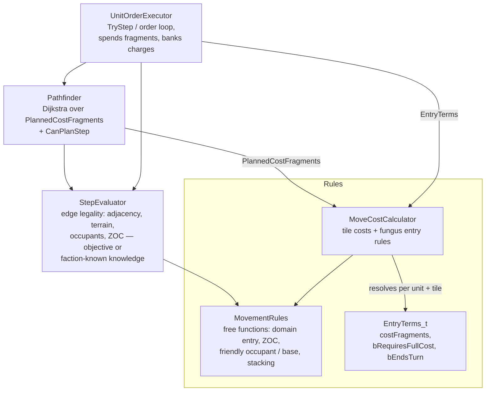

# Unit Movement System

Movement is split into four components with one-way dependencies: rule resolution
(`MoveCostCalculator`), legality checks (`StepEvaluator` + the free functions in
`MovementRules.h`), planning (`Pathfinder`), and execution (`UnitOrderExecutor`). All
entry-cost and fungus rules live in `MoveCostCalculator`; the executor and pathfinder only
consume its output and never inspect tile features themselves.

## MoveCostCalculator — the single home of entry rules

`ForUnit(unit, map)` returns a `Query` that caches the unit's rule flags
(`IgnoreDifficultTerrain`, `TreatFungusAsRoad`). A `Query` resolves each tile into an
`EntryTerms_t`:

- **`costFragments`** — the tile's entry price. Highest `move_cost` among the tile's terrain
  features and improvements; any `move_cost_override` replaces that result entirely (even
  when higher), and among multiple overrides the lowest wins (MagTube 0 beats Road 1/3).
  Nothing configured → `defaultMoveCost`. `IgnoreDifficultTerrain` caps non-fungus feature
  costs at the default. `TreatFungusAsRoad` makes fungus contribute Road's
  `move_cost_override` instead of its own cost.
- **`bRequiresFullCost`** — the full price must be banked (possibly across turns) before the
  unit may enter. Set for fungus without an override in play and without a friendly occupant.
  When false, any positive fragment balance admits the unit (the cost clamps to what
  remains) — the default terrain rule.
- **`bEndsTurn`** — entering zeroes the unit's remaining fragments. Set for fungus without
  an override in play, friendly occupant or not.

An override "in play" (a Road or MagTube built on the tile, or `TreatFungusAsRoad`) negates
both fungus flags along with the cost — infrastructure bypasses the fungus entry rules.

Costs are integer *fragments*: `MovementConstants_t::k_moveFragmentsPerPoint` (360) per
movement point, so fractional configs like Road's `"1/3"` stay exact integers.

## Planning vs execution

The `Query` exposes two views of the same terms, one per consumer:

- `EntryTerms(tile)` — the raw rules, resolved from objective tile state. Consumed by
  `UnitOrderExecutor` when actually spending fragments.
- `PlannedCostFragments(tile)` — Dijkstra edge weight for `Pathfinder`. Shrouded
  (unexplored) tiles report the default cost so the planner cannot see rockiness / fungus /
  roads under fog. End-turn entries are valued in whole turns of the unit's movement
  allotment: a banked entry costs `ceil(cost / allotment)` turns, an immediate
  (friendly-occupant) entry exactly one — this is why a clear detour beats a
  "cheaper-looking" fungus shortcut.

## Execution

`UnitOrderExecutor::SpendMovesAndEnter_` is rule-agnostic — it just acts on the terms:

1. `bRequiresFullCost` and the banked total (`MoveOrder_t::chargeFragmentsPaid` toward
   `pChargeTile`) plus this turn's fragments still fall short → bank the remainder, zero the
   unit's fragments, stay put. Switching charge target resets the bank.
2. Otherwise enter: remaining fragments become `0` when `bEndsTurn`, else
   `available - costFragments` (clamped at 0, so ordinary terrain admits a last-fragment
   entry into any cost).

`Execute_(MoveOrder_t)` loops `Pathfinder::NextStep` → `TryStep`, re-planning after every
step because each step can reveal fog or hostiles (which also cancels the order via
`CancelMoveOrderIfNewHostile_`).
