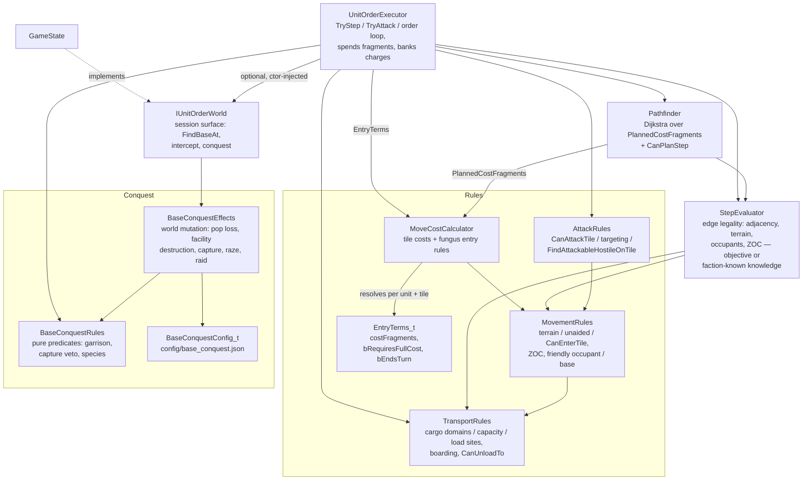

# Unit Movement System

Movement is split into components with one-way dependencies: rule resolution
(`MoveCostCalculator`), legality checks (`StepEvaluator` + the free functions in
`MovementRules.h` and `TransportRules.h`), planning (`Pathfinder`), and execution
(`UnitOrderExecutor`). All entry-cost and fungus rules live in `MoveCostCalculator`; the
executor and pathfinder only consume its output and never inspect tile features themselves.

## MoveCostCalculator — the single home of entry rules

`ForUnit(unit, map)` returns a `Query` that caches the unit's rule flags
(`IgnoreDifficultTerrain`, `TreatFungusAsRoad`). A `Query` resolves each tile into an
`EntryTerms_t`:

- **`costFragments`** — the tile's entry price. Highest `move_cost` among the tile's terrain
  features and improvements; any `move_cost_override` replaces that result entirely (even
  when higher), and among multiple overrides the lowest wins (MagTube 0 beats Road 1/3).
  Nothing configured → `defaultMoveCost`. `IgnoreDifficultTerrain` caps non-fungus feature
  costs at the default. `TreatFungusAsRoad` makes fungus contribute Road's
  `move_cost_override` instead of its own cost.
- **`bRequiresFullCost`** — the full price must be banked (possibly across turns) before the
  unit may enter. Set for fungus without an override in play and without a friendly occupant.
  When false, any positive fragment balance admits the unit (the cost clamps to what
  remains) — the default terrain rule.
- **`bEndsTurn`** — entering zeroes the unit's remaining fragments. Set for fungus without
  an override in play, friendly occupant or not.

An override "in play" (a Road or MagTube built on the tile, or `TreatFungusAsRoad`) negates
both fungus flags along with the cost — infrastructure bypasses the fungus entry rules.

Costs are integer *fragments*: `MovementConstants_t::k_moveFragmentsPerPoint` (360) per
movement point, so fractional configs like Road's `"1/3"` stay exact integers.

## Planning vs execution

The `Query` exposes two views of the same terms, one per consumer:

- `EntryTerms(tile)` — the raw rules, resolved from objective tile state. Consumed by
  `UnitOrderExecutor` when actually spending fragments.
- `PlannedCostFragments(tile)` — Dijkstra edge weight for `Pathfinder`. Shrouded
  (unexplored) tiles report the default cost so the planner cannot see rockiness / fungus /
  roads under fog. End-turn entries are valued in whole turns of the unit's movement
  allotment: a banked entry costs `ceil(cost / allotment)` turns, an immediate
  (friendly-occupant) entry exactly one — this is why a clear detour beats a
  "cheaper-looking" fungus shortcut.

## Execution

`UnitOrderExecutor::SpendMovesAndEnter_` is rule-agnostic — it just acts on the terms:

1. `bRequiresFullCost` and the banked total (`MoveOrder_t::chargeFragmentsPaid` toward
   `pChargeTile`) plus this turn's fragments still fall short → bank the remainder, zero the
   unit's fragments, stay put. Switching charge target resets the bank.
2. Otherwise enter: remaining fragments become `0` when `bEndsTurn`, else
   `available - costFragments` (clamped at 0, so ordinary terrain admits a last-fragment
   entry into any cost).

`Execute_(MoveOrder_t)` loops `Pathfinder::NextStep` → `TryStep`, re-planning after every
step because each step can reveal fog or hostiles (which also cancels the order via
`CancelMoveOrderIfNewHostile_`).

`SpendMovesAndEnter_` splits arrival into two phases. `EnterTile_` does position and move
cost only; `ApplyArrivalEffects_` then runs the side effects of *being* on the new tile —
boarding a transport parked there, and base-entry conquest.

### A step can destroy the mover

`TryStep` returns `StepResult_t { bEntered, bMoverDestroyed }` rather than a bool, because a
native-life raider is consumed by the base it raids: the step legally succeeds and leaves no
mover behind. The flag propagates outward — `ApplyArrivalEffects_` → `SpendMovesAndEnter_` →
`TryStep` → `Execute_` → `Execute` → `PlayerActions` — and every layer stops touching the
unit once it is set. `Execute` reports this as `OrderProgress_t::UnitDestroyed`, which is
distinct from `Expended`: `Expended` means *the caller must* `DestroyUnit`, `UnitDestroyed`
means it already happened. `TryStep` is `[[nodiscard]]` so this cannot be dropped silently.

## Transports and cargo

`MovementRules` owns the entry ladder and is what other modules call. For the boarding
case it asks `TransportRules::FindBoardableTransport` (`.cpp` edge only; headers stay
acyclic). Three entry predicates form a ladder:

- `CanEnterTileTerrain` (MovementRules) — chassis domain against raw terrain.
- `CanOccupyTileUnaided` (MovementRules) — the above, plus a land unit garrisoning a friendly
  sea base. "Can this unit hold this tile with nothing under it?"
- `CanEnterTile` (MovementRules) — the above, plus the land exceptions that depend on what
  else is on the tile: boarding a friendly transport, or `Permission(Enter)` onto a
  qualifying sea-base tile. Neither grants free ocean movement.

Carrier capability is entirely config-driven via the `TransportParams` effect: which
passenger domains a carrier accepts, and which tile capabilities it needs in order to
exchange cargo (`loadSiteFlags`, resolved through `TileProvidesFlag` — see
`effects-system.md`). Capacity itself is the `cargo_capacity` stat.

**Attack implies entry (every domain).** `AttackRules::CanAttackTile` requires
`CanEnterTile` — ships therefore cannot attack shore; air may attack wherever it can land.
Land additionally needs `Permission(Attack)` on a channel crossing (embarked, or attacker
tile water-ness differs from the target). Amphibious Pods grant conditional `Enter`
(Water+Base) and unconditional `Attack`. Declare-attack legality for `TryAttack` / UI is
`FindAttackableHostileOnTile` (moves, adjacency, visible hostile, `CanAttackTile`);
targeting rules (embarked-in-base, prefer carrier) live in `FindVisibleHostileOnTile`.

An embarked unit shares its carrier's tile. Outside a base it is excluded from ZOC,
combat targeting, and tile occupancy; in a base it may defend and block (carrier preferred
as the combat target). `UnitPositionIndex::MoveUnit` carries cargo along with the carrier,
and `StepEvaluator` routes an embarked mover through `CanUnloadTo` instead of the normal
terrain check.

### Boarding is only automatic where it has to be

Two entry points, deliberately different:

- `TryAttachToTransport` — the explicit **L** order. Boards wherever boarding is legal,
  including inside a base.
- `TryAutoAttachOnEntry` — applied silently by `ApplyArrivalEffects_` after a step. Boards
  **only** when the passenger fails `CanOccupyTileUnaided`, i.e. when it could not otherwise
  be on that tile at all.

So stepping onto open water loads a land unit onto the transport waiting there, while walking
into a base never stows a unit behind the player's back. `SurvivesCarrierLoss` uses the same
predicate from the other direction: when a carrier is destroyed, cargo that can hold the tile
unaided is set down on it and cargo that cannot goes down with the carrier — a ship sunk in
port does not drown the garrison, one sunk at sea does.

`HasBaseGarrison` counts embarked units in a base (cargo holds against capture and may
defend). Open-sea cargo remains invisible to `FindVisibleHostileOnTile`.

## Base conquest

Conquest is split so the predicates stay testable without a live world:

- `BaseConquestRules` — pure predicates only. `HasBaseGarrison`, `CanCaptureBase`
  (`CannotCaptureBases` is the sole veto — Needlejet/Missile chassis, noncombat modules),
  and the species tests. Land assault legality lives in `AttackRules` /
  `MovementRules::CanEnterTile`.
- `BaseConquestEffects` — every world mutation, returning a `BaseConquestResult_t` tally
  (population lost, facilities destroyed, escape pods, razed, actor destroyed).

Two entry points, reached from `UnitOrderExecutor`:

- `ResolvePostCombatBaseConquest` — after the last garrison on a base tile dies. Applies
  last-defender population loss (Additive `LastDefenderPopLoss`; `base_conquest.json` Adds the
  baseline, Perimeter Defense and Citizen difficulty `MaxClamp` 0 cancel it), then a
  native raid if the attacker is native life. **Capture requires stepping onto the tile**, so
  combat alone never transfers ownership.
- `ResolveBaseEntryConquest` — a unit entered an ungarrisoned foreign base tile. Native life
  raids; anything else captures if `CanCaptureBase`. Same-species capture pop loss is the
  separate Additive `CapturePopLoss`, resolved before random facility destruction so a
  `ThisBase` clamp still counts if the granting building is then demolished. How many
  facilities are destroyed is likewise resolved from the base's effects — Additive
  `CaptureFacilitiesDestroyedMin` and `CaptureFacilitiesDestroyedMaxPercent`, each clamped
  against the eligible count so no modifier can invert the range. It is independent
  of `LastDefenderPopLoss`: Perimeter Defense guards the last-defender case only, and nothing
  in the shipping config modifies capture loss.

Same-species capture (and probe mind-control) also starts a recently-conquered drone window
on the base: extra drones for `assimilation_drones × assimilation_decay_turns` turns
(shipping 50), at `assimilation_drones` (shipping 5) minus one per decay interval, capped by
`floor(base_size/4 + ConqueredDroneCap)`. Recapture by the faction the window still names as
former owner inverts elapsed time into remaining duration — 12 turns in becomes 1 drone for
12 turns. Diplomatic `TransferBaseTo` does not start the window.

Razing (population reaching zero) tombstones the base's Secret Projects through
`GameState::MarkSecretProjectDestroyed`, so no faction can rebuild them.

Both entry points need session-wide state the map and pathfinder cannot supply. That reaches
the executor through `IUnitOrderWorld`, a narrow interface `GameState` implements and passes
to the executor's constructor. It is nullable: movement-only test harnesses build an executor
with no world, which disables intercept and conquest but leaves stepping intact.
