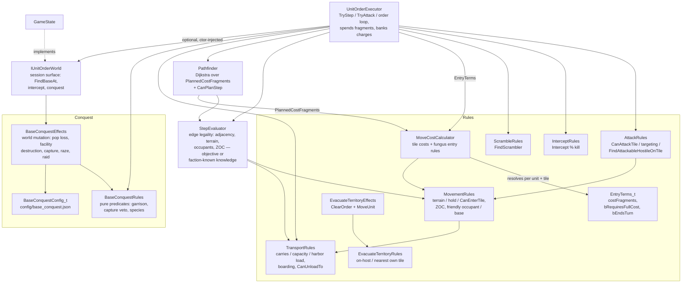

# Unit Movement System

Movement is split into components with one-way dependencies: rule resolution
(`MoveCostCalculator`), legality checks (`StepEvaluator` + the free functions in
`MovementRules.h` and `TransportRules.h`), planning (`Pathfinder`), and execution
(`UnitOrderExecutor`). All entry-cost and fungus rules live in `MoveCostCalculator`; the
executor and pathfinder only consume its output and never inspect tile features themselves.

## MoveCostCalculator — the single home of entry rules

`ForUnit(unit, map)` returns a `Query` that caches the unit's rule flags
(`IgnoreDifficultTerrain`). A `Query` resolves each tile into an
`EntryTerms_t`:

- **`costFragments`** — the tile's entry price. Highest `move_cost` among the tile's terrain
  features and improvements. Nothing configured → `defaultMoveCost`. `IgnoreDifficultTerrain`
  caps non-fungus feature costs at the default. That seed is passed to
  `ResolveStatModifiers` with the matching `move_cost` `MaxClamp`s from
  `CollectTileEffects` (Road, River, and MagTube) plus the entering unit's live effects.
  Mind Worms use `"1/3"` on Fungus and Isles use `1`. The tightest
  clamp wins (MagTube 0 beats Road 1/3) and does not raise a lower cost. The parsed amount
  is move fragments. A `MaxClamp` contribution in the breakdown cancels fungus entry rules.
- **`bRequiresFullCost`** — the full price must be banked (possibly across turns) before the
  unit may enter. Set for fungus without a matching `move_cost` clamp and without a friendly
  occupant. When false, any positive fragment balance admits the unit (the cost clamps to
  what remains) — the default terrain rule.
- **`bEndsTurn`** — entering zeroes the unit's remaining fragments. Set for fungus without
  a matching `move_cost` clamp, friendly occupant or not.

A matching `move_cost` clamp (a Road, River, or MagTube on the tile, or the unit) negates
the fungus entry rules.

Costs are integer *fragments*: `MovementConstants_t::k_moveFragmentsPerPoint` (360) per
movement point, so fractional configs like Road's `"1/3"` stay exact integers.

## Planning vs execution

The `Query` exposes two views of the same terms, one per consumer:

- `EntryTerms(tile)` — the raw rules, resolved from objective tile state. Consumed by
  `UnitOrderExecutor` when actually spending fragments.
- `PlannedCostFragments(tile)` — Dijkstra edge weight for `Pathfinder`. Shrouded
  (unexplored) tiles report the default cost so the planner cannot see rockiness / fungus /
  roads under fog. End-turn entries are valued in whole turns of the unit's movement
  allotment: a banked entry costs `ceil(cost / allotment)` turns, an immediate
  (friendly-occupant) entry exactly one — this is why a clear detour beats a
  "cheaper-looking" fungus shortcut.

## Execution

`UnitOrderExecutor::SpendMovesAndEnter_` is rule-agnostic — it just acts on the terms:

1. `bRequiresFullCost` and the banked total (`MoveOrder_t::chargeFragmentsPaid` toward
   `pChargeTile`) plus this turn's fragments still fall short → bank the remainder, zero the
   unit's fragments, stay put. Switching charge target resets the bank.
2. Otherwise enter: remaining fragments become `0` when `bEndsTurn`, else
   `available - costFragments` (clamped at 0, so ordinary terrain admits a last-fragment
   entry into any cost).

`Execute_(MoveOrder_t)` loops `Pathfinder::NextStep` → `TryStep`, re-planning after every
step because each step can reveal fog or hostiles (which also cancels the order via
`CancelMoveOrderIfNewHostile_`).

`SpendMovesAndEnter_` splits arrival into two phases. `EnterTile_` does position and move
cost only; `ApplyArrivalEffects_` then runs the side effects of *being* on the new tile —
boarding a transport parked there, improvement visit (Investigate prompt or AI auto-apply of
`on_visit_effects`), and base-entry conquest.

### A step can destroy the mover

`TryStep` returns `StepResult_t { bEntered, bMoverDestroyed }` rather than a bool, because a
native-life raider is consumed by the base it raids: the step legally succeeds and leaves no
mover behind. The flag propagates outward — `ApplyArrivalEffects_` → `SpendMovesAndEnter_` →
`TryStep` → `Execute_` → `Execute` → `PlayerActions` — and every layer stops touching the
unit once it is set. `Execute` reports this as `OrderProgress_t::UnitDestroyed`, which is
distinct from `Expended`: `Expended` means *the caller must* `DestroyUnit`, `UnitDestroyed`
means it already happened. `TryStep` is `[[nodiscard]]` so this cannot be dropped silently.

## Transports and cargo

`MovementRules` owns the entry ladder and is what other modules call. For the boarding
case it asks `TransportRules::FindBoardableTransport` (`.cpp` edge only; headers stay
acyclic). Three entry predicates form a ladder:

- `CanEnterTileTerrain` (MovementRules) — `Resolve(enter)` for chassis domain × land/water.
- `CanHoldTileWithoutCarrier` (MovementRules) — terrain allow, or a tile that `TileHarbors`
  the mover's domain for its faction. "Can this unit hold this tile with nothing under it?"
  Grants no entry.
- `CanEnterTile` (MovementRules) — stock enter allow, plus the two wrong-surface lifts: sea
  onto land via `TileHarbors(sea)` (own coastal base), or land onto water via boarding
  (`FindBoardableTransport` → `UnitCarries`).

All three call the same `ResolveInteractionCell(grids, query, actingUnit, ctx)`. The unit is
the *only* override source; there is no tile `InteractionOverride` layer. Tile-shaped rules
(`TileHarbors`, boarding) are plain code at the call sites that need them.

**Wrong-surface lifts.** Stock `enter` denies domain × wrong surface. That deny is lifted by
exactly one of two predicates: `TileHarbors` (the *tile* harbors the mover's domain for its
faction) or `UnitCarries` (a *unit* on the tile carries the mover's domain). Ships berth under
power at their own coastal base; land reaches water — including its own sea base — only by
transport or Amphibious Pods. Holding is easier than reaching: once on a harboring tile,
`CanHoldTileWithoutCarrier` keeps a land garrison alive when its carrier dies
(`SurvivesCarrierLoss`).

**`TransportParams`.** Carrier capability is config-driven: `carries` (passenger domains) and
`requires_harbor` (load only where the tile harbors the *carrier's* domain). Embarked cargo of
a carried domain refuels on the carrier — that follows from `carries`, not a separate flag.
Contributions union across matching `ThisUnit` effects; there is no separate carry
interaction grid. Capacity is the `cargo_capacity` stat. Stock Carrier Deck is one
`TransportParams` (`carries: [air]`).

**Occupants vs cargo.** `WorldMap::GetUnitsOnTile` / `UnitPositionIndex::GetUnitsOnTile` return
a const ref to the per-tile occupant list; `GetCargoOnTile` likewise for embarked units.
Carried units are not on the tile for occupancy, ZOC, or load-site projection. Callers that
need both use `GetAllUnitsOnTile` (concatenated copy — garrison, defence, UI).
`UnitPositionIndex` maintains the two lists on move / embark / disembark; `MoveUnit` tows
cargo with the carrier; `StepEvaluator` routes an embarked mover through `CanUnloadTo`
instead of the normal terrain check.

**Attack implies entry, but entry is not enough.** `AttackRules::CanAttackTile` requires
`CanEnterTile` — ships therefore cannot attack shore (attack ⇒ enter, and a foreign shore is
not a harbor); air may attack wherever it can land — *and* `Resolve(attack_tile)` over the
attacker's domain × `footing` (`land`, `water`, or `embarked`). Stock allows land units to
assault only from `land`, which stops an assault out of a boat or off a sea base. The two
grids are independent: a non-amphibious land unit on a transport *may* disembark onto adjacent
land (`CanUnloadTo` → `CanEnterTile`) but *may not* attack onto it. Amphibious Pods carries
two overrides — a Water+Base `enter` allow for garrisoning sea bases, and an `attack_tile`
allow with the `footing` axis omitted ("assault from anywhere"). Declare-attack legality for
`TryAttack` / UI is `FindAttackableHostileOnTile` (moves, adjacency, visible hostile,
`CanAttackTile`, then `Resolve(attack_unit)`); a resting aircraft — on a tile that harbors its
domain, or embarked on a same-faction carrier that carries it — is attackable by any domain.
Targeting rules (embarked-in-base, prefer carrier) live in `FindVisibleHostileOnTile`.

**Intercept vs scramble vs airdrop interdiction.** Three related but distinct paths:

1. **`Intercept`** (ODP / SAM-style) — rolled in `TryInterceptAttack` before combat.
   Success destroys the attacker with empty rounds. Stock filters orbital attackers on base
   tiles.
2. **`Scramble`** — after Intercept misses/skips, `ResolveScrambleDefender_`
   picks a same-faction unit with a matching `condition` against the attacker, Chebyshev
   distance within the effect's `range`, and a `Pathfinder` path whose `totalCostFragments`
   fit in remaining moves. Ranking: highest live Attack, then current HP, then lowest unit
   id. `TryAttack` assigns a `MoveOrder` to the destination and `Execute`s it — the same
   hop-by-hop `TryStep` loop as normal movement — then uses the arrived unit as the
   `CombatResolver` defender (original defender does not fight). Hops are recorded on
   `CombatResult_t::scramblePath` for future UI playback. Stock Air Superiority uses
   `condition` Domain air and `parameters.range` 2.
3. **Airdrop hard-deny** — `IsAirdropInterdicted` scans `CollectAreaEffects` on the
   destination for a hostile-owned `airdrop_interdiction` RuleFlag (ThisTile aura, typically
   with radius). Stock Air Superiority projects radius 2 the same way units project Detect;
   spent moves do not lift the aura. Aerospace Complex would use the same flag once building
   `ThisTile` has a base-tile anchor (today that scope on buildings is legal but inert).

**Diplomatic evacuate (forced relocate).** `EvacuateUnitsFromTerritory` teleports a guest
faction's free units off a named host's territory onto the nearest Chebyshev own-territory
tile that passes `CanHoldTileWithoutCarrier` and `CanPlaceUnitOnTile`. Search expands
rings and stops at the first hit; free units that share an origin tile share one search and
move together when placement allows. Mutation is raw `UnitPositionIndex::MoveUnit` — no
move fragments spent, no airdrop/arrival combat path. Every guest unit on the host's tiles
(including embarked cargo) has its order cleared; embarked passengers are not relocated
separately (the carrier tows them). When no legal own-territory tile exists the unit stays
put (orders still cleared). Diplomacy is the intended caller; `DiplomaticActionExecutor`
does not invoke it yet.

**Grid shape.** Every grid in `interaction_grids.json` is the acting unit's domain (the row)
against one other thing (the column). "Actor" is always the unit whose own overrides
`ResolveInteractionCell` consults first — the mover, the attacker, the unit a ZOC would
hold — so the
row axis is `actor_domain` everywhere. Only the column vocabulary differs: `enter` uses
`surface` (the target tile's land/water), `attack_tile` uses `footing` (what the acting unit is
standing on), and `attack_unit` and `zoc` both use `target_domain`. Note which unit the actor
is on the `zoc` grid: the row is the *held* unit's domain and the column the projector's,
because the actor is always whoever is acting — for ZOC that is the unit trying to move, not
the one standing next to it. A unit that ignores ZOC therefore declares a plain `zoc` `deny`
on itself (Cloaking Device, Probe Team): where stock would hold it that is non-default; where
stock already denies, resolve skips the override. Projector-side ZOC overrides are not
expressible; stock rules need none, and the grid still covers every domain pair. Every axis
value is read
directly off a unit or tile — no axis is a derived predicate, so new values are added by
extending an enum and its grid column, never by writing new classification logic. An
`InteractionOverride` names the grid, a `cell` (allow or deny), and any subset of its two
axes; an omitted axis wild-cards, a column axis belonging to a different grid is rejected at
load, and scope must be `ThisUnit` or `FactionUnits`. Resolve applies an override only when
its cell differs from stock (non-default only), so overlapping matches cannot disagree.

**Resolution cost.** `ResolveInteractionCell` consults the acting unit's overrides via
`CollectLiveUnitEffects`, which allocates. Because entry and ZOC are evaluated per tile during
pathfinding, the acting unit is gated by `UnitMayOverride` first — a mask test against
`UnitDesign::GetInteractionMask()` OR'd with `Faction::GetInteractionMask()`. Both masks are
cached (design at construction, faction alongside the existing composed-effects version cache)
and are conservative: a set bit means "collect and check", a clear bit means no override can
exist, so the resolve drops straight to the stock cell. There is no scan of the units standing
on the target tile — that was a second allocation on the pathfinder's hot path, and the rules
that needed it are now plain code at their call sites.

### Boarding is only automatic where it has to be

Two entry points, deliberately different:

- `TryAttachToTransport` — the explicit **L** order. Boards wherever boarding is legal,
  including inside a base.
- `TryAutoAttachOnEntry` — applied silently by `ApplyArrivalEffects_` after a step. Boards
  **only** when the passenger fails `CanHoldTileWithoutCarrier`, i.e. when it could not otherwise
  be on that tile at all. That covers stepping onto open water and transferring from one
  transport onto another adjacent one.

So stepping onto open water loads a land unit onto the transport waiting there, while walking
into a base never stows a unit behind the player's back. `SurvivesCarrierLoss` uses the same
predicate from the other direction: when a carrier is destroyed, cargo that can hold the tile
unaided is set down on it and cargo that cannot goes down with the carrier — a ship sunk in
port does not drown the garrison, one sunk at sea does.

`HasBaseGarrison` counts embarked units in a base (cargo holds against capture and may
defend). Open-sea cargo remains invisible to `FindVisibleHostileOnTile`.

## Base conquest

Conquest is split so the predicates stay testable without a live world:

- `BaseConquestRules` — pure predicates only. `HasBaseGarrison`, `CanCaptureBase`
  (`CannotCaptureBases` is the sole veto — Needlejet/Missile chassis, noncombat modules),
  and the species tests. Land assault legality lives in `AttackRules` /
  `MovementRules::CanEnterTile`.
- `BaseConquestEffects` — every world mutation, returning a `BaseConquestResult_t` tally
  (population lost, facilities destroyed, escape pods, razed, actor destroyed).

Two entry points, reached from `UnitOrderExecutor`:

- `ResolvePostCombatBaseConquest` — after the last garrison on a base tile dies. Applies
  last-defender population loss (Additive `LastDefenderPopLoss`; `base_conquest.json` Adds the
  baseline, Perimeter Defense and Citizen difficulty `MaxClamp` 0 cancel it), then a
  native raid if the attacker is native life. **Capture requires stepping onto the tile**, so
  combat alone never transfers ownership.
- `ResolveBaseEntryConquest` — a unit entered an ungarrisoned foreign base tile. Native life
  raids; anything else captures if `CanCaptureBase`. Same-species capture pop loss is the
  separate Additive `CapturePopLoss`, resolved before random facility destruction so a
  `ThisBase` clamp still counts if the granting building is then demolished. How many
  facilities are destroyed is likewise resolved from the base's effects — Additive
  `CaptureFacilitiesDestroyedMin` and `CaptureFacilitiesDestroyedMaxPercent`, each clamped
  against the eligible count so no modifier can invert the range. It is independent
  of `LastDefenderPopLoss`: Perimeter Defense guards the last-defender case only, and nothing
  in the shipping config modifies capture loss.

Same-species capture (and probe mind-control) also starts a recently-conquered drone window
on the base: extra drones for `assimilation_drones × assimilation_decay_turns` turns
(shipping 50), at `assimilation_drones` (shipping 5) minus one per decay interval, capped by
`floor(base_size/4 + ConqueredDroneCap)`. `PopulationManager` keeps an occupier window plus a
claim per faction that lost the base; claims expire independently. Recapture by a faction
with an active claim inverts *that* claim's elapsed time — 12 turns away becomes 1 drone
for 12 turns, including after a third party captured in between. A later occupier still
gets a fresh 5/50. Diplomatic `TransferBaseTo` does not start a window.

Razing (population reaching zero) tombstones the base's Secret Projects through
`GameState::MarkSecretProjectDestroyed`, so no faction can rebuild them.

Both entry points need session-wide state the map and pathfinder cannot supply. That reaches
the executor through `IUnitOrderWorld`, a narrow interface `GameState` implements and passes
to the executor's constructor. It is nullable: movement-only test harnesses build an executor
with no world, which disables intercept and conquest but leaves stepping intact.
