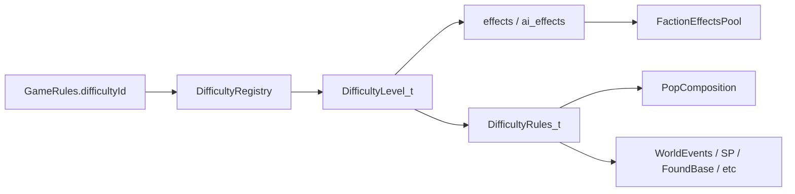

# Difficulty config

## Source list (interpreted)

Six levels. Where a feature is omitted on a harder level, it is **off** (not inherited).

| Feature | Citizen | Specialist | Talent | Librarian | Thinker | Transcend |
|---|---|---|---|---|---|---|
| Pop before drones (divisor) | 6 | 5 | 4 | 3 | 2 | 1 |
| AI production cost | 130% | 120% | 110% | 100% | 80% | 70% |
| Random events after turn | 75 | 65 | 55 | 45 | 35 | 25 |
| Command Center upkeep cap | 0 | 1 | 1 | 2 (via Fusion) | 3 (Fusion+Quantum) | 3 (Fusion+Quantum) |
| No research first 5 turns | yes | yes | — | — | — | — |
| AI SP needs human prereq | yes | yes | yes | — | — | — |
| Colony pod at size 1 keeps base | yes | yes | — | — | — | — |
| No power overloads | yes | yes | — | — | — | — |
| No prototype cost | yes | yes | — | — | — | — |
| No production (retool) penalty | yes | yes | — | — | — | — |
| Combat handicap | general | general | natives only | — | — | — |
| No pop loss from attacks | yes | — | — | — | — | — |
| No incited pact/treaty scripts | yes | — | — | — | — | — |
| Mind control / subversion cost halved | yes | yes | yes | — | — | — |
| AI auto personality off | yes | yes | — | — | — | — |
| Higher ecological damage | 3 | 3 | 3 | 3 | 5 | 5 |

`diff` ordinal for bureaucracy / tech-cost Lua: Citizen=0 … Transcend=5 (matches existing `Difficulty_t`). Default session level: **Talent**.

---

## Mapping onto defined stats / rules

### Effects (pool-resolved)

| Feature | Shape | Notes |
|---|---|---|
| AI production cost | `ai_effects`: `CostMultiplier` `AddPercent` **+30 / +20 / +10 / 0 / −20 / −30**, scope `AllOwnerBases` | Values known. Human unaffected. |
| Mind control / subversion halved | Prefer `ai_effects`: `ProbeActionCost` `AddPercent` **−50** | Existing stat is **target-side** (cost to act against that base). Putting −50 on AI bases makes probing AI cheaper (player benefit). Putting it on player `effects` would make the *player* cheaper to mind-control — wrong direction. **Confirm** against SMAC intent before shipping. |
| No pop loss from attacks | `effects`: `ConquestPopLoss` `MaxClamp` **0** | Exists; Citizen only. Perimeter Defense uses the same shape at `ThisBase`. |
| No prototype cost | `effects`: `PrototypeSurchargeScale` `MultiplyGeometric` **0** | Stat already exists (Skunkworks pattern). Citizen + Specialist. |
| No production penalty | `effects`: `RetoolPenaltyScale` `MultiplyGeometric` **0** | Interpret as retool forfeit. Stat already exists. Citizen + Specialist. (Earlier plan text that said “retooling is not difficulty-controlled” is **withdrawn**.) |
| Command Center upkeep cap | `effects`: `FacilityEnergyUpkeep` `MaxClamp` **0 / 1 / 1 / 2 / 3 / 3**, `buildingFilter` `BuildingId: Command_Center` | Tech `fusion_power` / `quantum_power` already emit `Add` +1 on CC. Clamp caps the RawScaled result. **Done:** RawScaled + tech Adds. |
| Pop before drones | `effects`: `SizeFreeDrones` — **or** `rules.size_drone_divisor` | See drones note below. |
| Higher ecological damage | `effects`: `EcologicalDamage` scale | **Stat not defined yet.** |
| Combat handicap | `effects`: Attack/Defense (or dedicated scale) | **Magnitude unknown;** natives-only needs a native unit filter. |

### Rules (non-effect fields)

| Feature | Field | Values |
|---|---|---|
| Random events gate | `rules.random_events_after_turn` | 75 / 65 / 55 / 45 / 35 / 25 |
| No research first N turns | `rules.research_disabled_turns` | 5 on Citizen+Specialist; 0 elsewhere |
| AI SP needs human prereq | `rules.ai_secret_projects_require_human_prereq` | true on Citizen–Talent |
| Colony pod preserves size-1 base | `rules.colony_pod_preserves_size_1_base` | true on Citizen+Specialist |
| No power overloads | `rules.no_power_overloads` | true on Citizen+Specialist |
| No incited pact/treaty scripts | `rules.no_incited_pact_treaty_scripts` | true on Citizen |
| AI auto personality | `rules.ai_auto_personality` | **false** on Citizen+Specialist; **true** (or omit = default on) elsewhere |
| Combat handicap mode | `rules.combat_handicap` + `rules.combat_handicap_natives_only` | general / natives / none — until % known |

Bureaucracy base-limit already consumes `Difficulty_t` (0…5) in `pop_composition` Lua — keep that; do **not** duplicate it as a difficulty effect.

---

## Flags: needs specific values

| Item | Why |
|---|---|
| **Combat handicap %** | List says “Combat handicap” / “with native life forms” but no Attack/Defense (or damage) percent. Stub flags until numbers are known; do not invent. |
| **Higher ecological damage magnitude** | Thinker/Transcend only say “Higher”. Need AddPercent / Multiply amount (and whether it stacks with Planet rating). |
| **Mind-control −50 placement** | Confirm actor vs target. Current `ProbeActionCost` is target-resolved; recommend `ai_effects` −50 pending confirmation. |
| **Size-drone exact formula** | “N pop before encountering drones” → treat as first size-drone at size N (`floor((size-(N-1?))/…)` vs SMAC `floor(size/N)`). Pin: **divisor = N**, first drone when `size >= N` (Talent N=4 matches today’s `floor(size/4)`). |

---

## Flags: not covered / incomplete systems

| Item | Gap |
|---|---|
| **Random events** | Gate field is planned; WorldEvents system barely exists — stub read site. |
| **Power overloads** | Boolean planned; **no power-overload gameplay** to wire yet. |
| **Incited pact/treaty scripts** | Boolean stub; diplomacy scripts not implemented. |
| **AI auto personality** | Boolean stub; AIProfile / faction AI personality auto-assign not wired as a difficulty consumer. |
| **EcologicalDamage stat** | **Not in `StatId_t` yet.** Add when eco meter exists; until then stub `rules.higher_ecological_damage` boolean so levels are expressible. |
| **Combat handicap vs natives** | Needs native-life unit filter (or psi/native domain gate) plus combat resolve hook — neither is a finished difficulty consumer. |
| **AI SP “player has prerequisite”** | Availability policy field planned; `SecretProjectAvailabilityCalculator` must learn to read it. |
| **Research disabled turns** | Field planned; ResearchManager / labs accumulation must gate on turn index. |
| **Colony pod size-1 preserve** | Field planned; `FoundBaseRules` must read it. |

Covered end-to-end once config+pool land (stats already exist): AI `CostMultiplier`, CC `MaxClamp` + tech tiers, `PrototypeSurchargeScale` / `RetoolPenaltyScale` zeros, `ConquestPopLoss` MaxClamp, `ProbeActionCost` (placement TBD).

---

## Drones note (`SizeFreeDrones`)

`SizeFreeDrones` is free population before size drones: `max(0, base_size - size_free_drones)`.
Talent emits 4 → first size drone at size 5; Citizen 6 → first at size 7. Stacks with
bureaucracy drones in `pop_composition.json`'s `drone_formula`.

---

## Effects vs other path (summary)

**Use effects** when the knob is a continuous modifier or rule flag the pool already resolves:

| Feature | Effect shape |
|---|---|
| AI production cost 130%…70% | `ai_effects`: `CostMultiplier` AddPercent `+30…−30` |
| Mind control / subversion halved | `ai_effects` (pending confirm): `ProbeActionCost` AddPercent `−50` |
| No population losses from attacks | `effects`: `ConquestPopLoss` MaxClamp **0** |
| No prototype cost | `effects`: `PrototypeSurchargeScale` MultiplyGeometric `0` |
| No production penalty | `effects`: `RetoolPenaltyScale` MultiplyGeometric `0` |
| CC upkeep cap | `effects`: `FacilityEnergyUpkeep` MaxClamp + `buildingFilter` `Command_Center` |
| Higher eco damage (later) | `effects`: `EcologicalDamage` — **needs stat + magnitude** |
| Combat handicap (later) | Attack/Defense (or scale) — **needs magnitude** (+ natives filter) |

**Use rules** for turn gates, availability policy, and systems without a stat:

| Feature | Config home |
|---|---|
| Random events after turn T | `rules.random_events_after_turn` (stub consumer) |
| No research first 5 turns | `rules.research_disabled_turns` |
| AI secret projects need human prereq | `rules.ai_secret_projects_require_human_prereq` |
| Colony pod at size 1 keeps base | `rules.colony_pod_preserves_size_1_base` |
| No power overloads | `rules.no_power_overloads` (stub) |
| Incited pact/treaty scripts | `rules.no_incited_pact_treaty_scripts` (stub) |
| AI auto personality | `rules.ai_auto_personality` (stub) |
| Combat handicap mode | `rules.combat_handicap` / `combat_handicap_natives_only` until % known |
| Higher eco (until stat) | `rules.higher_ecological_damage` boolean stub |
| Size-drone divisor | `rules.size_drone_divisor` **or** `SizeFreeDrones` effects |



---

## Config shape

[`config/difficulty.json`](config/difficulty.json):

```json
{
  "default": "talent",
  "levels": [
    {
      "id": "citizen",
      "name": "Citizen",
      "diff": 0,
      "rules": {
        "size_drone_divisor": 6,
        "random_events_after_turn": 75,
        "research_disabled_turns": 5,
        "ai_secret_projects_require_human_prereq": true,
        "colony_pod_preserves_size_1_base": true,
        "no_power_overloads": true,
        "no_incited_pact_treaty_scripts": true,
        "ai_auto_personality": false,
        "combat_handicap": true,
        "combat_handicap_natives_only": false,
        "higher_ecological_damage": false
      },
      "effects": [
        {
          "type": "StatModifier",
          "scope": "FactionGlobal",
          "parameters": {
            "stat": "conquest_pop_loss",
            "amount": 0,
            "op": "MaxClamp"
          }
        },
        {
          "type": "StatModifier",
          "scope": "FactionGlobal",
          "parameters": {
            "stat": "facility_energy_upkeep",
            "amount": 0,
            "op": "MaxClamp"
          },
          "buildingFilter": { "kind": "BuildingId", "building": "Command_Center" }
        },
        {
          "type": "StatModifier",
          "scope": "AllOwnerBases",
          "parameters": {
            "stat": "prototype_surcharge_scale",
            "amount": 0,
            "op": "MultiplyGeometric"
          }
        },
        {
          "type": "StatModifier",
          "scope": "AllOwnerBases",
          "parameters": {
            "stat": "retool_penalty_scale",
            "amount": 0,
            "op": "MultiplyGeometric"
          }
        }
      ],
      "ai_effects": [
        {
          "type": "StatModifier",
          "scope": "AllOwnerBases",
          "parameters": {
            "stat": "cost_multiplier",
            "amount": 30,
            "op": "AddPercent"
          }
        },
        {
          "type": "StatModifier",
          "scope": "AllOwnerBases",
          "parameters": {
            "stat": "probe_action_cost",
            "amount": -50,
            "op": "AddPercent"
          }
        }
      ]
    }
  ]
}
```

Encode all six levels from the matrix. Omit numeric combat/eco effects until magnitudes are known; keep boolean stubs so the level is complete.

Building id is `Command_Center` (production techs: `fusion_power`, `quantum_power`).

---

## Code additions

1. **Types + parser** (mirror [`ProductionConfigParser`](include/game/faction/base/production/ProductionConfigParser.h)):
   - `DifficultyRules_t`, `DifficultyLevel_t` (`id`, `name`, `diff`, `rules`, `effects`, `aiEffects`)
   - `DifficultyConfig_t` (`defaultId`, `levels` + lookup by id)
   - `DifficultyConfigParser` via `EffectConfigParser::ParseEffects(..., EffectSourceKind_t::Difficulty, id)`
   - `EffectSourceKind_t::Difficulty` like Faction/Tech in `ValidateScopeForSource`
   - **Already done / in tree:** `MaxClamp`/`MinClamp` in modifier stack; `FacilityEnergyUpkeep` RawScaled; fusion/quantum CC `Add`s
   - **Still needed for eco later:** `EcologicalDamage` PureMultiplier (or RawScaled) when the eco meter lands

2. **Load path:** [`GameDataPaths`](include/game/GameDataPaths.h) `difficulty`; [`LoadGameData`](src/game/GameDataContext.cpp) owns config (replace ad-hoc WIP loader with typed parser).

3. **Session selection:** `difficultyId` on [`GameRulesConfig_t`](include/game/GameRulesConfig.h) (empty → config `default`), alongside existing `Difficulty_t` ordinal **or** derive ordinal from level.`diff`.

4. **Effect injection** in [`FactionEffectsPool`](include/game/faction/FactionEffectsPool.h): level `effects` for every faction; `ai_effects` only when `!IsPlayerControlled()`.

5. **Wire known consumers;** stub TODOs elsewhere (`WorldEvents`, research early turns, SP availability, `FoundBaseRules`, power overload, combat, eco, diplomacy scripts, AI personality). Size-drone divisor into pop composition.

## Tests

- Parser: all six levels; unknown effect/stat fails; default id resolves.
- AI at Citizen: `CostMultiplier` +30%; human does not.
- CC: Citizen clamp 0; Librarian clamp 2 after fusion; Thinker reaches 3 after quantum.
- Probe: AI bases see −50% action cost when level includes it (once placement confirmed).
- Composition: Talent divisor 4 → first drone at size 4; Citizen 6 → first at size 6.
- Existing suites stay green with default Talent.
