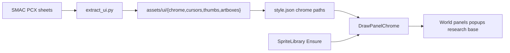

# UI chrome (roadmap Phase 4)

Wire SMAC UI chrome into the game: extract sheets into gitignored `assets/ui/…`, point
`style.json` and views at those sprites (native size, rect+text fallback), audit typography,
and fix world-map base name placement. Fonts already shipped via
[`extract_fonts.py`](../../extract_fonts.py). Roadmap:
[graphics_assets_roadmap_04a90a53.plan.md](graphics_assets_roadmap_04a90a53.plan.md).

## Context

### What SMAC does

Default-palette UI sheets in the GOG install (sizes measured locally):

| Source | Size | Role |
|---|---|---|
| `iface.pcx` (+ `iface_up/down[.2]`, `_A` variants) | 1024×768 | Main UI sheet: frames, buttons, widgets (palette index 255 keyed) |
| `console.pcx` / `console2.pcx` (+ `_x` / `_A`) | 800×257 / 1024×257 | World-map bottom console strip |
| `text.pcx` | 800×600 | Dialog / text-screen backdrop (not a glyph atlas) |
| `artbox0.pcx`–`artbox24.pcx` | 420×520 | Diplomacy / portrait frames |
| `Cursor.pcx` | 1024×768 | Mouse cursor cells |
| `*_sm.pcx` (~104) | varies | Notice / event thumbs |

UI text is GDI `SetTextColor` over paletted chrome — solid RGBA, **not** terrain
`palette.pcx` / `DrawTileSprite`.

### What we do today

- Panels fill with `DrawFilledRect` (+ optional `DrawRect` border) from
  [`config/ui/style.json`](../../config/ui/style.json) colours via
  [`UiStyle`](../../include/ui/style/UiStyle.h).
- [`SpriteLibrary`](../../include/ui/SpriteLibrary.h) is used for map art and Phase 3 content
  icons only.
- [`world_display.airdrop_cursor_path` / `bombard_cursor_path`](../../config/ui/style.json)
  exist but are empty strings.
- No `extract_ui.py`; [`extract_all.py`](../../extract_all.py) runs terrain, faction, fonts,
  and icons only.
- [`.gitignore`](../../.gitignore) covers `assets/ui/fonts/` only — not chrome PNG trees.
- [`docs/thinker/smac-ui-typography.md`](../thinker/smac-ui-typography.md) does not exist.
- World-map base names ([`MapRenderer::DrawBaseName_`](../../src/ui/MapRenderer.cpp)) draw at
  `FootprintOrigin` plus a single `base_text_offset_ratio` on X and Y — top-left of the tile
  footprint, wrong against Phase 2 base sprites.

## Design



### Extraction — `extract_ui.py`

- Same CLI/game-dir defaults as [`extract_icons.py`](../../extract_icons.py): `--game-dir`,
  `--out` (asset root, default `assets`), index **255** → alpha via
  `extract_pcx_common.clear_transparent_rgb`.
- Output tree (gitignored binaries; region tables live in the script + thinker notes):

```text
assets/ui/
  chrome/
    console.png / console_nobar.png     # 800-wide; default has black side bars
    console2.png / console2_nobar.png   # 1024-wide; default has black side bars
    console_x.png / console_x2.png
    console_x/…          # guided crops from console_x.pcx
    console_x2/…         # guided crops from console_x2.pcx
    text.png             # text.pcx whole sheet
    iface/…              # named crops from iface.pcx region table
  cursors/
    <name>.png           # crops from Cursor.pcx
  thumbs/
    <stem>_sm.png        # 1:1 from *_sm.pcx
  artboxes/
    artbox00.png …       # 1:1 from artboxN.pcx
  fonts/                 # already from extract_fonts.py
```

- **Whole-file converts:** `console*`, `text.pcx`, all `artbox*`, all `*_sm`.
- **Region tables (this phase):** reverse-engineer `iface.pcx` and `Cursor.pcx` against the
  running game / sheet guide pixels; record crops in
  [`docs/thinker/smac-ui-chrome.md`](../thinker/smac-ui-chrome.md) and encode them in
  `extract_ui.py` (same pattern as terrain region tables). Minimum cursor crops for airdrop
  and bombard; minimum iface crops for panel frames used by wired views (see below). Extra
  unused iface cells may ship as named PNGs once identified without wiring them.
- **Out of scope this phase:** `Color Blind Palette/` copies; iface `_A` / up/down button-state
  sheets beyond what wired widgets need; leader/diplomacy screens that consume artboxes.
- Register `"ui"` in `extract_all.py` next to fonts/icons.
- **Gitignore** (with the extractor): add `assets/ui/chrome/`, `assets/ui/cursors/`,
  `assets/ui/thumbs/`, and `assets/ui/artboxes/` beside the existing `assets/ui/fonts/` entry.
  Extracted PNGs never ship in the repo.

### Style schema

Add **optional** string path fields (empty or missing → today’s fill/border behaviour; empty
string allowed like cursor paths today):

- Shared pattern on panel style structs that already have `backgroundColor`:
  `background_sprite` (path under `assets/ui/…`).
- Optional `border_sprite` only where a distinct frame crop exists; otherwise keep colour
  `border_color` drawn after the background sprite (or skip border when the sprite includes
  the frame).
- **No stretch / scale this phase.** Draw chrome at the PNG’s native pixel size. Size the
  consuming panel via `layouts` and related ratios in
  [`config/ui/style.json`](../../config/ui/style.json) so the layout matches the sprite (and
  SMAC’s proportions) instead of scaling the art to fit an arbitrary rect. Prefer cropping
  `iface` / console sheets to the exact panel piece rather than drawing an oversized sheet
  into a small slot. Stretch / uniform scale / 9-slice is a later roadmap exploration.
- Fill `world_display.airdrop_cursor_path` / `bombard_cursor_path` (+ hotspots from RE)
  pointing at extracted cursor PNGs.
- Shipping [`config/ui/style.json`](../../config/ui/style.json) and
  [`tests/fixtures/ui/style.json`](../../tests/fixtures/ui/style.json) get the new keys and
  any layout/ratio retunes in the same change (no parser migration shim for old absences —
  optional keys with default empty).

### Shared draw helper

New small helper (e.g. `ui/style/DrawPanelChrome.h` or free functions next to `UiStyle`):

- Inputs: `Graphics&`, `SpriteLibrary&`, layout, `backgroundColor`, optional `borderColor` +
  width, optional `background_sprite` path.
- If path non-empty and `SpriteLibrary::Ensure` succeeds → `DrawSprite` at **native size**,
  origin at the layout’s top-left (clip or leave overhang only if RE requires a known
  ornament; do not scale to `layout.width` / `layout.height`). Else `DrawFilledRect` with
  `backgroundColor` for the full layout.
- Border: if colour border still applies, `DrawRect` after (same as `ListSelectorPopup`
  today).
- UI never uses the terrain palette shader.

Views that need chrome receive `SpriteLibrary&` the same way Phase 3 icon panels already do
([`ViewFactory`](../../src/ui/ViewFactory.cpp) / constructors). Panels that only fill today
and are listed below get the library reference when they gain a sprite path.

### In-scope view wiring (this phase)

Use `DrawPanelChrome` + style paths for:

1. **World bottom band:** `layouts.console` fixed placement in `style.json` (pixel variants
   + align); map is the band above the placed console. The chosen variant’s sprite draws at
   native size with an opaque backdrop fill. Dashboard panels use `world_view.console_layouts`.
2. **Popups / research:** `ListSelectorPopup`, `NoticePopup`, `CurrentResearchPanel` —
   `text.png` or iface frame crops.
3. **Base screen major panels:** `BuildingsDisplay`, `ProductionDisplay` (and the other
   `ResourceLinesPanelStyle_t` users that share the same style shape if they share one sprite
   key). `PopulationDisplay` / `SupportDisplay` only if they already share the same style
   block pattern without a large constructor churn — otherwise leave them on colour fill
   until a follow-up.
4. **Cursors:** wire extracted airdrop/bombard PNGs into existing `WorldDisplay` cursor style
   keys.

### Extract-only (no game wiring this phase)

- All `artboxes/` (diplomacy / commlinks later).
- All `thumbs/` (`NoticePopup` has no thumb slot yet; mapping notice kinds → stems is a later
  plan).
- Unused iface / cursor cells produced while building region tables.

### Typography

- Add [`docs/thinker/smac-ui-typography.md`](../thinker/smac-ui-typography.md): face (Arial
  Narrow via `font_paths`), sample sizes, and sample RGB for labels on the wired chrome (from
  SMAC GDI / side-by-side), not from terrain palette.
- Audit and update text RGBA in `style.json` for the wired panels above when RE shows a clear
  mismatch.
- Bold/italic TTFs stay on disk; runtime still one face via `font_paths` (no multi-face
  selection this phase).

### World-map base name position

[`MapRenderer::DrawBaseName_`](../../src/ui/MapRenderer.cpp) currently draws at
`FootprintOrigin` plus the same `base_text_offset_ratio` on X and Y — top-left of the tile
footprint, which sits wrong against Phase 2 base sprites (SMAC places the name under /
relative to the base art).

- Reverse-engineer SMAC’s layout-label anchor (offset from seat / sprite bottom / tile centre)
  and record it in the typography or chrome thinker note.
- Expose separate style knobs as needed (e.g. replace the single `base_text_offset_ratio` with
  explicit X/Y or below-sprite ratios on `map_renderer`); update shipping and fixture
  `style.json`.
- Draw with that anchor (still truncated to `base_name_width_ratio`, faction label colour
  unchanged). Prefer config ratios over hard-coded pixels.
- If BaseView’s [`BaseNameDisplay`](../../src/ui/base/BaseNameDisplay.cpp) label is also
  misaligned after chrome layout retunes, fix via `base_name_layout` / its text padding
  ratios in the same pass — map label is the required fix.

### Fallbacks

- Missing / failed chrome PNG → colour fill + border (same spirit as Phase 3 icon omit).
- No UI checkerboard for chrome.
- Missing fonts unchanged: try `font_paths` in order, throw if none.

### Architecture docs

Update [`docs/architecture/ui-system.md`](../architecture/ui-system.md) and
[`docs/architecture/graphics-system.md`](../architecture/graphics-system.md): chrome paths in
`style.json`, `DrawPanelChrome` + `SpriteLibrary`, cursor paths, extractor output layout; note
fonts already preferred from `assets/ui/fonts/`; document the base-name anchor.

## Changes

1. RE notes: `docs/thinker/smac-ui-chrome.md` (+ typography doc); region tables for iface +
   Cursor.
2. `extract_ui.py` + `extract_all.py` `"ui"` entry + `.gitignore` for
   `assets/ui/chrome/`, `cursors/`, `thumbs/`, `artboxes/` (keep `fonts/`).
3. Optional `background_sprite` (and cursor path fills) on the listed style structs + parsers
   + shipping/fixture JSON.
4. `DrawPanelChrome` helper; thread `SpriteLibrary&` into wired panels that lack it.
5. Wire the world / popup / research / base panels and cursors listed above; retune
   `style.json` layouts/ratios so native-size sprites seat correctly.
6. Typography colour audit for those panels.
7. Fix world-map base name position (`DrawBaseName_` + `map_renderer` style offsets); retune
   `BaseNameDisplay` layout only if chrome retunes leave it wrong.
8. Tests: parser accepts optional sprite paths; chrome draw records sprite when Ensure
   succeeds and fill when path empty/missing (via `RecordingGraphics` / existing UI fixtures);
   cursor style non-empty paths in fixture if tests assert cursor set; base-name draw position
   asserts against the settled style ratios / anchor.
9. Architecture + roadmap pointer updates.

## Verification

- `python extract_ui.py` (and `extract_all.py` including `ui`) populate the tree above from
  the local SMAC install.
- `./bd build` and `./bd test` (UI / style fixture tests green).
- Visual: world bottom band, a research/list popup, and base buildings/production show SMAC
  chrome when assets exist; without assets, rect+text unchanged.
- Side-by-side: console strip and text colours match RE notes within the wired surfaces; base
  name labels sit under the base sprite as in SMAC.

## Out of scope

- Phase 5 units / Phase 6 media.
- Color-blind palette pack.
- Artbox-backed diplomacy UI; notice thumbs in `NoticePopup`.
- UiStyle god-object breakup (noted debt in ui-system.md — not this phase).
- Multi-face bold/italic runtime selection.
- Atlas / UV packing.
- Stretching, uniform scaling, or 9-slice chrome (tracked on the graphics assets roadmap as a
  later exploration).
